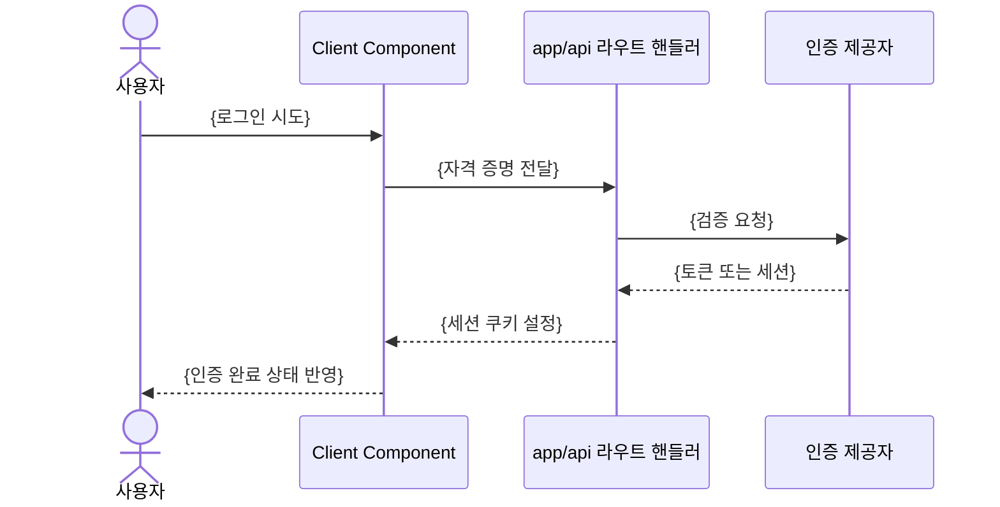

# API 명세: {프로젝트명}

CRITICAL: 모든 API 로직은 `app/api/` 라우트 핸들러에서만 처리한다. 클라이언트 컴포넌트에서 외부 API를 직접 호출하지 않는다. 라우트 핸들러와 `services/` 래퍼의 관계는 `/docs/ARCHITECTURE.md`의 레이어 의존 관계를 따른다.

---

## 공통 규약

| 항목 | 값 |
|------|------|
| Base URL | {예: /api} |
| 요청/응답 형식 | {예: application/json, UTF-8} |
| 인증 헤더 | {예: 없음 / Authorization: Bearer {token}} |
| 버저닝 | {예: 없음 / 경로 프리픽스 /api/v1} |
| 타임아웃 | {예: 10s} |

- 요청 본문은 라우트 핸들러 진입점에서 반드시 스키마 검증을 거친다.
- 응답 타입은 `types/`에 정의하고 클라이언트와 공유한다.

---

## 엔드포인트 목록

| 메서드 | 경로 | 설명 | 인증 |
|--------|------|------|------|
| {GET} | {/api/xxx} | {설명} | {필요/불필요} |
| {POST} | {/api/xxx} | {설명} | {필요/불필요} |
| {} | {} | {} | {} |

---

## 엔드포인트 상세

엔드포인트마다 아래 블록을 하나씩 추가한다.

### {METHOD} {/api/xxx}

**설명**: {이 엔드포인트가 하는 일}
**인증**: {필요/불필요}
**연동 서비스**: {호출하는 services/ 래퍼. 없으면 "없음"}

요청 파라미터:

| 위치 | 이름 | 타입 | 필수 | 설명 |
|------|------|------|------|------|
| {query/path/body} | {name} | {type} | {O/X} | {설명} |

요청 본문:
```json
{
  "{field}": "{type — 설명}"
}
```

응답 (200):
```json
{
  "{field}": "{type — 설명}"
}
```

실패 응답: {이 엔드포인트에서 발생 가능한 상태 코드와 상황}

---

## 에러 응답 규약

모든 에러는 아래 형태로 통일한다.

```json
{
  "error": "{사용자에게 보여줄 메시지}",
  "code": "{내부 에러 코드}"
}
```

| 상태 코드 | 상황 | 대응 |
|-----------|------|------|
| 400 | {잘못된 입력 / 스키마 검증 실패} | {예: 필드명과 함께 메시지 반환} |
| 401 | {인증 실패} | {} |
| 404 | {리소스 없음} | {} |
| 429 | {레이트 리밋 초과} | {예: 클라이언트에서 백오프 후 재시도} |
| 500 | {서버 / 외부 API 오류} | {예: 내부 상세는 노출하지 않고 로그에만 남김} |

- 외부 API 키, 스택 트레이스 등 내부 정보를 응답에 포함하지 않는다.

---

## 인증·인가 흐름

인증이 있는 경우에만 작성한다. 흐름 표현은 `/docs/ARCHITECTURE.md`의 작성 규칙에 따라 Mermaid로 적는다.


