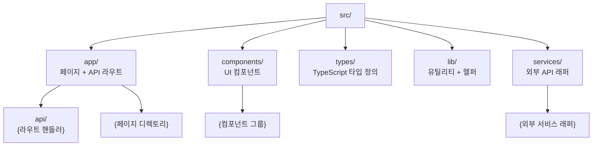
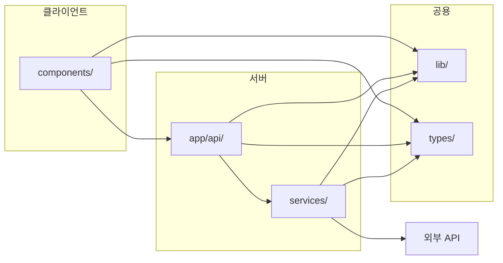
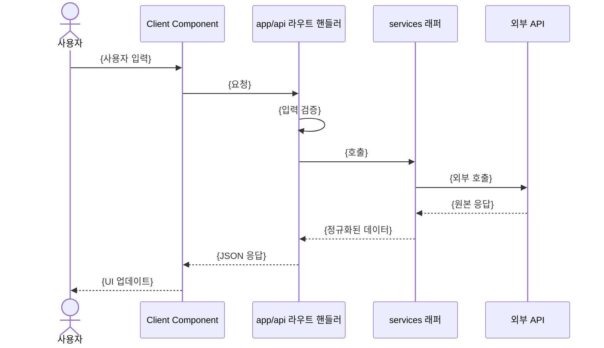
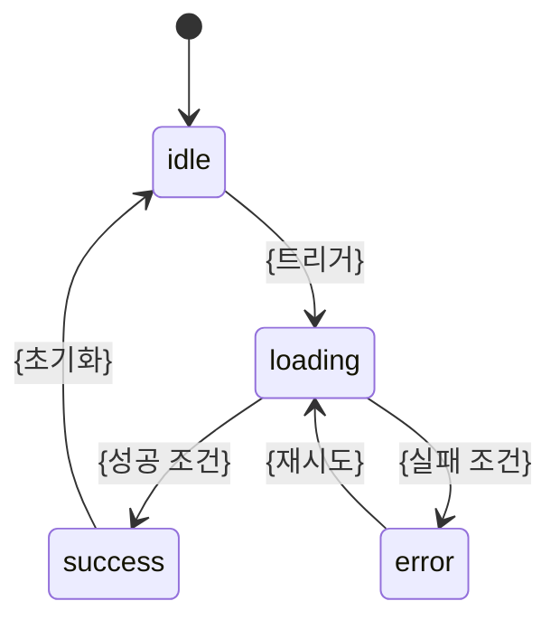

# 아키텍처

## 작성 규칙

- CRITICAL: 이 문서의 모든 구조·흐름 표현은 Mermaid로 작성한다. ASCII 아트 트리, 화살표 나열, 이미지 첨부는 금지한다.
- 세부 구조가 추가될 때도 아래 표에서 대상에 맞는 다이어그램 종류를 골라 Mermaid로 작성한다.
- 노드 라벨은 `["경로 또는 이름 설명"]` 형태로 적어 경로와 역할을 함께 드러낸다.

| 표현할 대상 | 사용할 다이어그램 |
|-------------|------------------|
| 디렉토리 구조 | `flowchart TD` |
| 모듈·레이어 의존 관계 | `flowchart LR` + `subgraph` |
| 요청 처리 흐름 | `sequenceDiagram` |
| 상태 전이 | `stateDiagram-v2` |
| 데이터 모델 관계 | `erDiagram` |

---

## 디렉토리 구조

세부 디렉토리가 늘어나면 위 그래프에 노드를 추가한다. 새 최상위 디렉토리를 만들 때는 ADR에 근거를 남긴다.

---

## 레이어 의존 관계

허용된 의존 방향만 화살표로 표시한다. 화살표가 없는 방향의 import는 금지다.

- {금지 방향 1 (예: components/ → services/ 직접 호출 금지. 반드시 app/api/ 경유)}
- {금지 방향 2}

---

## 패턴

{사용하는 디자인 패턴 (예: Server Components 기본, 인터랙션이 필요한 곳만 Client Component)}

---

## 데이터 흐름

흐름이 여러 개면 흐름마다 `sequenceDiagram`을 하나씩 추가한다.

---

## 상태 관리

{상태 관리 방식 (예: 서버 상태는 Server Components, 클라이언트 상태는 useState/useReducer)}

