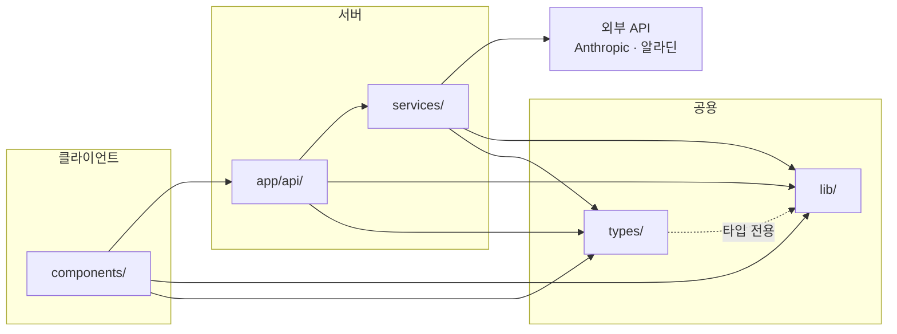
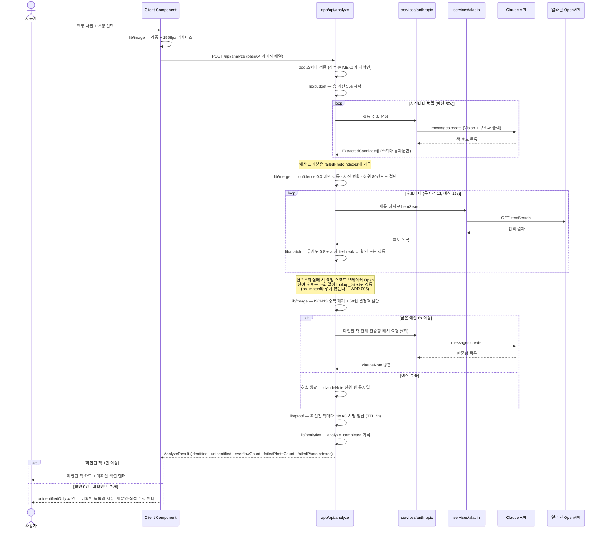
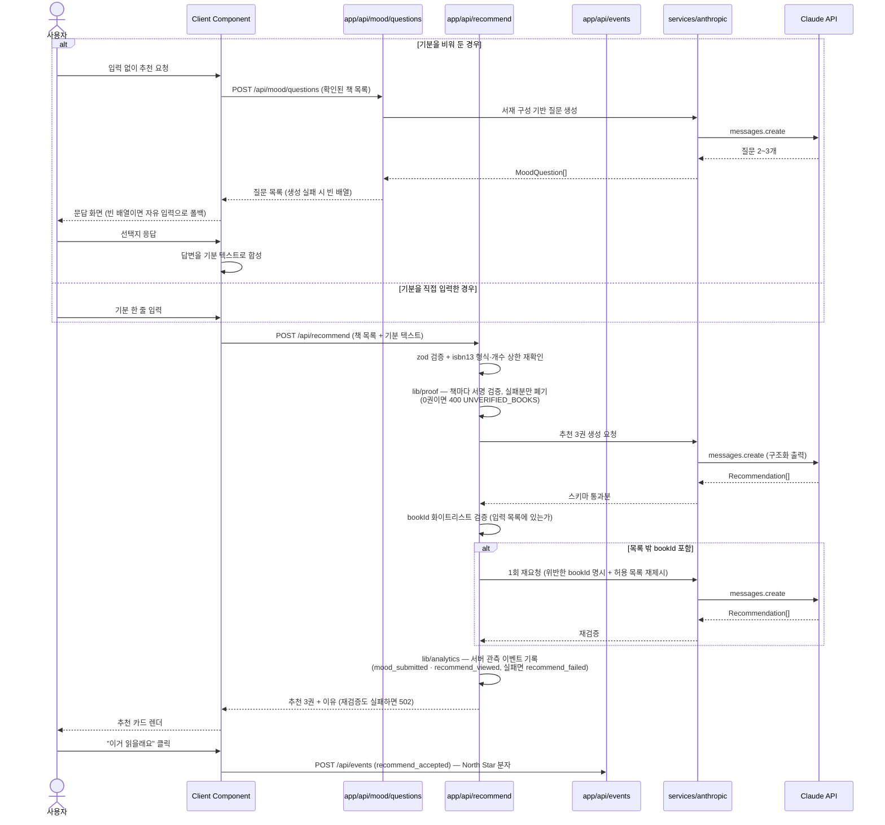
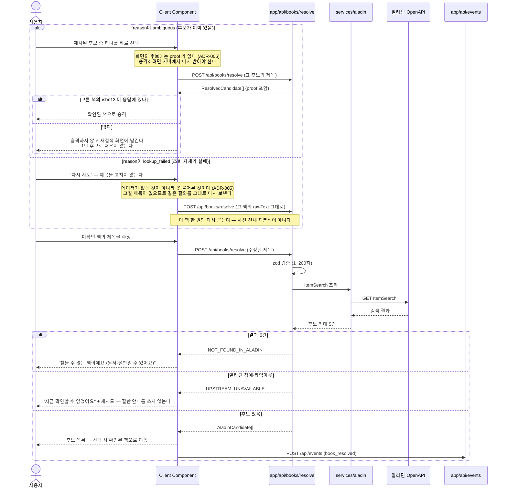
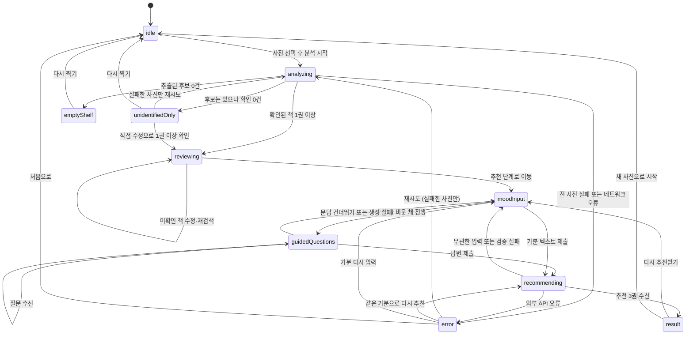

# 아키텍처

## 작성 규칙

- CRITICAL: 이 문서의 모든 구조·흐름 표현은 Mermaid로 작성한다. ASCII 아트 트리, 화살표 나열, 이미지 첨부는 금지한다.
- 세부 구조가 추가될 때도 아래 표에서 대상에 맞는 다이어그램 종류를 골라 Mermaid로 작성한다.
- 노드 라벨은 `["경로 또는 이름 설명"]` 형태로 적어 경로와 역할을 함께 드러낸다.

| 표현할 대상 | 사용할 다이어그램 |
|-------------|------------------|
| 디렉토리 구조 | `flowchart TD` |
| 모듈·레이어 의존 관계 | `flowchart LR` + `subgraph` |
| 요청 처리 흐름 | `sequenceDiagram` |
| 상태 전이 | `stateDiagram-v2` |
| 데이터 모델 관계 | `erDiagram` |

---

## 디렉토리 구조

```mermaid
flowchart TD
    src["src/"]

    src --> app["app/<br/>페이지 + API 라우트"]
    src --> components["components/<br/>UI 컴포넌트"]
    src --> types["types/<br/>TypeScript 타입 정의"]
    src --> lib["lib/<br/>유틸리티 + 헬퍼"]
    src --> services["services/<br/>외부 API 래퍼"]

    app --> api["api/<br/>라우트 핸들러"]
    app --> page["page.tsx<br/>단일 페이지 (상태 10종을 화면으로 전환)"]

    api --> apiAnalyze["analyze/route.ts<br/>사진 → 확인·미확인 책"]
    api --> apiResolve["books/resolve/route.ts<br/>수정된 제목으로 재검색"]
    api --> apiQuestions["mood/questions/route.ts<br/>기분 유도 질문 생성"]
    api --> apiRecommend["recommend/route.ts<br/>책 목록 + 기분 → 3권"]
    api --> apiEvents["events/route.ts<br/>클라이언트 전용 이벤트 수집"]

    components --> cUpload["upload/<br/>사진 선택·촬영·썸네일"]
    components --> cBooklist["booklist/<br/>확인된 책 카드 · 미확인 섹션"]
    components --> cMood["mood/<br/>자유 입력 · 문답"]
    components --> cRecommend["recommend/<br/>추천 3권 카드"]
    components --> cCommon["common/<br/>스켈레톤 · 에러 배너 · 배지"]

    lib --> libImage["image.ts<br/>파일 검증 · 1568px 리사이즈"]
    lib --> libSchemas["schemas.ts<br/>zod 스키마 (외부 응답 검증 경계)"]
    lib --> libMatch["match.ts<br/>제목 유사도 · 확인/미확인 판정"]
    lib --> libMerge["merge.ts<br/>ISBN 중복 제거 · 50권 상한"]
    lib --> libPrompts["prompts.ts<br/>추출 · 한줄평 · 추천 · 문답 프롬프트"]
    lib --> libAnalytics["analytics.ts<br/>구조화 이벤트 로그"]
    lib --> libBudget["budget.ts<br/>단계별 시간 예산 · 데드라인 전파"]
    lib --> libProof["proof.ts<br/>확인된 책 HMAC 서명 발급 · 검증"]
    lib --> libEnv["env.ts<br/>환경변수 부팅 시 검증 · 도메인 상수 단일 출처"]
    lib --> libSession["session.ts<br/>세션 상태 리듀서 (순수)"]
    lib --> libApiClient["api-client.ts<br/>app/api 호출 래퍼 · 에러 정규화"]

    services --> svcAnthropic["anthropic.ts<br/>Claude API 래퍼"]
    services --> svcAladin["aladin.ts<br/>알라딘 OpenAPI 래퍼"]

    types --> tBook["book.ts<br/>ExtractedCandidate · IdentifiedBook · UnidentifiedBook"]
    types --> tApi["api.ts<br/>요청 · 응답 · 에러 코드"]
```

세부 디렉토리가 늘어나면 위 그래프에 노드를 추가한다. 새 최상위 디렉토리를 만들 때는 ADR에 근거를 남긴다.

저장소를 도입할 때(ADR-007)도 새 최상위 디렉토리를 만들지 않는다. Supabase 클라이언트는 `services/supabase.ts`로 들어가고, DB 행을 검증하는 스키마는 `lib/schemas.ts`에, 행 타입은 `types/`에 둔다 — 외부 API와 정확히 같은 자리다.

---

## 레이어 의존 관계

허용된 의존 방향만 화살표로 표시한다. 화살표가 없는 방향의 import는 금지다.

- `components/` → `services/` 직접 호출 금지. 반드시 `app/api/`를 경유한다. 클라이언트 번들에 `ANTHROPIC_API_KEY`·`ALADIN_TTB_KEY`가 새어 나가는 것을 구조적으로 차단하기 위함이다.
- `services/` → `components/` 역방향 import 금지. 서버 전용 모듈이 React 컴포넌트를 참조하면 서버 코드가 클라이언트 번들로 끌려 들어간다.
- `lib/` → `services/` 금지. `lib/`는 외부 호출을 하지 않는 순수 함수만 담는다. 이 경계 덕분에 `lib/`는 모킹 없이 단위 테스트할 수 있다.
- `types/` → `lib/schemas.ts`는 **타입 전용**으로만 허용한다(점선). 스키마와 타입을 이중 정의하지 않으려면(TR-002) `z.infer`가 스키마를 참조할 수밖에 없다. 대신 `types/`는 `import type`·`export type`만 쓰고 값을 하나도 내보내지 않으므로, 컴파일 후 런타임 import가 남지 않아 클라이언트 번들에 `lib/`가 끌려 들어가지 않는다. 역방향(`lib/` → `types/`)과 `types/`의 값 export는 계속 금지다.
- `lib/image.ts`만 브라우저 API(Canvas)에 의존한다. 서버 코드에서 import하지 않는다.
- 저장소를 도입하면(ADR-007) Supabase도 위 그래프의 `외부 API`와 같은 자리에 놓인다. `components/` → Supabase 직접 호출 금지이며, 반드시 `app/api/`를 경유한다. `service_role` 키가 클라이언트 번들로 새는 경로를 구조적으로 막기 위함이고, 이는 `ANTHROPIC_API_KEY`에 적용하는 규칙과 같은 것이다.

---

## 패턴

- **Server Components 기본, 인터랙션이 있는 곳만 Client Component.** 이 앱은 사진 선택부터 추천까지 전 구간이 인터랙션이므로 `app/page.tsx`가 얇은 셸이고 실제 화면은 대부분 Client Component다. 서버에서 미리 렌더할 데이터가 없다(무상태).
- **검증 경계 패턴.** 외부에서 들어오는 모든 값 — HTTP 요청 본문, Claude 응답, 알라딘 응답 — 은 `lib/schemas.ts`의 zod 스키마를 통과한 뒤에만 도메인 타입으로 취급한다. `safeParse` 실패는 예외가 아니라 판별 가능한 실패 값으로 다룬다.
- **강등 패턴 (fail-soft).** 개별 책의 검증·조회가 실패해도 요청 전체를 실패시키지 않고 그 책만 미확인으로 강등한다. 사진 단위 실패도 마찬가지로 `failedPhotoCount`만 올리고 성공분은 반환한다.
- **출처 분리.** `IdentifiedBook`은 알라딘 원본 필드와 Claude 생성 필드(`claudeNote`)를 한 객체에 담되, 렌더 단계에서 서로 다른 시각 층위로 표시한다. 타입 수준에서 어느 필드가 어디서 왔는지 주석으로 명시한다.
- **화이트리스트 검증.** 추천 응답의 `bookId`는 요청에 담아 보낸 확인된 책 목록 안에 있어야만 사용자에게 도달한다. 모델 출력을 신뢰하지 않는다.
- **증명 동반 (proof-carrying).** 화이트리스트 검증은 *모델 출력*을 입력과 대조할 뿐, 그 입력이 사실인지는 묻지 않는다. 무상태 설계에서 확인 판정은 응답과 함께 클라이언트로 나갔다가 다음 요청에 다시 들어오므로, 서버는 그것이 자기가 내준 값인지 알 수 없다. 그래서 확인된 책은 **자기 증명(`proof` 서명)을 들고 다닌다.** 검증 실패는 요청 전체가 아니라 그 책만 폐기하는 강등으로 처리해 fail-soft 패턴과 일관되게 둔다 (ADR-006).
- **시간 예산 패턴.** 요청 진입점에서 총 예산(`/api/analyze`는 55s)을 잡고, 각 단계는 `남은 예산 = 총 예산 − 경과 시간`을 계산해 자기 몫과 비교한 뒤 **작은 쪽**을 데드라인으로 삼는다. 예산을 넘긴 단계는 요청을 실패시키지 않고 그 단계의 산출물만 강등한다(`lookup_failed`, 빈 `claudeNote`). 단계별 타임아웃을 따로 두면 합이 함수 상한을 넘겨 플랫폼이 연결을 끊고, 그러면 정해진 504조차 돌려주지 못한다 (ADR-005, `/docs/TRD.md` 7번).
- **사유 보존.** 강등할 때 *왜* 강등했는지를 잃지 않는다. 알라딘 조회 실패(`lookup_failed`)와 알라딘에 없음(`no_match`)은 사용자에게 완전히 다른 문장으로 보여야 하므로, 코드에서도 끝까지 다른 값으로 나른다.
- **어댑터 없는 단일 공급자.** provider 추상화 레이어를 만들지 않는다. `services/anthropic.ts`가 곧 경계이고, 공급자를 바꿔야 할 일이 생기면 이 파일 하나를 교체한다 (ADR-001).

---

## 데이터 흐름

### 흐름 1 — 사진 분석 (US-001, TR-006)

### 흐름 2 — 추천 생성 (US-003·US-004, TR-009·TR-010)

### 흐름 3 — 미확인 책 재검색 (US-002, TR-008)

흐름이 여러 개면 흐름마다 `sequenceDiagram`을 하나씩 추가한다.

---

## 상태 관리

서버 상태가 없으므로 전역 상태 라이브러리를 쓰지 않는다. 세션 전체를 `app/page.tsx`의 `useReducer` 하나로 관리한다. **화면 컴포넌트에는 `dispatch`를 넘기지 않는다** — 필요한 값만 개별 props로 주고 사용자의 행동은 콜백으로 받는다. `dispatch`를 넘기면 화면이 액션 이름을 알게 되어 상태 전이를 직접 하게 되고, 그 순간 전이 규칙이 리듀서 밖으로 새어 나가 순수 함수 테스트가 규칙 전부를 검사하지 못한다. 리듀서 자체는 `lib/session.ts`에 **순수 함수로** 두어 jsdom 없이 검증한다 — 화면 전이 규칙은 React와 무관한 규칙이고, React 안에 있으면 렌더링을 통해서만 검사할 수 있다. 새로고침하면 상태가 사라지며, 이는 무상태 설계의 의도된 결과다 (ADR-003).

**`/api/books/resolve`로 승격된 책은 `photoIndex`를 갖지 않는다.** 그 책은 사진이 아니라 사용자의 재검색에서 왔기 때문이다. 승격된 책을 확인된 책으로 다루되(알라딘 대조와 `proof`를 똑같이 통과했다) 사진 출처가 있는 척하지 않는다 — 없는 값을 `0`으로 지어내는 것은 출처를 위조하는 것이다. 요청 경계를 넘을 때 쓰는 `bookReferenceSchema`·`recommendBookSchema`가 `photoIndex`를 요구하지 않으므로 계약을 바꿀 이유도 없다.

그래서 세션의 책 목록은 **출처를 태그로 달고 다닌다** — `photo`(사진에서 왔다)와 `resolved`(재검색에서 왔다)의 판별 유니온이다. **두 출처는 화면에서 한 목록으로 선다.** 확인된 책 섹션 하나에 합계 권수를 세고, 카드만 출처에 따라 고른다. 목록을 둘로 가르면 사용자는 자기 책장이 왜 두 덩어리인지 알 수 없고, 그 구분은 사용자에게 아무 의미가 없다 — **출처는 목록을 가를 이유가 아니라 카드가 무엇을 그릴 수 있는지를 정하는 값이다.** `resolved` 책에는 `claudeNote`가 없으므로 그 카드는 생성 텍스트 블록을 아예 그리지 않는다(ADR-002 — 없는 해석을 빈 문자열로 지어내지 않는다).

**재시도에는 간격이 있다** (FR-010). 분석 재시도는 세션당 3회이고 간격은 0초 → 5초 → 15초로 벌어진다. 대기는 화면의 로컬 상태이지 세션 상태가 아니다 — 리듀서는 "몇 번 눌렀는가"를 알지만 "지금 몇 초 남았는가"는 알 필요가 없고, 그것을 리듀서에 넣으면 순수 함수가 타이머를 갖게 된다. 대기 중에는 재시도 버튼을 **감추지 않고 비활성**한다. 타이머는 처음부터 다시 시작(`RESTARTED`)과 언마운트에서 반드시 정리한다 — 정리하지 않으면 사용자가 버리기로 한 세션에 유령 분석 호출이 나가고 모델 비용이 든다.

다만 **의도된 소실과 사고로 인한 소실은 다르다.** 분석에 30초를 기다린 사용자가 실수로 새로고침하면 사진과 결과가 함께 사라지고 API 비용도 다시 든다. `reviewing` 이후 상태에서는 `beforeunload` 경고를 걸어 이탈을 한 번 되묻는다. 선택한 원본 파일은 `error` 상태에서도 메모리에 유지해, 재시도가 재업로드를 요구하지 않게 한다.

**`error`는 어느 단계에서 실패했는지 기억한다.** 그 값 없이는 회복 경로를 고를 수 없다 — 분석 실패의 회복은 `analyzing`이고 추천 실패의 회복은 `recommending`·`moodInput`인데, **상태 이름만으로는 둘이 구분되지 않는다.** 세 경로가 같은 상태에서 나가므로 화면이 실패 단계로 갈라야 하고, `error → analyzing`(재시도)은 **분석 단계에서 온 `error`에서만** 유효하다. `error → recommending`은 직전 `mood`를 **그대로 재전송**하는 경로다(사용자에게 기분을 다시 쓰게 하지 않는다). `error → moodInput`은 사용자가 다르게 쓰겠다고 고를 때다. 이 두 전이가 없으면 **추천 한 번의 외부 장애에 분석 비용을 다시 내야 한다** — 회복 경로가 전체 재분석이거나 `idle`뿐이기 때문이다. 실패 단계를 무엇으로 표현할지는 리듀서의 몫이므로 여기서 필드 이름을 정하지 않는다. 다만 **기억하지 않는 선택지는 없다.**

