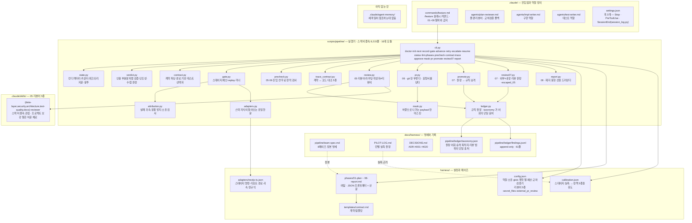
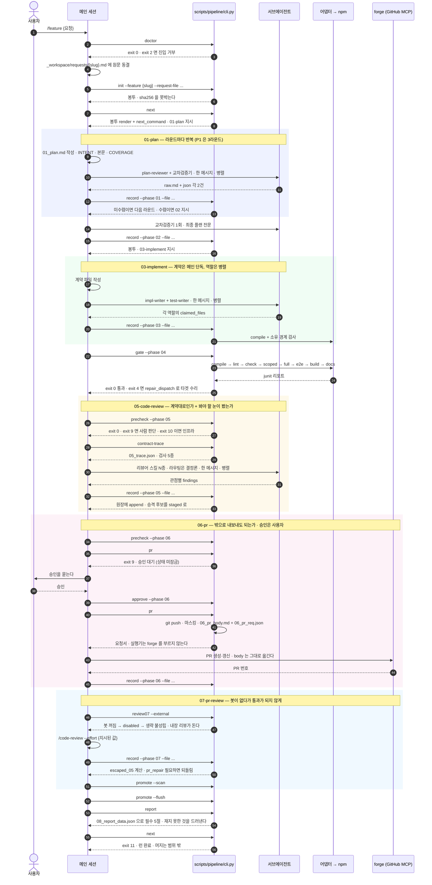
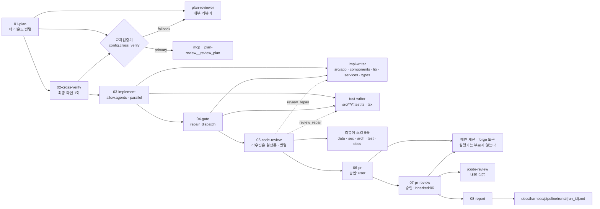

# 파이프라인 개발 기록 (Pipeline Log)

> **이 문서의 위치**
> `/feature` 8페이즈 파이프라인을 만들면서 **무엇을 왜 그렇게 설계했고, 얼마나 줄었고, 어디가 깨졌고 어떻게 고쳤는가**를 한 곳에서 순서대로 읽게 하는 문서다.
> 원본 기록은 셋이다 — [PILOT-LOG.md](harness/PILOT-LOG.md)(런별 실측 원장) · [DECISIONS.md](harness/DECISIONS.md)(`ADR-H` 결정) · [team-spec.md](harness/pipeline/team-spec.md)(8페이즈 정본 명세). 셋 다 하네스 자신의 문서이고 프로젝트 작업 중에는 읽기만 한다.
> **이 문서는 그 셋에서 수치를 인용만 하고 새 수치를 만들지 않는다.** 측정되지 않은 것은 `미측정` 으로 적고 무엇을 재야 값이 생기는지를 함께 적는다. 추정치를 실측처럼 쓰지 않는다.

---

## 1. 무엇을 만들었나

`/feature {요청}` 한 번이 **요청 동결 → 계획 → 교차검증 → 구현 → 게이트 → 코드리뷰 → PR → PR리뷰 → 보고서**까지 끌고 가는 실행기다. 페이즈마다 `next`(지시문 받기) → 모델이 산출물 작성 → `record`(제출·검증) 두 번의 왕복만 있고, 검증을 통과하면 실행기가 다음 페이즈 지시문을 바로 낸다.

**여덟이 다 섰다.** 01~08 페이즈 파일이 전부 있고 `lint-phases` 의 `FUTURE` 전이는 0건이다 — 다섯 번의 증분 동안 다음 진입점을 가리키던 그 한 줄이 처음으로 사라졌다. `/feature` 는 **`git push` 까지 실행기가 하고, PR 생성·갱신과 코멘트 게시는 메인 세션이 forge 도구로** 한다. **머지는 범위 밖이다** ([ADR-H015](harness/DECISIONS.md)).

**배선이 섰다는 것과 흐름이 돈다는 것은 다르고, 2026-09-04 에 흐름이 처음 돌았다.** 파이프라인 런 P2 가 `offline-vs-upstream` 을 01~07 완주시켜 [PR #2](https://github.com/hyuham1335-stack/shelfie-app/pull/2) 까지 갔다(머지 안 함). **그 런은 08 을 닫지 못한 채 끝났다** — `record --phase 08` 이 미구현이었고(M24) 06 이 요구한 커밋이 04 영수증을 낡게 만들어 `advance` 도 거부했다(M25). **둘 다 그 뒤에 닫혔고 P2 는 `report` 경로로 종결됐다**(`run_status: done`). 안 돈 경로 넷 중 둘이 닫혔고 둘은 남았다 — §7 을 본다.

| 층 | 실물 | 규모 |
|---|---|---|
| 실행기 | `scripts/pipeline/{cli,state,verdict,contract,gate,attribution,adapters,ledger,precheck,review,trace_contract,mask,pr,promote,review07,report}.py` — 16개 모듈 | **9,571줄** · Python 3.8 stdlib만 (서드파티 0) |
| 계약 계층 | `scripts/harness.py` — `doctor` · `calibrate` · `init` · glob 엔진 · 파일 목록 | 1,295줄 |
| 페이즈 파일 | `harness/phases/{01-plan,02-cross-verify,03-implement,04-gate,05-code-review,06-pr,07-pr-review,08-report}.md` | **8개** · JSON 프론트매터 + 산문 |
| 진입점 | `.claude/commands/feature.md` · `.claude/agents/{plan-reviewer,impl-writer,test-writer}.md` · 리뷰어 스킬 5종(`.claude/skills/*-reviewer/`) | 에이전트 정의는 각 3KB 이하 |
| 기록 | `scripts/session_log.py` — `SessionEnd` 훅이 부르는 원장 수집기 | 원장은 `docs/pipeline-ledger.jsonl` (§7) |
| 테스트 | `test_pipeline.py` 583 · `test_execute.py` 176 · `test_harness.py` 70 | **829건** (파일럿 앱은 **1,424건** · 47 suites — P7 이 +21) |

실행기가 Python stdlib 인 이유는 셋이다 — 스택마다 실행기를 다시 만들지 않기 위해, **게이트가 깨진 프로젝트에서도 돌기 위해**, 프로젝트 의존성 그래프를 오염시키지 않기 위해 (`team-spec.md:98-103`). 서드파티 금지의 대가로 페이즈 프론트매터는 YAML 이 아니라 `---` 로 감싼 **JSON** 이다.

---

## 2. 토큰과 시간을 줄이려고 고른 전략 — 실측

절감은 전부 **순차 실행기(`scripts/execute.py`) 열 런 50 step** 에서 A/B 로 쟀다. 8페이즈 실행기 자신의 비용은 아직 재지 않았다.

| 전략 | 근거 | 실측 결과 |
|---|---|---|
| 가드레일 문서를 step 이 **고르게** 한다 (전량 주입 폐지) | `ADR-H008` | 가드레일 문자 **506,835 → 232,753 (−54.1%)** · step 당 비용 **$5.61 → $3.45 (−38.5%)** · turn 당 재독 **145,491 → 106,596 (−26.7%)** · step 당 turn **38.0 → 29.6** · **품질 회귀 0건** |
| step 이 지목한 **소스 파일을 실행기가 접두부에 싣는다** | `ADR-H009` | step 당 turn **29.6 → 22.6 (−23.6%)** · 소요 **−11.0%** · 재독 −9.3% · **비용 −0.7% (중립)** |
| `scoped` 테스트 선택을 **이름 필터 → 경로 필터**로 | `ADR-H009` 부수결정 · M16 | `full` 대비 **100.2% → 14.6%** (31.30s → 4.56s, **6.8배**) |
| 01 산출물을 `01_plan.md` **한 파일**로 통합 | `01-plan.md:64-65` | 미측정 — 파일 하나당 `record` 왕복 1회가 붙는다는 설계 근거만 있다 |
| 01 에서 플랜 **전체 재작성 금지**, 부분 편집만 | `01-plan.md:85-86` | 미측정 — 전문이 라운드마다 쌓이면 접두부가 라운드 수만큼 곱해진다 |
| 03 을 순차(테스트 → 구현)가 아니라 **역할 병렬**로 | `03-implement.md:45-46` | 미측정 — 순차 대비 왕복 1회 감소 |
| 해소된 지적을 다음 라운드 프롬프트에서 뺀다 | M21-② | 미측정 — 고치기 전에는 리뷰어 프롬프트가 라운드마다 자랐다 |

### 2.1 비용의 정체를 먼저 찾았다

다섯 런을 다 돌린 뒤에야 청구서를 뜯었고, 거기서 방향이 뒤집혔다.

- 청구 토큰 **115.6M 중 cache read 가 110.3M (95.4%)** 이다. 이건 작업량이 아니라 **매 turn 프롬프트 접두부를 다시 읽은 양**이다 (turn 당 147,025).
- 그 접두부의 **86.9% 가 가드레일 문서**였다. UI step 이 배포 인프라 절을, 순수 함수 step 이 GTM 이벤트 표를 **750 turn 내내 재독**했다.
- **작업량이 아니라 주입 방식이 비용의 정체였다** (`ADR-H008` 이유).

고칠 정보는 이미 있었다 — step 파일들이 `## 읽어야 할 파일` 에 각각 3~5종을 적어 두고 있었고, 그대로 주입했다면 **591,780 → 350,704자(−41%)** 였다. **정보는 있었고 실행기가 쓰지 않았을 뿐이다.**

### 2.2 절감이 멈춘 자리도 적는다

`ADR-H008` 은 접두부를 문자 기준 절반으로 줄였는데 turn 당 재독은 **26.7%** 만 내려갔다. 역산하면 **turn 당 재독의 약 53%만 접두부이고 나머지 47%는 누적 대화**다. 이 결정으로 얻을 수 있는 것은 여기까지였고, 남은 절반이 `ADR-H009`(소스 첨부)의 몫이 됐다.

그 `ADR-H009` 는 **기제는 작동했으나 비용은 중립**이었다. turn 을 23.6% 줄였는데 접두부가 **113%** 늘어 감소분을 그대로 먹었다. **롤백하지 않았다** — 기제가 작동하는 것이 확인됐고 남은 것은 예산이기 때문이고, 미지정이면 기존 동작이라 롤백 비용이 0이기 때문이다.

### 2.3 측정을 틀린 이야기

`ADR-H009` 의 첫 설계 초안은 파일 크기를 `wc -c`(**바이트**)로 쟀다. 실행기는 `len(body)`(**문자**)로 센다. 한국어 주석이 많은 이 리포에서 바이트/문자 비는 파일마다 **1.15~1.46배**라, `anthropic.ts` 가 상한의 **88%** 라고 결론냈으나 문자로는 **64%** 였다. **실재하지 않는 제약을 만들어 레이어를 쪼갤 뻔했다.**

같은 계열의 두 번째 사례가 `scoped` 다. 세 런이 "이 스택에서 부분 테스트는 손해"라고 결론지었는데, 그건 테스트 **이름** 필터(`-t`)로 잰 값이었다. vitest 는 이름 필터에서도 모든 파일을 변환·수집한 **뒤에** 거른다. **경로** 필터로 다시 재니 6.8배 쌌다. **틀린 것은 측정이 아니라 측정 대상이었다.**

---

## 3. 컨텍스트를 어떻게 관리하도록 설계했나

### 3.1 축은 접두부 총량이 아니라 접두부 × turn 이다

13 step 의 청구서를 3항목 회귀로 분해했다 — `비용 ≈ 0.492 × cache_read(M) + 10.769 × cache_write(M) + 24.576 × output(M)`, 맞춤 오차 최대 **$0.016**(13/13). 여기서 나온 상관이 설계를 정했다.

| 무엇 | 비용과의 상관 (n=13) |
|---|---:|
| `cache_read` (= 접두부 × turn) | **+0.960** |
| 출력 토큰 (산출량) | **+0.920** |
| turn 수 | +0.818 |
| 세션이 끌어온 양 | +0.803 |
| **접두부 총량** | **+0.662** |

접두부는 매 turn 재독(단가 0.49)이 아니라 **캐시 쓰기(단가 10.77, 약 22배)** 로 물린다. **접두부가 가장 큰 step 이 가장 싼 런이 두 번 있었다.** 그래서 예산을 접두부 총량에 걸면 엉뚱한 곳을 조인다.

### 3.2 그래서 상한을 걸기 전에 분해해서 잰다

`ADR-H010` 이 접두부를 네 조각으로 쪼개 기록하게 했다 — `preamble_chars` · `guardrail_chars` · `source_chars` · `context_chars`, 그리고 접두부 밖인 `step_body_chars`.

**상한은 지금도 걸지 않았다.** 이유가 문서에 그대로 있다:

> 상한을 걸면 그 순간부터 step 설계가 그 값에 맞춰지고, 그러면 **그 값이 옳았는지를 재는 표본이 더는 생기지 않는다.** (`ADR-H010`)

### 3.3 첨부 판단의 축 — 크기가 아니라 "통독해야 하는가 × 크기"

`ADR-H012` 가 두 유형을 갈랐다.

- **통독해야 하는 파일**: 안 첨부하면 대략 `문자 수 ÷ 1,700` turn 을 문다 (하한).
- **부르기만 할 파일**(`grep` 으로 시그니처만 보는 경우): **크기와 무관하게 2~3 turn.** `anthropic.ts` 39,233자는 어림 23.1 turn 이었지만 실측은 **2 turn**이었다 — **11.6배 과대평가**.

같은 파일을 첨부한 쪽과 안 한 쪽을 직접 붙인 표본이 하나 있다. 런 #7 step 4 는 **첨부하고 27 turn · $3.78**, 런 #8 step 3 은 **첨부하지 않고 44 turn · $5.19** — **turn +63% · 비용 +37%**.

트레이드오프가 비대칭이라 기본값이 정해진다: **통독할 파일을 안 첨부하면 손해에 천장이 없고, 부르기만 할 파일을 첨부한 손해에는 상한(60,000자)이라는 천장이 있다. 확신이 없으면 첨부한다.**

### 3.4 에이전트 정의에 규약을 복사하지 않는다

`.claude/agents/*.md` 는 **소유 경계 · 제출 형식 · 금지 사항만** 담고 3KB 이하로 쓴다. 프로젝트 지식은 네 곳에서만 온다 — `CLAUDE.md` · `docs/` · 계약 파일 · `agent-memory/{role}/`.

이유는 비용이다. 규약 산문을 정의에 복사하면 **역할 호출마다 그 고정비가 따라붙는다.** 정의는 "어디서 읽을지"만 지시한다 (`team-spec.md:382-384`).

### 3.5 아직 정하지 못한 것 (미측정)

| 항목 | 무엇을 재야 값이 생기는가 |
|---|---|
| 접두부 통합 예산의 **값** | 8페이즈 자신의 실측. 형태는 정해졌고(접두부 × turn, 옆에 산출량) 값은 없다 |
| 리뷰어 호출 고정비 | 첫 3런의 원장 |
| 05~08 실행 비용 | **사유가 바뀌었다** — 페이즈 파일은 여덟이 다 섰고, 이제는 리뷰어를 실제로 띄운 런이 **0회**인 것이 사유다 |
| P1 런의 소요·비용·토큰 | 8페이즈 실행기가 아직 청구서를 남기지 않는다 |

값 없이 상수를 굳히면 **근거 없는 숫자를 모든 파생 프로젝트가 물려받는다.** 그것이 이 설계가 막으려는 실패다.

---

## 4. 8페이즈를 그렇게 설계해서 얻은 것

근거는 **파이프라인 런 P1**(`retry-reviewing`, 2026-09-03)이다. 8페이즈 실행기의 첫 실물 런이고, 이것 하나가 승격 게이트를 닫았다.

| 항목 | 값 |
|---|---|
| 결과 | **완주 · 등급 `PASS_WITH_GAPS` · 테스트 1,311 → 1,333** |
| 페이즈 | 01 `passed`(**3라운드**) · 02 `passed` · 03 `passed` · 04 `passed` → exit 11 |
| 모델 호출 | 서브에이전트 **10회** (01 리뷰어 7 · 02 교차검증 1 · 03 역할 2) |
| 지적 | 01 에서 **11건**(Major 4 · Minor 7, 중복 제거 8가지) · 02 에서 **2건**(Major 1 · Minor 1) |
| 스테이지 | compile 1.97s · lint 6.71s · check 8.08s · scoped 5.74s · full 19.81s · build 6.26s |
| gaps | `stage_absent:e2e` · `stage_absent:docs` · `adapter_unverified` |

### 4.1 `01-plan` — 의도 동결이 결정론의 앵커다

`init` 이 요청 원문을 **바이트 그대로** 복사하고 sha256 을 박는다. 플랜의 모든 불변식·인수 조건에는 `source_quote` 가 붙고, **그 인용은 원문의 문자 단위 부분문자열이어야 한다**(공백만 정규화 후 포함 검사). 아니면 제출이 exit 8 로 튕긴다.

한 줄짜리 검사인데, 이게 **"없는 요구를 지어내거나 실제 요구를 자기 말로 바꿔치기"를 막는 유일한 기계적 손잡이**다. 검사 비용은 사실상 0이다.

### 4.2 교차검증이 실제로 추가로 잡아낸 것 — P1 에서 설계를 바꾼 지적 넷

작성자(메인)와 격리된 **리뷰어 둘을 매 라운드 병렬로** 돌린다. 교차검증이 마지막이 아니라 매 라운드 걸린다. P1 에서 이 계층이 낸 값은 다음 넷이다.

1. **[01 R1 · 내부 리뷰어] 재시도가 *다시* 실패하는 경로가 설계에 없었다.** 따라가니 더 큰 것이 나왔다 — `error` 출발 재시도도 보존형이어야 한다. 아니면 `reviewing → 실패 → error → 재시도` 에서 **첫 재시도가 지킨 책을 두 번째가 지운다.** 개정 전 플랜대로 구현했으면 그 구멍이 그대로 들어갔다.
2. **[01 R1 · 교차검증기] 인수 조건이 원래 증상을 못 잠갔다.** AC-4 가 "전이 검사와 병합 검사가 서로 다른 케이스로 존재한다"뿐이라 **리듀서 유닛 테스트 둘만으로 충족**됐다. 즉 **리듀서는 고쳤는데 화면은 그대로**인 구현이 인수 조건을 전부 통과한다 — 요청이 신고한 바로 그 상태다. AC 를 파일·단언 대상까지 못박아 7개로 쪼갰다.
3. **[01 R3 · 두 리뷰어가 동시에] 메인이 "고쳤다"고 적기만 하고 안 고쳤다.** 2라운드 지적(§7 머리글의 틀린 AC 번호)에 대해 메인은 머리글을 그대로 둔 채 **"머리글에는 AC 번호를 달지 않는다"는 거짓 서술을 본문에 추가**했다. 두 리뷰어가 독립적으로 잡았다. **부분 편집은 고치지 않고도 고쳤다고 적을 수 있게 만들고, 그 거짓말은 작성자에게 보이지 않는다.**
4. **[02] §3과 §4가 서로를 부정한다.** §3은 기존 헬퍼가 "같은 규칙"이라 단언하는데 §4는 재시도 응답의 좌표가 **새 배열 기준**이라고 확정한다. 그러면 그 규칙은 정반대 결과를 낸다.

**`02-cross-verify` 의 존재 이유가 여기서 실증됐다.** 페이즈 파일은 "01의 매 라운드에서 이미 교차검증이 걸렸으므로 02에서 새 지적이 나오는 일은 드물다"고 적었는데, 이 런이 그것을 반증했다 — **전문을 통으로 읽어야 보이는 모순이 실제로 있었다.**

### 4.3 리뷰 계층이 **구조적으로 못 잡는 것**도 같이 적는다

플랜 §3이 "기존 `dedupeByIsbn` 을 새로 만들지 않고 그것을 쓴다"고 단언했는데 **쓸 수 없었다.** 그 함수의 타입 제약을 `ShelfBook` 이 만족하지 못한다.

**세 라운드의 리뷰어 여섯이 못 잡은 것이 아니라 볼 수 없었다** — 리뷰어에게 리포 탐색을 금지하기 때문이다. 그 규칙에는 이유가 있지만(탐색한 맥락으로 지적하면 요청에 없는 요구가 끌려 들어온다) 대가가 이것이다: **플랜이 코드에 대해 하는 주장은 01·02 에서 한 번도 검증되지 않고 03 까지 간다.**

이 런에서는 계약을 쓰는 메인이 실물을 보다 잡았고, 02 가 다른 경로(좌표계 모순)로 같은 자리에 닿았다. **계약이 플랜의 코드 주장이 처음으로 실물과 대조되는 자리**라는 뜻이다.

### 4.4 `03-implement` — 계약이 "테스트 먼저"의 대역이다

메인이 **단독으로** 계약을 써서 시그니처·오류 어휘·진입점을 먼저 고정한 뒤, 구현 역할과 테스트 역할을 **한 메시지 안에서 동시 호출**한다. 그러면 구현이 테스트에 맞춰 형태를 바꾸거나 테스트가 구현을 보고 사후 작성되는 일이 **구조적으로 불가능**하다 — TDD 규칙이 막으려는 것이 정확히 그 둘이다.

P1 실측: impl 이 `src/lib/session.ts` 하나(**+114/−8**), test 가 `session.test.ts`·`page.test.tsx` 둘. **소유 경계 위반 0 · orphan 0.** 계약이 금지한 헬퍼 재사용을 워커가 하지 않았고 **그 이유를 코드 주석에 옮겨 적었다** — 계약의 근거가 코드에 남았다.

소유 판정은 VCS 가 보고하는 **실제 변경 집합**과 각 역할이 보고한 `claimed_files` 를 대조한다. 판정에 쓰는 glob 엔진은 `doctor` 가 쓰는 것과 **같은 것**이다 — 같은 규칙이 두 곳에서 갈라지는 것이 이 리포가 이미 겪은 실패이기 때문이다(M11 · M17).

### 4.5 `04-gate` — 실패 귀속은 게이트가 하고 모델이 다시 하지 않는다

스테이지 체인(compile → lint → check → scoped → full → e2e → build → docs)을 어댑터가 갖고, 실패하면 게이트가 **어느 역할의 것인지 귀속**해 `repair_dispatch` 를 만든다. 모델은 그 배정을 그대로 쓴다 — 다시 분류하면 핑퐁 방지와 시그니처 추적이 무너진다.

**정직하게 적을 것**: P1 에서 게이트가 한 번도 실패하지 않아 **귀속 경로는 여전히 미검증**이다 (`attribution.json` 의 `failures: []`). 어댑터가 `verified: true` 로 올라가지 못하는 이유가 이것이고, 일부러 실패를 만들지 않고 자연히 실패하는 런을 기다린다.

### 4.6 검사가 실제로 무는지 확인했다

"회귀로 잠갔다"는 주장은 그 자체로는 증거가 아니다. 그래서 구현의 `reviewing` 분기를 **되돌려 봤다** — **10건이 빨간불**이 됐고, 되돌린 것을 복구하니 **174건이 다시 초록불**이 됐다.

---

## 5. 발생한 문제와 해결

각 항목의 결론은 하나로 통일돼 있다 — **이 결함이 무엇을 조용히 통과시킬 뻔했는가.**

| ID | 문제 | 해결 | 커밋 |
|---|---|---|---|
| **M22** | `budget.model_calls_max: 24` 가 선언돼 있고 봉투가 그 칸을 렌더하는데 **증가시키는 코드가 없었다.** P1 은 서브에이전트 10회를 태우고도 끝까지 **"0/24"** 를 찍었다 — 예산 소진(exit 5)이 **영원히 발화하지 않는다** | `bump_model_calls` 가 `total`·`by_phase` 를 함께 올리고, 리뷰어 제출마다 1회·역할 병렬 페이즈는 역할 수만큼 센다. **과다 계수를 택했다** — 재제출은 그 전에 모델을 한 번 태운 뒤이고, **일찍 걸리는 것이 영원히 안 걸리는 것보다 낫다**. 봉투 문구도 "근사" → **"제출 기준 근사"** | `18e7d48` (테스트 132 → 142) |
| **M23** | 계약 파서가 `-` 로 시작하는 **모든 줄**을 유닛으로 셌다. 설명용 중첩 불릿을 쓰자 **유닛 19개 · unmatched 15건**이 나왔고 `page.test.tsx` 가 **스코프 선택에서 빠졌다**. 안 잡았으면 **04는 초록불인데 AC-4는 검증되지 않은 채 통과**했을 것이다. 게다가 **템플릿 자신이 그 형태**여서 파싱하면 유령 유닛이 나왔다 | 최상위 불릿만 유닛으로 세고, 컨테이너·심볼 쌍이 아닌 것은 **조용히 버리지 않고 `dropped[]` 에 사유와 함께** 남긴다. 템플릿은 형태만 고쳤다. `doctor` 에 **"템플릿이 자기 파서를 통과하는지"** 검사를 더했다 — 기존 검사는 절 제목만 봤다. **템플릿이 `units=2`(유령 1개) → `units=1 · dropped=[]` 가 됐다.** 왼쪽 칸의 `19 → 4` 는 P1 런에서 **사람이 계약 형태를 손으로 고쳐** 나온 값이고 (`PILOT-LOG.md:2321`), 이 커밋이 고친 것은 **다음 계약이 그 형태를 베끼지 않게 하는 쪽**이다 | `b1855f9` (142 → 149) |
| **M20** | 검증기는 **원문의 심각도 헤딩 개수 = findings 개수**를 요구하는데, 페이즈 파일의 "제출 형식" 절이 `.raw.md` 형태를 **한 줄도 적지 않았다.** 리뷰어가 모르면 exit 8 이고, **메인이 사후에 헤딩을 붙여 맞추는 것이 유일한 길**이 된다 — 원문 대조라는 검사의 취지와 정면으로 어긋난다. P1 에서 제출 **6건 전부**에 메인이 손댔다 | 01·02 "제출 형식"에 원문 형태를 예시와 함께 적고, 05 제출 형식에도 **미리** 적었다. 회귀 둘 — 헤딩 없는 원문이 exit 8 로 튕기는지, 그리고 **페이즈 파일이 그 규칙을 실제로 적고 있는지**. 뒤엣것이 이 수정이 다시 지워지는 것을 막는다 | `8fa5c81` (149 → 151) |
| **M21** | 단조성 검사가 세 방향으로 샜다 — ① 지적의 신원이 제목이라 **다듬은 제목**으로 재제기하면 "신규"이자 동시에 "증발"로 **오탐이 두 번** 난다(2라운드에서 실제로 걸림) ② 해소가 누적되지 않아 3라운드 제출이 1라운드에서 이미 닫힌 지적까지 다시 적어야 통과했고, **그 목록이 리뷰어 프롬프트에 실려 접두부가 라운드마다 자랐다** ③ 두 리뷰어가 모두 `F-1`·`F-2` 를 써서 한 줄이 **서로 다른 두 지적을 동시에 해소**로 계수했다 | ① `reraised_from_previous` 를 1급 어휘로 (열린 지적을 안 가리키면 exit 8, **재제기는 해소가 아니므로 그 지적은 계속 열려 있다**) ② 닫힌 키를 제외 ③ **id 대조를 리뷰어별로 한정** — 남의 지적은 `key` 로만 닫는다 | `ec18281` (151 → 155) |
| 후속 | `cross_verify.primary` 가 `null` 이라 교차검증이 늘 폴백이었고, **폴백이 섞이면 1라운드 수렴이 거부**된다 → 모든 런이 최소 2라운드 강제 | `primary` 를 채우고, 봉투가 `## 교차검증` 절로 **누구를 쓰는지와 1라운드 수렴이 열리는지**를 함께 말한다. **도구 이름은 config 에만 두고 코어는 읽기만 한다** — 이름이 코어에 새면 실패하는 테스트를 동봉했다. 함께: `doctor` 가 **폴백 에이전트 파일의 부재**도 잡는다. 그 전에는 `config.roles[]` 만 훑어서 **P1 직전에 `plan-reviewer.md` 가 없는 것을 못 잡았다** — config 가 이름을 부르는데 파일이 없으면 01 이 라운드마다 헛돈다 | `94ade78` (155 → 162) |
| 후속 | 이 문서를 매 작업마다 갱신하는 일을 훅 하나에 다 시킬 수 없었다. **훅은 셸 명령이라 §5 가 요구하는 해석("무엇을 조용히 통과시킬 뻔했는가")을 쓸 수 없고**, 쓰게 하려면 훅 안에서 모델을 부르는 수밖에 없다 — 그러면 **검증하는 사람 없이 문서에 추측이 쌓인다.** 이 문서 머리가 금지한 그것이다 | **사실과 해석을 갈랐다.** 사실은 `SessionEnd` 훅 → `session_log.py` 가 `docs/pipeline-ledger.jsonl` 에 append 하고, 해석은 `/log` 가 **사람이 부를 때만** §5 로 승격한다. `calibrate` 가 재고 ADR 이 해석하는 것, `findings.jsonl` 이 쌓이고 `promote` 가 올리는 것과 같은 구조다 | `b9a8274` (파이썬 408 → 421) |
| 후속 | `05-code-review` 를 지어 `lint-phases` 가 가리키던 FUTURE 한 줄을 닫았다. 짓는 과정에서 **0건을 "지적 없음"으로 읽게** 만드는 자리가 여럿 나왔다 — 가장 무거운 것은 **리뷰어 다섯이 전부 실패해도 findings 가 0건**이라 아무도 보지 않은 코드가 통과하는 것이었다. 그 밖에 추적 파일만 보는 `missing_impl` 이 **03 이 방금 쓴 새 파일에서 정확히 반대로** 동작하고, `git status --porcelain` 이 **새 디렉터리를 한 줄로 뭉쳐** 파일 열 개짜리 폴더가 예산에 1 로 잡히고, public 심볼 정규식이 **한글 식별자를 놓쳐** `out_of_contract` 가 조용히 아무것도 안 잡았다 | `review05.status` 를 **findings 개수와 분리**해 상태에 남기고 **계획된 리뷰어가 0개인 것도 `failed`** 로 센다. `-uall` 로 새 디렉터리를 펼치고, 심볼 정규식을 비ASCII 까지 넓히고, 드롭을 **헤딩 대조 뒤로** 옮겼다 — 먼저 하면 리뷰어 원문의 헤딩 수와 어긋나 **리뷰어 잘못이 아닌 것으로 리뷰어를 벌한다**. 미검증 상속값(`review_repair.max` · 승격 임계값 여섯 · `findings_max` · `baseline_runs`)은 **재지 않았으므로 굳히지 않고 그렇게 표기**했다 | `9ac34da` (파이썬 421 → 530) |
| 후속 | `06~08` 을 한 증분으로 지어 `lint-phases` 의 `FUTURE` 전이를 **0건**으로 닫았다. 짓는 과정에서 실행기 안의 자리 셋이 나왔다 — 가장 무거운 것은 **등급을 세 곳(게이트 · 02 스킵 · 05 판정)이 각자 `s["grade"] = …` 로 직접 대입**하고 있어 **단조 강등을 보장하는 코드가 아예 없었다**는 것이다. 게이트가 05 뒤에 다시 돌면 `PASS_WITH_GAPS` 가 **`PASS` 로 되돌아간다** — **한 번 드러난 결손이 조용히 사라지는 경로**이고, 최종 등급을 확정하는 08 이 그 위에 얹힐 참이었다. 나머지 둘은 `precheck` 의 **선언과 실제가 어긋난** 자리다 — 정책 실패(exit 9)가 `counter_consumed: True` 를 반환하면서 **`counter_inc` 를 부르지 않아** 하나도 안 태우고 태웠다고 보고했고, exit 10 은 "상태를 잠근다"고 적혀 있으면서 **`st.escalate` 를 부르지 않아** 인프라가 깨진 채로 다음 명령이 그냥 돌았다 | `state.demote(s, grade, gap)` 를 **등급의 단일 출처**로 두고 **강등만 허용 · 승격은 거부**한다. `gate.py` 의 중복 상수도 `state.GRADES` 를 보게 했다. `precheck` 둘은 **방향을 갈라서** 고쳤다 — 명세 §2.5 에 정책이 예산을 태워야 할 근거가 없으므로 exit 9 는 **선언을 실제에 맞추고**(`False`), 명세 §2.3 이 잠금을 요구하는 exit 10 은 **실제를 선언에 맞췄다.** 07 이 막는 실패도 같은 형태다 — **"봇이 없으니 리뷰가 없었다"가 "통과"가 되는 것.** 다만 이 증분은 **배선을 세웠을 뿐 05~08 은 실물 런을 한 번도 돌지 않았고**, 그 사실과 안 돈 경로 넷을 §1 · §7 에 함께 적었다 ([ADR-H015](harness/DECISIONS.md)) | `fabf136` (파이썬 530 → 634) |
| 후속 (P2 런) | **05~08 이 실물에서 한 번도 안 돌았다.** 388건은 배선이 맞다는 뜻이지 흐름이 돈다는 뜻이 아니었고, 안 돈 경로 넷이 §7 에 열려 있었다. 그대로 두면 **네 페이즈가 초록불인 채로 다음 증분이 그 위에 쌓인다** | `offline-vs-upstream` 을 01~07 완주시켜 [PR #2](https://github.com/hyuham1335-stack/shelfie-app/pull/2) 까지 갔다(머지 안 함). 등급 `PASS_WITH_GAPS` · 앱 테스트 1333 → 1347. **안 돈 경로 넷 중 둘이 닫혔다** — 요청서→forge→`record --phase 06` 왕복과 `escaped_05`(값 6). 남은 둘은 표본이 모자라 안 돌았다(승격 후보 0 · `change_requested: false`). **고친 것이 아니라 연 것이 이 행의 요점이다** — 결함 **M24~M30** 일곱이 열렸고 07 의 내장 리뷰가 하네스 코드에서 7건을 더 냈다. 그중 M24(`record --phase 08` 미구현)와 M25(06 이 요구한 커밋이 04 영수증을 낡게 만들어 `advance` 도 거부한다)가 겹쳐 **이 런은 08 을 `running` 으로 남긴 채 끝났다.** 상세는 [PILOT-LOG](harness/PILOT-LOG.md) 의 "파이프라인 런 P2" | `c1cf886`·`5eb46b0`·`a5383f5` (앱 테스트 1333 → 1347 · 파이프라인 테스트 388 그대로) |
| 후속 (세션 원장) | `SessionEnd` 훅이 쓴 원장 한 줄이 **미커밋으로 남아 있었다.** 05 의 `precheck` 가 `git status --porcelain -uall` 로 변경 예산을 세므로, **하네스가 스스로 만든 기록이 다음 런에서 사람이 쓴 변경으로 계수된다** — 예산이 코드가 아니라 기록 때문에 깎이고, 그만큼 줄어든 여유 위에서 리뷰 스코프가 정해진다 | 그 줄을 런 전에 **따로 커밋으로 분리**했다 — 원장은 append-only 이므로 지우는 것은 선택지가 아니고, 예산에서 빼는 유일한 길이 커밋이다. **이것은 일회성 청소이지 구조적 수정이 아니다** — 코드를 한 줄도 고치지 않았고, 이 승격 시점에도 `docs/pipeline-ledger.jsonl` 이 다음 훅 줄로 다시 더러워 있다. 예산 계수가 훅의 산출물을 제외하게 할지는 아직 결정하지 않았다 | `dc5af91` (테스트 변화 없음 — 코드 변경 0줄) |
| **M24·M25** | **런을 끝내는 코드가 리포 전체에 하나도 없었다.** `record --phase 08` 은 exit 2 로 "미구현"을 냈고 `report` 는 보고서 파일을 쓰고도 페이즈를 닫지 않았다. `state.latest_run_id` 는 `run_status != "done"` 인 런을 거르는데 **`done` 을 대입하는 자리가 어디에도 없어** 거르는 쪽만 있고 쓰는 쪽이 없었다 — **보고서가 나왔으니 끝난 것처럼 보이지만 런은 영원히 열려 있다**(M24). 겹쳐서 지문이 `HEAD + 소유 범위 미커밋 파일 해시` 여서 **바이트가 하나도 안 바뀌어도 커밋하면 값이 달라졌다.** 06 은 PR diff 에 코드가 들어가려면 커밋을 요구하므로 **06 을 지난 런은 `advance` 로도 닫을 수 없다**(M25). 실물 런 P2 가 정확히 그 둘에 겹쳐 걸려 08 을 `running` 으로 남긴 채 멈췄다 | **닫는 것은 그 페이즈의 동사다** — 04 는 `gate` 가, 01·02·03·05·06·07 은 제출이 곧 일이므로 `record` 가, 08 의 동사는 `report` 이므로 `report` 가 닫는다. `_record_08` 을 따로 만들면 산출물을 내는 커맨드와 전이하는 커맨드가 갈라지고, 재작성이 정상인 08 에서 `record` 의 "이미 passed 면 exit 3" 과 부딪힌다. `st.close_run` 이 `run_status` 의 **단일 출처**이고, 전이 대상이 아예 없는 마지막 페이즈는 이제 `lint-phases` **FAIL** 이다 — 런이 닫히는 자리가 코드 어디에도 안 생긴다는 뜻이기 때문이다. 지문은 **커밋 주소에서 내용 주소로** 옮겼다(`tree-sha256`) — HEAD 를 해시에서 빼고 소유 범위 파일의 워킹트리 내용만 본다. **영수증이 증언하는 것은 커밋 여부가 아니라 게이트가 무엇을 테스트했는가이므로**, 커밋은 값을 안 바꾸고 커밋이 내용을 바꿨으면 값이 바뀐다. **버린 안이 이 행의 요점이다** — "06 커밋 직후 지문 다시 박기"는 한 줄이면 되지만 **게이트가 본 것과 다른 내용을 담은 커밋도 통과시킨다.** 지문이 막으려던 바로 그것이다. 대가는 적어 뒀다 — **옛 지문은 algo 가 달라 영원히 안 맞고**(의도), 그래서 P2 는 `advance` 가 아니라 M24 의 `report` 경로로 닫혔다. 결정은 [ADR-H016](harness/DECISIONS.md) | `ce4c225`·`140ee20`·`0f647be` (파이썬 634 → 657 · `src/` 변경 0줄) |
| 후속 (12건) | **P2 가 연 결함 열둘이 열려 있었다** — M26~M30 과 07 의 내장 리뷰가 하네스 코드에서 낸 G-1~G-7. 그중 넷(G-4·G-5·G-6·M29)이 이 리포가 최악으로 치는 **"조용히 통과"** 부류였다. 리뷰어가 아무도 안 붙어도 `review05.status` 가 `ok` 이고, 외부 리뷰 누락이 보고서에서 사라지고, 봇의 자진 신고를 기계 확인 없이 저장하고, 수리된 지적이 영원히 `deferred` 다. 그리고 G-1·G-3·M29·M30 은 **P3 에서 처음 실제로 도는 승격·원장 경로**에 걸려 있어, 남겨 두면 P3 가 첫 승격을 틀린 데이터 위에서 한다 | 여덟 커밋으로 열둘을 닫았다. **묶음을 주제가 아니라 "같은 함수를 만지는가·순서 제약이 있는가" 로 갈랐다** — 독립 검토가 낸 반박 하나가 결정적이었다: M27(델타 재리뷰 1명)을 G-4 와 떼면 **분모가 1이 되어 깨끗한 델타 라운드가 앞선 `degraded` 를 지운다.** 방금 막은 구멍이 옆문으로 다시 열리므로 한 커밋이고, `review05.status` 를 런 안에서 **단조 비개선**으로 만들었다. **G-4 는 "구현되지 않은 선언" 이었다** — `_review_render` 와 페이즈 파일이 "라우팅 0명이면 `failed`" 를 이미 적고 그것을 쓰는 코드가 없었다. **G-2 는 검사 하나를 통째로 꺼 놓고 있었고**, 그래서 §E6 의 baseline 3런은 발화할 수 없는 검사의 오탐률을 재고 있었다. M26 은 **진단부터 고쳤다** — "하한" 이 아니라 양방향 오차이므로 관측 단위를 제출에서 **지시**로 옮겼다. `or` 가 적법하게 빈 컬렉션을 거짓으로 읽는 자리가 둘 나와 함께 닫았다. 결정 넷을 [ADR-H017~H020](harness/DECISIONS.md) 으로 기록했다 | `b0dd845`·`f5928d3`·`f63c936`·`2b3ccf9`·`8127b48`·`2504c17`·`3dfd8f4` (파이썬 657 → 708 · `src/` 변경 0줄) |
| 후속 (승격 베이스라인) | `promote --apply` 가 `lint` 규칙을 승격할 때 **모델이 판정 파일에 적어 보낸 `baseline_diff` 가 비었는지만** 봤다. 아무 문자열이나 넣으면 통과한다 — 승격이 막으려던 실패("규칙은 추가했는데 아무것도 안 막는다")를 **정확히 그대로 통과시키는 형태**였다. 그 값을 만드는 절차도 어디에도 없었고(`baseline` 이라는 낱말이 07 페이즈 파일에도 `/feature` 에도 없었다), 어댑터의 `baseline_cmd` 는 **선언만 있고 소비자가 없는 필드**였다 | `--apply` 가 `baseline_cmd` 를 직접 돌리고 `baseline_file` 의 VCS 변화를 재서 그것을 유일한 출처로 쓴다 — 07 의 `external` 과 같은 규율이다(**신고하지 마라, 실었으면 대조한다, 다르면 exit 8**). **종료 코드를 성패로 읽지 않는 것이 핵심이다** — 린터가 위반을 찾으면 0 이 아니고 그것이 정상이며, 판정은 오직 diff 가 한다. 실행 자체가 불가능한 127·124 만 `infra`(exit 10)로 갈라 **시스템 문제를 "규칙이 아무것도 안 막는다" 는 데이터 문제로 설명하지 않는다.** 변화 판정은 `git diff` 가 아니라 `git status` 가 한다 — 베이스라인 파일은 첫 승격 시점에 아직 미추적이고 `git diff` 는 그것을 한 줄도 안 보여 주므로 **그대로 두면 첫 승격이 반드시 거절된다.** `baseline_cmd` 없는 스택은 막지 않되 갭 `promotion_baseline_unverified` 다(`entrypoint_resolver` 부재를 `skipped` 로 남기는 선례 — **스킵은 통과가 아니다**). **승격 자체 게이트는 여전히 미구현**이고 그 사실을 07 페이즈 파일과 §E11 에 적었다. 결정은 [ADR-H021](harness/DECISIONS.md) | `71beeaf`·`e3ae526` (파이썬 708 → 719 · `src/` 변경 0줄) |
| 후속 (P3 앞 캘리브레이션) | `tests_ran_floor` 가 **1179** 인데 실제 앱 테스트는 1347 이라 하한이 **168건 느슨했다** — 테스트가 통째로 사라져도 게이트가 말하지 않는 폭이다. 다시 재자 이번에는 `test_resolves_the_three_namespaces` 가 깨졌다. 그 검사가 `tests_ran_floor` 를 **1179 라는 리터럴로 박아** 두고 있었는데, 픽스처가 실물 `harness/calibration.json` 을 복사하므로 그 리터럴은 **한 시점의 실측 스냅샷**이었다. 검사가 묻는 것은 값이 얼마인가가 아니라 `calibration` 네임스페이스가 파일까지 도달하는가다 — **"실측 없는 상수를 상속하지 않는다"(ROADMAP 2절)를 테스트가 정반대로** 하고 있었다 | 하한을 1212 로 올리고, 기대값을 리터럴이 아니라 그 파일에서 읽는다. **함께 드러난 것을 지우지 않고 적었다** — 첫 `calibrate` 시도의 `full` 이 exit 1 로 실패했는데 같은 명령을 직접 돌리면 통과했고 재실행도 통과했다. **앱 테스트에 간헐 실패가 최소 하나 있다**는 뜻이고, `calibrate` 가 출력을 버려서 **어느 것인지는 모른다.** 백그라운드 회귀는 `full` 39.77s 로 여전히 OFF 이고 `scoped` 는 옛 실측(4.33s)이 `stale` 로 보존됐다 | `ef0a2b7`·`83b219e` (파이썬 719 그대로 — 검사 하나를 고쳤고 더하지 않았다) |
| **M31** | 01 수렴 경로가 `phases["01-plan"]["rounds"]` 에 **수렴 회차(정수)를 대입**해 회차별 제출 기록을 통째로 날렸다. 01 이 다시 돌지 않으면 무해했고, 그래서 P1·P2 에서는 드러나지 않았다. **02 의 Critical 이 01 로 되돌리는 경로가 P3 에서 처음 돌면서 터졌다** — `setdefault("rounds", {})` 가 정수를 받아 `_previous_open` 이 `sorted(4)` 에서 `TypeError` 로 죽고 런이 멈췄다. **죽은 것보다 나쁜 것은 잃은 것이다** — 그 기록은 단조성 검사가 근거로 삼는 자리라, 죽지 않았더라도 **이전 회차 지적이 조용히 사라지는 것을 더는 잡지 못했을 것**이다. 그리고 그 정수를 읽는 소비자는 **어디에도 없었다** | 수렴 회차를 `converged_at_round` 로 따로 둔다. 되돌리면 깨지는 회귀를 동봉했고 **일부러 옛 코드로 돌려 실제로 깨지는 것을 확인했다.** P3 런의 소실분은 리뷰어 제출 JSON 8개에 `verdict.check_review` 를 순서대로 다시 먹여 **복원**했다 — `finding_key` 가 제출 내용의 결정론적 함수라 **추정이 아니라 복원**이고, 재계산값이 런 중 콘솔에 남은 값과 일치한다 | `af204b8` (파이썬 719 → 720) |
| 후속 (P3 런) | P3 가 `lookup-cap-and-offline` 을 완주시켰고, 그 산출물이 앱에서 **"재지 않은 것을 잰 것처럼 적은" 자리 둘**을 냈다. ① TRD 10번과 `env.ts` 가 세션당 알라딘 호출 상한을 **260** 이라 선언하는데 실행 경로 최악값이 **320** 이었다 — `route.ts` 가 `lookupFactsMany` 를 `capIdentified` 보다 먼저 불러 ItemLookUp 이 50건이 아니라 조회 전 후보 상한 80건까지 나갔고, `merge.test.ts` 가 잠근 `(80 + 50) × 2` 는 **실행 경로가 아니라 TRD 산문**이었다. **문서와 테스트가 같이 틀려 서로를 지지했다.** ② 재검색 패널이 `panel.errorCode` 를 저장만 하고 읽지 않아 `stage === "failed"` 가 **오프라인 단절에도 상류 장애 문구**를 썼다 — 같은 사실이 어느 화면이 관측했느냐에 따라 다른 문장이 되고 있었고, 이는 ADR-005 가 CRITICAL 로 금한 뭉갬이다 | `MAX_CANDIDATES_FOR_LOOKUP` 을 80 → 65 로 내린다 — 검색 65×2 + 조회 65×2 = 260 이고 **검색한 것이 전부 조회되므로 절단할 일이 없다.** 로직은 한 줄도 안 고쳤고 상수와 회귀식만 바꿨다. `MESSAGE` 를 export 해 문구의 단일 출처로 삼고 `failed` 갈래를 코드로 나눴다. **알려진 잔여를 적어 둔다** — 소스 주석 다섯 자리에 80 이 남았고 그중 `services/aladin.ts:84` 는 **이 diff 가 없던 어긋남을 새로 만든** 자리다(05 의 `sec` 리뷰어가 minor 로 냈고 05 는 minor 를 고치지 않는다). 런 자체가 낸 것은 **결함 넷(M31~M34)과 지적 42건**이고, `report` 가 런의 **정상 종료 경로**로 처음 돌았다(exit 11 · `run_status: done` — [ADR-H016](harness/DECISIONS.md) 재검토 항목이 닫혔다). `promote --apply` 는 이번에도 안 돌았고 **이유가 확정됐다** — `distinct_runs` 가 2 가 됐는데 **두 런에 걸쳐 관측된 버킷이 0 개**다. 임계가 높은 것이 아니라 **같은 지적이 재발한 적이 없고**, `held` 도 0 이라 그 둘이 **같은 침묵으로 보인다** | `926969d`·`67b2a9e`·`cd6ce80` (앱 테스트 1347 → 1353 · 파이썬 720 그대로) |
| **M35** | **`cross_verify.primary` 가 설정돼 있고 서버도 살아 있는데 01 의 다섯 라운드가 전부 폴백으로 돌았다.** 같은 도구가 02 에서는 성공했다. 무해하지 않았다 — 폴백 xv 가 민 설계를 02 의 primary 가 **Critical 로 반려**해 왕복 예산 1회와 라운드 예산 다섯을 다 썼다. **그런데 보고서에 `폴백`·`교차검증`·`MCP` 가 0건이었다.** 원인이 셋이다 — ① 명세·스키마·코드가 아는 것은 "부재(null)" 뿐이고 `503`·`재시도`·`재프로브` 라는 낱말이 한 건도 없었다. **앱 코드에 `lookup_failed` != `no_match` 를 CRITICAL 로 요구하면서(ADR-005) 하네스가 "지금 못 함" 과 "없음" 을 한 어휘로 뭉갰다** ② `## 교차검증` 절은 `render_packet` 에서만 나오고 그건 `next` 에서만 불리는데 01 의 루프는 `record → record` 라 **재프로브를 지시할 경로가 물리적으로 없었다** ③ 회차 `mode` 가 `state.cross_verify` 에 안 올라가고 02 가 통째로 덮었다 — `02-cross-verify.md:70` 과 `team-spec.md:1066` 이 **"상태와 보고서에 남는다" 고 적어 놓고 그 코드가 없었다** | 제출에 `primary_error` 를 더하되 **`mode` 어휘는 둘로 유지한다** — 셋째 값을 만들면 `converged` 의 `mode == "fallback"` 검사가 놓쳐 **조용히 1라운드 수렴이 열린다**([ADR-H022](harness/DECISIONS.md)). 직전 회차가 실패로 폴백했으면 **다음 회차 봉투가 재시도를 지시**하고(비수렴 봉투가 `## 교차검증` 절을 함께 낸다), `state.cross_verify` 가 `configured`·`rounds`·`degraded_rounds`·`last_primary_error` 를 갖되 `mode` 는 **내려가기만** 하며 02 는 덮지 않고 **병합**한다. 폴백 회차가 있으면 갭 `cross_verify:fallback` 으로 등급이 말하고 보고서가 적는다 — `external:disabled` 와 같다. MCP 재시도 창은 늘리지 않았다: 장애가 분 단위였고 **한 라운드가 그보다 기니 다음 라운드 재프로브가 그 일을 더 잘한다.** 네 수정을 각각 되돌려 자기 검사가 무는 것을 확인했지만 **실물 확인은 P4 가 한다** — 배선이 맞다는 것과 흐름이 돈다는 것은 다르다 | `083c2fb`·`86eb45e` (파이썬 720 → 728) |
| **M32~M34 · `out_of_contract`** | P3 가 연 결함 넷이 남아 있었고 셋은 **다음 런을 같은 자리에서 또 멈추게** 할 것이었다. **M33** — flip 규칙(§3.4)과 `stuck_after_identical`(§2.6)이 **같은 조건**이라, flip 이 다음 역할을 배정한 바로 그 라운드에 정체 감지가 먼저 멈췄다. 배정은 파일에 적히고 지시로는 못 나간 채 버려져 **ambiguous 실패는 구조적으로 두 역할 중 한쪽만 시도해 보고 에스컬레이션됐다.** **M32** — 02 가 Critical 로 되돌릴 때 `phase` 만 되돌리고 라운드 카운터는 그대로 둬 **뒤집힌 새 설계가 리뷰를 한 번밖에 못 받았고, 그 한 번이 진짜 결함 셋을 찾았다.** **M34** — `_confirm_profile` 을 부르는 자리가 `_record_03` 하나뿐이라 계약 델타로 유닛이 2 → 5 가 돼도 프로파일이 `small` 로 굳어 05 의 리뷰어가 1명이 됐다. 그 런의 `review05.status: ok (1/1)` 은 **"계획이 1명이었다" 는 뜻이지 "봐야 할 눈이 다 봤다" 는 뜻이 아니었다.** 그리고 **`out_of_contract` 의 docstring 은 "계약에 없는 신규 public 심볼" 이라 적는데 구현은 변경된 파일의 본문 전체를 정규식에 태웠다** — P2 46 + P3 32 = **78/78 이 구조적 오탐**이고(P3 의 32건 중 24건은 그 런이 손도 안 댄 상수였다), baseline 이 다음 런에 풀리면 그 30여 건이 **blocking major** 가 된다. 산문이 기계 사실을 참칭하는 이 리포의 반복 결함이 **검사 자신에게서** 났다 | 커밋 넷으로 갈랐다 — **무엇이 무엇을 고쳤는지가 갈려 있어야 P4 가 그 각각을 확인할 수 있다.** 정체 감지의 단위를 배정 뒤의 **(소유자, 시그니처)** 쌍으로 바꾸고([ADR-H023](harness/DECISIONS.md)), `stuck_after_identical` 을 **처음으로 실제로 읽게** 했다 — 프론트매터 넷·문서 넷에 선언돼 있는데 `scripts/` 파이썬에는 grep 0건이었고 값 2 가 코드에 박혀 **3 으로 바꿔도 동작이 안 변했다.** 왕복 뒤 라운드는 **리셋이 아니라 지급이다**([ADR-H024](harness/DECISIONS.md)) — `used` 를 되돌리면 **M31 이 낸 손실과 같은 모양**이라 상한만 올리고 지급 사실을 `grants` 에 남긴다("예산을 썼다" 와 "예산을 더 줬다" 를 뭉치면 원장에서 두 런이 같아 보인다). 프로파일은 `contract.sha256` 이 바뀌면 03 기록·04 게이트 진입·05 라우팅 직전 세 자리에서 **다시 센다** — **변화를 감지할 재료는 이미 상태에 있었고 읽는 쪽이 없었다.** `out_of_contract` 는 `git diff -U0` 의 `+` 줄만 본다(미추적 새 파일은 본문 전체 — **03 이 방금 쓴 코드가 정확히 그 상태다**). **`BASELINE_CHECKS` 에서는 아직 빼지 않았다** — 78/78 은 **고치기 전** 구현의 오탐률이고 새 구현의 값은 아직 0런이다. 재지 않은 것을 잰 것처럼 쓰지 않는다 | `6ddb666`·`c577579`·`94a384f`·`d1d24bd`·`a77f2f3` (파이썬 728 → 748 · `src/` 변경 0줄) |
| 후속 (P4 런 · `abandoned`) | **선행 조건이 영원히 만족될 수 없는 것으로 밝혀진 첫 런이다.** `cap-derivation-drift` 가 01~04 를 통과하고 05 의 `precheck` 에서 **exit 10** 으로 멈췄다 — `infra_preflight` 의 `aladin_key` 프로브가 `ALADIN_TTB_KEY` 를 요구하는데 **알라딘 OpenAPI 는 신규 발급이 2026-09-04 에 닫혔고 서비스가 2026-10-30 에 종료된다.** 이 리포는 알라딘을 한 번도 부른 적이 없다(`calibration.json` 의 `infra.aladin_key: false`). 그리고 그 프로브의 전제가 실측과도 어긋났다 — 04 의 `scoped` 가 `aladin.test.ts` 를 포함해 **833건을 키 없이 exit 0** 으로 통과시켰고 `services/aladin.ts:202`·`:307` 이 목업 모드이며 이 런의 `aladin.ts` 변경은 **주석 전용**이었다 | **가짜 키를 넣지 않았다** — 넣으면 영수증에 "환경변수가 설정돼 있다" 는 거짓이 기계 사실로 남고, 그것이 이 리포가 최악으로 치는 "산문이 기계 사실을 참칭한다" 다. **런 도중에 어댑터도 고치지 않았다** — `feature.md` 가 금한다(게이트가 검사할 기준을 게이트를 통과하려고 고치는 것이다). 런을 사유와 함께 `abandoned` 로 닫고 **런 밖에서** 프로브를 뗐다. 뗀 범위는 `aladin_key` **하나만**이다 — `infra_preflight` 를 통째로 비우자 파이프라인 테스트 셋이 깨졌는데 그 셋은 실제 어댑터를 픽스처로 써서 **프로브 기전 자체**를 검사하고 있었다 | `92a961c` |
| 후속 (P5 런) | P5 가 같은 요청문으로 재실행해 **01~08 을 완주했다**([PR #4](https://github.com/hyuham1335-stack/shelfie-app/pull/4) · `PASS_WITH_GAPS` · 앱 테스트 1353 → **1352** · `src/` 로직 변경 0줄). **M34 와 `out_of_contract` 수정이 실물에서 확인됐다** — 유닛 11 로 프로파일이 `normal` 이 되어 05 의 리뷰어가 **3명**이 됐고(P3 는 파싱 결함으로 1명이었다) `out_of_contract` 는 **0건**이다(P2 46 + P3 32 = 78/78 오탐이던 그 검사다). 그리고 **01 의 교차검증기가 낸 지적이 같은 런 안에서 실물로 재현됐다** — "낱말을 세는 인수 조건은 올바른 구현을 탈락시킨다" 고 했고, 03 이 `TRD.md:643` 을 "…같은지 회귀 테스트로 고정한다. **넘지 않는지가 아니라 같은지다**" 로 구현해 옛 AC 가 정답을 떨어뜨렸을 상황이 만들어졌다. 반대로 **이 런 자신이 같은 실패를 새 자리에 만들었다** — `ARCHITECTURE.md:182` 의 새 Note 가 한정 없이 적었는데 **같은 커밋의** `aladin.ts:280` 은 부분집합 한정을 정확히 달았고, 05 의 `arch` 가 그것을 major 로 잡았다 | 런이 결함 **여덟(M37~M44)** 을 열었고 전부 비용을 치르고 드러났다 — 봉투가 기계 검사를 다 안 말해 제출이 세 번 반려됐고(`merged` 모드의 제출 규약 · 델타 라운드의 minor 회계 의무 · 원장 어휘에 문서 드리프트 코드 부재), `precheck --scope pr` 이 미커밋 diff 를 재서 **지정된 커밋 자리를 지키면 06 의 예산이 항상 0파일/0줄**이 되며, `review05` 가 델타 라운드로 덮여 **1회차의 리뷰어 셋이 `1/1` 로 축소돼 기록됐다**. **`escaped_05` 는 P3 와 같은 이유로 0 이다** — 07 이 새로 잡은 둘은 `harness/**` 이고 그 경로는 어느 리뷰어의 `when` glob 에도 없다. 지표가 0 인 것은 **그 둘이 minor 라서**이지 05 를 빠져나간 것이 없다는 뜻이 아니다 | `685b463`·`e7c22f2`·`e06fe84` (앱 테스트 1353 → 1352) |
| 후속 (CI 간헐 실패의 정체) | PR #4 의 CI 가 `src/app/edge-cases.test.tsx` **한 건**으로 죽었다 — 1352 중 1건이고 **그 파일은 PR 의 diff 에 없다**. `beforeunload` 가드는 `page.tsx` 의 `useEffect` 로 붙는데(렌더 커밋 **뒤**), `await findBy*` 는 대기 동안 act 환경을 끄고 `setTimeout(0)` 하나로만 드레인한다. React 스케줄러는 Node 에서 `setImmediate` 를 쓰므로 effect flush 는 check 페이즈에서 돌고 `setTimeout(0)` 은 1ms 로 클램프된다 — **이벤트 루프 한 회차가 1ms 를 넘으면 드레인이 effect 보다 먼저 도착한다.** 노출된 자리가 정확히 넷이고 **전부 `toBe(true)`** 라, 이 결함은 구조상 `expected false to be true` 형태로만 날 수 있다 | 넷만 `await waitFor(...)` 로 감쌌다. **`toBe(false)` 셋은 감싸지 않았다** — `waitFor` 는 참이 될 때까지 재시도하므로 `false` 를 감싸면 "아직 안 붙었다" 가 "영원히 안 붙는다" 로 통과해 **되묻지 않는 쪽의 계약을 검사하지 않게 된다.** 로컬 재현 25회 중 1회(지는 자리가 매번 달랐다) → 수정 후 **60회 무실패**. **§5.2 의 `후속 (P3 앞 캘리브레이션)` 행이 "앱 테스트에 간헐 실패가 최소 하나 있다 … 어느 것인지는 모른다" 고 적어 둔 그 하나다** | `1c4912f`·`786daa5` |
| 후속 (하네스 결함 아홉) | **P5 가 연 여덟(M37~M44)과 앞선 증분이 열어 둔 M36 을 한 브랜치에서 닫았다.** 파이프라인을 태우지 않고 메인이 손으로 고쳤다 — 대상이 전부 `main_owned_paths` 라 워커가 만질 수 없다. 셋(M37·M38·M39)은 **봉투가 기계 검사를 다 안 말해** 제출이 반려된 자리였고, 하나(M44)는 **P4 를 통째로 `abandoned` 로 만든** 기전이다. 나머지는 06 의 예산 검사를 무의미하게 만들거나(M40) 보고서·PR 본문이 **사실과 다른 것을 적게** 했다(M41·M42·M43) | **M39 는 어휘를 고쳤을 뿐 승격을 열지 않았다** — 실측이 그 한계를 확정한다. `other/*` 16건은 서로 다른 제목 16종이고 그중 9건이 `target_role: main` 이라, 승격 버킷의 축이 제목인 한 임계에 영원히 안 닿는다. 축을 바꾸는 것은 잰 적 없는 축 위에서 잰 적 없는 임계를 다시 맞추는 일이라 하지 않고 `by_category` 롤업으로 **드러내기만** 했다(ADR-H026). `infra_skipped:` gap 은 소비자 둘만 있고 **생산자가 0건**이었는데 M44 가 그것을 만들었다 — 선언만 있고 코드가 안 읽는 M36 의 넷째 사례다. **아홉 중 실물에서 확인된 것은 아직 없다** — 테스트는 배선을 보고 런은 비용을 본다 | `a301fb8`·`2991f82`·`ebd9238`·`022a6be`·`b79da68`·`fc28aa9`·`1225c4c` (하네스 테스트 502 → 544) |
| 후속 (P6 런) | **아홉을 닫은 증분이 한 줄도 실물에서 안 돌았다.** 테스트 544건은 배선이 맞다는 뜻이지 비용을 치렀다는 뜻이 아니었고, ROADMAP 은 아홉의 확인 항목을 **예정형 표**로만 갖고 있었다. 그대로 두면 **다음 런이 같은 것을 또 확인하거나, 더 나쁘게는 확인했다고 착각한다** | `unreadable-two-kinds` 를 01~08 완주시켜 [PR #6](https://github.com/hyuham1335-stack/shelfie-app/pull/6) 까지 갔다(머지 안 함). 등급 `PASS_WITH_GAPS` · 앱 테스트 1352 → **1403**. **아홉 중 넷이 답을 얻었다** — M36 의 `on_exceed` 가 `review_repair` **3/2** 에서 처음 발화했고, M39 의 `DOC_CODE_DRIFT` 가 **13건** 쓰여 “어휘가 아니라 리뷰어 프롬프트 문제” 라는 대안이 기각됐고, M40 의 `at_06` 이 PR 실측과 **13파일/1750줄로 정확히 일치**했고, M43 의 리뷰어 칸이 델타 라운드에 안 덮였다. **미확인 하나(M44)와 확인 못 한 둘(M37·M38)을 통과로 적지 않았다** — 특히 M37·M38 은 판정 기준으로 적어 둔 `attempts` 필드가 **`state.json` 에 아예 없어** 잴 자가 없었다. **고친 것보다 연 것이 이 행의 요점이다** — 결함 **여섯(M45~M50)** 이 열렸고 그중 셋은 런이 스스로, 셋은 **판정 근거를 다시 재는 과정에서** 나왔다. 가장 무거운 M50 은 계약 컨테이너 매칭이 **03 이 방금 만든 새 파일을 못 찾아** `scoped` 가 이 런의 핵심 모듈 테스트(450줄)를 **한 번도 안 돌린** 것이다. 상세는 [PILOT-LOG](harness/PILOT-LOG.md) 의 “파이프라인 런 P6” | `be30d41`·`7f94226`·`b68b9c4` (앱 테스트 1352 → 1403) |
| 후속 (하네스 결함 여섯) | **P6 이 연 M45~M50 이 전부 미해결이었고, 그중 넷은 기계가 사실을 틀리게 적는 것이었다.** M50 은 04 가 `git ls-files`(추적분만)를 봐서 **03 이 방금 만든 파일을 못 찾고**, 그 결과 `scoped` 가 그 런의 핵심 모듈 테스트(450줄)를 수리 루프 내내 한 번도 안 돌렸다 — 게이트의 초록불이 무엇을 뜻하는지가 바뀐다. M46 은 어휘 검사가 **전원 병합 뒤에** 돌아 엉뚱한 제출자를 탓했고 그 제출자가 스스로 못 빠져나와 **셋 전원 재제출**을 낳았다. M48 은 `escaped_05` 가 **05 를 실제보다 나쁘게** 적었고, M49 는 **고쳐진 지적이 `deferred` 로 굳어** 승격 집계에 "반복되는 미해결" 로 학습됐다 | 커밋을 결함별로 갈랐다. **순서는 M50 → M45 → M46 → M47 → M48 → M49 이고, M45 가 둘째로 올라온 것이 이 증분의 첫 발견이다** — M46 의 수정 절반("제출 형식이 어휘를 말한다")이 **M45 가 잘라 내던 바로 그 절** 위에 서 있었다. M45 는 연 것보다 넓었다: `_section` 이 코드 펜스 안의 `## ` 를 절 경계로 봐서 **다섯 페이즈에 여섯 절**이 잘렸고 그중 셋이 「제출 형식」(05 는 78줄 중 22줄)이다 — **M20·M37·M38 이 전부 "봉투가 기계 검사를 다 말하지 않아 제출이 반려됐다" 는 같은 계열이었고, 그 셋을 고치며 더한 문장이 잘리는 구간에 있었는지는 아무도 확인하지 않았다.** 같은 원인이 `parse_phase_file` 의 `sections` 에도 있어 유령 절 넷이 목록에 들어갔고 `lint-phases` 의 필수 절 검사가 **코드 블록 안의 글자로 통과할 수 있었다.** **판단한 자리 둘을 ADR 로 남겼다** — 예산은 사유만 남기고 **값을 안 갈랐고**([ADR-H029](harness/DECISIONS.md)) `finding_key` 는 **안 바꾸고** 경계에 선언을 뒀다([ADR-H030](harness/DECISIONS.md)). 둘 다 이유가 같다: 잰 적 없는 축 위에 임계를 놓지 않고, 과거 원장 134행을 무의미하게 만들지 않는다. **정직하게 적을 한계 둘** — M48 은 자동 의미 dedup 이 아니라 **선언 기반**이고(안 달면 여전히 새 것으로 센다 · 그 경우를 잠그는 회귀를 넣었다), **여섯 중 실물에서 확인된 것은 아직 없다**(P7 확인 목록은 ROADMAP 에 표로 남겼다) | `249ea09`·`960ef47`·`bc6401b`·`fb0185d`·`37986d5`·`1af7fdc` (파이썬 790 → 829 · `src/` 변경 0줄) |
| 후속 (P7 앞 캘리브레이션) | P6 을 머지한 뒤 `tests_ran_floor` 가 **1216** 인데 실제 앱 테스트는 **1403** 이라 하한이 **187건 느슨했다** — 테스트가 그만큼 사라져도 게이트가 아무 말도 안 하는 폭이고, `후속 (P3 앞 캘리브레이션)` 과 **같은 형태가 두 번째로** 났다. 하한은 실측에서 유도되는데 그 실측을 다시 재는 일이 머지에 묶여 있지 않다 | 다시 쟀다. `tests_ran` 1352 → **1403** · `suites` 46 → 47 · `tests_ran_floor` 1216 → **1262**. 유도 정책 셋은 안 바뀌었다(백그라운드 전체 회귀 OFF · `full_timeout_sec` 300 · `retry_budget` 2). **함께 드러난 것을 지우지 않고 적는다** — 스테이지 소요가 전부 올랐는데(compile 2.22 → 5.80 · lint 8.62 → **40.58** · check 1.83 → 8.06 · full 24.92 → 35.36 · build 7.50 → 20.66) 그 증분은 `src/` 를 한 줄도 안 바꿨다. **코드가 아니라 이 머신의 부하가 낸 값이고, 그래서 이 리포의 스테이지 초는 런 사이에 비교할 수 없다.** 정책은 임계(180s)에서 멀어 흔들리지 않았지만 그 여유가 좁아지면 이 눈금이 먼저 문제가 된다 | `174ea7e` (앱 1352 → 1403) |
| 후속 (P7 런) | **코드가 옳은데 그 코드를 설명하는 문장이 세 층에서 틀려 있었다.** 접힘 규칙의 결함 둘(경계를 안 넘는 접힘 · 빈 키가 한 키로 접힘)을 고치는 런이었는데, 정작 드러난 것은 서술이다. ⓐ 플랜 §2 표가 서로 성립할 수 없는 두 문장을 함께 적었고 **01 이 여섯 라운드를 돌면서도 검증하지 않았다**(예산 5 초과 · Major 5 열린 채 진행). ⓑ 05 의 Major 셋이 전부 "빈 키 비접힘이 `blank_title` 한 칸만 움직인다"는 한 가정에서 나왔다 — 실제로 가장 크게 움직이는 칸은 분자에 드는 `low_confidence` 다. ⓒ **가장 무거운 것은 07 이 잡았다** — 확인 경계를 넘는 차감이 `lookup_capped` 에 닿는다고 코드 주석 둘과 TRD 두 자리가 적었는데, 병합이 65 절단보다 **먼저** 돌므로 `keys(capped) ∩ identifiedKeys = ∅` 이 구성상 성립해 **그 일은 일어날 수 없다.** 그 거짓 위에 **사람이 01 에스컬레이션에서 "그 칸이 줄어드는 대가를 알고 고른다"** 는 판단을 얹었고 그것을 지키려다 설계를 세 번 다시 써 라운드 셋을 태웠다 — **대가는 실제로는 치러지지 않았다. 사람의 판단이 틀린 것이 아니라 사람에게 준 사실이 틀렸다** | 03~08 을 완주했다. `mergeKey` 가 `string \| null` 을 내고 키 계산을 `reduceBeforeLookup` 한 곳으로 올려 `toLookup`·`capped` 가 그 키를 나른다 — 덕분에 `PromotedBook.mergeKey` 가 `string` 인 채로 남고 좁히는 분기가 안 생겼다(02 판정 F-1). 정규화 제목이 빈 후보는 조회 대상에서도 뺐다. 확인 키는 `dedupeByIsbn` **전**의 `promoted` 에서 모아 `identifiedFacts` 와 교집합한다. **거짓 서술 셋은 전부 그 자리에서 고쳤고 07 수리는 `resolution: repaired` 로 git 대조를 통과했다** — TRD 한계 5 와 되돌림 표 2행을 실제로 닿는 칸(`low_confidence`)으로 고치면서 **틀렸던 근거를 지우지 않고 남겼다.** 게이트는 1라운드에 통과했고 리뷰어 3/3 이 돌았다. `test` 리뷰어는 `profile_caps.normal: 3` 에 밀려 **두 런 연속** 안 돌았고 그 사실이 등급과 보고서에 남는다 | `2c58075`·`5b9246b`·`f3680f7`·`f23fb0b`·`4df232c` ([PR #9](https://github.com/hyuham1335-stack/shelfie-app/pull/9) · 앱 1403 → **1424**) |

**수정 순서는 M22 → M23 → M20 → M21 이었고 근거는 하나였다** — 셋 다 "05~08로 늘면 문제가 배가된다"이므로 **05를 짓기 전에 닫았다.** 파이프라인 테스트 132 → 162건.

**M20~M23 과 교차검증 행의 결정 근거**는 `DECISIONS.md` 의 **ADR-H014** 다 — 예산 계수에서 과다 계수를 택한 이유와 교차검증 소스를 선언한 이유가 거기 있다. `b9a8274` 행(세션 원장)은 별개이고 §7 이 그 설계를 자세히 적는다. `9ac34da` · `fabf136` 두 행의 근거는 [ADR-H015](harness/DECISIONS.md) 다.

> **이 승격의 근거는 원장이 아니라 git 이다.** `docs/pipeline-ledger.jsonl` 의 유일한 줄이 `commits: []` 여서 커밋 여섯 중 **0개**를 담고 있었다. 원인은 세션 경계 판정이 `base != branch` 로 **이름만** 비교하는 데 있다 — 이번에는 이름이 달랐지만 `main` 과 `feat-pipeline-skeleton` 이 **같은 커밋을 가리켜** `main..HEAD` 가 정당하게 비었다. `/log` 가 이 경우를 위해 둔 예외 조항(`log.md:24-26`)을 따라 git 에서 읽었고, **그 사실을 여기 적는다.** 가드는 이름이 아니라 sha 를 비교해야 한다.

**`9ac34da` 행(05-code-review)의 근거는 원장이다** — `docs/pipeline-ledger.jsonl` 이 세션 `e6b8a328` 에 커밋 `9ac34da` 를 담고 있었다 (`commits_since.kind: prev_entry`). 다만 원장이 세는 테스트는 파일럿 앱의 1,333건뿐이라 **파이썬 421 → 530 은 원장이 아니라** 커밋 본문과 `def test_` 정적 계수에서 왔다. 테스트를 새로 돌려 만든 값이 아니다.

**마지막 `후속` 행(06~08)의 근거도 원장이다** — `docs/pipeline-ledger.jsonl` 이 세션 `353157ff` 에 커밋 `fabf136` 을 담고 있었다 (`commits_since.kind: prev_entry`). 이 작업을 실제로 쓴 세션은 그 앞의 `879a4e77` 이지만 그때는 전부 미커밋(`commits: []`)이었고, **커밋 하나를 두 항목으로 쪼개지 않으려고** 두 세션을 이 한 행으로 묶었다. **파이썬 530 → 634 는 원장이 아니라** 커밋 본문과 `def test_` 정적 계수에서 왔다 (388 · 176 · 70). §1 규모 표는 이 커밋이 이미 실측으로 맞춰 뒀고 다시 세어 일치를 확인했다 — 실행기 7,424줄 · 16개 모듈 · 페이즈 8개. 훅은 이 증분에서 더하거나 빼지 않았으므로 §6.5 는 그대로다.

**`후속 (P2 런)` 행의 근거는 원장이 아니라 git 이다.** 이 세션(`f35e9389`)은 아직 끝나지 않아 `SessionEnd` 훅이 돌지 않았고 `docs/pipeline-ledger.jsonl` 에 줄이 없다. 그래서 커밋 `c1cf886`·`5eb46b0`·`a5383f5` 와 런 상태 파일(`_workspace/runs/20260903-2002-ff8d/state.json`)을 직접 읽었다. 앱 테스트 1333 → 1347 은 04 게이트 영수증의 `tests.ran` 과 런 종료 후 실행한 전체 회귀에서 왔고, 파이프라인 테스트 388건은 이 세션에서 다시 돌려 확인한 값이다 — **파이프라인 코드를 고치지 않았으므로 변하지 않았다.** 원장에 미승격으로 남은 두 줄(`07c8e9b1`·`76845c2c`)은 **올릴 새 항목이 없어** 승격하지 않았다: 전자는 `commits: []` 이고 후자의 커밋 `67b50b3` 은 그 자체가 §5 승격이다.

**`후속 (세션 원장)` 행의 근거는 원장이다** — `docs/pipeline-ledger.jsonl` 의 세션 `f35e9389` 줄이 커밋 `dc5af91` 을 담고 있고(`commits_since.kind: prev_entry`), 문제와 근거는 그 커밋 본문이 직접 적은 것이다. 같은 줄이 담은 다른 네 커밋 중 셋(`c1cf886`·`5eb46b0`·`a5383f5`)은 바로 위 `후속 (P2 런)` 행이 이미 올렸고, `08796b7` 은 **그 승격 행을 쓴 커밋 자체**라 올릴 항목이 없다. 수치를 새로 만들지 않았다 — 이 커밋은 코드를 고치지 않았으므로 §1 규모 표(실행기 7,424줄 · 16개 모듈 · 파이썬 634건)를 정적 계수로 다시 대조해 그대로임만 확인했고, §6.5 훅 표도 `settings.json` 과 대조해 셋 그대로임을 확인했다.

**`M24·M25` 행의 근거는 원장이다** — `docs/pipeline-ledger.jsonl` 의 세션 `d54027d2` 줄이 커밋 `ce4c225`·`140ee20`·`0f647be` 을 담고 있고(`commits_since.kind: prev_entry`), 같은 줄이 `run.run_status: "done"` 으로 **P2 가 실제로 닫혔음**을 함께 증언한다. **파이썬 634 → 657 은 원장이 아니라** 커밋 본문의 계수(388 → 403 → 411)에 변하지 않은 `test_execute.py` 176 · `test_harness.py` 70 을 더한 값이고, 뒤따르는 `후속 (12건)` 클러스터의 첫 커밋이 시작값 657 로 같은 수를 독립적으로 적고 있다. **테스트를 새로 돌려 만든 값이 아니다.** §1 규모 표는 정적 계수로 대조했고(실행기 8,215줄 · 16개 모듈 · 462·176·70 = 708건) 이미 맞아 고칠 것이 없었다. §6.5 훅 표도 `settings.json` 과 대조해 셋 그대로였다.

**`후속 (12건)` 행의 근거는 원장이 아니라 git 이다.** 이 세션은 아직 끝나지 않아 `SessionEnd` 훅이 돌지 않았다. 그래서 커밋 일곱(`b0dd845`·`f5928d3`·`f63c936`·`2b3ccf9`·`8127b48`·`2504c17`·`3dfd8f4`)과 각 커밋 본문을 직접 읽었다 (`log.md` 0번이 허용한 경로). 파이썬 708건은 `python -m pytest scripts/ -q` 를 매 클러스터마다 돌려 확인한 값이고, `src/` 변경 0줄은 `git diff --stat 0f647be..HEAD -- src/` 가 비었음으로 확인했다. 앱 테스트 1,347건은 `npm test -- --run` 을 실제로 돌려 확인했다 — `src/` 를 안 고쳤으니 그대로일 것이라고 추정할 수 있었지만, **추정과 실측을 같은 칸에 적지 않는다.** §1 규모 표는 정적 계수로 다시 재서 갱신했다(실행기 7,424 → 8,215줄 · 모듈 16 그대로 · 파이썬 634 → 708). §6.5 훅 표는 `settings.json` 과 대조해 셋 그대로였다 — 훅을 더하거나 빼지 않았다.

**`후속 (승격 베이스라인)` 행의 근거는 원장이 아니라 git 이다.** `docs/pipeline-ledger.jsonl` 에 그 세션 줄이 **아예 없다** — 훅이 돌지 않았고 원장에 구멍이 남았다. 그래서 `git log 41ec979..ef0a2b7` 로 직접 읽어 커밋 셋(`e37df4f`·`71beeaf`·`e3ae526`)과 PR #2 의 머지 커밋 `2a39d9e` 를 찾았다 (`log.md` 0번이 허용한 경로). 파이썬 708 → 719 는 `71beeaf` 커밋 본문이 적은 값이고 `def test_` 정적 계수(462 → 473)와 일치한다 — **테스트를 새로 돌려 만든 값이 아니다.** 셋 중 `e37df4f` 에는 행을 만들지 않았다: 이미 올라간 `후속 (세션 원장)` 과 **같은 결함의 세 번째 발생**(훅과 `/log` 가 남긴 기록이 미커밋으로 떠 예산에 섞인다)이라, 같은 결함을 두 번 학습시키지 않는다.

**`후속 (P3 앞 캘리브레이션)`·`M31` 두 행의 근거는 원장이다** — 세션 `fd37029e` 줄이 커밋 `ef0a2b7`·`83b219e`·`af204b8` 셋을 담고 있고(`commits_since.kind: base_branch`, `ref: main`), 같은 줄의 `tests.app: 1347` 이 `source: calibration` 으로 그 재측정을 증언한다. 하한 1179 → 1212 와 `full` 39.77s 는 `ef0a2b7` 본문에서, 파이썬 719 → 720 은 `af204b8` 본문(473 → 474)에 변하지 않은 `test_execute.py` 176 · `test_harness.py` 70 을 더한 값이다.

**`후속 (P3 런)` 행의 근거는 원장이다** — 세션 `55fdf0e8` 줄이 커밋 `926969d` 를, 세션 `9af555c5` 줄이 `67b2a9e`·`cd6ce80` 을 담고 있다(둘 다 `commits_since.kind: prev_entry`). **앱 테스트 1347 → 1353 은 원장이 준 값이다** — 앞 줄의 `tests.app: 1347`(`source: calibration`)과 뒷줄의 `tests.app: 1353`(`source: run_state`), 그리고 `926969d` 본문이 같은 수를 적는다. 같은 줄의 `run.grade: PASS_WITH_GAPS` · `run_status: done` 이 P3 의 정상 종결을 증언한다. **커밋 셋을 한 행으로 묶은 이유는 `후속 (P2 런)` 과 같다** — 런 하나가 낸 앱 산출물·원장·기록이고, 쪼개면 같은 런이 §5 에서 세 번 학습된다.

**`M35` 와 `M32~M34 · out_of_contract` 두 행의 근거도 원장이다** — 세션 `9af555c5` 줄이 커밋 아홉을 담고 있고 그중 일곱이 이 두 행이다. **파이썬 720 → 728 → 748 은 원장이 아니라** 각 커밋 본문의 계수(474 → 482 → 487 → 492 → 499 → 502)에 불변인 176 · 70 을 더한 값이고, `def test_` 정적 계수로 커밋마다 대조해 일치를 확인했다 — **테스트를 새로 돌려 만든 값이 아니다.** §1 규모 표는 정적 계수로 다시 재서 갱신했다(실행기 8,215 → 8,786줄 · 모듈 16 그대로 · 파이썬 708 → 748 · 앱 1,347 → 1,353). §6.5 훅 표는 `.claude/settings.json` 과 대조해 `SessionEnd`·`Stop`·`PreToolUse` 셋 그대로였다 — 훅을 더하거나 빼지 않았다.

**세션 `1c064337` 은 승격하지 않았다** — `commits: []` 이고 직전 `/log` 실행 그 자체다(2026-09-04 17:35:06 의 promote 두 줄을 쓴 세션). 올릴 새 항목이 없어 재검토 대상에서 빼려고 표시만 한다.

**`후속 (P6 런)` 행의 근거는 원장이다** — `docs/pipeline-ledger.jsonl` 의 세션 `e0269bac` 줄이 커밋 셋(`be30d41`·`7f94226`·`b68b9c4`)을 담고 있고(`commits_since.kind: base_branch` · `ref: main`), 같은 줄의 `run.grade: PASS_WITH_GAPS` · `run_status: done` · `tests.app: 1403`(`source: run_state`)이 P6 의 완주를 증언한다. **앱 테스트 1403 은 원장이 준 값이다** — 04 게이트 영수증의 `tests.ran` 과도 같다. **파이썬 790건은 다시 돌려 만든 값이 아니다** — 이 증분이 `scripts/` 를 한 줄도 고치지 않았으므로 `def test_` 정적 계수로 대조했고, **그 대조가 §1 규모 표의 드리프트 셋을 드러냈다.** 표는 실행기 8,786줄 · 파이썬 748건(502·176·70) · 앱 1,353건을 적고 있었는데 실측은 **9,270줄 · 790건(544·176·70) · 1,403건**이다 — 앞의 둘은 M36~M44 증분(ROADMAP 이 “테스트 502 → 544” 라고 적은 그것)이 §1 을 갱신하지 않아 남은 것이고 세 번째는 P6 이 만든 것이다. **셋 다 갱신했다.** 앞선 승격 행들이 매번 “§1 규모 표를 정적 계수로 다시 대조했다” 고 적은 절차가 한 번 건너뛰어진 자리이고, 이 리포의 어휘로는 `DOC_CODE_DRIFT` 다. §6.5 훅 표도 `.claude/settings.json` 과 대조해 `SessionEnd`·`Stop`·`PreToolUse` 셋 그대로였다. **커밋 셋을 한 행으로 묶은 이유는 `후속 (P3 런)` 과 같다** — 런 하나가 낸 앱 산출물·원장·보고서이고, 쪼개면 같은 런이 §5 에서 세 번 학습된다. **이 승격을 쓰는 커밋 자신은 행으로 만들지 않는다.**

**`후속 (하네스 결함 여섯)` 행의 근거는 원장이 아니라 git 과 테스트 실행이다.** 이 증분은 파이프라인 런이 아니므로 `run` 블록이 없고, 커밋 여섯이 전부 이 브랜치에 있다. **파이썬 829건은 실제로 돌려 얻은 값이다** — `pytest scripts/test_pipeline.py scripts/test_harness.py` 가 653 통과이고(`test_pipeline` 583 + `test_harness` 70), 여기에 이 증분이 손대지 않은 `test_execute.py` 176 을 더해 829 다. `def test_` 정적 계수와 일치한다. **`src/` 는 한 줄도 안 고쳤으므로 앱 1,403 은 P6 이 준 값 그대로**이고 다시 재지 않았다. §1 규모 표는 정적 계수로 다시 재서 갱신했다(실행기 9,270 → **9,571줄** · 모듈 16 그대로 · 계약 계층 1,272 → **1,295줄** · 파이썬 790 → **829건**). §6.5 훅 표는 `.claude/settings.json` 과 대조해 셋 그대로였다.

**커밋 여섯을 한 행으로 묶은 이유는 `후속 (하네스 결함 아홉)` 과 같다** — 한 증분이 한 세대의 결함을 닫은 것이고, 쪼개면 같은 판단이 §5 에서 여섯 번 학습된다. 다만 **커밋 자체는 결함별로 갈랐다**: 무엇이 무엇을 고쳤는지가 갈려 있어야 P7 이 각각을 확인할 수 있다. **각 수정을 되돌려 그 커밋이 넣은 테스트가 무는 것을 확인했고**, M45·M47 은 어휘·이벤트가 이미 존재하는데 안 쓰였을 뿐이라 되돌려도 초록일 위험이 있어([ADR-H025](harness/DECISIONS.md) 가 적어 둔 함정) **전수 검사**를 회귀에 넣었다 — 모든 페이즈 절의 펜스가 짝수인가, 모든 `counter_inc` 호출처가 사유를 주는가. **이 승격을 쓰는 커밋 자신은 행으로 만들지 않는다.**

**`후속 (P7 앞 캘리브레이션)` 행의 근거는 원장이다** — `chore-calibrate-after-p6` 세션 줄이 커밋 `174ea7e` 하나를 담고 있고(`commits_since.kind: base_branch`, `ref: main`), 같은 줄의 `tests.app: 1403` 이 `source: run_state` 로 그 값을 증언한다. 하한 1216 → 1262 와 스테이지 초는 `harness/calibration.json` 과 그 커밋 본문에서 왔다.

**`후속 (P7 런)` 행의 근거는 원장이 아니라 git 과 런 영수증이다.** `SessionEnd` 훅은 세션이 끝날 때 쓰므로 **이 런의 완주 줄이 아직 원장에 없다** — 원장의 마지막 두 줄은 13:49 시점이고 `run_status: active` · `tests.app: 1403 (source: calibration)` 이다. 그래서 커밋 다섯을 `git log` 로 직접 읽었고, 등급·gaps·리뷰 실적은 런 자신의 영수증(`_workspace/runs/20260908-1019-4d2a/` 의 `state.json`·`04_gate_report.json`·`05_trace.json`)에서 왔다. **앱 1424 는 마지막 `full` 스테이지가 실제로 돈 값이다** — 같은 런의 게이트 영수증은 `1423` 을 적는데, 그 차이가 `tests.ran` 이 스테이지 재실행으로 갱신되지 않는다는 뜻이고 P7 이 그것을 `M55` 로 열었다.

### 5.1 앞선 순차 실행기 런에서 와서 8페이즈 설계를 바꾼 것

- **M18** — 첨부 상한 검사가 **그 단계에 도달해서야** 돌아, 앞선 두 step **897초를 태운 뒤** 막혔다. → `01-plan` 이 런 전체의 선행조건을 미리 훑는다. 다만 **사전 검사는 예측이지 보장이 아니므로**(뒤 페이즈가 파일을 고친다) 진입 시 강제도 함께 둔다.
- **M13** — 재개 판정은 "돌았다"가 아니라 **"남겼다"**를 본다. 종료 코드만 보는 수정으로는 부족했다.
- **M19** — 실행기가 가드레일 **지문**을 남기지 않아 런 중 문서가 바뀐 것이 장부에 드러나지 않았다.
- **ADR-H005** — 프롬프트를 명령행 인자로 넘겨 Windows 인자 상한(32,767자)을 넘겼다. 가드레일만 97KB 다. → **stdin 으로 넘긴다.**
- **ADR-H006** — 프로세스 생존 판정에 POSIX 관용구(시그널 0)를 쓰면 일부 플랫폼에서 **그 프로세스를 죽인다.** → pid 가 아니라 **heartbeat** 로 판정한다. **플랫폼 관용구를 그대로 옮기지 않는다.**

---

## 6. 구조 — 무엇이 무엇을 부르는가

### 6.1 자산 배치

### 6.2 `/feature` 실행 흐름 — 어느 왕복에서 무엇이 붙는가

**모델이 하는 일은 둘뿐이다** — 산출물 파일을 쓰고, `record` 를 호출한다. 봉투(stdout 의 JSON 하나)에서 읽는 것도 `render` 와 `next_command` 둘뿐이다.

### 6.3 페이즈 → 에이전트 배선

**05 이후로는 서브에이전트가 아닌 것이 둘 붙는다** — 리뷰어는 스킬이고, PR 을 실제로 만드는 것은 forge 도구를 든 메인 세션이다. 실행기는 `git` 과 `npm` 밖으로 나가지 않는다 ([ADR-H015](harness/DECISIONS.md)).

**폴백이 섞이면 1라운드 수렴을 허용하지 않는다** — "독립 관측 두 개"라는 전제가 약해지기 때문이다. P1 이 3라운드를 돈 이유가 이것이다.

### 6.4 종료 코드 — 무엇을 보고 무엇을 하는가

| exit | 뜻 | 할 일 |
|---|---|---|
| 0 · 11 | 진행 · 런 완료 | 봉투의 `next_command` 를 계속 따른다 |
| 3 | 선행조건 미충족 | `render` 가 말한 것을 채우고 같은 명령을 다시 친다 |
| 4 | 기계 판정 실패, 예산 남음 | 수리한다. **`repair_dispatch` 의 배정을 그대로 쓴다** |
| 8 | 제출물이 스키마·정합성을 어겼다 | 고쳐서 다시 낸다 |
| 5 · 7 · 10 | 예산 소진 · 반복 한계 · 에스컬레이션 | **멈춘다.** `ESCALATION.md` 의 선택지를 사람에게 제시한다 |
| 2 · 9 | `doctor` 미통과 · 사용자 승인 대기 | 진입 거부 / 사람 판단을 기다린다 |

### 6.5 훅 — 셋이고, 그중 하나만 파이프라인의 것이다

| 이벤트 | matcher | 명령 | 무엇을 위해 |
|---|---|---|---|
| `SessionEnd` | (전체 사유) | `python ${CLAUDE_PROJECT_DIR}/scripts/session_log.py --from-hook` (`timeout: 20`) | 세션이 남긴 **사실**을 `docs/pipeline-ledger.jsonl` 에 append |
| `Stop` | (전체) | `npm run lint && npm run build && npm run test` | 응답 끝마다 게이트 |
| `PreToolUse` | `Bash` | `rm -rf` · `git push --force` · `git reset --hard` · `DROP TABLE` 을 정규식으로 잡아 차단 | 위험 명령 차단 |

**`PostToolUse` · `SubagentStop` · `SessionStart` 훅은 없다.** `Stop` 과 `PreToolUse` 는 `settings.json` 안의 인라인 셸이고, `SessionEnd` 만 스크립트 파일을 부른다 — 인라인으로 stdin 을 받는 것은 Windows 에서 깨지기 쉽고 무엇보다 **테스트할 수 없다.**

`timeout: 20` 은 장식이 아니다. **`SessionEnd` 의 기본 예산은 1.5초**이고 모든 `SessionEnd` 훅이 그것을 공유한다. per-hook `timeout` 이 전체 예산을 그 값까지(최대 60초) 올리는 것이 공식 문서가 지정한 방법이다. 그래서 이 훅은 **테스트를 돌리지 않고** 이미 기록된 수치를 읽기만 한다.

### 6.6 헤드리스로 도는가 — 정확히 말하면 "옛 실행기만"

| 실행기 | 모델을 어떻게 부르는가 |
|---|---|
| `scripts/execute.py` (옛 순차 실행기) | **헤드리스로 부른다.** `claude -p --dangerously-skip-permissions --output-format json` 을 `subprocess` 로 띄우고 **프롬프트는 stdin 으로** 넘긴다 (argv 로 넘기면 Windows 인자 상한을 넘긴다 — `ADR-H005`). 응답 JSON 에서 `total_cost_usd` · `num_turns` · `cache_read_input_tokens` 를 뽑아 기록한다 |
| `scripts/pipeline/cli.py` (8페이즈 실행기) | **모델을 직접 띄우지 않는다.** 봉투를 stdout 으로 내고, **메인 세션이 그것을 읽어 서브에이전트를 부른다.** 실행기가 `subprocess` 로 부르는 것은 `npm` 과 `git` 뿐이다 |

- **`--model` 플래그는 `scripts/` 어디에도 없다.** 모델 선택은 이 파이프라인의 관심사가 아니다.
- 8페이즈 명세는 **헤드리스 실행·머지 자동화를 명시적으로 범위 밖**으로 둔다 — 파이프라인은 PR 까지다.
- 그래서 8페이즈의 "모델 호출 수"는 실행기가 **셀 수 없고 추정한다.** 그 추정조차 P1 때는 없었다(M22).

### 6.7 실행기가 둘 공존한다

`/feature`(8페이즈, `harness/phases/01~08.md`)와 `harness` 스킬 → `scripts/execute.py`(순차, `phases/{task}/step{N}.md`)가 **미통합 상태로 함께 있다.** 순차 실행기는 01~08 이 기능 1건을 완주할 때까지 **회귀 안전망**으로 남긴다.

---

## 7. 앞으로

- ~~**다음 작업은 M24·M25 다**~~ · ~~**그다음은 M26~M30 과 G-1~G-7 이다**~~ — **열넷 다 닫혔다 (2026-09-04).** P2 가 연 결함은 M24~M30 일곱이고 07 의 내장 리뷰가 하네스 코드에서 7건을 더 냈으며, 그 전부가 이제 닫혀 있다. 상세는 [PILOT-LOG](harness/PILOT-LOG.md) 의 "파이프라인 런 P2".

    **다음 작업은 P3 실물 런이다.** 이번 증분은 **한 줄도 실물에서 안 돌았다** — 708건은 배선이 맞다는 뜻이지 흐름이 돈다는 뜻이 아니고, P2 가 정확히 그 교훈을 준 자리다. P3 가 처음 확인하는 것 넷: ① `report` 가 런의 **정상** 종료 경로로 도는가(ADR-H016 재검토) ② 원장이 본 런이 둘이 되어 `promote --apply` 의 규칙 전용 브랜치가 도는가 ③ 새 `instructed` 계수와 세션 실측의 차이가 얼마인가(ADR-H020 재검토) ④ 리뷰어 실패·라우팅 0명 경로가 자연히 나오는가.

    **안 돈 경로 넷 중 둘이 닫혔다** — ① 요청서 → forge → `record --phase 06` 왕복 **돌았다** · ② `escaped_05` **값을 가졌다(6)** · ③ `promote --apply` 의 규칙 전용 브랜치 **안 돌았다**(후보 0) · ④ `pr_repair` **안 돌았다**(`change_requested: false`).

    **그리고 새로 열린 것 셋이 있다.** ⓐ `repaired_by` 가 항상 `null` 이다 — `state.repair`(§2.4 의 `by_main`/`by_agent`)를 실행기가 쓰지 않아서이고, 그래서 §3.8 의 "메인 직접 수리 비율" 을 아직 계산할 수 없다. ⓑ 승격 임계 여섯의 **캘리브레이션 표본이 리셋됐다** — 누적의 단위가 바뀌어 이전 원장의 값과 같은 뜻으로 비교할 수 없다. ⓒ `instructed` 계수의 사각 둘(모델의 자발 호출 · 메인의 대행)은 **훅으로만 좁힐 수 있고** 그것은 별건이다.
- ~~**승격 원장이 아직 비어 있다**~~ — **54줄이 쌓였다.** 리뷰어 4건 + `contract-trace` 의 baseline 관측 50건이고, 후자는 `resolution: warn_only` 라 승격 집계에서 빠진다(`ledger.py:52`). `rules_changelog.md` 데이터 행은 여전히 0 — 원장이 본 런이 1개라 임계에 닿을 표본이 없다.
- ~~**다음 런이 1라운드 수렴의 첫 표본이다**~~ — **열리지 않았다.** 구조적 제약(폴백)은 사라졌는데 01 이 **5라운드를 다 쓰고도 수렴하지 못했다.** Major 이상은 0건이었고 **신규 minor 1건**이 남았다 — `converged` 가 `신규 키 0` 을 요구하기 때문이다. 상한이 낮은 것인지 수렴 조건이 minor 에 엄격한 것인지는 표본 둘로 갈리지 않는다.
- **실패를 내는 런이 여전히 필요하다** — `attribution` 의 실패 경로가 **세 런 연속**(P4·P5·P6) 안 돌았다. 일부러 만들지 않고 자연히 실패할 때를 기다린다.
- **접두부 통합 예산의 값** — 형태는 정해졌고(접두부 × turn) 값은 8페이즈 자신의 실측이 있어야 정해진다.

### 세션 종료 자동 기록 — 원장과 승격을 갈랐다

이 문서를 매 작업마다 갱신하는 일을 훅 하나로 다 시키지 않았다. **훅은 셸 명령이라 §5 가 요구하는 해석을 쓸 수 없고**, 쓰게 하려면 훅 안에서 모델을 부르는 수밖에 없는데 그러면 검증하는 사람 없이 문서에 추측이 쌓인다. 이 문서 머리가 금지한 그것이다.

그래서 둘로 나눴다.

| 층 | 누가 | 무엇을 |
|---|---|---|
| 사실 | `SessionEnd` 훅 → `scripts/session_log.py` | 날짜·브랜치·HEAD·커밋·미커밋 변경량·런 등급·라운드 수·세션이 끌어온 양을 `docs/pipeline-ledger.jsonl` 에 **한 줄 append** |
| 해석 | `/log` (`.claude/commands/log.md`) — **사람이 부를 때만** | 원장을 읽고 §5 표에 한 줄로 승격. 승격 표시도 줄을 고치지 않고 새 줄로 append |

`calibrate` 가 재고 ADR 이 해석하는 것, `findings.jsonl` 이 쌓이고 `promote` 가 올리는 것과 같은 구조다 (`team-spec.md` §5.2·§5.3).

**세션의 경계를 정직하게 정했다.** 세션 *시작*은 아무도 기록하지 않으므로, 원장은 "이 세션의 커밋"을 **직전 원장 줄의 HEAD 이후**로 정의하고 그 기준(`commits_since.kind`)을 같은 줄에 적는다 — `prev_entry` · `base_branch` · `head_recent` 는 서로 다른 뜻이고, 기준을 안 적으면 두 줄의 숫자를 같은 뜻으로 비교하게 된다.

**이 자동화의 한계 둘 — 적어 둔다.**

1. **크래시나 창을 그냥 닫았을 때 `SessionEnd` 가 발화하는지는 공식 문서에 없다.** 문서가 명시하는 것은 종료·`/clear`·`/resume` 전환뿐이다. 그래서 **원장에 구멍이 생길 수 있고**, `/log` 는 원장이 비어 있어도 `git log` 로 직접 읽어 동작한다.
2. **`transcript_path` 는 비동기로 기록된다.** 훅 발화 시점에 마지막 turn 이 아직 없을 수 있어, 원장의 `session.*` 수치는 **하한**이다. 트랜스크립트가 12MB 를 넘으면 예산 때문에 읽지 않고 `metrics_skipped` 로 적는다 — **안 읽은 것과 값이 없는 것을 구분한다.**

---

## 8. 이력서·포트폴리오용 요약

아래는 그대로 옮겨 쓸 수 있는 형태다. **모든 숫자는 §2~§5 의 실측이고, 재지 않은 것은 넣지 않았다.**

### 8.1 한 줄 소개

> AI 코딩 에이전트가 기능 하나를 **계획 → 교차검증 → 구현 → 게이트 → 코드리뷰 → PR → 보고서**까지 완주하도록 만드는 8페이즈 파이프라인을 설계·구현했다. 절감은 A/B 로 재고, 재지 않은 값은 상수로 굳히지 않았다.

### 8.2 프로젝트 항목

**Shelfie — AI 개발 파이프라인 (개인 프로젝트, 2026-09)**
Next.js 16 · TypeScript · React 19 / 실행기는 Python 3.8 stdlib (서드파티 0)
실행기 8,215줄 · 파이프라인 테스트 462건 (전체 파이썬 테스트 708건) · 앱 테스트 1,347건

### 8.3 성과 불릿 (이력서용)

- **LLM 호출 비용 −38.5% 달성 (A/B 실측).** 프롬프트 청구 토큰의 **95.4%가 접두부 재독**이고 그 **86.9%가 가드레일 문서**임을 청구서 분석으로 규명, 문서 전량 주입을 단계별 선택 주입으로 전환. 가드레일 문자 −54.1%, 단계당 turn 38.0 → 29.6, **품질 회귀 0건**.
- **테스트 실행 시간 6.8배 단축.** 부분 테스트가 전체 대비 100.2%로 무의미하다는 기존 결론이 **측정 대상의 오류**임을 확인 — 이름 필터 대신 경로 필터로 재측정해 **전체 대비 14.6%**(31.3s → 4.6s)로 개선.
- **비용 모델을 회귀로 규명해 최적화 대상을 재정의.** 13개 표본 3항목 회귀(맞춤 오차 최대 $0.016)로 **비용의 축이 접두부 총량(r=0.662)이 아니라 접두부 × turn(r=0.960)**임을 확인. 이후 컨텍스트 정책을 이 축 위에서 설계.
- **작성자와 검증자를 격리한 이중 리뷰 루프 설계.** 리뷰어 둘을 매 라운드 병렬 실행하고 **인용의 원문 부분문자열 검증·단조성 검사**로 거짓 수렴을 차단. 첫 실물 런에서 **설계를 바꾼 지적 4건**을 확보했고, 그중 하나는 **"고쳤다고 적기만 하고 고치지 않은" 자기 보고의 허위**였다.
- **계약 선고정 + 역할 병렬로 TDD 를 구조적으로 강제.** 시그니처·오류 어휘를 먼저 못박은 뒤 구현·테스트 역할을 동시 실행해, 테스트가 구현을 보고 사후 작성되는 경로 자체를 제거. 첫 실물 런에서 **소유 경계 위반 0 · orphan 0**.
- **파이프라인 자체의 결함 4건을 실물 런에서 발견·수정** (예산 미계수 / 계약 파서 오탐 / 검증 규칙 미문서화 / 단조성 3중 누수). 각 수정에 **회귀 테스트를 함께 걸어** 132 → 162건.

### 8.4 기술 키워드

`멀티 에이전트 오케스트레이션` · `서브에이전트 격리(작성자 ≠ 검증자)` · `LLM 비용 프로파일링·A/B 측정` · `프롬프트 캐시 최적화` · `계약 기반 병렬 실행` · `결정론적 게이트·실패 귀속` · `Claude Code 스킬·훅·MCP` · `TDD` · `Python stdlib 전용 CLI 설계`

### 8.5 면접에서 되물어올 자리 — 미리 준비한 답

| 예상 질문 | 답의 근거 |
|---|---|
| "플랜 리뷰를 왜 여러 번 도나? 2회와 차이가 있었나" | 첫 표본은 **3라운드**다. 1라운드는 리뷰어 둘 다 폴백이 아니고 Major 0건일 때만 허용한다 — 폴백이 섞이면 "독립 관측 두 개"가 성립하지 않기 때문. 2라운드는 신규 minor 2건으로 실패했고 3라운드에 수렴했다. **표본 하나이므로 상한 3/5 는 아직 "미검증 상속값"이라고 문서에 적어 뒀다.** |
| "교차검증이 실제로 뭘 잡았나" | §4.2 의 넷. 특히 **인수 조건이 원래 증상을 못 잠갔다**는 지적(리듀서만 고쳐도 AC 전부 통과)과, **02가 전문을 통독해야 보이는 §3↔§4 모순**을 잡은 것. 후자는 "02에서 새 지적은 드물다"던 우리 명세를 반증했다. |
| "n회 제한의 n은 어떻게 정했나" | **정하지 않았다.** 재시도 상한은 실측 `attempts` 에서 유도하고 기록이 부족하면 바닥값을 쓴다. 라운드 상한은 물려받은 값이라 문서에 **"미검증 상속값"** 으로 표기해 뒀다. **근거 없는 상수를 파생 프로젝트가 물려받는 것**을 막는 게 이 설계의 원칙이다. |
| "절감 수치가 8페이즈에서 잰 건가" | **아니다.** 절감 A/B 는 앞선 순차 실행기 50 step 에서 쟀고, 8페이즈 자신의 비용은 아직 미측정이다. 8페이즈는 접두부에 계약·이전 findings·리뷰어 프롬프트를 **더 얹으므로** 같은 장치가 더 필요하다는 것이 이식 근거였다. |
| "게이트가 실제로 무는가" | 구현의 핵심 분기를 **되돌려 봤다** — 10건 빨간불, 복구하니 174건 초록불. 다만 **04의 실패 귀속 경로는 아직 미검증**이다(런에서 게이트가 한 번도 실패하지 않았다). 그래서 어댑터를 `verified: true` 로 올리지 않았다. |

### 8.6 블로그 글감 (이 문서에서 바로 나오는 것)

1. **"프롬프트 청구서를 뜯어보니 95%가 재독이었다"** — 비용의 정체를 찾고 −38.5% 까지 가는 과정, 그리고 절감이 멈춘 자리(47%는 누적 대화)까지.
2. **"측정이 아니라 측정 대상이 틀렸다"** — 부분 테스트 6.8배, 바이트 vs 문자 1.46배. 두 사례 다 "숫자는 맞았는데 결론이 틀린" 유형.
3. **"AI에게 '고쳤다'는 말을 믿지 않는 파이프라인"** — 인용 부분문자열 검증 · 단조성 검사 · 작성자와 검증자 격리. 실제로 허위 자기 보고를 잡은 사례 포함.
