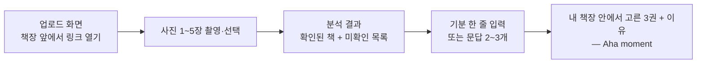

# PRD: Shelfie (셸피)

> **작성 규칙**
> - 모호한 형용사 대신 수치와 로직으로 쓴다. "빠르게" (X) → "조회 p95 800ms 이하" (O).
> - 이 문서는 **무엇을 왜(What & Why)** 만드는지만 다룬다. **어떻게(How)** 는 `/docs/TRD.md`, `/docs/API_SPEC.md`, `/docs/ARCHITECTURE.md`, `/docs/UI_GUIDE.md`에서 관리한다.
> - 결정하지 못한 항목은 빈칸으로 두지 말고 **8. Open Questions**에 질문 형태로 옮긴다.
> - 흐름 표현은 `/docs/ARCHITECTURE.md`의 작성 규칙에 따라 Mermaid로 적는다.

---

## 0. Core Input

PRD를 쓰기 전에 이 표부터 채운다. 여기가 비면 아래 전부가 추측이 된다.

| 항목 | 내용 |
|------|------|
| 제품명 (Product Name) | Shelfie (셸피) — shelf + selfie |
| 핵심 타겟 (Target Persona) | 집에 종이책 50~300권을 갖고 있고 그중 30% 이상이 사놓고 안 읽은 책이며, 독서 앱은 설치해 봤지만 서재를 일일이 등록해 본 적은 없는 20~40대 직장인 독자. 주 1회 이상 "뭐 읽지" 하고 책장 앞에 서지만 5분 안에 못 고르고 폰을 든다 |
| 문제 (The Problem) | 책장 앞에 서면 **책등의 제목만** 보인다. 제목만으로는 이 책이 몇 쪽인지, 얼마나 무거운지, 지금 내 컨디션에 맞는지 판단할 수 없다. 현재 우회 방식: ① 한 권씩 뽑아 뒤표지를 읽는다(권당 30초, 10권이면 5분) ② 제목을 하나씩 검색창에 타이핑한다(오타·동명이서로 자주 실패) ③ 결국 포기하고 이미 있는 책 대신 새 책을 산다 |
| 핵심 가설 (Key Hypothesis) | **책장 사진 한 장으로 서재를 읽어내고 기분 한 줄에 맞춰 3권을 골라주면** → **서재를 등록해 본 적 없는 독자가** → **추천 수락률 60% 이상**을 보이고 **책 고르는 시간이 5분 이상에서 2분 이내로** 줄어든다 |
| 데이터 소스·연동 (Data Source & Integrations) | Anthropic Claude API (`claude-opus-5`, Vision + 텍스트 생성), 알라딘 OpenAPI (ItemSearch / ItemLookUp) |

---

## 1. Executive Summary & Context

### 한 문단 요약
집에 안 읽은 책이 쌓여 있는 독자가 책장을 찍어 올리면, Shelfie가 책등에서 제목을 읽어내고 알라딘에서 실제 책인지 대조한 뒤, "요즘 번아웃인데 가볍게 읽을 것" 같은 한 줄에 맞춰 3권을 골라준다. 읽어내지 못한 책은 숨기지 않고 미확인 목록에 원문 그대로 보여주며, 사용자가 제목을 고쳐 다시 찾을 수 있다. 로그인도 서재 등록도 없이 사진 한 장에서 추천까지 한 세션에 끝난다.

### 왜 지금인가 (Why Now)
세로쓰기 책등, 기울어진 책, 옆 책에 가려 절반만 보이는 제목은 전통 OCR이 문장 단위로 복원하지 못하던 영역이다. 멀티모달 LLM이 이 판독을 문맥으로 처리할 수 있게 되면서, 사진 한 장에서 서재 목록을 뽑는 일이 처음으로 실용 정확도에 들어왔다. 동시에 이미지 1장당 추론 단가가 45원 수준까지 내려와 개인 프로젝트로도 감당 가능해졌다.

### 안 만들면 생기는 일 (Cost of Inaction)
타겟 독자는 계속 주 1회씩 5분을 쓰고도 못 고른다. 집에 있는 미독 도서 수십 권이 계속 미독으로 남고, 대신 새 책을 산다. 기존 독서 앱은 "서재를 먼저 등록하라"는 진입 비용을 요구하는데, 100권을 손으로 등록할 사람은 거의 없다는 것이 이미 검증된 사실이다.

### 대안 (Alternatives)

| 대안 | 사용자가 지금 쓰는 방식 | 부족한 점 | 우리가 나은 점 |
|------|------------------------|-----------|----------------|
| 아무것도 안 함 | 책장 앞에서 책등을 눈으로 훑고 감으로 고름 | 쪽수·난이도·분위기를 알 수 없어 집었다 놓기를 반복. 5분 넘게 걸리고 자주 실패 | 사진 1장으로 서재 전체를 정보화하고, 기분 조건으로 후보를 3권까지 좁혀 준다 |
| 도서 관리 앱 | ISBN 바코드를 한 권씩 스캔해 서재를 등록 | 100권 등록에 30분 이상. 등록 자체가 목적이 되어 대부분 중도 포기 | 등록 단계가 없다. 찍으면 그 자리에서 결과가 나오고 저장을 요구하지 않는다 |
| 검색 포털·서점 앱 | 제목을 하나씩 타이핑해 검색 | 권당 20초 + 오타·동명이서로 실패. "내가 가진 책 중에서"라는 조건을 걸 수 없다 | 내 책장 안에서만 고른다. 이미 가진 책을 다시 사게 하지 않는다 |
| 범용 챗봇에 사진 붙여넣기 | ChatGPT·Claude 앱에 책장 사진을 올려 물어봄 | 존재하지 않는 책을 그럴듯하게 지어내도 알아챌 수 없고, 표지·쪽수·평점 같은 사실 확인이 안 됨 | 모든 책을 알라딘과 대조해 확인/미확인으로 가르고, 사실과 해석을 화면에서 분리해 보여준다 |

---

## 2. Goals & Guardrail Metrics

### North Star Metric
**추천 수락률** — 추천받은 3권 중 1권 이상에 "이거 읽을래요"를 누른 세션의 비율. 이 숫자가 오르면 "내 책장에서 지금 읽을 책을 골라준다"는 가설이 맞은 것이다.

### 성공 지표 (KPI)

| 지표 | Baseline | Target | 측정 시점 | 측정 방법 |
|------|----------|--------|-----------|-----------|
| 추천 수락률 | 미측정 | 60% | 출시 후 4주 | `recommend_accepted` / `recommend_viewed` (7번 이벤트 로그) |
| 책 인식률 (확인된 책 ÷ 사람이 육안으로 세는 권수) | 미측정 | 85% | 출시 후 2주 | 골든 사진 20장 수동 채점 |
| 세션 완주율 (업로드 → 추천 화면 도달) | 미측정 | 70% | 출시 후 4주 | `recommend_viewed` / `photo_uploaded` |
| 업로드부터 추천까지 소요 시간 (중앙값) | 5분 이상 (수동 탐색 기준) | 2분 이내 | 출시 후 4주 | `photo_uploaded` → `recommend_viewed` 타임스탬프 차 |

### 가드레일 지표 (Guardrail / Counter-metrics)
이 기능 때문에 **나빠지면 안 되는** 지표. 임계치를 넘으면 롤백한다.

| 지표 | 허용 한계 (Threshold) | 위반 시 조치 |
|------|----------------------|--------------|
| 존재하지 않는 책이 확인된 책으로 노출된 건수 | 0건 | 즉시 배포 중단. 알라딘 대조 로직을 최우선 수정 |
| 미확인 비율 (미확인 ÷ 추출된 전체 후보) | 20% 이하 | 추출 프롬프트를 직전 버전으로 롤백 |
| 분석 응답 시간 p95 | 30초 이내 | 사진 장수 상한을 5장 → 3장으로 축소 |
| 세션당 Anthropic API 비용 | 300원 이하 | `MODEL_EXTRACT`를 `claude-sonnet-5`로 강등 |
| 분석 요청 에러율 (5xx) | 1% 미만 | 외부 API 폴백 경로 점검 후 기능 플래그 off |

### 중단 기준 (Kill Criteria)
출시 후 4주 시점에 **추천 수락률이 30% 미만**이거나 **책 인식률이 70% 미만**이면 가설을 기각하고 중단한다. 단, **누적 30세션에 도달하기 전에는 어떤 지표로도 판단하지 않는다** — 지인 10명 규모에서는 한두 사람의 행동이 비율을 통째로 뒤집기 때문에, 표본이 모이기 전의 수치는 신호가 아니라 잡음이다. 전자는 "내 책장 안에서 고른다"는 전제가 사용자에게 가치가 없다는 뜻이고, 후자는 책등 판독이 아직 실용 정확도에 못 미친다는 뜻이다. 어느 쪽이든 UI를 다듬어서 해결되는 문제가 아니다.

---

## 3. User Stories with Acceptance Criteria

스토리마다 아래 블록을 반복한다. AC는 **관찰 가능한 결과**로만 쓴다. "잘 동작한다" 같은 문장은 AC가 아니다.

### US-001: 책장 사진으로 내 서재 읽어내기

**As a** 집에 안 읽은 책이 쌓인 독자 **I want to** 책장을 찍어 올리기만 하면 **so that** 손으로 등록하지 않고도 내가 가진 책 목록을 정보와 함께 본다
**우선순위**: Must
**연결 지표**: 책 인식률, 세션 완주율

Acceptance Criteria (Given–When–Then):

- [ ] Given 책등이 보이는 책장 사진 1장을 선택했을 때, When 업로드하면, Then 확인된 책이 표지·제목·저자·출판사·쪽수·알라딘 독자평점과 함께 목록으로 표시된다
- [ ] Given 사진을 2장 이상 5장 이하로 선택했을 때, When 업로드하면, Then 모든 사진이 함께 분석되고 같은 ISBN인 책은 한 권으로 합쳐져 표시된다
- [ ] Given 확인된 책이 목록에 있을 때, When 목록을 보면, Then 알라딘에서 온 사실(제목·저자·쪽수·평점)과 Claude가 쓴 한줄평이 서로 다른 시각적 층위로 구분되어 보인다
- [ ] Given 사진 6장을 선택했을 때, When 업로드를 시도하면, Then 업로드가 차단되고 "최대 5장까지 올릴 수 있어요" 안내가 표시된다 — **실패 케이스**
- [ ] Given 책이 하나도 없는 사진을 올렸을 때, When 분석이 끝나면, Then 빈 표 대신 "책등이 보이도록 다시 찍어 주세요" 안내와 재촬영 CTA가 표시된다 — **실패 케이스**

### US-002: 못 읽어낸 책을 직접 고쳐 찾기

**As a** 서재의 일부가 인식되지 않은 사용자 **I want to** 미확인으로 빠진 책의 제목을 직접 고쳐 다시 찾아 **so that** 흐릿하게 찍힌 책도 추천 후보에 넣는다
**우선순위**: Must
**연결 지표**: 책 인식률, 세션 완주율

- [ ] Given 알라딘 매칭에 실패한 책이 있을 때, When 결과 화면을 보면, Then 미확인 섹션에 사진에서 읽힌 원문 텍스트가 그대로 표시되고 실패 사유(못 읽음 / 검색 결과 없음 / 후보가 여럿)가 함께 보인다
- [ ] Given 미확인 책의 제목을 고쳤을 때, When 재검색하면, Then 알라딘 후보가 표시되고 하나를 고르면 확인된 책 목록으로 이동한다
- [ ] Given 미확인 사유가 "후보가 여럿"(`ambiguous`)일 때, When 결과 화면을 보면, Then 알라딘 후보가 이미 함께 표시되고 제목을 고치지 않아도 그중 하나를 바로 골라 확인된 책으로 옮길 수 있다
- [ ] Given 고친 제목으로도 알라딘 결과가 0건일 때, When 재검색하면, Then 그 책은 미확인에 남고 "알라딘에서 찾을 수 없는 책이에요 (원서·절판일 수 있어요)"가 표시된다 — **실패 케이스**
- [ ] Given 알라딘 조회 자체가 실패했을 때(5xx·타임아웃), When 미확인 사유를 보면, Then "지금 확인할 수 없었어요"와 재시도 안내가 표시되고, **"원서·절판일 수 있어요"라는 문구는 쓰이지 않는다** — 시스템 문제를 데이터 문제로 설명하지 않는다 — **실패 케이스**

### US-003: 지금 기분에 맞는 책 추천받기

**As a** 서재 목록을 확인한 사용자 **I want to** 지금 내 상황을 한 줄로 적고 **so that** 그 상태에 맞는 책 3권을 근거와 함께 받는다
**우선순위**: Must
**연결 지표**: 추천 수락률

- [ ] Given 확인된 책이 3권 이상일 때, When 기분을 한 줄 적고 추천을 요청하면, Then 그 목록 안에서만 고른 3권이 각각 추천 이유와 함께 표시된다
- [ ] Given 추천 결과를 보고 있을 때, When 한 권에 "이거 읽을래요"를 누르면, Then 선택이 시각적으로 반영되고 `recommend_accepted` 이벤트가 기록된다
- [ ] Given 확인된 책이 1~2권뿐일 때, When 추천을 요청하면, Then 있는 권수만큼만 추천하고 "책장을 더 찍으면 더 잘 고를 수 있어요" 안내가 함께 표시된다
- [ ] Given 책과 무관한 문장("점심 뭐 먹지")을 입력했을 때, When 추천을 요청하면, Then 억지 추천 대신 "책 고르는 데 참고할 내용을 적어 주세요" 안내와 예시 문장이 표시된다 — **실패 케이스**
- [ ] Given 같은 세션에서 무관 판정이 **2회 연속** 나왔을 때, When 세 번째로 제출하면, Then 판정을 무시하고 추천이 생성된다 — 오탐으로 사용자를 입력 화면에 가두지 않는다 — **실패 케이스**
- [ ] Given 확인된 책이 0권이고 미확인만 있을 때, When 결과 화면을 보면, Then 추천 단계로 넘어가는 CTA 대신 미확인 목록과 그 사유, 재촬영·직접 수정 경로가 표시된다 — **실패 케이스**

### US-004: 기분을 모를 때 문답으로 좁히기

**As a** 뭘 읽고 싶은지 스스로도 모르는 사용자 **I want to** 짧은 질문 몇 개에 답해서 **so that** 빈 입력창 앞에서 막히지 않고 추천까지 간다
**우선순위**: Should
**연결 지표**: 세션 완주율

- [ ] Given 기분 입력을 비워 둔 채일 때, When 추천을 요청하면, Then 내 서재 구성을 근거로 만든 질문 2~3개가 선택지와 함께 표시된다
- [ ] Given 질문에 모두 답했을 때, When 제출하면, Then 답변이 기분 텍스트로 합성되어 추천이 생성된다
- [ ] Given 질문 생성이 실패했을 때, When 화면을 보면, Then 문답을 건너뛰고 자유 입력창으로 되돌아가며 세션이 끊기지 않는다 — **실패 케이스**

---

## 4. Functional & Data Requirements

### 로직 & 규칙 (Logic & Rules)

| ID | 규칙 | 상세 (입력 → 처리 → 출력) |
|----|------|--------------------------|
| FR-001 | 업로드 제한 | 이미지 1~5장, 장당 원본 10MB 이하, `image/jpeg` `image/png` `image/webp`만 허용 → 초과·미지원 시 업로드 차단 |
| FR-002 | 전송 전 축소 | 클라이언트에서 **EXIF orientation을 적용해 정립시킨 뒤** 긴 변 1568px로 리사이즈하고 JPEG 품질 0.85로 인코딩해 전송. 이미지 토큰을 장당 약 1,600으로 고정해 비용을 예측 가능하게 만든다. 산출물은 장당 2MB·요청 합계 4MB 이하. HEIC는 캔버스 디코드를 시도하고 실패하면 명시적으로 거부한다 (Q3) |
| FR-003 | 확인/미확인 판정 | 추출된 제목+저자로 알라딘 ItemSearch → 제목 유사도 0.8 이상 후보가 1건이면 **확인**. 0건이면 `no_match`. 2건 이상이면 **저자 일치로 tie-break**하고 그래도 복수면 `ambiguous`. 판독 자체가 불완전하면 `unreadable`. **알라딘을 조회하지 못했으면(5xx·타임아웃) `lookup_failed`** — `no_match`와 섞지 않는다. ISBN13이 없는 레코드는 확인으로 승격하지 않는다 |
| FR-004 | 사진 간 중복 제거 | 확인된 책은 `isbn13` 기준으로 합친다. 동일 ISBN이 여러 장에 등장하면 1권으로 표시하고 최초 등장 사진 인덱스를 유지 |
| FR-005 | 목록 상한 | 확인된 책이 50권을 넘으면 상위 50권만 유지하고 "n권 더 있어요"를 표시. 정렬은 결정적이어야 한다 — 평점 내림차순 → 평점 없음은 최하위 → 동점은 먼저 등장한 사진 순 → ISBN 순. 추천은 이 50권 안에서만 고른다 |
| FR-006 | 추천 권수 | 3권 고정. 확인된 책이 3권 미만이면 있는 권수만큼만 추천하고 부족 사유를 안내 |
| FR-007 | 기분 입력 분기 | 기분 텍스트가 공백 제거 후 빈 문자열이면 문답 생성으로 분기. 2자 이상이면 그대로 추천으로 진행 |
| FR-008 | 한줄평 생성 | 확인된 책 전체를 **1회 호출**로 배치 생성. 책당 60자 이내, 난이도·분위기·읽는 맛만 다루고 줄거리 요약은 하지 않는다 |
| FR-009 | 추천 범위 제약 | 추천은 반드시 확인된 책 목록 안에서만 고른다. 목록에 없는 책을 제안한 응답은 스키마 검증 단계에서 폐기하고, 위반한 책을 명시해 1회 재요청한다. **단 이 검사는 모델 출력이 입력과 일치하는지만 보므로, 입력 목록 자체의 진위는 FR-011이 담당한다** |
| FR-010 | 재시도·재추천 상한 | 분석 재시도는 세션당 3회(간격 0초 → 5초 → 15초). 재추천은 세션당 5회. 재시도는 데이터를 망가뜨리지 않지만 비용은 매번 새로 든다 |
| FR-011 | 확인 상태의 증명 | 확인된 책에는 서버 서명을 붙여 돌려주고, 추천·문답 요청 때 그 서명을 검증한다. 서명이 없거나 위조·만료된 책은 그 책만 버린다. 무상태라 확인 판정이 클라이언트를 거쳐 돌아오는데, 서명이 없으면 서버는 그 목록이 자기가 내준 것인지 알 수 없다 (ADR-006) |
| FR-012 | 조회 전 후보 상한 | 알라딘 조회 전에 판독 확신도 0.3 미만은 "못 읽음"으로 내리고, 남은 후보를 확신도 높은 순 80건까지만 조회한다. 미확인 목록은 100건까지만 보여준다. 상한이 없으면 판독 한 번의 이상 동작이 알라딘 일일 한도를 한 요청에 소진시킨다 |

### 데이터 요구사항

| 항목 | 내용 |
|------|------|
| 필요한 데이터 | 사용자 업로드 이미지(휘발), Claude가 추출한 제목·저자 후보, 알라딘 ItemSearch/ItemLookUp의 서지 정보(표지 URL·저자·출판사·쪽수·독자평점·ISBN13) |
| 갱신 주기 | 요청 시마다 실시간 조회. 캐시 없음 |
| 정확도 기준 | 확인된 책으로 표시된 항목은 알라딘에 실재하는 도서와 100% 일치해야 한다. 사실 필드는 알라딘 응답을 그대로 쓰며 어떤 경우에도 생성하지 않는다 |
| 보관 기간 | **0.** 이미지·추출 결과·추천 결과 모두 요청-응답 주기 안에서만 존재하고 어디에도 저장하지 않는다 |

스키마 정의는 `/docs/TRD.md`의 데이터 모델에 둔다.

### MoSCoW Prioritization

| 구분 | 항목 | 근거 |
|------|------|------|
| **Must have** | 사진 1~5장 업로드 및 책등 추출, 알라딘 대조 후 확인/미확인 분류, 미확인 직접 수정·재검색, 자유 텍스트 기분 입력, 3권 추천 + 이유 | 이 다섯이 빠지면 "책장 사진 → 내 책 중 추천"이라는 핵심 가설을 검증할 수 없다 |
| **Should have** | 기분 미입력 시 문답 유도, 책별 Claude 한줄평, "이거 읽을래요" 수락 이벤트 | 문답은 완주율을, 한줄평은 수락률을 올릴 것으로 보지만 없어도 가설 검증은 가능하다 |
| **Could have** | 추천 결과 이미지로 저장, 알라딘 구매 링크, 촬영 가이드 오버레이 | 가치는 있으나 핵심 루프 밖이다 |
| **Won't have (this release)** | 로그인·계정, 서재 누적 저장, 읽은 책 기록, 사용자 간 공유·피드, 전자책 연동 | 저장을 넣는 순간 데이터 레이어·인증·개인정보 처리방침이 함께 필요해져 MVP 범위가 두 배가 된다. 무상태로 가설부터 검증한다 (ADR-003) |

---

## 5. User Experience & Edge Cases

### Happy Path

### 화면 인벤토리

| 화면 | 목적 | 핵심 요소 | 관련 스토리 |
|------|------|-----------|-------------|
| 업로드 | 첫 행동까지의 마찰을 최소화 | 촬영·선택 버튼, 선택된 사진 썸네일(최대 5), 촬영 팁 한 줄, 분석 시작 CTA | US-001 |
| 분석 결과 | 내 서재를 사실 기반으로 확인 | 확인된 책 카드 목록(표지·서지·평점·한줄평), 미확인 섹션(원문·사유·수정 입력), 추천으로 넘어가는 CTA | US-001, US-002 |
| 기분 입력 | 추천 조건을 한 줄로 받기 | 자유 텍스트 입력창, 예시 문장 3개, 비워 두고 진행하는 경로 | US-003, US-004 |
| 문답 | 기분을 모를 때 좁혀 주기 | 서재 기반 질문 2~3개와 선택지, 건너뛰기 | US-004 |
| 추천 결과 | 가치 획득 | 추천 3권 카드(표지·서지·추천 이유), "이거 읽을래요" 버튼, 다시 추천받기 | US-003 |

### Edge Cases

| 상황 | 발생 조건 | 시스템 동작 | 사용자에게 보이는 것 |
|------|-----------|-------------|---------------------|
| 빈 상태 (Empty State) | 사진에서 책 후보가 0건 추출됨 | 결과 화면 대신 재촬영 안내로 분기. 빈 목록을 렌더링하지 않는다 | "책등이 보이도록 다시 찍어 주세요" + 촬영 팁 + 재촬영 CTA |
| 로딩 (Loading) | 분석 요청이 300ms를 넘김 | 사진별 진행 상태를 표시하는 스켈레톤. 클라이언트 타임아웃은 **70초**(서버 상한 60초보다 길게 잡아 504와 안내 문구를 받는다) | 사진 썸네일 위 진행 표시 + "책등을 읽고 있어요" (5장 기준 최대 30초 안내) |
| 실패 (Error) | Anthropic 또는 알라딘 5xx·타임아웃 | 1회 자동 재시도(지수 백오프 1초). 재시도도 실패하면 에러 배너 | "지금 책을 확인할 수 없어요. 잠시 후 다시 시도해 주세요" + 재시도 버튼. 내부 에러 상세·API 키는 노출하지 않는다 |
| 권한 없음 (Unauthorized) | 브라우저 카메라·사진 접근 권한 거부 | 촬영 경로를 막고 파일 선택 경로만 유지 | "사진 접근 권한이 없어요. 갤러리에서 직접 선택해 주세요" + 파일 선택 버튼 |
| 부분 실패 (Partial Failure) | 5장 중 일부 사진의 추출만 실패, 또는 알라딘 조회 일부 실패 | 성공한 사진의 결과는 그대로 반영하고 실패분만 별도 표기. 전체를 실패시키지 않는다. 실패한 사진의 인덱스를 응답에 담아 그 사진만 다시 시도할 수 있게 한다 | "사진 3장 중 1장은 읽지 못했어요" 배너 + "이 사진만 다시 시도" 버튼 + 성공한 책 목록은 정상 표시 |
| 대량 데이터 | 확인된 책이 50권 초과 (FR-005) | 평점 내림차순 상위 50권만 유지. 추천도 이 범위 안에서 수행 | "50권까지만 보여드려요 (n권 더 있음)" + 목록은 스크롤 |
| 오프라인·네트워크 단절 | 업로드 또는 추천 요청 중 연결 끊김 | 요청을 중단하고 입력 상태(선택한 사진·기분 텍스트)를 메모리에 유지 | "인터넷 연결을 확인해 주세요" + 재시도 버튼. 고른 사진은 그대로 남는다 |
| 확인 0건·미확인만 존재 | 후보는 추출됐으나 알라딘 대조를 통과한 책이 0권 (알라딘 장애 또는 전량 미확인) | 빈 상태로 보내지 않는다. 미확인 목록을 사유와 함께 그대로 보여주고 추천 CTA는 감춘다 | "읽어낸 책을 알라딘에서 확인하지 못했어요" + 사유별 목록 + 직접 수정·재촬영 경로 |
| 결과 이탈 (새로고침·뒤로가기) | 분석 결과를 본 뒤 새로고침하거나 뒤로 간다 | 무상태라 사진·결과가 함께 사라지고 재분석에 API 비용이 다시 든다. `reviewing` 이후 상태에서 `beforeunload` 경고를 건다 | "지금 나가면 분석 결과가 사라져요" 브라우저 확인창 |
| 재추천·재시도 반복 | "다시 추천받기"나 에러 화면의 "다시 시도"를 계속 누른다 | 재추천 5회, 분석 재시도 3회로 제한하고 재시도 간격을 0초 → 5초 → 15초로 벌린다 (FR-010). 호출마다 모델 비용이 새로 발생한다 | 소진 시 버튼 비활성화 + "기분을 바꿔 적어 보세요" / "잠시 후 다시 시도해 주세요" |
| 같은 사진 중복 선택 | 갤러리에서 동일 파일을 두 번 고른다 | 파일 해시로 중복을 제거하고 장수에서 뺀다. 같은 사진을 두 번 분석하면 비용만 두 배가 된다 | "같은 사진 1장은 제외했어요" 안내 |
| 파노라마·초고해상도 사진 | 세로로 긴 책장 사진(예: 1200×4000) | 긴 변 1568px로 줄이면 책등 글자가 판독 불가 수준으로 뭉개진다. 리사이즈 후 짧은 변이 600px 미만이면 경고한다 | "사진이 너무 길어요. 책장을 나눠서 여러 장으로 찍어 주세요" |

시각적 규칙(색상·컴포넌트·타이포그래피)은 `/docs/UI_GUIDE.md`를 따른다.

---

## 6. Technical Considerations

상세 설계는 아래 문서에 두고, 여기에는 **제품이 요구하는 제약**만 적는다.

- 기술 스택·데이터 모델·비기능 요구사항 → `/docs/TRD.md`
- 엔드포인트 계약 → `/docs/API_SPEC.md`
- 구조·데이터 흐름 → `/docs/ARCHITECTURE.md`

| 항목 | 요구사항 |
|------|----------|
| 성능 (Latency) | 사진 1장 분석 p95 12초 이내, 5장 p95 30초 이내. 추천 생성 p95 15초 이내 |
| 데이터 신선도 | 알라딘 조회는 매 요청 실시간. 캐시가 없으므로 지연 개념이 없다 |
| 외부 API 종속성 | **Anthropic Claude API** — 사실상 단일 장애점. 429/5xx 시 1회 백오프 재시도 후 사용자에게 실패를 명시한다. **알라딘 OpenAPI** — 일 5,000회 호출 한도. 장애 시 해당 책을 미확인으로 강등하고, 확인되지 않은 책은 추천 후보에 넣지 않는다 |
| 규모 가정 | 초기 일 요청 100건 이하, 세션당 사진 최대 5장·책 최대 50권. 이 가정을 넘으면 TRD의 MVP → Scale 전환 트리거가 발동한다 |
| 보안·컴플라이언스 | `ANTHROPIC_API_KEY`와 알라딘 TTB 키는 서버 환경변수로만 보관하고 클라이언트 번들·응답에 절대 포함하지 않는다. 업로드된 이미지는 디스크에 쓰지 않고 요청 처리 후 폐기한다 |

---

## 7. Go-To-Market & Analytics

### 온보딩 (Activation)

**Aha moment 정의**: 추천 3권이 각각의 이유와 함께 화면에 나타나고, 그중 한 권이 "내가 이미 갖고 있는데 잊고 있던 책"임을 사용자가 알아본 시점.

| 단계 | 사용자가 하는 일 | 이탈 위험 | 대응 |
|------|-----------------|-----------|------|
| 1 | 링크를 열고 업로드 화면을 본다 | 뭘 찍어야 할지 몰라 이탈 | 예시 이미지 1장 + "책등이 보이게 한 칸씩" 한 줄 가이드. 로그인 요구 없음 |
| 2 | 책장 사진을 찍거나 고른다 | 촬영이 귀찮음 | 여러 장 선택을 기본으로 열어 두되 1장만으로도 진행 가능하게 한다 |
| 3 | 분석 결과에서 내 책을 알아본다 | 인식률이 낮으면 신뢰를 잃음 | 미확인을 숨기지 않고 원문 그대로 노출해 "왜 빠졌는지"를 납득시킨다 |
| 4 | 기분을 적고 추천을 받는다 | 빈 입력창 앞에서 막힘 | 예시 문장 3개 노출 + 비워 두면 문답으로 유도 (US-004) |

목표: 첫 진입 후 3분 이내 Aha moment 도달률 60%.

### 출시 전략 (Rollout)

| 단계 | 대상 | 기간 | 다음 단계 진입 조건 |
|------|------|------|--------------------|
| 내부 테스트 | 개발자 본인의 책장 사진 20장(골든 세트) | 1주 | 책 인식률 85% 이상, 존재하지 않는 책 노출 0건 |
| 제한 배포 | 지인 10명에게 링크 공유 | 2주 | 가드레일 지표 위반 없음, 세션당 비용 300원 이하 유지 |
| 전체 배포 | 링크 공개 | — | 일 요청 100건 도달 시 TRD의 Scale 전환 검토 |

### 이벤트 로그 (Tracking Plan)

명명 규칙: snake_case, `{object}_{action}` 형식. 저장소가 없으므로 구조화 JSON 한 줄로 표준 출력에 남기고 Vercel 로그로 조회한다. 개인 식별 정보·이미지·판독 원문(`rawText`)은 절대 기록하지 않는다.

**수집 경로**: 대부분은 라우트 핸들러가 직접 남기지만, `recommend_viewed`·`recommend_accepted`·`book_resolved` 세 가지는 클라이언트에서만 관측된다. 이 셋은 `POST /api/events`로 보내 서버 로그에 합류시킨다. 이 경로가 없으면 **North Star 지표의 분자를 셀 수 없어 가설 검증 자체가 성립하지 않는다.** 아래 표의 `수집` 열이 어느 쪽인지 밝힌다.

| 이벤트명 | 수집 | 발생 시점 | 속성 (Properties) | 연결 지표 |
|----------|------|-----------|-------------------|-----------|
| `photo_uploaded` | 서버 | `/api/analyze` 요청 수신 | `session_id`, `photo_count` | 세션 완주율(분모), 소요 시간(시작점) |
| `analyze_completed` | 서버 | 분석 응답 반환 직전 | `session_id`, `identified_count`, `unidentified_count`, `unidentified_by_reason`(4종 카운트), `overflow_count`, `failed_photo_count`, `duration_ms`, `input_tokens`, `output_tokens` | 책 인식률, 미확인 비율(가드레일), 세션당 비용(가드레일) |
| `analyze_failed` | 서버 | 분석 중 처리 불가 오류 | `session_id`, `error_code`, `failed_photo_count` | 에러율(가드레일) |
| `questions_generated` | 서버 | 문답 응답 반환 직전 | `session_id`, `question_count`(0이면 폴백), `input_tokens`, `output_tokens` | 세션 완주율, 세션당 비용(가드레일) |
| `mood_submitted` | 서버 | 기분 텍스트 또는 문답 답변 제출 | `session_id`, `input_mode` (`free_text` 또는 `guided`), `retry_index`(다시 추천받기 횟수) | 세션 완주율 |
| `book_resolved` | **클라이언트** → `/api/events` | 미확인 책을 사용자가 확정 | `session_id`, `resolve_attempt`, `matched` | 책 인식률 |
| `recommend_viewed` | **클라이언트** → `/api/events` | 추천 결과 렌더링 | `session_id`, `recommended_count`, `duration_ms`, `input_tokens`, `output_tokens`(응답에서 전달받은 값) | 추천 수락률(분모), 세션 완주율(분자), 세션당 비용 |
| `recommend_accepted` | **클라이언트** → `/api/events` | "이거 읽을래요" 클릭 | `session_id`, `position` (1~3) | **추천 수락률(분자) — North Star** |

- 지표에 연결되지 않는 이벤트는 만들지 않는다.
- **Claude를 호출하는 모든 이벤트에 토큰 수를 싣는다.** 가드레일이 "세션당 비용 300원"인데 추출 토큰만 기록하면 추천·문답 비용이 집계에서 빠져 실제보다 낮게 보인다.
- 미확인은 사유별로 나눠 센다. `lookup_failed`(알라딘 장애)는 미확인 비율 가드레일의 분자에서 제외한다 — 외부 장애를 프롬프트 품질 저하로 오독하면 엉뚱한 롤백을 하게 된다 (ADR-005).

---

## 8. Open Questions & Risks

### Open Questions

| # | 질문 | 상태 | 결정이 필요한 시점 | 결정권자 |
|---|------|------|-------------------|----------|
| Q1 | 알라딘 TTB 키 발급에 등록할 사이트 주소를 무엇으로 할 것인가 (Vercel 배포 도메인 확정 필요) | **미결** | 알라딘 연동 구현 시작 전 | 프로젝트 오너 |
| Q2 | 골든 사진 20장을 어떻게 확보할 것인가 — 본인 책장만으로 다양한 조명·각도를 커버할 수 있는가 | **미결** | 인식률 측정 시작 전 | 프로젝트 오너 |
| Q3 | iOS에서 촬영한 HEIC를 지원할 것인가, 브라우저 리사이즈 단계에서 JPEG로 강제 변환할 것인가 | **결정됨** ↓ | — | — |
| Q4 | 제목 유사도 0.8(FR-003)이 적절한 임계값인가 | **결정됨** ↓ (제한 배포 전 골든 세트로 재검증) | — | — |
| Q5 | 골든 사진 20장을 리포에 커밋할 것인가 — 실제 책장이라 사생활이 섞이고, 커밋하지 않으면 다른 사람이 회귀 측정을 재현할 수 없다 | **미결** | 골든 테스트 작성 시 | 프로젝트 오너 |

**Q3 결정 — HEIC는 변환을 시도하고, 실패하면 거부한다.**
캔버스로 디코드를 시도한다(iOS Safari는 대개 성공한다). 실패하면 폴리필을 넣지 않고 명시적으로 거부하며, "아이폰 설정 → 카메라 → 포맷을 '높은 호환성'으로 바꿔 주세요" 안내를 띄운다. 디코드 라이브러리는 새 의존성이고, 새 의존성은 ADR 없이 추가하지 않는다는 규칙이 있다. 조용히 실패해 빈 결과를 주는 것보다 이유를 말하고 거부하는 편이 낫다.

**Q4 결정 — 0.8을 유지하고, 대신 저자로 tie-break한다.**
임계값을 낮추면 오확인(가드레일 0건)이 늘어난다. ADR-002가 재현율을 희생하고 정밀도를 택했으므로 임계값을 건드리는 것은 그 결정을 뒤집는 일이다. 놓치는 책은 임계값이 아니라 **판정 방식**으로 회수한다 — 0.8을 넘는 후보가 둘 이상일 때 저자 일치를 함께 보면 동명 제목·개정판 상당수가 한 건으로 좁혀진다. 제한 배포 전 골든 세트로 재검증하고, 그때도 미확인이 20%를 넘으면 그 결과를 근거로 임계값을 다시 논의한다.

### Risks

| 리스크 | 유형 | 영향 | 대응 |
|--------|------|------|------|
| 존재하지 않는 책을 그럴듯하게 지어내 확인된 책으로 노출 | 제품 | 높음 | 알라딘 대조를 통과한 책만 확인으로 승격하고(ADR-002), 그 판정에 서버 서명을 붙여 클라이언트를 거쳐 돌아와도 위조를 판별한다(ADR-006). 가드레일 임계치 0건. **다만 화면에 실제로 뜬 가짜 책을 사후 탐지할 신호는 없다** — 이 지표는 감지가 아니라 예방으로만 지켜지며, 그래서 모델·프롬프트를 바꿀 때 골든 세트 실행이 선택이 아닌 게이트다 |
| 알라딘에 없는 원서·절판본이 전부 미확인으로 빠짐 | 제품 | 중간 | 미확인 사유를 "찾을 수 없는 책(원서·절판일 수 있어요)"으로 구분해 사용자가 시스템 결함이 아님을 이해하게 한다 |
| Anthropic API 장애 시 서비스 전체 정지 | 기술 | 높음 | 폴백 제공자가 없음을 수용한다. 사용자에게 실패를 명확히 알리고 입력 상태를 유지해 재시도 비용을 0으로 만든다 |
| 트래픽 증가로 API 비용이 예상을 초과 | 운영 | 중간 | 세션당 비용을 이벤트 로그로 상시 측정. 가드레일 초과 시 `MODEL_EXTRACT` 강등, 그래도 넘으면 사진 장수 상한 축소 |
| 공개 링크가 남용되어 API 비용이 폭주 | 운영 | 높음 | 로그인도 레이트 리밋도 없는 URL이 장당 45원짜리 모델을 부른다. **세션당 가드레일은 총량 폭주를 잡지 못한다.** Anthropic 콘솔의 spend limit을 배포 전에 걸고, `SERVICE_ENABLED=false`로 즉시 차단할 수 있게 하며, 링크 공개 전에 레이트 리밋을 도입한다 |
| 외부 장애를 "책이 없다"고 설명해 신뢰를 잃음 | 제품 | 중간 | 알라딘 조회 실패는 `lookup_failed`로 분리해 "지금 확인할 수 없었어요"로 표시한다. 사실이 아닌 설명은 가짜 책을 보여주는 것과 같은 종류의 신뢰 손상이다 (ADR-005) |
| 업로드 이미지에 책 외 사생활(방 내부·사람)이 포함 | 법무 | 중간 | 이미지를 저장하지 않는다. 로그에 이미지·파일명을 남기지 않는다. 업로드 화면에 "사진은 저장되지 않아요"를 명시 |
| 책등 판독 정확도가 조명·각도에 크게 좌우됨 | 기술 | 중간 | 촬영 가이드를 업로드 화면에 노출하고, 미확인 직접 수정 경로(US-002)로 사용자가 복구할 수 있게 한다 |

### 의도적으로 감수하는 기술 부채 (Accepted Debt)

| 항목 | 지금 이렇게 하는 이유 | 갚아야 하는 시점 |
|------|---------------------|-----------------|
| 저장소·계정 없음 (무상태) | 등록 마찰 0이 이 제품의 핵심 차별점이고, 데이터 레이어를 넣으면 MVP 범위가 두 배가 된다 (ADR-003) | 사용자가 "찍은 서재를 다시 보고 싶다"고 요구하기 시작할 때 |
| 이벤트 로그를 분석 도구 없이 표준 출력으로만 | 저장소가 없어 이벤트 DB를 따로 세울 이유가 없다. 초기 요청량에서는 Vercel 로그 조회로 충분 | 일 요청 100건을 넘어 수동 집계가 불가능해질 때 |
| 레이트 리밋·남용 방지 없음 | 링크를 아는 소수에게만 공유하는 단계라 남용 표면이 좁다. 그 전제가 깨지는 순간 비용이 그대로 노출되므로, 그동안은 Anthropic spend limit과 `SERVICE_ENABLED` 스위치가 유일한 방어선이다 | 링크를 공개 배포하기 직전 (미루면 안 되는 부채) |
| 알라딘 응답 캐시 없음 | 같은 책이 반복 조회될 확률이 초기 트래픽에서는 낮다 | 알라딘 일 5,000회 한도의 50%에 도달할 때 |
