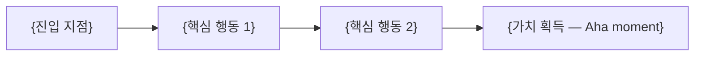

# PRD: {제품명 / Product Name}

> **작성 규칙**
> - 모호한 형용사 대신 수치와 로직으로 쓴다. "빠르게" (X) → "조회 p95 800ms 이하" (O).
> - 이 문서는 **무엇을 왜(What & Why)** 만드는지만 다룬다. **어떻게(How)** 는 `/docs/TRD.md`, `/docs/API_SPEC.md`, `/docs/ARCHITECTURE.md`, `/docs/UI_GUIDE.md`에서 관리한다.
> - 결정하지 못한 항목은 빈칸으로 두지 말고 **8. Open Questions**에 질문 형태로 옮긴다.
> - 흐름 표현은 `/docs/ARCHITECTURE.md`의 작성 규칙에 따라 Mermaid로 적는다.

---

## 0. Core Input

PRD를 쓰기 전에 이 표부터 채운다. 여기가 비면 아래 전부가 추측이 된다.

| 항목 | 내용 |
|------|------|
| 제품명 (Product Name) | {} |
| 핵심 타겟 (Target Persona) | {역할·규모·숙련도까지 구체적으로. "중소 쇼핑몰 사장" (X) → "월 GMV 1천만~1억, 마케터 없이 대표가 직접 광고를 집행하는 Shopify 셀러" (O)} |
| 문제 (The Problem) | {이 사람이 지금 겪는 고통. **현재 어떻게 우회하고 있는지(current workaround)** 까지 적는다} |
| 핵심 가설 (Key Hypothesis) | {"{무엇}을 만들면 → {누가} → {지표}가 {수치}만큼 변한다" 형태로. 검증 가능해야 한다} |
| 데이터 소스·연동 (Data Source & Integrations) | {예: Shopify Admin API, Google Analytics 4} |

---

## 1. Executive Summary & Context

### 한 문단 요약
{누구의 / 어떤 문제를 / 어떻게 해결하는지. 3~5문장. 이 문단만 읽어도 의사결정이 가능해야 한다}

### 왜 지금인가 (Why Now)
{시장·기술·규제 변화 중 지금이어야 하는 근거. "언제 해도 되는 일"이면 우선순위를 낮춘다}

### 안 만들면 생기는 일 (Cost of Inaction)
{현상 유지 시 잃는 것. 수치로}

### 대안 (Alternatives)

| 대안 | 사용자가 지금 쓰는 방식 | 부족한 점 | 우리가 나은 점 |
|------|------------------------|-----------|----------------|
| {경쟁 제품 / 수작업 / 아무것도 안 함} | {} | {} | {} |

---

## 2. Goals & Guardrail Metrics

### North Star Metric
{단 하나. 이 숫자가 오르면 제품이 성공한 것}

### 성공 지표 (KPI)

| 지표 | Baseline | Target | 측정 시점 | 측정 방법 |
|------|----------|--------|-----------|-----------|
| {} | {현재값 또는 "미측정"} | {수치} | {예: 출시 후 4주} | {예: 7번 이벤트 로그 기준} |

### 가드레일 지표 (Guardrail / Counter-metrics)
이 기능 때문에 **나빠지면 안 되는** 지표. 임계치를 넘으면 롤백한다.

| 지표 | 허용 한계 (Threshold) | 위반 시 조치 |
|------|----------------------|--------------|
| {예: 기존 핵심 플로우 완료율} | {예: -3%p 이내} | {예: 기능 플래그 off} |
| {예: p95 응답 시간} | {예: +200ms 이내} | {} |
| {예: 에러율} | {예: 1% 미만} | {} |

### 중단 기준 (Kill Criteria)
{언제 가설을 기각하고 접는가. 예: "출시 후 4주간 활성 사용자의 주간 재사용률이 15% 미만이면 중단하고 회고" — 성공 기준만 있고 중단 기준이 없으면 실패한 기능이 영원히 유지보수된다}

---

## 3. User Stories with Acceptance Criteria

스토리마다 아래 블록을 반복한다. AC는 **관찰 가능한 결과**로만 쓴다. "잘 동작한다" 같은 문장은 AC가 아니다.

### US-001: {스토리 제목}

**As a** {페르소나} **I want to** {행동} **so that** {얻는 가치}
**우선순위**: {Must / Should / Could}
**연결 지표**: {2번의 어떤 KPI를 움직이는가}

Acceptance Criteria (Given–When–Then):

- [ ] Given {초기 상태}, When {사용자 행동}, Then {관찰 가능한 결과}
- [ ] Given {}, When {}, Then {}
- [ ] Given {실패 조건}, When {}, Then {에러 처리 결과} — **실패 케이스 최소 1개 필수**

### US-002: {스토리 제목}

**As a** {} **I want to** {} **so that** {}
**우선순위**: {}
**연결 지표**: {}

- [ ] Given {}, When {}, Then {}

---

## 4. Functional & Data Requirements

### 로직 & 규칙 (Logic & Rules)

| ID | 규칙 | 상세 (입력 → 처리 → 출력) |
|----|------|--------------------------|
| FR-001 | {} | {임계값·정렬 기준·계산식을 수치로. 예: "최근 30일 매출 상위 10개, 동률 시 최신순"} |
| FR-002 | {} | {} |

### 데이터 요구사항

| 항목 | 내용 |
|------|------|
| 필요한 데이터 | {어떤 소스에서 무엇을} |
| 갱신 주기 | {예: 15분 배치 / 실시간} |
| 정확도 기준 | {예: 원본 대비 오차 1% 이내} |
| 보관 기간 | {} |

스키마 정의는 `/docs/TRD.md`의 데이터 모델에 둔다.

### MoSCoW Prioritization

| 구분 | 항목 | 근거 |
|------|------|------|
| **Must have** | {} | {없으면 핵심 가설 검증 자체가 불가능한 것만} |
| **Should have** | {} | {} |
| **Could have** | {} | {} |
| **Won't have (this release)** | {} | {명시적으로 안 만드는 것 + 왜 지금이 아닌지} |

---

## 5. User Experience & Edge Cases

### Happy Path

### 화면 인벤토리

| 화면 | 목적 | 핵심 요소 | 관련 스토리 |
|------|------|-----------|-------------|
| {} | {} | {} | {US-001} |

### Edge Cases

| 상황 | 발생 조건 | 시스템 동작 | 사용자에게 보이는 것 |
|------|-----------|-------------|---------------------|
| 빈 상태 (Empty State) | {최초 진입, 데이터 0건} | {} | {예: 안내 문구 + 첫 행동 CTA. 빈 표 노출 금지} |
| 로딩 (Loading) | {} | {예: 300ms 이상 걸리면 스켈레톤 표시} | {} |
| 실패 (Error) | {API 오류, 타임아웃} | {예: 1회 자동 재시도 후 에러 배너} | {} |
| 권한 없음 (Unauthorized) | {} | {} | {} |
| 부분 실패 (Partial Failure) | {일부 데이터만 조회 성공} | {} | {} |
| 대량 데이터 | {예: 1만 건 이상} | {예: 페이지네이션 / 가상 스크롤} | {} |
| 오프라인·네트워크 단절 | {} | {} | {} |

시각적 규칙(색상·컴포넌트·타이포그래피)은 `/docs/UI_GUIDE.md`를 따른다.

---

## 6. Technical Considerations

상세 설계는 아래 문서에 두고, 여기에는 **제품이 요구하는 제약**만 적는다.

- 기술 스택·데이터 모델·비기능 요구사항 → `/docs/TRD.md`
- 엔드포인트 계약 → `/docs/API_SPEC.md`
- 구조·데이터 흐름 → `/docs/ARCHITECTURE.md`

| 항목 | 요구사항 |
|------|----------|
| 성능 (Latency) | {예: 목록 조회 p95 800ms 이하} |
| 데이터 신선도 | {예: 최대 15분 지연 허용} |
| 외부 API 종속성 | {서비스명 + 레이트 리밋 + 장애 시 폴백 동작} |
| 규모 가정 | {예: 초기 사용자 100명, 계정당 데이터 1만 건} |
| 보안·컴플라이언스 | {예: 외부 API 토큰은 서버에만 보관} |

---

## 7. Go-To-Market & Analytics

### 온보딩 (Activation)

**Aha moment 정의**: {사용자가 가치를 처음 체감하는 정확한 순간. 예: "첫 리포트가 생성되어 화면에 표시된 시점"}

| 단계 | 사용자가 하는 일 | 이탈 위험 | 대응 |
|------|-----------------|-----------|------|
| 1 | {} | {} | {} |
| 2 | {} | {} | {} |

목표: {예: 가입 후 10분 이내 Aha moment 도달률 60%}

### 출시 전략 (Rollout)

| 단계 | 대상 | 기간 | 다음 단계 진입 조건 |
|------|------|------|--------------------|
| {내부 테스트} | {} | {} | {} |
| {제한 배포} | {예: 신규 가입자 10%} | {} | {가드레일 지표 위반 없음} |
| {전체 배포} | {} | {} | {} |

### 이벤트 로그 (Tracking Plan)

명명 규칙: {예: snake_case, `{object}_{action}` 형식}

| 이벤트명 | 발생 시점 | 속성 (Properties) | 연결 지표 |
|----------|-----------|-------------------|-----------|
| {feature_viewed} | {} | {user_id, source} | {2번 KPI 중 하나} |
| {feature_completed} | {} | {} | {} |
| {feature_failed} | {} | {error_code} | {가드레일 에러율} |

- 지표에 연결되지 않는 이벤트는 만들지 않는다.

---

## 8. Open Questions & Risks

### Open Questions

| # | 질문 | 결정이 필요한 시점 | 결정권자 |
|---|------|-------------------|----------|
| Q1 | {} | {예: 구현 시작 전} | {} |

### Risks

| 리스크 | 유형 | 영향 | 대응 |
|--------|------|------|------|
| {} | {제품 / 기술 / 법무 / 운영} | {높음·중간·낮음} | {} |

### 의도적으로 감수하는 기술 부채 (Accepted Debt)

| 항목 | 지금 이렇게 하는 이유 | 갚아야 하는 시점 |
|------|---------------------|-----------------|
| {} | {} | {} |
