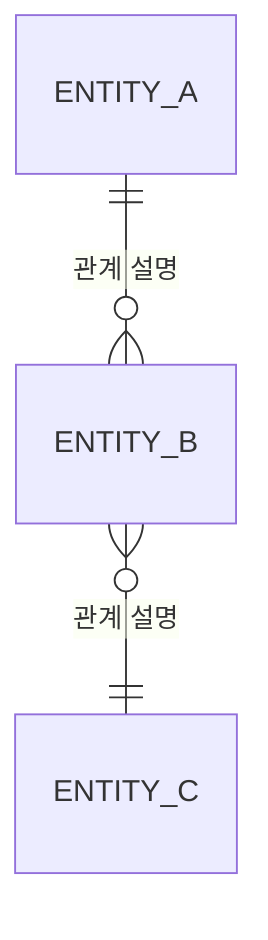
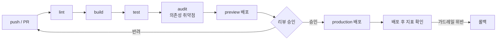

# TRD: {프로젝트명}

> **작성 규칙**
> - 모든 수치는 단위와 함께 적는다 (ms, %, TPS, req/min). "빠르게", "안정적으로" 같은 형용사는 요구사항이 아니다.
> - 기술 선택에는 **포기한 것(Trade-off)** 을 반드시 함께 적는다. 상세 근거는 `/docs/ADR.md`에 남긴다.
> - 구조·흐름은 `/docs/ARCHITECTURE.md`의 작성 규칙에 따라 Mermaid로 표현한다.
> - 모든 항목에 `[MVP]` 또는 `[Scale]` 태그를 단다. `[MVP]`는 첫 배포 전 필수, `[Scale]`은 아래 트리거에 도달했을 때 채운다.
>
> **단계 전환 트리거 (MVP → Scale)**: {예: DAU 1,000명 도달 또는 API p95 1s 초과 또는 유료 고객 발생}
> 이 줄이 비어 있으면 티어 구분이 무의미해진다. 반드시 채운다.

---

## 1. 개요 (Scope & Context)

### 기술적 목표 (Technical Goals)

비즈니스 목표가 아니라, 이 시스템이 **기술적으로** 달성해야 하는 것.

1. {예: 외부 API 응답을 캐싱해 동일 조회의 p95를 500ms 이하로 유지}
2. {}
3. {}

### 비목표 (Non-Goals)

이번에 **풀지 않는** 기술 문제. 경계를 적지 않으면 스코프가 샌다.

- {예: 멀티 테넌시 — 단일 조직 전제로 설계한다}
- {예: 실시간 동기화 — 폴링으로 충분하다고 판단}

### 참조 문서

| 알고 싶은 것 | 문서 |
|--------------|------|
| 비즈니스 목표, 페르소나, 유저 스토리, 성공 지표 | `/docs/PRD.md` |
| 디렉토리 구조, 레이어 의존 관계, 데이터 흐름 다이어그램 | `/docs/ARCHITECTURE.md` |
| 기술 선택의 배경과 트레이드오프 (결정 기록) | `/docs/ADR.md` |
| 엔드포인트 계약, 요청·응답 스키마, 에러 규약 | `/docs/API_SPEC.md` |
| 색상, 컴포넌트, 타이포그래피 | `/docs/UI_GUIDE.md` |

---

## 2. 기술 스택

| 레이어 | 선택 | 버전 | 선택 근거 (Why) | 포기한 것 (Trade-off) | 단계 |
|--------|------|------|-----------------|----------------------|------|
| 언어 | {예: TypeScript} | {예: 5.x} | {예: 타입으로 API 계약을 강제} | {예: 빌드 단계 추가} | [MVP] |
| 런타임 | {예: Node.js} | {예: 20 LTS} | {} | {} | [MVP] |
| 프레임워크 | {예: Next.js App Router} | {예: 15} | {} | {} | [MVP] |
| 스타일링 | {예: Tailwind CSS} | {예: 4} | {} | {} | [MVP] |
| 데이터 저장소 | {} | {} | {} | {} | [MVP] |
| 테스트 | {예: Vitest} | {} | {} | {} | [MVP] |
| 관측성 | {} | {} | {} | {} | [Scale] |

- `포기한 것` 열이 비어 있다면 아직 대안을 검토하지 않은 것이다. 검토 후 `/docs/ADR.md`에 결정을 남긴다.
- 버전 고정 정책: {예: 메이저 고정, 마이너·패치는 lockfile로 관리}
- 배포 타깃 런타임: {예: Vercel Node 20 서버리스 함수}

---

## 3. 시스템 요구사항 (Functional → Tech Spec)

PRD의 유저 스토리(US-00N)·기능 요구사항(FR-00N)을 기술 요구사항으로 분해한다. `검증 방법`은 **실행 가능한 커맨드**로 적는다.

| ID | 대상 기능 (PRD) | 기술 요구사항 | 성공 지표 (Success Metric) | 엣지 케이스 | 검증 방법 | 단계 |
|----|-----------------|---------------|---------------------------|-------------|-----------|------|
| TR-001 | {US-001} | {무엇이 기술적으로 충족되어야 하는가} | {예: 응답 p95 500ms 이하, 실패율 1% 미만} | {예: 외부 API 타임아웃 시 캐시된 값 반환} | {예: `npm test -- xxx.test.ts`} | [MVP] |
| TR-002 | {} | {} | {} | {} | {} | [MVP] |
| TR-003 | {} | {} | {} | {} | {} | [Scale] |

- 하나의 TR이 여러 모듈에 걸치면 쪼갠다. harness step 하나가 TR 하나에 대응하는 크기가 이상적이다.
- `엣지 케이스` 열이 비면 PRD 5번의 Edge Cases 표를 다시 본다.

---

## 4. 데이터 설계

### 엔티티 (Entities)

구현 위치는 `/docs/ARCHITECTURE.md`의 `types/`를 따른다.

```ts
interface {EntityName} {
  {field}: {type};   // {설명, 제약(길이·범위·nullable)}
  {field}: {type};   // {설명}
}

interface {EntityName2} {
  {field}: {type};   // {설명}
}
```

### 관계 (ERD)

엔티티명과 관계 설명을 실제 값으로 바꿔 채운다. (erDiagram의 엔티티명에는 중괄호를 쓸 수 없으므로 플레이스홀더도 식별자 형태로 둔다.)



### 인덱싱 전략

인덱스는 "어떤 쿼리 때문에" 만드는지가 없으면 추측이다. 대상 쿼리를 먼저 적는다.

| 대상 | 인덱스 컬럼 | 대상 쿼리 | 종류 | 근거 | 단계 |
|------|------------|-----------|------|------|------|
| {테이블/컬렉션} | {(col_a, col_b)} | {예: 사용자별 최근 30일 목록 조회} | {단일/복합/유니크/부분} | {예: 풀스캔 시 1만 건 기준 800ms → 인덱스 후 20ms} | [MVP] |
| {} | {} | {} | {} | {} | [Scale] |

- 쓰기 비용: {예: 인덱스 3개 이상이면 삽입 지연 측정 후 재검토}

### 영속성 & 마이그레이션

| 항목 | 내용 |
|------|------|
| 저장소 | {예: 없음(메모리) / localStorage / Postgres} |
| 스키마 관리 | {예: 해당 없음 / Prisma migrate} |
| 마이그레이션 절차 | {예: PR에 마이그레이션 파일 포함 → 스테이징 적용 → 프로덕션 적용} |
| 롤백 방법 | {예: down 마이그레이션 보유. 파괴적 변경은 2단계로 나눠 배포} |
| 파괴적 변경 규칙 | {예: 컬럼 삭제는 "미사용 배포 → 다음 배포에서 삭제" 2단계} |

### 데이터 수명주기

| 데이터 | 보관 기간 | 삭제 방식 | PII 포함 | 단계 |
|--------|-----------|-----------|----------|------|
| {} | {예: 90일} | {예: 배치로 하드 삭제 / 소프트 삭제 후 30일} | {O/X} | [MVP] |
| {} | {} | {} | {} | [Scale] |

---

## 5. API 설계

엔드포인트 목록, 요청·응답 스키마, 에러 응답 규약은 `/docs/API_SPEC.md`에서 관리한다. 이 문서에는 중복해서 적지 않는다.

- CRITICAL: 모든 API 로직은 `app/api/` 라우트 핸들러에서만 처리한다.
- API 계약이 바뀌면 `/docs/API_SPEC.md`와 `types/`의 응답 타입을 함께 갱신한다.

### 계약 변경 정책

| 항목 | 규칙 |
|------|------|
| Breaking change 판단 기준 | {예: 필드 삭제·타입 변경·필수 파라미터 추가는 breaking. 선택 필드 추가는 non-breaking} |
| 버저닝 | {예: 없음(내부 전용) / 경로 프리픽스 `/api/v1`} |
| Deprecation 기간 | {예: 최소 2주, 응답 헤더로 예고} |

---

## 6. 비기능 요구사항 (Non-Functional Requirements)

이 문서에서 가장 중요한 섹션이다. 여기 수치가 없으면 "느리다"는 버그로 보고할 수 없다.

### 6.1 성능 (Performance)

**부하 가정**: {예: 동시 접속 50명, 일 요청 5만 건, 피크는 평균의 3배}

| 지표 | 목표 | 측정 방법 | 단계 |
|------|------|-----------|------|
| API 응답 p50 | {예: 200ms 이하} | {예: 라우트 핸들러 계측 로그} | [MVP] |
| API 응답 p95 | {예: 500ms 이하} | {} | [MVP] |
| API 응답 p99 | {예: 1.2s 이하} | {} | [Scale] |
| 초기 로딩 LCP | {예: 2.5s 이하} | {예: Lighthouse} | [MVP] |
| 상호작용 INP | {예: 200ms 이하} | {} | [MVP] |
| 초기 JS 번들 | {예: 200KB 이하 (gzip)} | {예: `npm run build` 출력} | [MVP] |
| 최대 처리량 (Max TPS) | {예: 50 TPS} | {예: k6 부하 테스트} | [Scale] |
| 동시 사용자 | {예: 500명} | {} | [Scale] |

- 외부 API 호출 시간은 위 목표에서 {포함 / 제외}한다: {근거}

### 6.2 확장성 (Scalability)

| 항목 | 현재 한계 | 한계 도달 신호 | 확장 방법 | 단계 |
|------|-----------|----------------|-----------|------|
| {예: 서버리스 함수 실행 시간} | {예: 요청당 10s} | {예: 타임아웃 에러율 0.5% 초과} | {예: 배치를 큐로 분리} | [MVP] |
| {예: DB 커넥션} | {} | {} | {예: 커넥션 풀러 도입} | [Scale] |
| {} | {} | {} | {} | [Scale] |

### 6.3 가용성 (Availability & Reliability)

| 항목 | 목표 | 단계 |
|------|------|------|
| 가동률 SLO | {예: 월 99.5% (다운타임 3.6시간/월)} | [MVP] |
| 에러 예산 | {예: 요청의 0.5%. 소진 시 신규 기능 배포 중단하고 안정화} | [Scale] |
| RTO (복구 목표 시간) | {예: 1시간} | [Scale] |
| RPO (데이터 손실 허용) | {예: 24시간 (일 1회 백업)} | [Scale] |

장애 등급:

| 등급 | 정의 | 대응 |
|------|------|------|
| P1 | {예: 핵심 플로우 전면 불가} | {예: 즉시 롤백} |
| P2 | {예: 일부 기능 저하} | {} |
| P3 | {} | {} |

### 6.4 관측성 (Observability)

**상관관계 ID 규칙**: `request_id`를 요청 진입점에서 생성해 로그·트레이스·에러 응답에 **동일한 값으로** 흘린다. 사용자가 신고한 에러 화면의 ID로 서버 로그를 바로 찾을 수 있어야 한다.

| 축 | 도구 | 무엇을 남기는가 | 단계 |
|----|------|----------------|------|
| 로깅 (Logging) | {예: 구조화 JSON 로그} | {예: request_id, route, status, duration_ms, error_code. **PII·토큰은 남기지 않는다**} | [MVP] |
| 메트릭 (Metrics) | {예: Prometheus} | {예: RED — 요청률(Rate), 에러율(Error), 지연(Duration)} | [Scale] |
| 트레이싱 (Tracing) | {예: OpenTelemetry} | {예: 요청 → services 래퍼 → 외부 API 구간별 스팬} | [Scale] |
| 알림 (Alerting) | {} | {예: 에러율 1% 초과 5분 지속 시 알림. PRD 가드레일 지표와 연동} | [Scale] |

- 로그 레벨 기준: {예: error는 사람의 조치가 필요한 것만. 예상된 4xx는 warn 이하}
- 로그 보관: {예: 30일}

### 6.5 보안 (Security)

| 항목 | 요구사항 | 단계 |
|------|----------|------|
| 전송 중 암호화 (in transit) | {예: 전 구간 HTTPS(TLS 1.2+). 평문 HTTP 리다이렉트} | [MVP] |
| 저장 시 암호화 (at rest) | {예: 해당 없음 / 관리형 DB 기본 암호화 사용} | [Scale] |
| 인증 (Authentication) | {예: 해당 없음 / 세션 쿠키 / OAuth2·OIDC} | [MVP] |
| 인가 (Authorization) | {예: 라우트 핸들러 진입점에서 소유권 검증. 클라이언트 신뢰 금지} | [MVP] |
| 시크릿 관리 | {예: 서버 환경변수만 사용. 클라이언트 번들 포함 금지. 커밋 금지} | [MVP] |
| 입력 검증 | {예: 모든 API 라우트 진입점에서 스키마 검증 후 처리} | [MVP] |
| Rate Limiting | {예: IP당 분당 60회, 초과 시 429 + Retry-After} | [MVP] |
| 의존성 취약점 | {예: `npm audit` CI 게이트, high 이상 차단} | [MVP] |
| 감사 로그 (Audit) | {예: 인증·권한 변경·삭제 행위 기록} | [Scale] |

- 에러 응답에 스택 트레이스·내부 경로·API 키를 절대 포함하지 않는다.

### 6.6 접근성 (Accessibility)

- {예: 키보드만으로 모든 인터랙션 도달 가능}
- {예: 텍스트 대비 WCAG AA 충족 — `/docs/UI_GUIDE.md` 색상표 기준}

---

## 7. 외부 의존성 & 장애 격리

`/docs/ARCHITECTURE.md`의 `services/` 레이어에 래퍼로 격리한다. 클라이언트 컴포넌트에서 직접 호출하지 않는다.

| 서비스 | 용도 | 인증 방식 | 상대 레이트 리밋 | 타임아웃 | 재시도 | 폴백 | 단계 |
|--------|------|-----------|-----------------|----------|--------|------|------|
| {예: OpenAI API} | {용도} | {예: Bearer 토큰} | {예: 분당 500회} | {예: 10s} | {예: 지수 백오프 2회} | {예: 캐시된 직전 값 반환} | [MVP] |
| {} | {} | {} | {} | {} | {} | {} | [MVP] |

- 재시도는 **멱등한 요청에만** 적용한다. 결제·생성 요청에 무분별한 재시도는 중복을 만든다.

### Circuit Breaker 정책

외부 장애가 우리 서비스 전체로 전파되는 것을 막는다.

| 대상 | Open 조건 | Open 유지 시간 | Half-open 시도 | Open 상태 동작 | 단계 |
|------|-----------|----------------|----------------|----------------|------|
| {서비스명} | {예: 연속 5회 실패 또는 30초간 실패율 50%} | {예: 60s} | {예: 1회 요청 통과 후 성공 시 Close} | {예: 즉시 폴백 응답, 외부 호출 생략} | [Scale] |

### 환경변수

| 이름 | 용도 | 필수 | 노출 범위 | 단계 |
|------|------|------|-----------|------|
| {EXAMPLE_API_KEY} | {용도} | {O/X} | {서버 전용 / NEXT_PUBLIC_} | [MVP] |
| {} | {} | {} | {} | [MVP] |

- 비밀값은 `.env.local`에만 두고 커밋하지 않는다.
- 클라이언트에 노출되어도 되는 값만 `NEXT_PUBLIC_` 접두사를 붙인다.
- 필수 환경변수는 부팅 시 검증하고, 없으면 즉시 실패시킨다(런타임 중 조용한 실패 금지).

### 자체 Rate Limiting

{예: IP당 분당 60회. 초과 시 429와 Retry-After 헤더 반환. 클라이언트는 지수 백오프.}

---

## 8. 테스트 전략

CLAUDE.md CRITICAL 규칙: 새 기능은 테스트를 먼저 작성하고, 통과하는 구현을 작성한다 (TDD).

### 범위

| 레벨 | 대상 | 도구 | 단계 |
|------|------|------|------|
| 단위 (Unit) | {예: lib/, services/ 순수 함수} | {예: Vitest} | [MVP] |
| 통합 (Integration) | {예: app/api/ 라우트 핸들러} | {} | [MVP] |
| 계약 (Contract) | {예: services/ 래퍼가 기대하는 외부 API 응답 형태} | {} | [MVP] |
| E2E | {예: 핵심 플로우 1개} | {} | [Scale] |
| 부하 (Load) | {예: Max TPS 목표 검증} | {예: k6} | [Scale] |

### 기준

- 커버리지: {예: 핵심 로직(lib, services) 80% 이상. UI 컴포넌트는 제외.}
- 외부 API: {예: 실제 호출 금지. services/ 레이어를 모킹한다.}
- 계약 테스트: {예: 외부 응답 스키마가 바뀌면 실패하도록. 스펙 변경을 배포 전에 잡는다.}

### AC 검증 커맨드

step의 Acceptance Criteria는 아래 커맨드로 검증한다.

```bash
npm run lint
npm run build
npm test
```

---

## 9. 배포 & 인프라 (Deployment & Infrastructure)

### 환경 구성

| 환경 | 용도 | 데이터 | 접근 권한 | 단계 |
|------|------|--------|-----------|------|
| local | {개발} | {예: 시드 데이터} | {} | [MVP] |
| preview | {PR별 확인} | {예: 스테이징 DB 공유} | {} | [MVP] |
| production | {실사용} | {실데이터} | {} | [MVP] |

### CI/CD 파이프라인



- 게이트: {예: lint·build·test·audit 중 하나라도 실패하면 배포 차단}

### 배포 전략

| 전략 | 적용 시점 | 방법 | 롤백 방법 | 단계 |
|------|-----------|------|-----------|------|
| 단일 환경 재배포 | {MVP 전 구간} | {예: main 머지 시 자동 배포} | {예: 직전 배포로 즉시 되돌리기} | [MVP] |
| Canary | {트래픽 증가 후} | {예: 신규 트래픽 10% → 30분 관찰 → 100%} | {예: 비율 0%로} | [Scale] |
| Blue-Green | {무중단이 필요할 때} | {예: 새 버전 대기 후 트래픽 전환} | {예: 이전 환경으로 전환} | [Scale] |

### 롤백 기준

`/docs/PRD.md`의 가드레일 지표(Counter-metrics)와 연결한다. 아래 중 하나라도 위반하면 롤백한다.

| 신호 | 임계치 | 관찰 창 | 조치 |
|------|--------|---------|------|
| {에러율} | {예: 1% 초과} | {예: 5분} | {즉시 롤백} |
| {p95 응답 시간} | {예: 기준 대비 +200ms} | {예: 10분} | {} |
| {} | {} | {} | {} |

### 기능 플래그 (Feature Flag)

- 사용 기준: {예: 되돌리기 비용이 큰 변경, PRD Rollout 단계가 있는 기능}
- 정리 규칙: {예: 전체 배포 후 2주 내 플래그 제거. 남은 플래그는 기술 부채로 등록}

---

## 10. 리스크 & 기술 부채

### 기술적 제약

- {예: 외부 API 무료 티어 — 분당 호출 수 제한}
- {예: 서버리스 환경 — 요청당 실행 시간 10초 제한, 상태를 메모리에 유지 불가}

### 병목 예상 지점

터지기 전에 어디가 터질지 적어둔다.

| 구간 | 예상 한계 | 감지 방법 | 완화 방안 | 단계 |
|------|-----------|-----------|-----------|------|
| {예: 외부 API 호출} | {예: 분당 500회} | {예: 429 응답 카운트 메트릭} | {예: 응답 캐싱 + 큐잉} | [MVP] |
| {예: 목록 조회 쿼리} | {예: 10만 건에서 1s 초과} | {예: 쿼리 시간 로그} | {예: 복합 인덱스 + 커서 페이지네이션} | [Scale] |

### 리스크

| 리스크 | 유형 | 발생 가능성 | 영향 | 대응 | 조기 경보 신호 |
|--------|------|-------------|------|------|----------------|
| {예: 외부 API 스펙 변경} | {외부 의존} | {중} | {높음} | {예: services/ 래퍼로 격리 + 계약 테스트} | {예: 계약 테스트 실패} |
| {} | {기술/운영/보안/법무} | {상·중·하} | {} | {} | {} |

### 의도적으로 감수하는 기술 부채 (Accepted Debt)

| 항목 | 지금 이렇게 하는 이유 | 상환 트리거 |
|------|---------------------|-------------|
| {예: 메모리 캐시 사용} | {예: 인스턴스 1개 전제, 외부 캐시 도입 비용 회피} | {예: 인스턴스 2개 이상으로 확장할 때} |
| {} | {} | {} |
