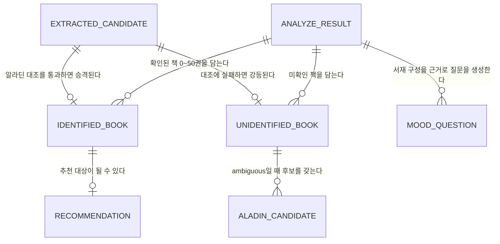
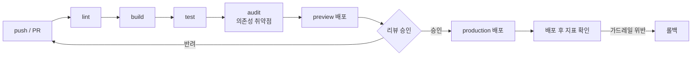

# TRD: Shelfie (셸피)

> **작성 규칙**
> - 모든 수치는 단위와 함께 적는다 (ms, %, TPS, req/min). "빠르게", "안정적으로" 같은 형용사는 요구사항이 아니다.
> - 기술 선택에는 **포기한 것(Trade-off)** 을 반드시 함께 적는다. 상세 근거는 `/docs/ADR.md`에 남긴다.
> - 구조·흐름은 `/docs/ARCHITECTURE.md`의 작성 규칙에 따라 Mermaid로 표현한다.
> - 모든 항목에 `[MVP]` 또는 `[Scale]` 태그를 단다. `[MVP]`는 첫 배포 전 필수, `[Scale]`은 아래 트리거에 도달했을 때 채운다.
>
> **단계 전환 트리거 (MVP → Scale)**: 일 요청 100건 초과가 3일 연속 지속되거나, 알라딘 일일 호출이 한도(5,000회)의 50%에 도달하거나, 분석 p95가 30초를 초과할 때.
> 이 줄이 비어 있으면 티어 구분이 무의미해진다. 반드시 채운다.

---

## 1. 개요 (Scope & Context)

### 기술적 목표 (Technical Goals)

비즈니스 목표가 아니라, 이 시스템이 **기술적으로** 달성해야 하는 것.

1. 책장 사진 5장을 병렬 처리해 분석 p95를 30초 이하로 유지하고, 일부 사진이 실패해도 성공한 사진의 결과는 반환한다 (부분 실패 허용).
2. 모델이 생성한 어떤 문자열도 검증 없이 사실로 표시하지 않는다. 외부 응답은 전부 zod 파싱 경계를 통과하고, 알라딘 대조에 실패한 책은 예외 없이 미확인으로 강등한다.
3. 서버는 상태를 갖지 않는다. 이미지·추출 결과·추천 결과를 디스크·DB·캐시 어디에도 쓰지 않고 요청-응답 주기 안에서만 다룬다.
4. 세션당 Anthropic API 비용을 300원 이하로 유지하고, 그 값을 이벤트 로그에서 토큰 수로 상시 측정할 수 있게 한다.

### 비목표 (Non-Goals)

이번에 **풀지 않는** 기술 문제. 경계를 적지 않으면 스코프가 샌다.

- **영속성 계층** — DB·ORM·마이그레이션을 도입하지 않는다. 무상태 전제로 설계한다 (ADR-003). 필요해졌을 때 쓸 저장소는 **Supabase로 미리 정해 두었다**(ADR-007) — 이번 범위에서 만들지 않는다는 뜻이지, 무엇을 쓸지 미정이라는 뜻이 아니다.
- **인증·인가** — 로그인이 없으므로 세션·토큰·소유권 검증 로직을 만들지 않는다.
- **멀티 프로바이더 추상화** — Anthropic 단일 공급자를 전제로 한다. provider 어댑터 레이어를 만들지 않는다 (ADR-001).
- **실시간 스트리밍 UI** — 분석 진행률을 SSE로 흘리지 않는다. 요청-응답 1회로 끝내고 클라이언트에서 스켈레톤을 보여준다.
- **오프라인 동작** — Service Worker·PWA 캐싱을 하지 않는다. 외부 API 없이는 아무 기능도 성립하지 않는다.
- **이미지 전처리(원근 보정·책등 분할)** — 멀티모달 모델에 원본을 그대로 넘긴다. 전처리는 인식률 측정 결과가 목표에 미달할 때만 재검토한다.

### 참조 문서

| 알고 싶은 것 | 문서 |
|--------------|------|
| 비즈니스 목표, 페르소나, 유저 스토리, 성공 지표 | `/docs/PRD.md` |
| 디렉토리 구조, 레이어 의존 관계, 데이터 흐름 다이어그램 | `/docs/ARCHITECTURE.md` |
| 기술 선택의 배경과 트레이드오프 (결정 기록) | `/docs/ADR.md` |
| 엔드포인트 계약, 요청·응답 스키마, 에러 규약 | `/docs/API_SPEC.md` |
| 색상, 컴포넌트, 타이포그래피 | `/docs/UI_GUIDE.md` |

---

## 2. 기술 스택

| 레이어 | 선택 | 버전 | 선택 근거 (Why) | 포기한 것 (Trade-off) | 단계 |
|--------|------|------|-----------------|----------------------|------|
| 언어 | TypeScript | 5.x | 알라딘·Claude 응답 타입을 클라이언트와 공유해 계약 위반을 컴파일 타임에 잡는다 | 빌드 단계 추가, 외부 응답은 결국 런타임 검증(zod)도 필요 | [MVP] |
| 런타임 | Node.js | 20 LTS | Vercel 기본 런타임. `@anthropic-ai/sdk`가 Edge보다 Node에서 안정적 | Edge 대비 콜드 스타트가 길다 | [MVP] |
| 프레임워크 | Next.js App Router | 16 | 라우트 핸들러가 CLAUDE.md의 `app/api/` 규칙과 그대로 대응하고, Vercel 배포가 무설정. 16을 택한 이유는 ADR-004 | App Router 고유의 캐싱 규칙을 별도로 이해해야 한다. 빌드가 Turbopack 기본이라 webpack 전용 플러그인을 쓸 수 없다 | [MVP] |
| UI 라이브러리 | React | 19 | Next.js 16의 기본 | — | [MVP] |
| 스타일링 | Tailwind CSS | 4 | `/docs/UI_GUIDE.md`의 토큰을 클래스로 직접 표현. 별도 CSS 파일 관리 불필요 | 마크업에 클래스가 길게 붙는다 | [MVP] |
| LLM SDK | `@anthropic-ai/sdk` | 최신 | 공식 SDK. 타입·재시도·타임아웃·structured outputs를 직접 구현하지 않는다 | Anthropic 단일 종속 | [MVP] |
| 스키마 검증 | zod | 3.x | 모든 외부 응답의 런타임 검증 경계. Claude structured outputs의 JSON Schema도 여기서 파생 | 스키마를 타입과 이중으로 관리하는 대신 `z.infer`로 단일화 | [MVP] |
| 데이터 저장소 | **없음 (무상태)** | — | 등록 마찰 0이 제품의 핵심 차별점. 저장을 넣으면 MVP 범위가 두 배 (ADR-003) | 서재 누적·읽은 책 기록 불가. 새로고침 시 결과 소실 | [MVP] |
| 데이터 저장소 | Supabase (관리형 Postgres + Auth + Storage) | — | 저장·인증·파일이 한 공급자로 함께 와, ADR-003이 통째로 미뤄 둔 것들을 조립 비용 없이 켤 수 있다. 도입 조건과 순서는 ADR-007 | 외부 장애점이 셋으로 늘고 무상태의 롤백 이점이 사라진다. 무료 티어는 무요청 기간이 길면 프로젝트를 일시 정지시킨다 | [Scale] |
| 테스트 | Vitest + Testing Library | Vitest 3.x | Vite 기반이라 별도 트랜스파일 설정 없이 TS를 실행. TDD 루프가 빠르다 | Jest 생태계 플러그인 일부 미지원 | [MVP] |
| 린트 | ESLint + `eslint-config-next` | ESLint 9, config 16 | flat config를 직접 내보내므로 `FlatCompat` 없이 쓴다. `next lint`는 Next 16에서 제거되어 `eslint .`를 직접 호출한다 | 구 `.eslintrc` 생태계 플러그인과 호환되지 않는다 | [MVP] |
| 관측성 | 구조화 JSON 콘솔 로그 (Vercel Logs) | — | 저장소가 없어 이벤트 DB를 세울 이유가 없다. 초기 요청량에서는 로그 조회로 충분 | 집계·대시보드 없음. 수동 조회 | [MVP] |
| 관측성 | 메트릭·트레이싱 도구 | — | 단계 전환 트리거 도달 시 도입 | — | [Scale] |
| 배포 | Vercel | — | Next.js 무설정 배포, PR별 preview 환경 자동 생성 | 함수 실행 시간 상한에 묶인다 | [MVP] |

- `포기한 것` 열이 비어 있다면 아직 대안을 검토하지 않은 것이다. 검토 후 `/docs/ADR.md`에 결정을 남긴다.
- 버전 고정 정책: 메이저 고정, 마이너·패치는 `package-lock.json`으로 관리. **모델 ID는 코드에 하드코딩하지 않고 환경변수 기본값으로 고정**한다.
- 배포 타깃 런타임: Vercel Node 20 서버리스 함수. `/api/analyze`는 `maxDuration = 60`(초)을 명시한다.

---

## 3. 시스템 요구사항 (Functional → Tech Spec)

PRD의 유저 스토리(US-00N)·기능 요구사항(FR-00N)을 기술 요구사항으로 분해한다. `검증 방법`은 **실행 가능한 커맨드**로 적는다.

| ID | 대상 기능 (PRD) | 기술 요구사항 | 성공 지표 (Success Metric) | 엣지 케이스 | 검증 방법 | 단계 |
|----|-----------------|---------------|---------------------------|-------------|-----------|------|
| TR-001 | FR-001, FR-002 | `lib/image.ts` — 파일 검증(1~5장, 장당 원본 10MB 이하, jpeg/png/webp)과 캔버스 리사이즈(**EXIF orientation 적용 후** 긴 변 1568px, JPEG 품질 0.85, base64 반환). 산출물은 장당 2MB · 요청 합계 4MB 이하 | 리사이즈 후 장당 이미지 토큰 1,600±10%, 처리 시간 장당 500ms 이하 | 6장 선택 시 차단, 10MB 초과 개별 파일만 제외, 지원하지 않는 MIME 거부. **EXIF를 적용하지 않으면 세로 사진이 누워 판독률이 급락**하므로 회전 보정을 테스트로 고정한다. HEIC는 캔버스 디코드를 시도하고 실패하면 명시적으로 거부(PRD Q3). 같은 파일을 두 번 고르면 해시로 중복 제거. 리사이즈 후 **짧은 변이 600px 미만**이면(파노라마·초고해상도) 책등 글자가 판독 불가 수준으로 뭉개지므로 경고하고 나눠 찍도록 안내 | `npm test -- image.test.ts` | [MVP] |
| TR-002 | US-001, FR-009 | `types/` + `lib/schemas.ts` — `IdentifiedBook` / `UnidentifiedBook` / API 요청·응답 zod 스키마 정의. Claude structured output용 JSON Schema를 같은 스키마에서 파생 | 모든 API 경계에서 `safeParse` 호출. 타입과 스키마 중복 정의 0건(`z.infer`만 사용) | 스키마 불일치 응답은 예외가 아니라 판별 가능한 실패 값으로 반환 | `npm test -- schemas.test.ts` | [MVP] |
| TR-003 | US-001 | `services/anthropic.ts` — 이미지 1장에서 책 후보(제목·저자·신뢰도) 추출. **사진당 후보 60건 상한을 스키마로 강제**한다. `claude-opus-5`, `output_config.format`으로 구조화 출력, `thinking: adaptive`, 서버사이드 fallback 활성화, `stop_reason: "refusal"` 처리 | 골든 사진 20장에서 후보 추출 재현율 90% 이상, 호출 p95 12초 이내 | 429/5xx는 지수 백오프 1회 재시도, refusal은 재시도하지 않고 해당 사진만 실패 처리, `max_tokens` 절단은 7번의 호출 규약을 따른다. 추출 예산(30s)을 초과한 사진은 실패로 집계해 `failedPhotoIndexes`에 담는다 | `npm test -- anthropic.test.ts` (SDK 모킹) | [MVP] |
| TR-004 | US-001, FR-003 | `services/aladin.ts` + `lib/match.ts` — ItemSearch 조회 래퍼와 제목 유사도(정규화 후 Levenshtein 기반) 판정. 유사도 0.8 이상 후보가 1건이면 확인, 0건이면 `no_match`, 2건 이상이면 **저자 일치로 tie-break** 후 그래도 복수면 `ambiguous`. 조회는 **동시성 12**로 제한 | 골든 세트에서 오확인(잘못된 책을 확인 처리) 0건 | 알라딘 5xx·타임아웃·대조 예산(12s) 소진 시 해당 책만 **`lookup_failed`**로 강등하고 전체를 실패시키지 않음 — `no_match`(알라딘에 정말 없음)와 절대 섞지 않는다 (ADR-005). ISBN13이 없는 레코드는 확인으로 승격하지 않는다 | `npm test -- match.test.ts aladin.test.ts` | [MVP] |
| TR-005 | FR-004, FR-005 | `lib/merge.ts` — ① 알라딘 조회 **전**에 `confidence < 0.3` 후보를 `unreadable`로 강등하고, 제목+저자 정규화 키로 사전 병합한 뒤 **`confidence` 내림차순 80건으로 자른다** ② 조회 후 ISBN13 기준 중복 제거(최초 등장 사진 인덱스 유지) ③ 확인 50권·미확인 100건 상한 절단 | 같은 책이 5장에 모두 등장해도 결과 1권이고 **알라딘 호출도 1회**, 51권 입력 시 정확히 50권 + `overflowCount: 1`, 후보 300건을 넣어도 알라딘 호출은 80건을 넘지 않음 | 절단 순서는 **결정적**이어야 한다: `aladinRating` 내림차순 → null은 최하위 → 동점은 `photoIndex` 오름차순 → `isbn13` 오름차순. ISBN13이 없는 책은 애초에 확인으로 올라오지 않으므로(TR-004) 대체 키 병합 경로는 두지 않는다 | `npm test -- merge.test.ts` | [MVP] |
| TR-006 | US-001 | `app/api/analyze/route.ts` — 이미지 배열을 받아 장별 병렬 추출 → 알라딘 대조 → 병합. **7번의 시간 예산 표에 따라 단계별 데드라인을 전파**한다. 부분 실패 시 성공분 반환 + `failedPhotoCount`·`failedPhotoIndexes` | 5장 요청 p95 30초 이내, 1장 실패해도 200 응답, 총 소요가 55s를 넘지 않음 | 전 사진 실패 시에만 502. 후보 0건이면 빈 배열이 아닌 `EMPTY_SHELF` 코드 반환. **후보는 있었으나 확인 0건**이면 `EMPTY_SHELF`가 아니라 200으로 `identified: []` + 미확인 목록을 반환한다(클라이언트는 `unidentifiedOnly` 상태로 분기) | `npm test -- analyze.route.test.ts` | [MVP] |
| TR-007 | FR-008 | 확인된 책 전체에 대한 한줄평 **1회 배치 호출**. 책당 60자 이내, 줄거리 요약 금지 | 책 50권 기준 1회 호출, 응답 p95 15초 이내 | 한줄평 생성 실패 시 `claudeNote`를 빈 문자열로 두고 책 자체는 정상 반환. **남은 예산이 8s 미만이면 호출 자체를 건너뛰고** 전원 빈 문자열로 둔다 (ADR-005) | `npm test -- note.test.ts` | [MVP] |
| TR-008 | US-002 | `app/api/books/resolve/route.ts` — 사용자가 고친 제목으로 알라딘 재검색, 후보 최대 5건 반환 | 응답 p95 3초 이내 | 결과 0건이면 `NOT_FOUND_IN_ALADIN` 코드와 안내 문구 반환 | `npm test -- resolve.route.test.ts` | [MVP] |
| TR-009 | US-004, FR-007 | `app/api/mood/questions/route.ts` — 확인된 책 목록을 근거로 질문 2~3개(각 선택지 3~4개) 생성 | 응답 p95 8초 이내, 질문 수 2~3개 스키마 강제 | 생성 실패·모델 장애 모두 **200과 빈 배열**로 통일해 클라이언트가 자유 입력으로 폴백한다(502를 쓰지 않는다 — 클라이언트 동작이 같은데 상태 코드를 나눌 이유가 없다). 타임아웃만 504 | `npm test -- questions.route.test.ts` | [MVP] |
| TR-010 | US-003, FR-006, FR-009, FR-011 | `app/api/recommend/route.ts` — **① 각 책의 `proof` 서명을 검증해 통과분만 남기고(0권이면 400 `UNVERIFIED_BOOKS`) ②** 확인된 책 목록 + 기분 텍스트로 3권 추천 **③ 응답의 모든 `bookId`가 검증 통과 목록에 있는지 확인**, 위반 시 1회 재요청 후에도 실패하면 502 | 목록 밖 책 노출 0건, 위조된 책 노출 0건, 응답 p95 15초 이내 | 책 3권 미만이면 있는 수만큼. 무관한 기분 입력은 모델 구조화 출력의 `relevant: false`로 판정해 `IRRELEVANT_MOOD` 반환하되, **같은 세션에서 2회 연속 무관 판정이면 판정을 무시하고 추천을 진행**한다(오탐으로 사용자를 가두지 않는다). 재요청 시에는 동일 프롬프트를 반복하지 않고 **위반한 `bookId`를 명시하고 허용 목록을 다시 제시**한다 | `npm test -- recommend.route.test.ts` | [MVP] |
| TR-011 | US-001~US-004 | `components/` 화면 5종(업로드·분석 결과·기분 입력·문답·추천 결과)과 클라이언트 상태 머신. 사실(알라딘)과 해석(Claude)을 구분된 시각 층위로 렌더 | LCP 2.5s 이하, INP 200ms 이하, 초기 JS 번들 200KB(gzip) 이하 | 각 상태의 로딩·빈 상태·에러 분기가 PRD 5번 Edge Cases 표와 1:1 대응 | `npm run build` + `npm test -- components/` | [MVP] |
| TR-012 | PRD 7번 | `lib/analytics.ts` — 8종 이벤트를 구조화 JSON 한 줄로 표준 출력. `session_id`는 클라이언트 생성 UUID, PII·이미지·파일명·`rawText` 미기록. Claude를 호출하는 모든 이벤트에 `input_tokens`·`output_tokens`를 싣는다 | 8종 이벤트 전부 발생 지점에서 호출되고, 세션당 비용을 로그만으로 합산할 수 있음 | 로깅 실패가 요청 처리를 막지 않는다(try/catch로 삼킴) | `npm test -- analytics.test.ts` | [MVP] |
| TR-013 | 6.5 보안 | IP당 분당 20회 레이트 리밋, 초과 시 429 + `Retry-After` | 429 정상 반환, 정상 트래픽 오탐 0건 | 서버리스 다중 인스턴스에서 카운터 공유가 필요해지므로 외부 스토어 도입 검토 | `npm test -- ratelimit.test.ts` | [Scale] |
| TR-014 | PRD 7번 | `app/api/events/route.ts` — 클라이언트 전용 이벤트(`recommend_accepted`·`book_resolved` 2종)를 받아 서버 로그로 남기는 얇은 엔드포인트. 저장하지 않고 표준 출력에만 쓴다 | North Star(추천 수락률)를 로그만으로 계산 가능 | 허용된 이벤트명·속성만 화이트리스트로 받고 그 외는 400. 본문이 커도 8KB 초과분은 거부. 로깅 실패가 200 응답을 막지 않는다 | `npm test -- events.route.test.ts` | [MVP] |
| TR-015 | 6.5 보안, FR-011 | `lib/proof.ts` — 확인된 책 1권당 HMAC-SHA256 서명 발급·검증(Node 내장 `crypto`, TTL 2시간). `analyze`·`resolve`가 발급하고 `recommend`·`mood/questions`가 검증한다 | 위조·만료 서명이 통과하는 경우 0건. 검증 실패는 요청 전체가 아니라 **해당 책만** 폐기 | 시크릿 교체 시 진행 중 세션의 책이 전부 실패 → 400 `UNVERIFIED_BOOKS`와 재분석 안내. 개발 환경에서 `BOOK_PROOF_SECRET`이 없으면 고정 개발용 값으로 대체하고 경고 로그, 프로덕션에서는 부팅 실패 | `npm test -- proof.test.ts` | [MVP] |

- 하나의 TR이 여러 모듈에 걸치면 쪼갠다. harness step 하나가 TR 하나에 대응하는 크기가 이상적이다.
- `엣지 케이스` 열이 비면 PRD 5번의 Edge Cases 표를 다시 본다.

---

## 4. 데이터 설계

### 엔티티 (Entities)

구현 위치는 `/docs/ARCHITECTURE.md`의 `types/`를 따른다. **저장소가 없으므로 이 엔티티들은 요청-응답 주기 안에서만 존재하는 인메모리 객체다.**

```ts
// 사진에서 Claude가 읽어낸 원시 후보. 아직 사실로 취급하지 않는다.
interface ExtractedCandidate {
  rawText: string;          // 책등에서 읽힌 원문 그대로. 1~200자
  title: string;            // 정규화된 제목 추정값. 1~200자
  author: string | null;    // 읽히지 않으면 null
  confidence: number;       // 0.0~1.0. 판독 자체에 대한 모델의 확신도.
                            // 0.3 미만이면 조회하지 않고 바로 unreadable로 강등하고,
                            // 조회 전 후보 상한(80건)을 넘으면 이 값 내림차순으로 자른다 (TR-005)
  photoIndex: number;       // 몇 번째 사진에서 나왔는가. 0-based
}

// 알라딘 대조를 통과한 책. facts 필드는 전부 알라딘 원본이다.
interface IdentifiedBook {
  isbn13: string;           // 13자리. 중복 제거 키
  title: string;            // 알라딘 원본
  author: string;           // 알라딘 원본
  publisher: string;        // 알라딘 원본
  coverUrl: string;         // 알라딘 원본 절대 URL
  pages: number | null;     // ItemLookUp에 없으면 null
  aladinRating: number | null; // 0.0~10.0. 독자평점 없으면 null
  aladinLink: string;       // 알라딘 상품 페이지 URL
  claudeNote: string;       // Claude 생성 한줄평. 0~60자. 생성 실패 시 빈 문자열
  photoIndex: number;       // 최초 등장 사진 인덱스
  proof: string;            // 서버 HMAC 서명. 알라딘 대조를 통과했음의 증명 (ADR-006)
}

// 확인에 실패한 책. 숨기지 않고 사용자에게 그대로 노출한다.
interface UnidentifiedBook {
  rawText: string;          // 사진에서 읽힌 원문
  // unreadable   : 책등 판독 자체가 불완전 (우리 쪽 인식 한계)
  // no_match     : 알라딘에 정말 없음 (원서·절판·독립출판)
  // ambiguous    : 유사 후보가 둘 이상이라 하나로 좁히지 못함
  // lookup_failed: 알라딘을 조회하지 못함 (5xx·타임아웃·예산 소진) — 데이터가 아니라 시스템 문제 (ADR-005)
  reason: 'unreadable' | 'no_match' | 'ambiguous' | 'lookup_failed';
  candidates: AladinCandidate[]; // reason이 ambiguous일 때만 채운다. 최대 5건
}

interface AladinCandidate {
  isbn13: string;
  title: string;
  author: string;
  publisher: string;
  coverUrl: string;
}

// /api/analyze 응답 전체. 어디에도 저장되지 않는다.
interface AnalyzeResult {
  sessionId: string;              // 클라이언트 생성 UUID v4
  identified: IdentifiedBook[];   // 최대 50건 (FR-005)
  unidentified: UnidentifiedBook[];
  overflowCount: number;          // 50권 상한으로 잘려나간 권수
  failedPhotoCount: number;       // 부분 실패한 사진 수
  unidentifiedOverflowCount: number; // 미확인 100건 상한으로 잘려나간 개수
  failedPhotoIndexes: number[];   // 실패한 사진의 0-based 인덱스. 그 사진만 골라 재시도하기 위한 값
}

// 추천 1건. bookId는 반드시 입력 목록의 isbn13 중 하나여야 한다 (FR-009).
interface Recommendation {
  bookId: string;           // IdentifiedBook.isbn13
  reason: string;           // Claude 생성 추천 이유. 20~200자
  position: 1 | 2 | 3;
}

// 기분을 모를 때 제시하는 유도 질문 (US-004)
interface MoodQuestion {
  id: string;
  question: string;         // 10~60자
  options: string[];        // 3~4개
}
```

### 관계 (ERD)

엔티티명과 관계 설명을 실제 값으로 바꿔 채운다. (erDiagram의 엔티티명에는 중괄호를 쓸 수 없으므로 플레이스홀더도 식별자 형태로 둔다.)



### 인덱싱 전략

인덱스는 "어떤 쿼리 때문에" 만드는지가 없으면 추측이다. 대상 쿼리를 먼저 적는다.

| 대상 | 인덱스 컬럼 | 대상 쿼리 | 종류 | 근거 | 단계 |
|------|------------|-----------|------|------|------|
| **해당 없음 (DB 없음)** | — | — | — | 저장소가 없어 인덱싱 대상이 존재하지 않는다. 중복 제거는 `Map<isbn13, IdentifiedBook>`으로 메모리에서 O(n) 처리한다 (TR-005) | [MVP] |
| 알라딘 응답 캐시 | `isbn13` (PK) | 동일 책 반복 조회 | Supabase Postgres 테이블 (키-값으로 사용) | 알라딘 호출이 일 5,000회 한도의 50%에 도달하면 도입. 저장소 선택은 ADR-007, 첫 도입 대상이 바로 이 캐시다 | [Scale] |

- 쓰기 비용: 해당 없음. 메모리 병합은 세션당 최대 250건(5장 × 50권) 규모라 상수 시간으로 간주한다.

### 영속성 & 마이그레이션

| 항목 | 내용 |
|------|------|
| 저장소 | **없음.** 서버 메모리(요청 처리 중)와 클라이언트 React state(세션 중)에만 존재 |
| 스키마 관리 | 해당 없음. 대신 zod 스키마(`lib/schemas.ts`)가 외부 응답 계약의 단일 출처 |
| 마이그레이션 절차 | 해당 없음 |
| 롤백 방법 | 해당 없음. 배포 롤백만으로 데이터 정합성 문제가 발생하지 않는다 (무상태의 이점) |
| 파괴적 변경 규칙 | API 응답 필드 삭제·타입 변경은 5번의 계약 변경 정책을 따른다. 클라이언트와 서버가 함께 배포되므로 2단계 배포는 불필요 |

저장소를 도입할 때(ADR-007) 이 표는 아래로 대체된다. **표를 먼저 채우고 코드를 쓴다.**

| 항목 | 도입 시 내용 | 단계 |
|------|-------------|------|
| 저장소 | Supabase 관리형 Postgres. 접근은 `services/supabase.ts` 한 파일로만, `service_role` 키는 서버 전용 | [Scale] |
| 스키마 관리 | 마이그레이션 SQL을 코드와 같은 리포지토리에 커밋하고 CI에서 적용. zod 스키마는 여전히 외부 응답 검증 경계로 남고, DB 행 검증도 같은 스키마를 재사용한다 | [Scale] |
| 마이그레이션 절차 | preview 프로젝트에 먼저 적용해 확인한 뒤 production. 컬럼 삭제는 ① 쓰기 중단 배포 → ② 삭제 마이그레이션의 2단계로 나눈다 | [Scale] |
| 롤백 방법 | 배포 롤백만으로는 스키마가 되돌아가지 않는다. 마이그레이션마다 역방향 SQL을 함께 커밋하고, 파괴적 변경 전에는 스냅샷을 남긴다 | [Scale] |
| 저장하지 않는 것 | **업로드 원본 이미지.** 저장소가 생겨도 사진은 남기지 않는다 (ADR-007) | [Scale] |

### 데이터 수명주기

| 데이터 | 보관 기간 | 삭제 방식 | PII 포함 | 단계 |
|--------|-----------|-----------|----------|------|
| 업로드 이미지 | 요청 처리 중에만 (수 초) | 디스크에 쓰지 않는다. 응답 반환과 함께 GC 대상 | O (방 내부·사람이 찍힐 수 있음) | [MVP] |
| 추출·분석 결과 | 클라이언트 세션 동안만 | 새로고침·탭 종료 시 소실. 서버는 응답 후 즉시 폐기 | X | [MVP] |
| 이벤트 로그 | Vercel 로그 보관 기간(기본 30일) | 플랫폼 정책에 따라 자동 만료 | X (`session_id`는 랜덤 UUID, 사용자와 연결되지 않음) | [MVP] |

---

## 5. API 설계

엔드포인트 목록, 요청·응답 스키마, 에러 응답 규약은 `/docs/API_SPEC.md`에서 관리한다. 이 문서에는 중복해서 적지 않는다.

- CRITICAL: 모든 API 로직은 `app/api/` 라우트 핸들러에서만 처리한다.
- API 계약이 바뀌면 `/docs/API_SPEC.md`와 `types/`의 응답 타입을 함께 갱신한다.

### 계약 변경 정책

| 항목 | 규칙 |
|------|------|
| Breaking change 판단 기준 | 필드 삭제·타입 변경·필수 파라미터 추가는 breaking. 선택 필드 추가는 non-breaking |
| 버저닝 | 없음(내부 전용). 클라이언트와 서버가 같은 배포 단위라 버전 스큐가 발생하지 않는다 |
| Deprecation 기간 | 해당 없음. 대신 계약 변경 시 `API_SPEC.md` → zod 스키마 → 라우트 핸들러 → 컴포넌트 순으로 한 PR 안에서 함께 고친다 |

---

## 6. 비기능 요구사항 (Non-Functional Requirements)

이 문서에서 가장 중요한 섹션이다. 여기 수치가 없으면 "느리다"는 버그로 보고할 수 없다.

### 6.1 성능 (Performance)

**부하 가정**: 초기 동시 접속 5명, 일 요청 100건 이하, 피크는 평균의 3배.

세션당 Claude 호출 수는 **재시도를 포함해** 센다. 비용 가드레일(세션 300원)은 아래 최악값 기준으로 검증한다.

| 구간 | 정상 | 최악 (SDK `maxRetries: 1` + 앱 레벨 재요청 포함) |
|------|------|------------------------------------------------|
| 추출 (사진 5장) | 5 | 10 |
| 한줄평 배치 | 1 | 2 |
| 문답 생성 | 0~1 | 2 |
| 추천 | 1 | 4 (재요청 1회 × SDK 재시도) |
| **합계** | **7~8** | **18** |

- "다시 추천받기"는 세션당 5회로 제한한다(FR-010). 제한이 없으면 위 최악값이 무한히 곱해진다.

| 지표 | 목표 | 측정 방법 | 단계 |
|------|------|-----------|------|
| `/api/analyze` p50 (사진 1장) | 8s 이하 | 라우트 핸들러 계측 로그(`duration_ms`) | [MVP] |
| `/api/analyze` p95 (사진 1장) | 12s 이하 | 동일 | [MVP] |
| `/api/analyze` p95 (사진 5장) | 30s 이하 | 동일. 장별 병렬 처리 전제 | [MVP] |
| `/api/recommend` p95 | 15s 이하 | 동일 | [MVP] |
| `/api/books/resolve` p95 | 3s 이하 | 동일. 알라딘 단독 호출 | [MVP] |
| `/api/mood/questions` p95 | 8s 이하 | 동일 | [MVP] |
| 초기 로딩 LCP | 2.5s 이하 | Lighthouse (모바일 프로파일) | [MVP] |
| 상호작용 INP | 200ms 이하 | Lighthouse | [MVP] |
| 초기 JS 번들 | 200KB 이하 (gzip) | `npm run build` 출력 | [MVP] |
| 최대 처리량 (Max TPS) | 2 TPS | k6 부하 테스트 | [Scale] |
| 동시 사용자 | 50명 | 동일 | [Scale] |

- 외부 API 호출 시간은 위 목표에 **포함**한다: 이 서비스의 응답 시간은 사실상 전부 Claude·알라딘 호출 시간이다. 이를 제외한 목표는 사용자가 체감하는 것과 무관해 의미가 없다.
- 클라이언트 리사이즈(TR-001)는 서버 시간에 포함되지 않지만 체감 시간에는 포함되므로 장당 500ms 이하를 별도 목표로 둔다.
- **위 p95는 목표치이고, `/docs/API_SPEC.md`의 타임아웃은 하드 상한이다.** 둘은 다른 것을 재며 값이 달라도 모순이 아니다 — 목표를 넘으면 가드레일·롤백 판단 대상이 되고, 상한을 넘으면 요청이 끊긴다. 상한은 항상 목표보다 넉넉해야 재시도 여지가 생긴다.
- 클라이언트 `fetch` 타임아웃은 서버 상한보다 길게 잡는다(`/api/analyze` 기준 **70s**). 같은 값으로 두면 클라이언트가 먼저 끊어 서버가 보낸 504와 정해진 안내 문구를 받지 못한다.

### 6.2 확장성 (Scalability)

| 항목 | 현재 한계 | 한계 도달 신호 | 확장 방법 | 단계 |
|------|-----------|----------------|-----------|------|
| Vercel 함수 실행 시간 | `/api/analyze` 60s (`maxDuration`) | 타임아웃 에러율 0.5% 초과 | 사진 장수 상한을 5 → 3으로 축소, 그래도 부족하면 장별 요청으로 분할 | [MVP] |
| 요청 본문 크기 | 플랫폼 상한 4.5MB. 우리 상한은 **요청 합계 4MB · 장당 2MB**(리사이즈 후 5장 약 3MB) | 413 응답 발생, 또는 합계가 4MB에 근접 | 클라이언트 JPEG 품질을 0.85 → 0.7로 하향. 그래도 넘으면 장수를 줄이도록 안내 | [MVP] |
| Anthropic 레이트 리밋 | 계정 티어에 종속 | 429 응답 카운트 증가 | 장별 추출을 순차 처리로 전환(지연 증가를 감수) | [Scale] |
| 알라딘 일일 호출 | 5,000회/일 | 한도의 50% 도달 | Supabase에 ISBN 키-값 캐시 도입 (ADR-007) | [Scale] |

### 6.3 가용성 (Availability & Reliability)

| 항목 | 목표 | 단계 |
|------|------|------|
| 가동률 SLO | 월 99.0% (다운타임 7.3시간/월). 외부 API 장애가 그대로 전파되는 구조라 보수적으로 잡는다 | [MVP] |
| 에러 예산 | 요청의 1%. 소진 시 신규 기능 배포를 멈추고 외부 호출 안정화에 집중 | [Scale] |
| RTO (복구 목표 시간) | 30분 (Vercel 직전 배포로 되돌리기) | [MVP] |
| RPO (데이터 손실 허용) | 해당 없음 — 보관하는 데이터가 없다. 저장소를 도입하면(ADR-007) 그때 실제 값을 정한다 | [MVP] |

장애 등급:

| 등급 | 정의 | 대응 |
|------|------|------|
| P1 | 분석 또는 추천이 전면 실패 (Anthropic 장애, 배포 사고), 또는 존재하지 않는 책이 확인된 책으로 노출 | 즉시 직전 배포로 롤백. 할루시네이션 건은 원인 수정 전까지 재배포 금지 |
| P2 | 일부 기능 저하 — 알라딘 장애로 미확인 비율 급증, 한줄평 생성 실패, 문답 생성 실패 | 폴백 경로 동작 확인 후 당일 내 수정 |
| P3 | 인식률 저하, 응답 시간 목표 초과, UI 렌더 결함 | 다음 배포 주기에 수정 |

### 6.4 관측성 (Observability)

**상관관계 ID 규칙**: `request_id`를 요청 진입점에서 생성해 로그·에러 응답에 **동일한 값으로** 흘린다. 사용자가 신고한 에러 화면의 ID로 서버 로그를 바로 찾을 수 있어야 한다. 클라이언트가 만든 `session_id`는 한 세션의 여러 요청을 묶는 데만 쓴다.

| 축 | 도구 | 무엇을 남기는가 | 단계 |
|----|------|----------------|------|
| 로깅 (Logging) | 구조화 JSON 콘솔 로그 (Vercel Logs) | `request_id`, `session_id`, `route`, `status`, `duration_ms`, `error_code`, `input_tokens`, `output_tokens`, `model`. **이미지·파일명·`rawText`·API 키는 남기지 않는다** | [MVP] |
| 비용 계측 | 위 로그의 토큰 필드 | 세션당 비용 = (input×단가 + output×단가). 가드레일 300원 대비 상시 확인 | [MVP] |
| 무결성 계측 | `proof` 검증 실패 카운트 | 위조·만료 서명이 얼마나 들어오는지. 0이 기본이며 0이 아니면 클라이언트 상태 조립 버그를 의심한다 (ADR-006) | [MVP] |
| 메트릭 (Metrics) | 미도입 | RED (요청률·에러율·지연) | [Scale] |
| 트레이싱 (Tracing) | 미도입 | 라우트 → `services/` 래퍼 → 외부 API 구간별 스팬 | [Scale] |
| 알림 (Alerting) | 미도입 | 에러율 1% 초과 5분 지속 시 알림. PRD 가드레일 지표와 연동 | [Scale] |

- **가장 중요한 가드레일에 자동 감지 수단이 없다는 점을 명시해 둔다.** "존재하지 않는 책이 확인된 책으로 노출 0건"은 임계치가 0인데, 프로덕션에서 이를 탐지할 신호가 없다 — 가짜 책이 화면에 떠도 로그에는 정상 응답으로 남는다. 사용자 신고(에러 배너의 `request_id`)가 유일한 사후 경로다. 따라서 이 가드레일은 **감지가 아니라 예방으로만 지켜진다**: 알라딘 대조(ADR-002), `proof` 서명(ADR-006), 화이트리스트 검증(FR-009), 그리고 모델·프롬프트 변경 시 골든 세트 필수 실행(8번). 이 네 겹 중 하나라도 빠지면 사고를 알아챌 방법이 없다.
- **`rawText`는 남기지 않되 판단 근거는 남긴다.** 미확인 비율이 20%를 넘었을 때 "프롬프트를 롤백할지"를 판정하려면 무엇이 안 읽혔는지 알아야 하는데, 원문은 사생활이 섞일 수 있어 기록할 수 없다. 그래서 미확인 1건당 `reason`, `raw_len`(문자 수), `raw_charset`(`hangul`/`latin`/`mixed`/`symbol_heavy`) 세 필드만 남긴다. 원문 복원은 불가능하면서 판독 실패의 성격은 구분된다.
- `lookup_failed`는 미확인 비율 가드레일의 **분자에서 제외**한다. 알라딘 장애를 프롬프트 품질 저하로 오독하면 엉뚱한 롤백을 하게 된다 (ADR-005).
- 로그 레벨 기준: `error`는 사람의 조치가 필요한 것만(5xx, 할루시네이션 검증 실패). 예상된 4xx와 미확인 강등은 `warn` 이하.
- 로그 보관: Vercel 기본 정책(30일).

### 6.5 보안 (Security)

| 항목 | 요구사항 | 단계 |
|------|----------|------|
| 전송 중 암호화 (in transit) | 전 구간 HTTPS(TLS 1.2+). Vercel 기본. 평문 HTTP는 리다이렉트 | [MVP] |
| 저장 시 암호화 (at rest) | 해당 없음 — 저장하는 데이터가 없다. Supabase 도입 시 관리형 암호화를 그대로 쓰고, `service_role` 키를 서버 전용 시크릿으로 관리한다 (ADR-007) | [MVP] |
| 인증 (Authentication) | 해당 없음 (로그인 없음) | [MVP] |
| 인가 (Authorization) | 해당 없음(권한 개념이 없다). 단, **클라이언트가 보낸 책 목록을 사실로 신뢰하지 않는다.** 형식·개수 재검증만으로는 그 책이 실재하는지 알 수 없으므로, 확인된 책에 서버 HMAC 서명(`proof`)을 붙여 요청 경계를 넘겨도 위조를 판별한다 (ADR-006, TR-015) | [MVP] |
| 시크릿 관리 | `ANTHROPIC_API_KEY`·`ALADIN_TTB_KEY`는 서버 환경변수만 사용. `NEXT_PUBLIC_` 접두사 금지, 커밋 금지, 응답·로그 포함 금지 | [MVP] |
| 입력 검증 | 모든 라우트 핸들러 진입점에서 zod `safeParse` 후 처리. 이미지 MIME·크기·장수를 서버에서 재검증(클라이언트 검증을 신뢰하지 않는다) | [MVP] |
| 프롬프트 인젝션 | 모델 프롬프트에 들어가는 **모든 클라이언트 경유 값**을 데이터로만 다룬다 — 기분 텍스트와 수정 제목뿐 아니라 추천 요청으로 되돌아오는 `title`·`author`·`claudeNote`도 포함된다(모델이 생성한 문자열이 다시 프롬프트로 들어가는 경로다). 시스템 프롬프트에 연결하지 않고 사용자 메시지 안의 구분된 블록에 넣는다. 출력은 `isbn13` 화이트리스트(FR-009)로, 입력은 `proof` 서명(ADR-006)으로 검증한다 | [MVP] |
| SSRF | 알라딘 표지 URL은 `image.aladin.co.kr` 도메인만 `next.config`의 이미지 허용 목록에 등록한다 | [MVP] |
| Rate Limiting | MVP는 없음(Accepted Debt). Scale에서 IP당 분당 20회, 초과 시 429 + `Retry-After` | [Scale] |
| 의존성 취약점 | `npm audit` CI 게이트, high 이상 차단. 현재 0건이며 이 상태를 기준선으로 유지한다. 예외를 두어야 할 상황이 생기면 먼저 상위 버전으로 해소를 시도하고(ADR-004의 선례), 불가능할 때만 부채 표에 상환 트리거와 함께 기록한다 | [MVP] |
| 감사 로그 (Audit) | 해당 없음 (권한 변경·삭제 행위가 존재하지 않음) | [MVP] |

- 에러 응답에 스택 트레이스·내부 경로·API 키를 절대 포함하지 않는다.

### 6.6 접근성 (Accessibility)

- 키보드만으로 모든 인터랙션에 도달 가능해야 한다. 파일 선택·미확인 수정 입력·추천 수락 버튼 전부 포함.
- 텍스트 대비 WCAG AA(4.5:1) 충족 — `/docs/UI_GUIDE.md` 색상표 기준.
- 표지 이미지에는 `alt`로 "{제목} 표지"를 넣는다. 장식용이 아니라 정보이므로 빈 `alt`를 쓰지 않는다.
- 미확인 배지는 색상만으로 구분하지 않는다. 텍스트 라벨("미확인")을 함께 표시한다.
- 분석 진행 상태는 `aria-live="polite"`로 알린다.

---

## 7. 외부 의존성 & 장애 격리

`/docs/ARCHITECTURE.md`의 `services/` 레이어에 래퍼로 격리한다. 클라이언트 컴포넌트에서 직접 호출하지 않는다.

| 서비스 | 용도 | 인증 방식 | 상대 레이트 리밋 | 타임아웃 | 재시도 | 폴백 | 단계 |
|--------|------|-----------|-----------------|----------|--------|------|------|
| Anthropic Claude API | 책등 추출, 한줄평, 추천, 문답 생성 | `x-api-key` 헤더 (SDK가 `ANTHROPIC_API_KEY`에서 자동 로드) | 계정 티어에 종속. 429 발생 시 로그로 감지 | **개별 호출** 추출 12s, 그 외 20s. 단계 예산은 아래 표 | 429·5xx·연결 오류에 지수 백오프 1회 (SDK `maxRetries: 1`) | **없음.** 실패를 사용자에게 명시하고 입력 상태를 유지한다 (ADR-001) | [MVP] |
| 알라딘 OpenAPI | 책 존재 검증, 서지 정보·표지·독자평점 조회 | 쿼리 파라미터 `ttbkey` | 일 5,000회 | 개별 5s, **동시성 12** | 5xx·타임아웃에 1회 재시도 | 해당 책만 미확인(**`lookup_failed`**)으로 강등. 전체 요청은 성공 처리 (ADR-005) | [MVP] |

- 재시도는 **멱등한 요청에만** 적용한다. 위 두 호출은 모두 조회·생성이며 부작용이 없어 재시도해도 안전하다.
- 다만 **멱등한 것과 공짜인 것은 다르다.** 재시도는 데이터를 망가뜨리지 않지만 비용은 그대로 다시 발생한다. 그래서 자동 재시도는 1회로 묶고, 사용자가 누르는 재시도 버튼에도 상한을 둔다 — `/api/analyze` 재시도는 **세션당 3회**, 간격은 0초 → 5초 → 15초로 벌린다(FR-011). 상한을 소진하면 버튼을 비활성화하고 "잠시 후 다시 시도해 주세요"로 안내한다. 레이트 리밋이 없는 MVP에서 이것이 사용자 쪽 비용 증폭을 막는 유일한 장치다.

### 시간 예산 (Time Budget)

개별 타임아웃만 정하면 합이 함수 실행 상한을 넘길 수 있다. 그러면 플랫폼이 연결을 끊어 API_SPEC이 정의한 504와 안내 문구조차 돌려주지 못하고, `analyze_failed` 이벤트도 남지 않는다. 그래서 **상한을 단계로 쪼개 배분**하고, 각 단계는 자기 예산 안에서만 산다 (ADR-005).

`/api/analyze` — 함수 상한 `maxDuration = 60s`, 내부 총 예산 **55s** (응답 직렬화·로깅 여유 5s):

| 순서 | 단계 | 예산 | 예산을 다 썼을 때 |
|------|------|------|-------------------|
| 1 | 책등 추출 (사진별 병렬) | 30s | 끝내지 못한 사진은 실패 처리 → `failedPhotoIndexes`에 추가 |
| 2 | 알라딘 대조 (동시성 12) | 12s | 조회하지 못한 후보는 **`lookup_failed`**로 강등 |
| 3 | 한줄평 배치 (1회) | 8s | 남은 예산이 8s 미만이면 **호출을 생략**하고 `claudeNote: ""` |
| — | 응답 조립·로깅 여유 | 5s | — |

- **데드라인 전파**: 각 단계는 시작 시점에 `남은 예산 = 55s − 경과 시간`을 계산해, 자기 예산과 남은 예산 중 **작은 쪽**을 데드라인으로 삼는다. 1단계가 빨리 끝나면 그 여유가 뒤 단계로 넘어가고, 1단계가 예산을 다 쓰면 뒤 단계가 줄어든다.
- **어느 단계가 예산을 넘겨도 요청은 200으로 끝난다.** 전 사진 추출 실패(1단계 전량 실패)만 502다. 부분 실패를 200으로 돌려주는 것은 이미 정의된 fail-soft 패턴이며, 시간 초과는 그 패턴의 한 경우일 뿐이다.
- 다른 라우트는 단계가 하나뿐이라 별도 예산표가 필요 없다. 개별 호출 타임아웃(20s)이 곧 예산이다.
- 위 배분(30/12/8)은 실측 전 추정치다. 골든 세트 측정 후 재조정하고, 조정 시 이 표와 6.1 성능 목표를 함께 고친다.

**Anthropic 호출 규약** (TR-003·TR-007·TR-009·TR-010 공통):

- 모델은 `MODEL_EXTRACT` / `MODEL_RECOMMEND` 환경변수에서 읽고, 기본값은 둘 다 `claude-opus-5`.
- 구조화 출력은 `output_config.format`을 쓴다. 응답을 정규식이나 문자열 매칭으로 파싱하지 않는다.
- `thinking: { type: "adaptive" }`를 사용한다. `budget_tokens`는 `claude-opus-5`에서 400을 반환하므로 쓰지 않는다.
- 서버사이드 fallback을 활성화한다 (`betas: ["server-side-fallback-2026-07-01"]` + `fallbacks: "default"`). 안전 분류기 거절 시 자동으로 다른 모델로 라우팅된다.
- 응답의 `content`를 읽기 전에 `stop_reason`을 확인한다. `"refusal"`이면 재시도하지 않고 해당 항목만 실패 처리한다.
- `max_tokens`는 비스트리밍 호출 기준 16000으로 둔다. 낮게 잡아 응답이 잘리면 재시도 비용이 더 크다.
- **`stop_reason`이 `"max_tokens"`면 응답 JSON이 잘려 zod가 통째로 거부한다.** 이 경우를 `refusal`과 분리해 다룬다: 배치 호출(한줄평)은 입력을 절반으로 쪼개 1회 재시도하고, 단건 호출(추출·추천·문답)은 재시도 없이 해당 항목만 실패 처리한다. 잘린 JSON을 부분 파싱해 살려 쓰려는 시도는 하지 않는다 — 검증 경계를 우회하는 것이기 때문이다.

### Circuit Breaker 정책

외부 장애가 우리 서비스 전체로 전파되는 것을 막는다.

| 대상 | Open 조건 | Open 유지 시간 | Half-open 시도 | Open 상태 동작 | 단계 |
|------|-----------|----------------|----------------|----------------|------|
| Anthropic Claude API | 연속 5회 실패 또는 30초간 실패율 50% | 60s | 1회 요청 통과 후 성공 시 Close | 외부 호출을 생략하고 즉시 `UPSTREAM_UNAVAILABLE` 반환 | [Scale] |
| 알라딘 OpenAPI | 연속 10회 실패 | 60s | 1회 요청 통과 후 성공 시 Close | 조회를 생략하고 모든 후보를 `no_match`로 강등 | [Scale] |

**요청 스코프 브레이커 [MVP]** — 위 표의 브레이커는 *인스턴스 간* 상태 공유가 필요해 Scale로 미뤘지만, **한 요청 안에서는 인메모리로 얼마든지 가능하다.** 그 구분을 하지 않아 지금까지 필요 이상으로 미뤄 두고 있었다.

| 대상 | Open 조건 | Open 상태 동작 | 단계 |
|------|-----------|----------------|------|
| 알라딘 (요청 내부) | 같은 요청에서 **연속 5회 실패** | 남은 후보를 조회하지 않고 전부 `lookup_failed`로 강등하고 즉시 다음 단계로 넘어간다 | [MVP] |

- 이것이 없으면 알라딘이 완전히 다운됐을 때 한 요청이 후보 80건 × (호출 1 + 재시도 1) = **최대 160회의 실패 호출**을 던지고, 12s 대조 예산을 타임아웃으로만 소진한 뒤에야 끝난다. 이미 죽은 서비스를 계속 두드리는 것은 우리에게도 상대에게도 손해다.
- Open으로 끝난 요청도 **200으로 응답한다.** 강등 경로가 이미 정의돼 있으므로 사용자는 미확인 목록과 "지금 확인할 수 없었어요"를 보게 된다 (ADR-005).
- 브레이커 상태는 요청이 끝나면 사라진다. 다음 요청은 다시 처음부터 시도하며, 이는 half-open 없이도 자연스러운 복구가 된다.

인스턴스 간 브레이커(위 표)는 여전히 Scale이다. MVP에서는 짧은 타임아웃, 1회 재시도, 요청 스코프 브레이커 셋으로 전파를 제한한다.

### 환경변수

| 이름 | 용도 | 필수 | 노출 범위 | 단계 |
|------|------|------|-----------|------|
| `ANTHROPIC_API_KEY` | Claude API 인증 | O | 서버 전용 | [MVP] |
| `ALADIN_TTB_KEY` | 알라딘 OpenAPI 인증 | O | 서버 전용 | [MVP] |
| `MODEL_EXTRACT` | 책등 추출 모델 ID. 기본값 `claude-opus-5` | X | 서버 전용 | [MVP] |
| `MODEL_RECOMMEND` | 한줄평·추천·문답 생성 모델 ID. 기본값 `claude-opus-5` | X | 서버 전용 | [MVP] |
| `BOOK_PROOF_SECRET` | 확인된 책 서명(`proof`)의 HMAC 키 (ADR-006). 32바이트 이상 랜덤 값 | O (프로덕션) | 서버 전용 | [MVP] |
| `SERVICE_ENABLED` | 긴급 차단 스위치. `false`면 모든 라우트가 외부 호출 없이 503과 점검 안내를 반환한다. 기본값 `true` | X | 서버 전용 | [MVP] |
| `NEXT_PUBLIC_MAX_PHOTOS` | 클라이언트 업로드 장수 상한. 기본값 `5` | X | `NEXT_PUBLIC_` (공개되어도 무해. 서버에서 재검증한다) | [MVP] |
| `SUPABASE_URL` | Supabase 프로젝트 엔드포인트 (ADR-007). 저장소 도입 전에는 존재하지 않는다 | O (도입 시) | 서버 전용 | [Scale] |
| `SUPABASE_SERVICE_ROLE_KEY` | Supabase 서버 접근 키. RLS를 우회하므로 **절대 `NEXT_PUBLIC_`을 붙이지 않는다** | O (도입 시) | 서버 전용 | [Scale] |

- 비밀값은 `.env.local`에만 두고 커밋하지 않는다.
- 클라이언트에 노출되어도 되는 값만 `NEXT_PUBLIC_` 접두사를 붙인다.
- 필수 환경변수는 서버 모듈 로드 시 `lib/env.ts`에서 zod로 검증하고, 없으면 즉시 실패시킨다(런타임 중 조용한 실패 금지).
- `BOOK_PROOF_SECRET`은 프로덕션에서 필수다. 개발 환경에서 비어 있으면 고정된 개발용 값으로 대체하고 경고를 남긴다 — 로컬에서 키 없이도 전 구간을 돌릴 수 있어야 한다는 9번의 목업 모드 원칙과 맞춘다. **이 값을 교체하면 진행 중이던 세션의 책이 전부 검증에 실패**하므로, 교체는 배포 창에서만 한다.

### 자체 Rate Limiting

MVP에서는 두지 않는다 (PRD의 Accepted Debt). 링크를 아는 소수에게만 공유하는 단계라 남용 표면이 좁고, 서버리스 다중 인스턴스에서 카운터를 공유하려면 외부 스토어가 필요해 무상태 전제와 충돌하기 때문이다. 링크 공개 배포 직전 또는 단계 전환 트리거 도달 시 TR-013으로 도입하며, 그때 필요한 공유 카운터 스토어는 Supabase로 채운다 (ADR-007). 도입 시 기준: IP당 분당 20회, 초과 시 429와 `Retry-After` 헤더 반환, 클라이언트는 지수 백오프.

---

## 8. 테스트 전략

CLAUDE.md CRITICAL 규칙: 새 기능은 테스트를 먼저 작성하고, 통과하는 구현을 작성한다 (TDD).

### 범위

| 레벨 | 대상 | 도구 | 단계 |
|------|------|------|------|
| 단위 (Unit) | `lib/` 순수 함수 — 이미지 검증, 제목 유사도 판정, 중복 제거·상한, 스키마 | Vitest | [MVP] |
| 통합 (Integration) | `app/api/` 라우트 핸들러 5종. `services/`를 모킹하고 요청→응답 계약과 에러 코드를 검증 | Vitest | [MVP] |
| 계약 (Contract) | `services/` 래퍼가 기대하는 알라딘 XML/JSON 응답 형태와 Claude structured output 형태. 고정 픽스처로 검증 | Vitest | [MVP] |
| 컴포넌트 | 화면 5종의 상태 분기 — 로딩·빈 상태·에러·부분 실패 | Testing Library | [MVP] |
| 인식률 (Golden) | 골든 사진 20장에 대한 추출 결과를 기대 목록과 비교. **실제 API를 호출하므로 CI에서 제외하고 수동 실행** | Vitest (별도 태그) | [MVP] |
| 시간 예산 (Budget) | 각 단계가 예산을 넘겼을 때 요청이 200으로 끝나고 `lookup_failed`·빈 `claudeNote`로 강등되는지. 가짜 타이머로 검증 | Vitest | [MVP] |
| E2E | 업로드 → 분석 → 기분 입력 → 추천 핵심 플로우 1개 | Playwright | [Scale] |
| 부하 (Load) | Max TPS 목표 검증 | k6 | [Scale] |

### 기준

- 커버리지: 핵심 로직(`lib/`, `services/`) 80% 이상. UI 컴포넌트는 제외.
- 외부 API: **실제 호출 금지.** `services/` 레이어를 모킹한다. 유일한 예외는 골든 인식률 테스트이며, CI에서 실행되지 않도록 분리한다.
- 계약 테스트: 외부 응답 스키마가 바뀌면 실패하도록 한다. 알라딘이 필드를 바꾸거나 Claude 출력 형태가 어긋나면 배포 전에 잡는다.
- 할루시네이션 회귀 테스트: "입력 목록에 없는 `bookId`를 반환한 추천 응답"을 픽스처로 두고, 그 응답이 사용자에게 도달하지 않는지 반드시 검증한다 (TR-010). 이 테스트는 삭제하지 않는다.
- **사유 혼동 회귀 테스트**: 알라딘이 5xx·타임아웃을 반환한 픽스처에서 그 책의 `reason`이 `no_match`가 **아니라** `lookup_failed`인지 검증한다 (ADR-005). 이 테스트도 삭제하지 않는다 — 사유가 틀리면 사용자에게 사실이 아닌 설명을 하게 된다.
- **골든 인식률 테스트 실행 트리거**: `MODEL_EXTRACT`·`MODEL_RECOMMEND`를 바꿀 때, 추출 프롬프트를 고칠 때, 제한 배포 직전. 셋 중 하나라도 해당하면 배포 전에 1회 수동 실행하고 결과를 기록한다. 모델 버전이 바뀌면 판독 품질이 예고 없이 달라진다는 ADR-001의 전제를 실행 가능한 게이트로 고정한 것이다.

### AC 검증 커맨드

step의 Acceptance Criteria는 아래 커맨드로 검증한다.

```bash
npm run lint
npm run build
npm test
npm audit --audit-level=high
```

- 네 번째 줄은 6.5·9번의 CI 게이트와 같은 것이다. 세 개만 돌리면 audit 게이트가 문서에만 있고 실제로는 검증되지 않는다.
- 네 번째 줄은 `npm run audit`으로도 실행할 수 있다.
- **미이행 항목**: `src/lib/env.ts`가 7번이 요구한 zod 필수값 검증 대신 조용한 기본값 폴백을 하고 있고, `vitest.config.ts`에 `setupFiles`가 없어 `@testing-library/jest-dom` 매처가 로드되지 않는다. 각각 `services/` 첫 구현(TR-003)과 컴포넌트 테스트(TR-011) 착수 전에 해소한다.

---

## 9. 배포 & 인프라 (Deployment & Infrastructure)

### 환경 구성

| 환경 | 용도 | 데이터 | 접근 권한 | 단계 |
|------|------|--------|-----------|------|
| local | 개발 | 목업 응답 픽스처 (API 키 없이도 UI 전 구간 확인 가능) | 개발자 본인 | [MVP] |
| preview | PR별 확인 | 실제 API 키 사용. 저장소가 없어 스테이징 데이터 개념이 없다 | 링크를 아는 사람 | [MVP] |
| preview (저장소 도입 후) | PR별 확인 | **production과 분리된 Supabase 프로젝트**를 쓴다. preview가 production 데이터를 건드리는 순간 PR 하나가 실 사용자 데이터를 망가뜨릴 수 있다 (ADR-007) | 링크를 아는 사람 | [Scale] |
| production | 실사용 | 실제 API 키 | 공개 링크 | [MVP] |

- 목업 모드: `ANTHROPIC_API_KEY`가 없으면 `services/`가 픽스처를 반환하도록 한다. API 키 발급 전에도 UI와 상태 전이를 전부 검증할 수 있어야 한다.
- Vercel 프로젝트는 GitHub 저장소에 연결해 `main` 머지 시 production, PR마다 preview가 자동 생성되게 둔다. 환경변수는 Vercel 대시보드의 Environment(Production/Preview/Development)별로 나눠 넣고, 서버 전용 값에는 `NEXT_PUBLIC_` 접두사를 붙이지 않는다.

### CI/CD 파이프라인



- 게이트: lint·build·test·audit 중 하나라도 실패하면 배포 차단.
- **배포 전 수동 체크리스트** (파이프라인이 대신해 줄 수 없는 것):
  1. Anthropic 콘솔의 **spend limit**이 설정돼 있는가 — 인증도 레이트 리밋도 없는 공개 URL에서 비용 폭주를 막는 마지막 방어선이다.
  2. 모델 ID나 추출 프롬프트를 바꿨다면 골든 인식률 테스트를 돌렸는가 (8번).
  3. `SERVICE_ENABLED` 스위치가 동작하는가 — 사고 시 재배포 없이 끌 수 있어야 한다.
- 골든 인식률 테스트는 실제 API를 호출하므로 이 파이프라인에 넣지 않는다. 제한 배포 전에 수동으로 1회 실행한다.

### 배포 전략

| 전략 | 적용 시점 | 방법 | 롤백 방법 | 단계 |
|------|-----------|------|-----------|------|
| 단일 환경 재배포 | MVP 전 구간 | `main` 머지 시 Vercel 자동 배포 | Vercel 대시보드에서 직전 배포로 즉시 되돌리기. 저장소가 없어 데이터 마이그레이션 고려가 불필요 — **이 이점은 Supabase를 도입하는 순간 사라진다**(ADR-007) | [MVP] |
| Canary | 트래픽 증가 후 | 신규 트래픽 10% → 30분 관찰 → 100% | 비율 0%로 | [Scale] |
| Blue-Green | 무중단이 필요할 때 | 새 버전 대기 후 트래픽 전환 | 이전 환경으로 전환 | [Scale] |

### 롤백 기준

`/docs/PRD.md`의 가드레일 지표(Counter-metrics)와 연결한다. 아래 중 하나라도 위반하면 롤백한다.

| 신호 | 임계치 | 관찰 창 | 조치 |
|------|--------|---------|------|
| 존재하지 않는 책이 확인된 책으로 노출 | 1건 | 즉시 | 즉시 롤백. 원인 수정 전까지 재배포 금지 |
| 5xx 에러율 | 1% 초과 | 5분 | 즉시 롤백 |
| `/api/analyze` p95 | 30s 초과 | 10분 | 사진 장수 상한 축소 후 재배포, 미해결 시 롤백 |
| 미확인 비율 | 20% 초과 | 20건 누적 | 추출 프롬프트를 직전 버전으로 롤백 |
| 세션당 API 비용 | 300원 초과 | 20건 누적 | `MODEL_EXTRACT`를 `claude-sonnet-5`로 강등 (환경변수 변경, 재배포 불필요) |

### 기능 플래그 (Feature Flag)

- 사용 기준: 되돌리기 비용이 큰 변경. MVP 범위에서는 **모델 선택을 환경변수로 분리한 것**이 사실상 유일한 플래그이며, 배포 없이 비용·품질을 조정하는 안전밸브 역할을 한다.
- 정리 규칙: 전체 배포 후 2주 내 플래그 제거. 남은 플래그는 기술 부채로 등록. 단, `MODEL_EXTRACT`/`MODEL_RECOMMEND`는 상시 운영 스위치로 유지한다.

---

## 10. 리스크 & 기술 부채

### 기술적 제약

- **Vercel 서버리스** — 요청당 실행 시간 상한(`/api/analyze`는 60s로 설정). 인스턴스 간 메모리 공유 불가라 레이트 리밋·서킷 브레이커·캐시를 인메모리로 구현할 수 없다. 이 제약은 공유 스토어(Supabase, ADR-007)를 도입할 때 함께 풀린다 — 지금은 세 항목을 모두 Scale로 미루는 근거다.
- **알라딘 OpenAPI** — 일 5,000회 한도. 후보 상한(80건)에 확인 승격분의 ItemLookUp까지 더하면 하루 약 19세션이 실질 상한이며, 이는 일 요청 100건 가정보다 **먼저 닿는다.** 캐시 도입(Scale)의 실제 트리거는 트래픽이 아니라 이 한도다. 응답이 XML/JSON 혼재이고 쪽수·독자평점이 누락된 레코드가 존재한다.
- **Anthropic API** — 폴백 공급자가 없다. 계정 레이트 리밋이 티어에 종속되어 사전에 정확한 상한을 알 수 없다.
- **브라우저 이미지 처리** — iOS Safari는 HEIC를 캔버스로 디코드하지만 다른 브라우저는 못 한다. 폴리필은 새 의존성이라 ADR 없이 넣지 않고, 디코드에 실패하면 명시적으로 거부한다(PRD Q3에서 결정). 대용량 캔버스 메모리 제약과 EXIF 회전 손실도 같은 층의 문제다.

### 병목 예상 지점

터지기 전에 어디가 터질지 적어둔다.

| 구간 | 예상 한계 | 감지 방법 | 완화 방안 | 단계 |
|------|-----------|-----------|-----------|------|
| 사진 5장 병렬 추출 | Vercel 함수 60s 상한 | `duration_ms` p95와 타임아웃 에러율 | 장수 상한 5 → 3 축소, 이후 장별 요청 분할 | [MVP] |
| Anthropic 레이트 리밋 | 계정 티어 종속 | 429 응답 카운트 | 병렬 → 순차 전환, 또는 `MODEL_EXTRACT` 하향 | [MVP] |
| 알라딘 일일 호출 | 5,000회/일. ItemSearch 80건 × 1~2회 + 확인 승격분 ItemLookUp 최대 50건 × 1~2회 = **세션당 최대 260회 → 하루 약 19세션**에서 한도 도달 (상한을 두기 전에는 무제한이었다) | 일일 호출 수 카운트 | ISBN 키-값 캐시 도입 | [Scale] |
| 요청 본문 크기 | 리사이즈 후 5장 약 3MB | 413 응답 | JPEG 품질 0.85 → 0.7 하향 | [MVP] |

### 리스크

| 리스크 | 유형 | 발생 가능성 | 영향 | 대응 | 조기 경보 신호 |
|--------|------|-------------|------|------|----------------|
| 존재하지 않는 책이 확인된 책으로 노출 | 제품/기술 | 중 | 높음 | 알라딘 대조 통과분만 승격(ADR-002). 확인된 책에 서버 서명을 붙여 요청 경계를 넘어도 위조를 판별(ADR-006). 추천 응답의 `bookId`를 입력 목록과 대조(TR-010). 회귀 테스트 상시 유지 | 추천 응답 검증 실패 카운트, **`proof` 검증 실패 카운트**. 단 화면에 실제로 뜬 가짜 책 자체를 감지하는 신호는 없다(6.4) |
| Anthropic API 장애·정책 변경 | 외부 의존 | 중 | 높음 | 폴백 없음을 수용. 사용자에게 실패를 명시하고 입력 상태를 유지 | 5xx·429 급증 |
| 알라딘 응답 스키마 변경 | 외부 의존 | 하 | 중간 | `services/aladin.ts`로 격리 + 계약 테스트 | 계약 테스트 실패 |
| 책등 인식률이 조명·각도에 따라 목표 미달 | 기술 | 중 | 높음 | 골든 세트 20장으로 상시 측정. 미확인 직접 수정 경로로 사용자 복구 가능 | 미확인 비율 20% 초과 |
| API 비용 폭주 (정상 트래픽) | 운영 | 하 | 중간 | 토큰 수를 이벤트 로그로 상시 계측. 환경변수로 모델 즉시 강등 | 세션당 비용 300원 접근 |
| **공개 URL 남용으로 인한 비용 폭주** | 운영/보안 | 중 | 높음 | 인증도 레이트 리밋도 없는 엔드포인트가 장당 45원짜리 모델을 부른다. 세션당 가드레일로는 **총량** 폭주를 잡지 못한다. 방어 3단: ① Anthropic 콘솔 spend limit(배포 전 체크리스트) ② `SERVICE_ENABLED=false` 긴급 차단 ③ 링크 공개 배포 전 TR-013 레이트 리밋 도입 | **일일 총 호출 수**가 평소의 3배를 넘거나, 한 `session_id`에서 분당 10회 이상 요청 |
| 업로드 이미지의 사생활 노출 | 법무 | 하 | 중간 | 저장하지 않고 로그에 남기지 않는다. 업로드 화면에 명시 | — |
| 프롬프트 인젝션 (기분 입력·수정 제목·클라이언트 경유 `claudeNote` 경유) | 보안 | 하 | 중간 | 클라이언트를 거쳐 프롬프트로 재유입되는 값 전부를 데이터 블록에 넣는다. 입력은 `proof`로, 출력은 `isbn13` 화이트리스트로 검증 | 추천 응답 검증 실패, `proof` 검증 실패 |
| 모델이 후보를 대량으로 쏟아내 외부 호출이 증폭 | 기술/운영 | 하 | 중간 | 추출 스키마에 사진당 60건 상한, 조회 전 총 80건 상한(`confidence` 내림차순), 미확인 100건 상한. 상한이 없으면 판독 한 번의 이상 동작이 알라딘 일일 한도를 한 요청에 소진시킬 수 있다 | 세션당 알라딘 호출 수가 260회에 근접 |

### 의도적으로 감수하는 기술 부채 (Accepted Debt)

| 항목 | 지금 이렇게 하는 이유 | 상환 트리거 |
|------|---------------------|-------------|
| 저장소 없음 (무상태) | 등록 마찰 0이 제품의 핵심 차별점. 데이터 레이어 도입 시 MVP 범위가 두 배 (ADR-003) | 사용자가 "찍은 서재를 다시 보고 싶다"고 요구할 때. 그때 도입할 저장소는 Supabase로 확정돼 있다 (ADR-007) |
| 레이트 리밋 없음 | 서버리스 다중 인스턴스에서 카운터 공유에 외부 스토어가 필요해 무상태 전제와 충돌 | 링크를 공개 배포하기 직전 (TR-013). 카운터 스토어는 Supabase (ADR-007) |
| **인스턴스 간** 서킷 브레이커 없음 | 서버리스에서 카운터를 공유하려면 외부 스토어가 필요하다(도입 시 Supabase, ADR-007). 단, **요청 스코프 브레이커는 인메모리로 가능해 MVP에 포함**한다(7번) — 둘을 구분하지 않아 필요 이상으로 미뤄 두고 있었다 | 인스턴스 간 상태 공유 수단을 도입할 때 |
| 알라딘 응답 캐시 없음 | 초기 트래픽에서 같은 책이 반복 조회될 확률이 낮다 | 알라딘 일 호출이 한도의 50%에 도달할 때. Supabase 도입의 첫 대상이다 (ADR-007) |
| 이벤트 로그를 표준 출력으로만 | 저장소가 없어 이벤트 DB를 세울 이유가 없다 | 일 요청 100건 초과로 수동 집계가 불가능해질 때 |
| 관측성이 로그 단일 축 | 메트릭·트레이싱 도구 도입 비용이 현재 규모에 비해 크다 | 단계 전환 트리거 도달 시 |
| `lib/env.ts`가 필수 환경변수를 zod로 검증하지 않음 | 스캐폴딩 단계에서 상수만 먼저 만들었다. 현재는 키가 없어도 조용히 기본값으로 넘어간다 | `services/`를 처음 구현할 때. 7번이 요구하는 "런타임 중 조용한 실패 금지"와 정면으로 어긋나므로 미루지 않는다 |
| `vitest.config.ts`에 `setupFiles` 없음 | 아직 컴포넌트 테스트를 쓰지 않아 `@testing-library/jest-dom` 매처가 필요한 곳이 없다. setup 파일 위치는 `components/`를 만들 때 함께 정하는 편이 문서 변경이 한 번으로 끝난다 | TR-011 착수 전 |
