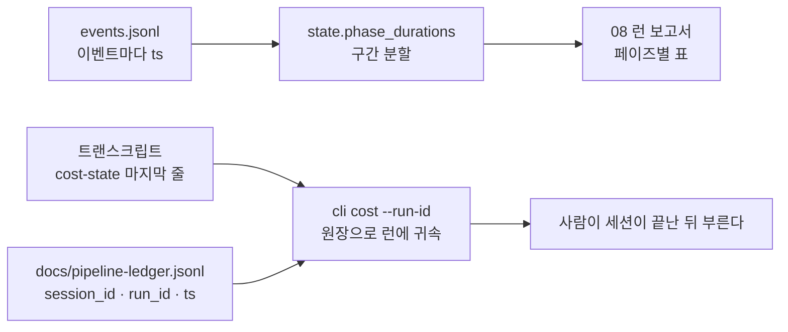
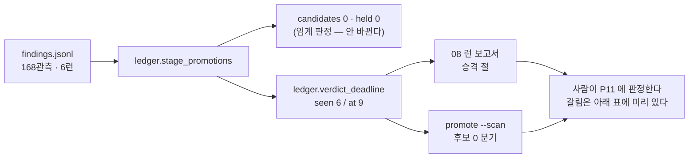
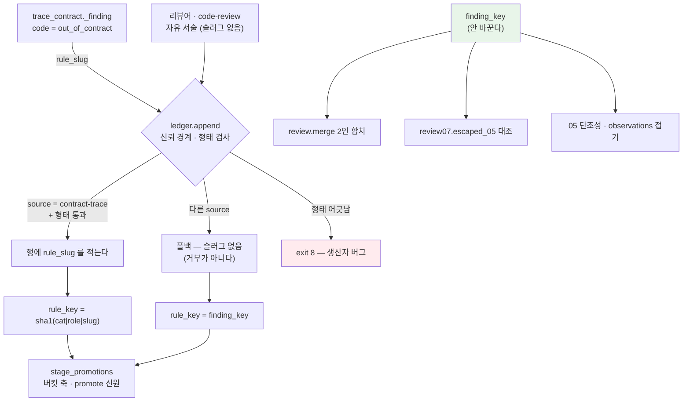
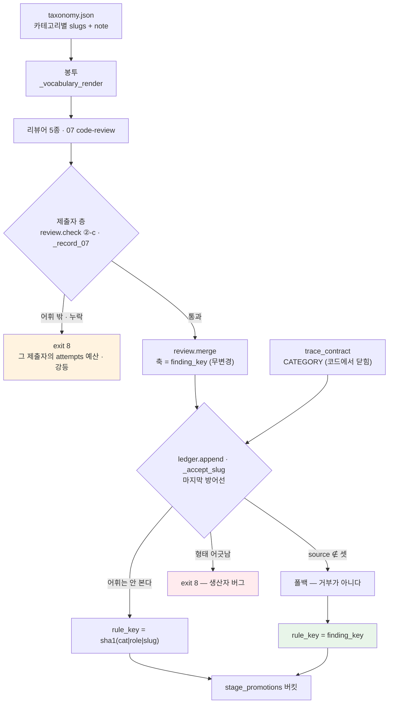
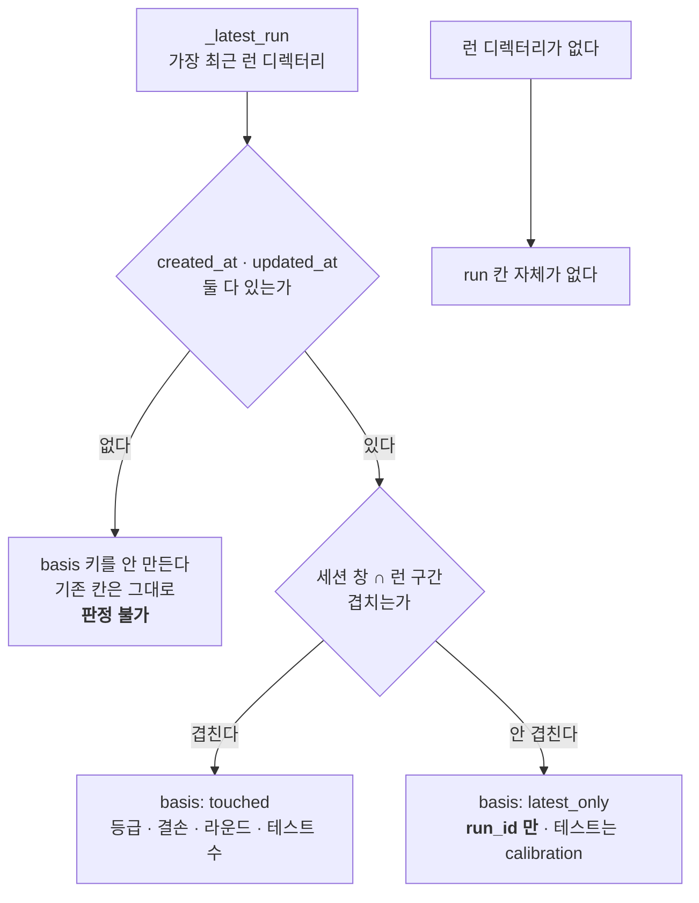
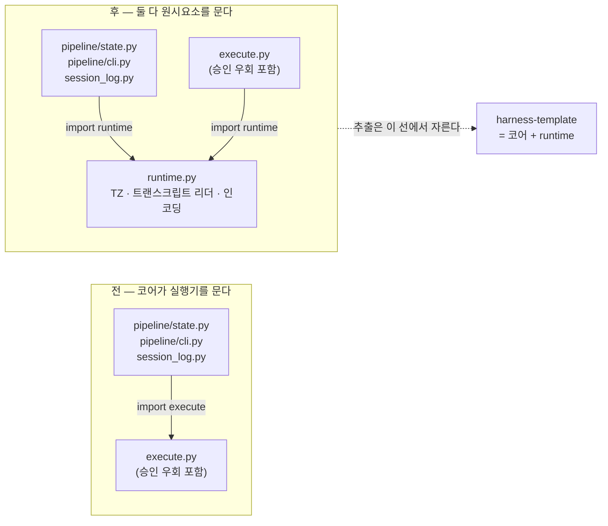

# 하네스 결정 기록 (Harness Decision Records)

> 이 문서는 **템플릿 리포 자신**에 대한 결정을 기록한다.
> 클론한 프로젝트의 기술 결정은 `/docs/ADR.md`에 적는다. 둘을 섞지 않기 위해 여기서는 `ADR-H` 접두사를 쓴다.

## 철학

검증한 것만 템플릿으로 승격한다. 실측 없는 상수를 상속하지 않는다. 파생 프로젝트가 물려받을 것에는 더 높은 기준을 적용한다.

---

### ADR-H001: 하네스 파이프라인을 단계적으로 승격한다

**결정**: 스택 비종속 8페이즈 feature-pipeline을 지금 한 번에 이식하지 않는다. `계약 계층 → 파일럿 → 8페이즈` 3단계로 나누고, 각 단계의 게이트를 통과한 것만 템플릿에 승격한다. 상세는 [ROADMAP.md](ROADMAP.md).

**이유**:
- 목표 파이프라인의 정책(백그라운드 회귀 여부, 타임아웃, 테스트 수 하한)은 전부 **실측값의 함수**다. 이 리포의 `docs/`는 아직 전부 빈칸이고, 파이프라인은 실제 프로젝트 제약을 만난 적이 없다. 지금 굳히면 근거 없는 상수를 모든 파생 프로젝트가 물려받는다.
- 어댑터의 `verified` 플래그와 같은 규율이다 — 실제로 완주시킨 뒤에만 승격한다.
- 반대로 프로젝트마다 하네스를 새로 만드는 선택지는 기각했다. 개선이 축적되지 않고, 고유명사·상수가 매번 다시 박혀 일반화의 목적이 무너진다.

**트레이드오프**:
- 첫 파일럿 프로젝트는 8페이즈 없이, 현재의 순차 실행기(`scripts/execute.py`)만으로 진행해야 한다. 계약 추적·리뷰어 라우팅·규칙 원장의 이점을 그 프로젝트에서는 못 쓴다.
- 그 대가로 얻는 것: 파이프라인 설계의 근거가 되는 실측 데이터.

**재검토 시점**: 파일럿 프로젝트 1건 완주 직후. 그때 기록된 "막힌 지점·수동 개입이 필요했던 지점"이 1단계 `config.json` 스키마의 입력이 된다.

---

### ADR-H002: 하네스 자신의 문서를 `docs/harness/`로 분리한다

**결정**: 템플릿 리포 자체에 대한 문서(로드맵·결정 기록·파이프라인 명세)는 `docs/harness/` 하위에 둔다. `docs/` 직속의 6개 문서는 프로젝트가 채우는 빈 템플릿으로 유지한다.

**이유**: `docs/ADR.md`에 하네스 결정을 적으면 **모든 파생 프로젝트가 무관한 ADR을 물려받는다.** 클론한 사람이 지워야 할 잔재가 되고, 템플릿의 "빈칸을 채운다"는 계약이 깨진다.

**트레이드오프**: 문서 트리가 한 겹 깊어지고, 새로 온 사람이 두 층의 차이를 알아야 한다. `ROADMAP.md` 상단과 이 문서 상단에 그 구분을 명시해 완화한다.

---

### ADR-H003: 1단계 계약 계층을 별도 템플릿 리포가 아니라 이 리포에 짓는다

**결정**: `harness/config.json`·스키마·어댑터·`init`·`doctor`를 `harness-practice` 안에 만든다. 별도 `harness-template` public 리포 생성은 미룬다. 실행기는 `scripts/harness.py`(계약 계층)와 `scripts/execute.py`(순차 step 실행기) **두 진입점**으로 둔다.

**이유**:
- 어댑터의 `verified` 규율(ADR-H001)을 지키려면 검증 대상이 필요하다. 이 리포에는 Shelfie라는 실물 프로젝트가 이미 있으므로, `doctor`를 추측이 아니라 진짜 `package.json`·디렉토리 구조·계약 절 제목에 대고 검사할 수 있다. 빈 템플릿 리포에서는 `doctor`가 검사할 실물이 없어 통과가 아무것도 의미하지 않는다.
- 실제로 그 값을 바로 회수했다. 첫 `doctor` 실행이 어댑터의 `compile` 스테이지가 참조하는 `npm run typecheck`가 `package.json`에 없다는 것을 잡았다. 별도 리포였다면 이 불일치는 첫 파일럿 게이트가 25분 돌고 나서 드러났을 것이다.
- `execute.py`를 흡수하지 않은 이유는 그쪽 CLI가 위치 인자(`execute.py <task-name>`)이고 `test_execute.py` 559줄과 `.claude/skills/harness/SKILL.md`가 그 형태에 묶여 있기 때문이다. 검증되지 않은 통합으로 동작하는 실행기를 깨뜨리는 것은 1단계가 살 이유가 없는 위험이다.

**트레이드오프**:
- 진입점이 둘이라 "하네스를 어떻게 부르는가"의 답이 하나가 아니다. 통합은 3단계(8페이즈 승격)에서 `execute.py`가 어차피 재작성될 때 한다.
- 하네스 자산이 프로젝트 리포에 섞인다. `main_owned_paths`로 소유 경계를 명시해 워커가 손대지 못하게 막고, 추출은 파일럿 완주 후로 미룬다.

**재검토 시점**: Shelfie 파일럿 완주 직후. 그때 `calibrate`로 실측을 확보하고 어댑터를 `verified: true`로 올릴 수 있는지 판단한다.

---

### ADR-H004: 역할 소유 겹침을 glob 대수가 아니라 실제 파일 목록으로 판정한다

**결정**: `doctor`의 소유 경계 검사는 `roles[].owns`와 `excludes` glob의 교집합을 추상적으로 계산하지 않는다. `git ls-files`(없으면 파일 시스템 탐색)로 얻은 **리포의 실제 파일 하나하나**에 `owns − excludes`를 적용해, 같은 파일을 두 역할이 소유하면 거부한다.

**이유**:
- 목표 파이프라인 설계는 "`owns` glob이 서로 disjoint여야 한다"고만 적었는데, glob 집합의 교집합 판정은 일반적으로 결정 불가능에 가깝다.
- 더 중요한 것은 **정상 설정을 거짓 거부한다**는 점이다. `impl`이 `src/lib/**`를 갖고 `test`가 `src/**/*.test.ts`를 갖는 것은 이 프로젝트의 올바른 경계인데, 두 glob은 문자열 수준에서 명백히 겹친다. `excludes`를 거쳐야 비로소 disjoint가 된다.
- 실물 기준 판정은 부수 효과로 **"어느 역할도 소유하지 않고 메인 소유도 아닌 파일"** 을 셀 수 있게 한다. 그런 파일을 워커가 건드리면 실패가 누구에게도 귀속되지 않는다 — 조용히 통과하는 경로 하나가 줄었다.

**트레이드오프**: 아직 존재하지 않는 파일의 겹침은 잡지 못한다. 새 파일이 생긴 뒤 첫 `doctor`에서 드러나므로, 게이트를 `/feature` 진입 전에 매번 돌린다는 전제와 함께여야 성립한다.

---

### ADR-H005: 모델 호출 프롬프트는 명령행 인자가 아니라 stdin 으로 넘긴다

**결정**: 실행기가 Claude를 호출할 때 프롬프트를 argv에 싣지 않는다. `subprocess`의 `input=`(stdin)으로 넘기고 `encoding="utf-8"`을 명시한다. 3단계에서 실행기를 다시 쓸 때도 이 제약을 승계한다.

**이유**:
- 파일럿 런 #1의 첫 실행이 step 0에서 `WinError 206`으로 즉사했다. 가드레일(`CLAUDE.md` + `docs/*.md` 전문)만 97,007자, 프롬프트 합계 102,839자인데 Windows `CreateProcess`의 인자 상한은 32,767자다.
- **문서가 자랄수록 확실해지는 실패다.** 이 하네스의 가드레일 주입 방식(문서 전문을 매 step 프롬프트에 넣는다)과 argv 전달은 근본적으로 양립하지 않는다. 문서를 줄이거나 상한을 조정해 풀 문제가 아니다.
- 목표 파이프라인은 여기에 계약·이전 findings·에스컬레이션 패킷까지 더 싣는다. 프롬프트는 앞으로 더 커지기만 한다.
- `encoding`을 명시하지 않으면 로캘(이 머신은 cp949)로 인코딩돼 한글 프롬프트가 깨진다. [[ADR-H003]]의 "모든 파일 I/O는 utf-8" 규율이 프로세스 경계에도 그대로 적용된다.

**트레이드오프**: 호출을 명령행에서 손으로 재현하기가 조금 번거로워진다(`claude -p "..."` 대신 파이프가 필요하다). 그 대가로 프롬프트 크기 상한이 사라진다.

**재검토 시점**: 없음. 되돌릴 이유가 생기기 어렵다. 회귀 테스트(`test_prompt_is_not_passed_as_argv`)가 50,000자 프롬프트에서 argv 총합이 200자 미만인지 고정한다.

---

### ADR-H006: 실행 중 상태를 `RUNNING` 파일로 외재화하고, 생존 판정은 pid 가 아니라 heartbeat 로 한다

**결정**: 실행기는 `phases/{phase}/RUNNING`에 `pid`·`host`·`step`·`started_at`·`heartbeat`를 남기고, 끝나면(성공·실패·차단 모두) 지운다. 다른 실행기는 이 파일의 **`heartbeat` 신선도**로 생존을 판정한다 — 5분 이내면 살아 있는 것으로 보고 `exit 2`로 거부한다. `pid`는 사람이 읽으라고 남기되 기계 판정에 쓰지 않는다.

**이유**:
- `started_at`은 있는데 `step{N}-output.json`이 없는 상태가 **"진행 중"과 "죽었음"을 동시에 뜻했다.** 출력 파일은 모델 호출이 반환한 뒤에야 쓰이기 때문이다. 파일럿 런 #4에서 감독 세션이 9분째 작업 중이던 step을 "끊겼다"로 읽고 산출물을 되돌렸고, 원래 계획은 실행기를 하나 더 띄우는 것이었다 — 그랬다면 둘이 같은 `index.json`을 두고 다퉜다.
- **Windows에서 `os.kill(pid, 0)`은 생존 확인이 아니라 프로세스 종료다.** CPython의 `os.kill`은 Windows에서 `CTRL_C_EVENT`·`CTRL_BREAK_EVENT`가 아닌 모든 시그널을 `OpenProcess` + `TerminateProcess(handle, sig)`로 처리한다. POSIX의 관용구를 그대로 옮기면 **이 결정이 막으려는 사고를 이 결정이 일으킨다.** `ctypes`로 `OpenProcess`를 직접 부르는 길도 있으나 pid 재사용에 여전히 취약하고 테스트가 어렵다.
- heartbeat는 이식 가능하고 **가짜 시계로 결정적으로 테스트된다.** 실행기 자신의 타임스탬프는 초 단위라 벽시계로 재면 흔들린다.
- 3단계의 병렬 스테이지에서는 선택이 아니다. 여러 스테이지가 동시에 도는 순간, 무엇이 살아 있는지 파일 하나로 답할 수 없으면 관찰자도 스케줄러도 눈이 없다.

**트레이드오프**: 실행기가 `SIGKILL`로 죽으면 `RUNNING`이 남는다. 그 경우 최대 5분 동안 다음 런이 "살아 있다"고 오판한다 — 잘못 시작하는 쪽보다 잘못 기다리는 쪽이 싸다고 보고 이 방향을 택했다. heartbeat를 읽을 수 없을 때(파일이 깨졌거나 형식이 다를 때)도 **살아 있는 쪽으로** 판정한다. 모르는 상태에서 남의 런을 죽었다고 단정하는 것이 M10이 낸 사고 그 자체였다.

**부수 규율**: heartbeat는 임시 파일 + `os.replace`로 원자적으로 쓴다. 제자리 쓰기는 truncate와 write 사이에 **빈 파일**을 노출하고, 하필 그때 읽은 실행기가 "실행 중인 런이 없다"로 판정해 그대로 시작한다. 읽기 쪽도 파일이 있는데 열지 못하면 실패로 보지 않는다.

---

### ADR-H007: `MAX_RETRIES`는 상한이 아니라 바닥값이다

**결정**: 자가 교정 재시도 상한을 `harness/calibration.json`의 `derived.retry_budget`에서 읽는다. 실측이 없으면 `MAX_RETRIES`(3)로 떨어진다. 상한을 유도하려면 먼저 `execute.py`가 step마다 `attempts`를 `index.json`에 남겨야 하고, 기록된 step이 `RETRY_RECORD_MIN`(10) 이상 모이기 전에는 `retry_budget`이 `null`이다.

**이유**:
- `MAX_RETRIES = 3`은 파일럿 20 step 동안 **한 번도 발동하지 않은 상수**였다. [[ADR-H001]]의 "실측 없는 상수를 상속하지 않는다"에 정면으로 걸린다.
- 그러나 지우면 자가 교정 장치 자체가 없어진다. 값이 근거 없는 것과 장치가 불필요한 것은 다른 문제다.
- **더 나쁜 것은 재시도 횟수가 어디에도 기록되지 않았다는 점이다.** "20 step 재시도 0회"는 콘솔을 지켜본 사람의 기억이지 데이터가 아니었다. 재지 않은 값에서 상한을 유도할 수는 없으므로, 이 결정의 첫 절반은 **재는 것을 만드는 일**이다.
- 1회에 통과해도 `attempts: 1`을 남긴다. **"기록 없음"과 "재시도 0회"를 같은 칸에 쓰지 않는 것**이 `calibrate` 전체의 규율이고, 과거 20 step을 소급해 0으로 적으면 정확히 그 규율을 깬다.

**트레이드오프**: 표본이 모일 때까지 상한은 여전히 3이다. 즉 이 결정은 값을 당장 바꾸지 않고 **값의 출처를 바꾼다.** 파일이 스스로 "기록 0 step · 미기록 20 step"이라고 말하게 되는 것이 지금 얻는 전부이며, 그것이 요점이다.

**부수 효과**: 이것이 **실행기가 유도된 정책을 소비하는 첫 사례**다. `background_full_regression`·`full_timeout_sec`·`tests_ran_floor` 셋은 `harness.py`가 계산해 출력만 하고 `execute.py`는 하나도 읽지 않았다. "실측이 정책을 만든다"가 여기서 처음으로 코드 경로가 됐다.

---

### ADR-H008: 가드레일 문서는 step이 고른다

**결정**: `execute.py`가 `docs/*.md`를 전량 주입하던 것을 step별 선택으로 바꾼다. 선택 출처는 `phases/{phase}/index.json`의 `steps[].docs` → `harness/config.json`의 `project.guardrail_docs` 순이고, `CLAUDE.md`는 언제나 주입한다. **어느 쪽도 지정하지 않으면 지금처럼 전량 주입하되 "문서 미선택 — 전량 주입 (N자)"으로 드러낸다.** step 파일의 `## 읽어야 할 파일` 절에 있는 문서가 주입 목록에서 빠지면 step 시작 전에 exit 2로 막는다.

**이유**:
- 파일럿 다섯 런의 실측이 근거다(M15). 청구 토큰 115.6M 중 **cache read가 110.3M(95.4%)** 이고, 이것은 **매 turn 프롬프트 접두부를 다시 읽은 양**이다(turn당 147,025). 그 접두부의 **86.9%가 가드레일**이다.
- 즉 UI step이 배포 인프라·성능 예산 절을, 순수 함수 step이 GTM 이벤트 표를 750 turn 내내 재독했다. **작업량이 아니라 주입 방식이 비용의 정체다.**
- 목표 8페이즈 파이프라인은 이 접두부에 계약·이전 findings·리뷰어 프롬프트를 더 얹는다. 지금 고치지 않으면 같은 구조를 더 큰 규모로 물려준다.
- **step은 이미 무엇을 읽어야 하는지 알고 있었다.** 런 #5의 6개 step 파일이 각각 3~5종을 `## 읽어야 할 파일`에 적어 두었고, 그대로 주입했다면 **문자 기준 41% 절감**(591,780 → 350,704자)이었다. 정보는 있었고 실행기가 쓰지 않았을 뿐이다.

**왜 프로즈를 주입 목록으로 쓰지 않는가**: `## 읽어야 할 파일`을 파싱해 그대로 주입하면 파싱이 빗나가는 순간 **문서가 조용히 빠진다.** 워커는 CRITICAL 규칙을 못 본 채 규칙을 지켰다고 보고할 것이고, 그것은 이 리포에서 가장 나쁜 실패 형태다(런 #4에서 step 파일의 금지사항 한 줄이 세 런의 이월을 만든 것과 같은 계열). 그래서 **선언은 명시적 필드로 받고, 프로즈는 교차검증에만 쓴다.** 어긋나면 시작을 막는다.

**트레이드오프**: phase 설계자가 step마다 `docs`를 채워야 한다. 채우지 않으면 지금 동작 그대로이므로 **하위 호환이고 롤백 비용이 0이다** — `steps[].docs`를 지우면 즉시 되돌아간다. 대신 미선택이 조용히 통과하지 않고 매 step 로그에 남는다.

**함께 들어간 것**: 효과를 재려면 재는 것이 있어야 한다. `steps[].runs[]`에 시도마다 `elapsed_sec`·`prompt_chars`·`guardrail_chars`·`cost_usd`·`turns`·`cache_read`를 남긴다(M12). [[ADR-H007]]이 `attempts`에 한 것과 같은 조치이고, 이유도 같다 — **실행기는 맞는 값을 알면서 화면에 찍고 버렸다.** 배열인 것은 런 #5에서 재개 실행이 `step2-output.json`을 덮어써 한도 중단분의 비용이 사라졌기 때문이다.

**검증 (런 #6, 2026-09-02)**: `contract-wiring` 5 step이 이 결정을 처음 소비했고 A/B가 성립했다 — 가드레일 문자 **−54.1%**(506,835 → 232,753) · turn당 재독 **145,491 → 106,596(−26.7%)** · step당 비용 **$5.61 → $3.45(−38.5%)** · step당 turn **38.0 → 29.6**. 경계했던 실패 양상(문서를 못 찾아 헤매느라 turn이 는다)은 나타나지 않았고 **품질 회귀도 0건**이다(금지 경로·CRITICAL·새 의존성·레이어 경계·저장소 흔적). 트레이드오프에 적은 "설계자가 채워야 한다"는 부담은 실현됐으나 비용이 낮았다 — 교차검증 `exit 2`가 한 번도 발동하지 않았다.

**검증이 드러낸 한계**: 접두부를 문자 기준 절반으로 줄였는데 turn당 재독은 26.7%만 내려갔다. 역산하면 **turn당 재독의 약 53%만이 접두부이고 나머지 47%는 누적 대화**다. step별로도 turn당 재독과 가드레일 크기의 상관은 약하다(**r ≈ 0.38, n=5** — 가드레일이 가장 작았던 step 3이 turn당 재독은 가장 컸다). **이 결정으로 얻을 수 있는 것은 여기까지이고, 남은 절반은 [[ADR-H009]]의 몫이다.** 두 결정이 겹치지 않고 이어진다는 것이 실측으로 확인된 셈이다. 다만 **표본이 한 런이라** 품질 회귀 0건은 런 #7이 한 번 더 지지해야 한다.

---

### ADR-H009: step이 지목한 소스는 실행기가 싣는다

**결정**: `phases/{phase}/index.json`의 `steps[].sources`에 적힌 파일을 실행기가 프롬프트 접두부에 `## 소스 (step 시작 시점의 내용이다)` 절로 싣는다. **미지정이면 지금 동작 그대로**(세션이 직접 읽는다). 합계 상한은 `config.project.source_inject_max_chars`(기본 60,000자)이고 초과하거나 실재하지 않는 경로면 `exit 2`. step 파일의 `## 읽어야 할 파일`에 있는 **문서가 아니면서 실재하는 파일**이 `sources`에서 빠지면 시작 전에 `exit 2` — [[ADR-H008]]의 교차검증과 같은 규율이다.

**이유**:
- 다섯 런 26 step의 트랜스크립트를 turn 단위로 분해했다(M16). 파일 읽기·검색이 **도구 호출의 38%(276회)** 이고 컨텍스트 투입의 **70.5%**다.
- 결정적인 것은 재독이다. 읽기 turn 336회가 **자기가 존재한다는 이유만으로** 접두부를 다시 읽게 만든 양이 **전체 재독 부담의 44.0%**다.
- 산술이 방향을 정한다. 파일(s자)을 turn `k`에서 읽으면 `s·(T−k)` + 그 turn의 접두부 재독이고, 미리 실으면 `s·T`다. 실측(s≈3,400 · k≈9.5 · 그 시점 접두부≈133,000)에서 **읽기 하나를 없앨 때마다 약 10만 문자·turn**이 절약된다. `s·k < 2×접두부`인 한 첨부가 항상 싸고, 관측된 범위에서 이 부등식은 언제나 참이었다.
- **336회 중 80회(22%)가 이미 읽은 파일을 또 읽은 것**이다. 접두부에 있으면 0회다.
- **첨부 대상은 이미 step 파일에 적혀 있었다.** `app-shell` 6개 step이 각각 3~6개(18,642~48,664자)를 `## 읽어야 할 파일`에 지목했고 전부 상한 안이다. M15와 같은 결론이다 — 정보는 있었고 실행기가 쓰지 않았다.

**왜 상한이 필수인가**: 접두부는 **모든 turn에 곱해진다.** 상한 없는 첨부는 개선이 아니라 악화이고, 그 경계가 위 부등식이다. 60,000자는 관측된 step 최대치(48,664자)에 여유를 둔 값이지 이론값이 아니다 — 실측이 바뀌면 함께 바꾼다.

**왜 stale 경고를 함께 싣는가**: 첨부본은 **step 시작 시점**의 내용이다. 세션이 파일을 고친 뒤에도 접두부는 옛 내용을 보여 준다. 그것을 최신으로 읽으면 잘못된 코드를 만든다. 그래서 절 머리에 "다시 읽지 마라. 단 네가 고친 뒤의 내용은 반영되지 않는다"를 명시한다. 첨부하지 않았을 때(세션이 turn k에서 읽었을 때)도 같은 위험이 있었지만, 첨부는 그 사실을 **눈에 보이게** 만들므로 경고를 함께 둔다.

**트레이드오프**: 설계자가 `sources`를 채워야 하고, 필요 없는 파일을 넣으면 접두부만 커진다. 채우지 않으면 기존 동작이므로 롤백 비용은 0이다. **런 #6에서는 켜지 않았다** — 런 #6은 [[ADR-H008]]의 A/B이고 두 변경을 겹치면 귀속이 불가능해진다. 그 판단이 지켜졌음은 런 #6 5 step의 `source_chars`가 전부 `0`인 것으로 파일에 남아 있다. **런 #7이 이 결정의 실측을 준다** — 대조군은 런 #6(step당 $3.45 · turn당 106,596 · step당 turn 29.6)이다.

**런 #6이 이 결정을 뒷받침한 방식**: [[ADR-H008]]의 A/B가 가드레일 쪽 여지를 거의 다 썼다는 것을 보여 줬다 — 접두부를 절반으로 줄인 뒤 turn당 재독의 **약 47%가 접두부 밖**으로 남았다. M16이 트랜스크립트 분해로 도달한 "남은 레버는 읽기 turn 하나"라는 진단에 **독립적인 두 번째 근거**가 생긴 것이다.

**검증 (런 #7, 2026-09-02) — 기제는 작동했고 순효과는 없다**

`forced-path` 5 step이 이 결정을 처음 소비했다(step당 소스 46,302자). 대조군은 런 #6이다.

- **기제는 작동했다.** step당 turn이 **29.6 → 22.6(−23.6%)**. M16이 "도구 호출의 38%"라고 셌던 읽기 turn이 실제로 사라졌다.
- **접두부 밖 재독이 줄었고, 이 결론은 환산비 가정에 의존하지 않는다.** 접두부가 step당 +61,484자 늘었는데 turn당 재독은 +20,076토큰만 늘었다. 자·토큰 비를 1.2~2.0 어디로 잡아도 접두부 증가분만으로 +30,742 ~ +51,237토큰이 설명되므로, **접두부 밖은 −10,667 ~ −31,161토큰/turn 만큼 줄었다.** [[ADR-H008]]의 53%/47% 분해는 "접두부 밖 불변" 가정 위에 있었는데, 이번 런이 그 가정을 깨면서도 같은 방향을 냈다.
- **그런데 비용은 −0.7%로 제자리다.** 접두부가 **113%** 늘어(소스 46,302 + 가드레일 33% 증가) turn 감소분을 그대로 먹었다. step당 재독은 −9.3%, 소요는 −11.0%.

**결론: 이 구성에서 비용 중립이다. 롤백하지 않는다** — 기제가 작동하는 것이 확인됐고 남은 것은 예산이다. 롤백 비용이 0이라는 원래 성질도 그대로다.

**이 검증이 드러낸 구조적 문제**: [[ADR-H008]]은 접두부를 줄이고 이 결정은 늘리는데, **둘의 상한이 서로를 모른다.** 가드레일에는 상한이 없고 여기의 60,000자는 소스만의 상한이다. 런 #7 step 2는 가드레일 83,760 + 소스 45,355로 접두부 **136,986자** — 일곱 런 최대다. **이 결정의 상한을 지키고도 이 결정이 막으려던 상태에 도달했다.** 필요한 것은 접두부 전체에 걸리는 하나의 예산이고, 그 값의 근거는 아직 두 런짜리다(ROADMAP 28).

**열린 질문**: 첨부는 **읽을** 파일에 값을 하고 **쓸** 파일에는 덜 하는가. 첨부본은 step 시작 시점이라 세션이 고친 뒤에는 다시 읽어야 한다(위 stale 경고 문단). 런 #7에서 step 4(접두부 최소 105,553 · 비용 최대 $3.78 · turn 최대 27)와 step 2(접두부 최대 136,986 · 비용 최소 $2.82 · turn 최소 17)가 정반대로 나와 **반례가 이미 있다.** n=5로는 판정할 수 없다.

**설계 시 실제로 만나는 제약 (런 #7 설계에서 실측)**: 상한은 **소스가 아니라 테스트에 먼저 걸린다.** 이 리포에서 가장 큰 소스는 `src/services/anthropic.ts`로 **38,130자(상한의 64%)** 이고 `src/lib/prompts.ts`(12,371자)와 함께 실어도 50,501자로 들어간다 — 레이어를 가로지르는 step도 상한 때문에 쪼갤 필요는 없다. 그런데 **`src/services/anthropic.test.ts` 하나가 70,189자로 상한을 혼자 넘는다.** 이 리포의 테스트가 소스보다 크기 때문이고(1.84배, TDD의 당연한 귀결이다), 결과적으로 `sources`는 큰 모듈에서 **사실상 소스 전용**이 된다.

**이것을 상한을 올릴 근거로 쓰지 않는다.** 70,189자를 접두부에 싣는 것이 정확히 이 결정이 막으려는 악화다 — 접두부는 모든 turn에 곱해진다. 테스트 파일은 step 세션이 필요한 만큼만 읽는 편이 싸다. 다만 **`sources`가 읽기 turn을 없앤다는 전제가 큰 모듈에서는 절반만 성립한다**는 뜻이므로, 런 #7의 A/B는 이 사실을 알고 해석해야 한다.

**측정 단위를 틀리지 마라**: `_load_sources`는 `len(body)`로 **문자**를 센다. `wc -c`(바이트)로 재면 한국어 주석이 많은 이 리포에서 1.15~1.46배 부풀고, **실재하지 않는 제약을 만들어 낸다.** 런 #7 설계의 첫 초안이 실제로 그렇게 틀렸다 — 바이트로 재서 "`anthropic.ts`가 상한의 88%라 레이어를 쪼개야 한다"고 결론지었으나 문자로는 64%였다.

**부수 결정 — 어댑터의 `select`는 이름 필터가 아니라 경로 필터다**: `nextjs-ts`의 `stages.scoped.select`(`{"flag":"-t"}`)를 지웠다. `-t`는 테스트 **이름** 필터라 vitest가 모든 파일을 변환·수집하고 환경을 세운 **뒤에** 거른다. 런 #3·#4·#5가 그 문법으로 재고 "`loop_stage`는 이 스택에서 손해"라고 결론지었는데, **경로 필터로 재니 `full` 대비 100.2% → 14.6%(4.56s vs 31.23s)** 였다. 6.8배다. `_stage_argv`가 `select` 블록이 없으면 선택자를 인자로 그대로 붙이므로 코드 변경은 없었다. **틀린 것은 측정이 아니라 측정 대상이었다** — 8페이즈의 `tests_from`은 계약의 심볼을 테스트 이름이 아니라 **파일 경로**로 조립해야 하고, 어댑터의 `select` 어휘가 그 구분을 담아야 한다.

---

### ADR-H010: 접두부는 예산을 걸기 전에 분해해서 잰다

**결정**: 실행기가 프롬프트 접두부를 **네 조각으로 분해해** `steps[].runs[]`에 남기고(`preamble_chars` · `guardrail_chars` · `source_chars` · `context_chars`, 그리고 접두부 밖인 `step_body_chars`) step 시작 때 한 줄로 찍는다. **상한은 걸지 않는다.**

**이유**:
- [[ADR-H008]]은 접두부를 **줄이고**(문서 선택) [[ADR-H009]]는 **늘린다**(소스 첨부). 그런데 가드레일에는 상한이 아예 없고 `source_inject_max_chars`는 소스만의 상한이다. 두 결정이 같은 자원을 반대로 당기면서 **서로의 상한을 모른다.**
- 그래서 런 #7 step 2가 `sources` 상한(60,000자)을 지키고도 접두부 **136,986자** — 일곱 런 최대를 만들었다. **규칙을 다 지키고 그 규칙이 막으려던 상태에 도달했다.**
- 필요한 것은 접두부 전체에 걸리는 하나의 예산이다. **그런데 그 값의 근거가 지금 두 런(#6·#7)뿐이다.** 실측 없는 상수를 상속하지 않는 것이 이 로드맵의 원칙이고([ROADMAP](ROADMAP.md) 2절), 그 원칙은 하네스 자신의 상수에도 적용된다.
- 그러므로 지금 정할 것은 값이 아니라 **무엇을 재야 값을 정할 수 있는가**다. `prompt_chars` 하나로는 알 수 없다 — 접두부는 **모든 turn에 곱해지고** step 본문은 한 번만 실리므로, 둘을 한 숫자로 두면 예산을 어디에 걸어야 하는지가 보이지 않는다.

**왜 지금 상한을 걸지 않는가**: 상한을 걸면 그 순간부터 step 설계가 그 값에 맞춰지고, 그러면 **그 값이 옳았는지를 재는 표본이 더는 생기지 않는다.** [[ADR-H007]]이 `MAX_RETRIES`에서 겪은 것과 같은 함정이다 — 그때는 "재는 것이 없었다"가 문제였고, 여기서는 "재기 전에 굳히는 것"이 문제다.

**트레이드오프**: 이번 런에서 접두부가 커지는 것을 막지 못한다. 막는 대신 **드러낸다** — 실행기가 매 step 분해를 찍으므로 설계자가 커진 것을 그 자리에서 본다. 값을 정할 표본은 런 #8부터 쌓인다.

**열린 질문 (런 #8이 답했다)**: 첨부는 **읽을** 파일에 값을 하고 **쓸** 파일에는 덜 하는가.

**아니다 — 반대였고, 질문 자체가 틀린 축을 보고 있었다.** 런 #8이 5 step을 두 팔로 갈라 쟀다. 팔 A(쓸 파일을 첨부한다 — step 0·2)는 **15.0 turn · $2.40**, 팔 B(읽을 파일만 첨부한다 — step 3·4)는 **33.5 turn · $3.80**이다. 접두부가 26% **작은** 팔이 58% 더 비쌌다. 런을 가로지르는 매칭 쌍이 더 강한 증거다 — 같은 `src/app/page.tsx`를 고치면서 런 #7 step 4는 그 파일을 **첨부하고** 27 turn·$3.78, 런 #8 step 3은 **첨부하지 않고** 44 turn·$5.19였다.

**그런데 팔 B 안에서 둘이 갈렸다.** step 4는 23 turn·$2.41로 팔 A와 다르지 않았다. 차이는 첨부하지 않아 세션이 직접 읽어야 했던 양이다 — step 3은 66,275자(`page.tsx` + 그 테스트 + `RecommendationList` + 테스트), step 4는 16,334자였다.

**그러므로 축은 "읽을/쓸"이 아니라 크기다**: 첨부의 값은 **안 첨부했을 때 드는 읽기 turn 수**에 비례한다. 큰 파일은 부분 읽기·재검색으로 여러 turn을 쓰고 turn 하나가 접두부 전체를 재독하게 만든다([[ADR-H009]]의 산술 그대로다). 쓸 파일이라 첨부본이 낡는 것은 **한 번의 재독**을 만들 뿐이고, 안 읽어서 생기는 여러 turn보다 싸다.

~~**남은 질문 (런 #9)**: 이 재정식화로 런 #8의 네 step이 전부 설명되는가. 그리고 **실행기가 "세션이 직접 읽은 양"을 재야 한다**~~ — **재는 쪽은 [[ADR-H011]]이 만들었다 (2026-09-02).** 41 step 백필이 런 #8의 다섯 step을 끌어온 양 순으로 늘어놓으니 turn이 16 · 14 · 18 · 23 · **44**로 사실상 단조였다. 다만 **사람이 어림한 값과 실측이 갈렸다** — `share-button`은 66,275자 어림에 실측 61,997자로 맞았지만, `capture-guide`는 16,334자 어림에 실측 **30,644자**로 두 배였다. 어림이 센 것은 *파일 크기*였고 실측이 세는 것은 *세션이 실제로 끌어온 전부*(테스트 출력·grep 결과 포함)다. 예산의 근거는 후자여야 한다 ([ROADMAP](ROADMAP.md) 28).

---

### ADR-H011: 세션이 끌어온 양은 이름이 아니라 문자로, 트랜스크립트에서 사후로 잰다

**결정**: 실행기가 step 세션의 트랜스크립트를 읽어 **접두부 밖에서 세션이 스스로 끌어온 양**을 `steps[].runs[]`에 남긴다 — `tool_result_chars`(컨텍스트에 들어간 도구 결과 문자) · `tool_result_count` · `tool_output_chars`(잘리기 전 원본, 하한) · `tool_calls`(이름별 횟수) · `session_id`. 트랜스크립트는 `~/.claude/projects/*/{session_id}.jsonl`을 **glob으로** 찾고, 지난 여덟 런 41 step은 `scripts/backfill_reads.py`가 사후 집계한다. **여기서도 상한은 걸지 않는다.**

**이유**:

- [[ADR-H010]]이 접두부를 분해해서 재게 했는데, **런 #7·#8이 두 번 연속 "접두부가 크면 비싸다"를 반증했다** — 접두부 최대 step이 두 번 최저 비용이었다. 런 #8이 진짜 변수를 지목했다: **첨부되지 않아 세션이 직접 읽어야 했던 양**이다(66,275자 → 44 turn · 16,334자 → 23 turn). 그런데 실행기는 `sources`(우리가 **실은** 것)는 알면서 세션이 **스스로 끌어온** 것은 몰랐다.
- **재지 않는 것을 근거로 상수를 정할 수 없다.** [[ADR-H007]]이 `MAX_RETRIES`에서, [[ADR-H010]]이 접두부에서 각각 지난 자리다. ROADMAP 28의 예산은 이 숫자 없이는 값을 가질 수 없다.
- 41 step 백필이 그 판단을 지지했다: **끌어온 양 ↔ 비용 r = 0.752**(n=15)인데 **접두부 ↔ 비용 r = 0.040**(n=5)이다. 예산을 걸 곳은 접두부가 아니다.

**왜 이름으로 분류하지 않는가**: 41 step의 도구 호출 1,083건 중 **`Bash`가 932건(86.1%)이고 `Read`는 6건(0.6%)**이다. step 세션은 bashFirst로 돌아 `cat`·`sed`·`grep`으로 읽고 heredoc으로 쓴다. 도구 이름은 "읽기/쓰기/테스트"의 정보를 **갖고 있지 않다.** 이름으로 가르면 읽기의 99%가 `Bash`라는 한 칸에 뭉쳐지고, 그 칸을 "실행"이라 부르는 순간 숫자가 거짓말을 시작한다. **틀린 숫자는 없는 숫자보다 나쁘다** — 런 #8이 `CLAUDE.md`에서 기록한 것과 같은 원리다. 이름별 횟수는 원자료로 남기고 해석은 사람이 한다.

**왜 슬러그를 유도하지 않는가**: `~/.claude/projects/` 아래 디렉토리 이름은 cwd에서 만들어지는 Claude Code의 구현 세부다. 이 리포는 경로 casing 함정에 **두 번** 물렸고 두 번 다 증상이 달랐다(런 #6 `useContext ... null`, 런 #8 `/_global-error`의 `workStore` 불변식). 규칙을 다시 구현하면 그 함정을 세 번째로 밟는다. `session_id`는 UUID라 **glob 한 번으로 유일하게** 잡히고, 슬러그가 무엇이든 상관없다.

**왜 사후 집계인가**: `--output-format stream-json`으로 바꾸면 실시간으로 같은 것을 셀 수 있지만, `_extract_usage`·`_usage_limit_reason`·`step{N}-output.json`이 전부 지금의 단일 JSON 형태 위에 서 있다. **재는 장치를 넣으려고 재고 있던 것을 깨뜨리지 않는다.** 트랜스크립트는 세션이 끝나면 완결돼 있으므로 사후로 충분하고, 부수로 **지난 여덟 런이 표본이 된다** — 백필하지 않았다면 ROADMAP 28의 예산은 런 #9부터 다시 쌓아야 했다.

**모르는 것은 비워 둔다**: 트랜스크립트를 못 찾으면 키를 만들지 않고 경고만 찍는다. 0으로 채우면 "재지 않았다"와 "0이었다"가 같은 칸에 들어간다 — [[ADR-H007]]이 `attempts`에서 겪은 실패다. 백필한 값에는 `reads_source: "backfill"`을 함께 적어 **실측 시점이 런 당시가 아님을 칸이 스스로 말하게** 한다(런 중에 잰 것은 `"live"`). 런 #1~#5의 26 step은 `runs[]`가 없어(M12가 그 다음에 생겼다) 백필이 항목을 새로 만드는데, `attempt`는 `null`이고 `outcome`은 아예 적지 않는다 — `step{N}-output.json`은 **마지막 세션**만 증명하고 그것이 몇 번째 시도였는지는 증명하지 않는다.

**트레이드오프**: 트랜스크립트 파일 배치에 의존한다. 그 배치가 바뀌면 이 계측은 조용히 빈 칸을 만든다 — 그래서 못 잰 것을 **경고로 드러내고** 0으로 덮지 않는다. 대안(`stream-json`)은 의존을 실행기 안으로 옮기지만 기존 파싱 세 곳을 함께 바꿔야 하므로, 이 계측이 값을 한다는 것이 확인된 뒤에 재검토한다.

**상한은 이번에도 걸지 않는다**: [[ADR-H010]]과 같은 이유다 — 걸면 그 순간부터 step 설계가 그 값에 맞춰지고, **그 값이 옳았는지 잴 표본이 더는 생기지 않는다.** 지금 생긴 것은 41개의 표본이고, 값은 그것이 여러 런에서 무엇을 예측하는지 본 뒤에 정한다. 막지 않고 드러낸다.

#### 보강 (2026-09-02) — 합계로는 부족했다. 같은 양이 두 조각 수로 갈린다

**추가 결정**: 스캐너가 합계 옆에 **호출당 크기 분포**(`tool_result_p50` · `tool_result_p90` · `tool_result_max`)와 **동일 결과 재수신**(`tool_result_repeat_chars` · `tool_result_repeat_count`)을 남긴다. 백필이 41 step에 소급했다. **여기서도 상한은 걸지 않는다.**

**왜**: 위 백필이 남긴 열린 질문이 하나였다 — 같은 양(≈79,800자)을 끌어온 두 step이 22 turn과 44 turn으로 갈렸다. 합계로는 그 차이를 볼 수 없고, `tool_result_count`는 15 step 전부에서 `turns - 1`이라 **새 정보가 아니다.** 남는 축은 둘뿐이다: 한 조각이 얼마나 큰가, 그 중 몇 자가 이미 왔던 것인가.

**답**: 조각 크기다.

| step | 끌어온 양 | 건 | 조각 평균 | 최대 조각 | 재수신 | turn |
|---|---:|---:|---:|---:|---:|---:|
| `booklist-props` | 79,860 | 21 | **3,803** | 18,723 | 0자 | **22** |
| `request-contract` | 79,679 | 43 | **1,853** | 5,804 | 8자 | **44** |

**끌어온 양으로 turn을 설명하고 남은 잔차가 조각 평균 크기와 r = −0.580이고**(R² 0.558 → 0.707), 그 잔차 순위의 양 끝이 정확히 이 두 step이다(−12.39 / +9.65). 비용에서도 같은 방향이다(잔차 ↔ 조각 r = −0.385, R² 0.566 → 0.631). **부호가 음수다 — 조각이 클수록 예측보다 싸다.**

**turn 쪽 관계의 일부는 항등식이다.** `turn = 건수 + 1`이고 `건수 = 끌어온 양 ÷ 조각 크기`이므로, 양을 고정하면 조각이 작을수록 turn이 느는 것은 산술이다. 그것을 감추지 않는다. 정보는 **비용 잔차도 같은 방향**이라는 것과, 두 축이 서로 독립이 아니라는 것이다(`r(양, 조각) = 0.772`) — 많이 끌어오는 step이 대체로 크게도 끌어온다.

**재수신은 이 사건을 설명하지 못한다.** 41 step에서 동일 결과 재수신은 **7,635자 / 1,965,693자 = 0.39%**다(건수로는 93/1,083 = 8.6%). 두 step 모두 사실상 0이었다. `tool_result_repeat_count`가 비용과 r=0.746으로 높게 나오지만 그것은 **총 호출 수를 타고 온 것**이지 재수신이 비용을 만든다는 뜻이 아니다 — 양이 0.39%인 것이 그 증거다. **높은 상관을 인과로 읽지 않는다.**

**그러므로 예산은 한 숫자가 아니다.** ROADMAP 28이 찾던 "하나의 예산"은 접두부가 아니었고(위 본문), 끌어온 양 **하나**도 아니다. 형태는 **얼마나 끌어오는가 × 몇 조각으로 끌어오는가**다. 그리고 조각 크기는 step 설계가 직접 정하지 못한다 — 세션의 읽기 방식이 정한다. **설계가 쥘 수 있는 손잡이는 여전히 `sources`뿐이고**, 첨부는 양을 줄이는 동시에 그 파일의 조각 수를 0으로 만든다. 이것이 `SKILL.md`의 첨부 기준을 "안 첨부하면 `크기 ÷ 1,700` turn"으로 재정식화한 근거다(조각 크기 중앙값 1,713자, p25 1,340 · p75 2,269).

**여전히 값을 정하지 않는다.** R²가 0.71이지 0.95가 아니고, 표본은 비용을 아는 15 step뿐이며 전부 `reads_source: "backfill"`이다. 실행기가 런 중에 재는 경로는 아직 실물에서 돌지 않았다 — 런 #9가 첫 `live` 표본을 만든다.

**부수 결정 — 백필은 빠진 칸만 채운다**: 병합 규칙이 "`PULL_KEYS` 중 하나라도 있으면 통째로 건너뛴다"였다. 그래서 이번에 새 키를 더했을 때 41 step이 전부 이미 옛 5종을 갖고 있어 **한 칸도 채워지지 않았다.** 빈 칸만 채우는 것은 "못 잰 것이 잰 것을 지우지 않는다"(M12·M14)를 깨지 않는다 — 지우는 것이 아니기 때문이다. `--force`는 이번에도 두지 않는다. `action`에 `extended`를 더해 표가 무엇이 일어났는지 스스로 말하게 했고, `reads_source`는 사후로 칸을 더해도 `live`를 유지한다 — 그 칸은 **실측이 언제 났는지**를 말하는 자리이지 마지막으로 손댄 때를 말하는 자리가 아니다. **계측이 늘 때마다 재발할 자리였다.**

---

### ADR-H012: 첨부 어림의 축은 크기가 아니라 "통독해야 하는가 × 크기"다

**결정**: `sources` 첨부 판단의 어림을 `크기 ÷ 1,700 turn`에서 **두 축**으로 가른다.

| 세션이 그 파일에 하는 일 | 어림 | 근거 |
|---|---|---|
| **통독해야 한다** — 고칠 파일, 로직을 다시 세울 파일, 규약을 옮겨 적을 파일 | `크기 ÷ 1,700` turn (하한) | 런 #8 `capture-guide`가 이 어림의 1.9배를 실제로 끌어왔다 |
| **부르기만 한다** — 시그니처·타입·한두 분기만 필요한 파일 | **크기와 무관하게 2~3 turn** | 런 #9 `golden-runner`가 39,233자를 grep 1회 + `sed` 1회, 합 6,726자로 끝냈다 |

크기는 여전히 축이다 — 다만 **첫 줄에서만** 그렇다. 둘째 줄에서는 크기가 사실상 무관하다.

**이유**: 런 #9가 이 어림을 일부러 반증하려고 설계됐고 반증됐다.

런 #8이 첨부의 축을 "읽을 파일이냐 쓸 파일이냐"에서 **크기**로 옮겼고([[ADR-H010]]), 41 step 백필의 조각 크기 중앙값 1,713자가 `크기 ÷ 1,700`이라는 눈금을 줬다([[ADR-H011]] 보강). 런 #9 step 3은 그 눈금이 과대평가일 자리를 지목해 만든 관측점이다 — `src/services/anthropic.ts`(39,233자 · **어림 23.1 turn**)를 일부러 첨부하지 않았고, 러너가 거기서 쓰는 것은 `extractFromPhoto`와 두 타입뿐이었다.

실측은 **2 turn · 6,726자**다. 세션은 파일을 열지 않고 심볼 7개를 `grep -n`으로 찾은 뒤(835자) 필요한 세 구간만 `sed -n`으로 떴다(5,891자). **turn 기준 11.6배, 문자 기준 5.8배 과대평가**다.

그래서 어림의 실측 폭이 **0.09배 ~ 1.9배**로 벌어졌다. 20배 넘게 흔들리는 눈금은 판단의 근거가 되지 못한다. 두 사례를 가르는 것은 크기가 아니다 — 런 #8의 16,334자가 1.9배였고 런 #9의 39,233자가 0.09배였으니 **큰 쪽이 오히려 싸게 끝났다.** 가르는 것은 세션이 그 파일에 무엇을 하는가다. 고칠 파일은 끝까지 읽어야 하고, 부를 파일은 서명만 있으면 된다.

**이것이 [[ADR-H010]]을 뒤집지 않는다.** 런 #8의 A/B는 "쓸 파일을 첨부한 팔이 쌌다"였는데, 그 결론은 이 결정으로 오히려 **설명된다** — 쓸 파일은 정의상 통독 대상이라 안 첨부하면 `크기 ÷ 1,700`을 전부 문다. 런 #8은 옳은 답을 냈고 이유를 절반만 말했다. 축이 크기라고 적었지만 실은 **크기가 통독 여부의 대리 변수**였고, 그 상관이 깨지는 자리가 런 #9다.

**트레이드오프**: 설계자가 "이 step이 저 파일을 통독할 것인가"를 런 전에 판정해야 한다. 이 판정은 `docs`·`sources` 교차검증처럼 기계가 대신할 수 없다 — 실행기는 step 파일의 산문을 읽지 않고, 읽더라도 "고친다"와 "부른다"를 구별할 근거가 없다. **[[ADR-H004]]가 소유 판정에서, [[ADR-H011]] 보강이 조각 크기에서 지난 자리와 같다** — 규칙은 사람이 적용하고 실측이 사후에 채점한다.

그리고 이 판정이 틀렸을 때의 값이 비대칭이다. **통독할 파일을 안 첨부하면 여러 turn을 물고, 부르기만 할 파일을 첨부하면 그 크기가 모든 turn에 곱해진다.** 후자가 실제로 이 런에서 일어났다 — step 3은 `aladin.ts`(22,379자)를 첨부했는데 세션이 그것을 통독했는지는 확인하지 못했다. 상한(60,000자)이 있으므로 후자의 손해에는 천장이 있고 전자에는 없다. **확신이 없으면 첨부하는 쪽이 여전히 맞다.**

**남은 것**: 이 두 줄 표는 n=2(런 #8 하나 · 런 #9 하나)에 서 있다. 값을 굳히지 않는다 — [[ADR-H010]]이 접두부에서, [[ADR-H011]]이 끌어온 양에서 각각 같은 이유로 상한을 걸지 않은 것과 같다. **네 번째로 상한을 걸지 않는다.**

관련: [[ADR-H009]](첨부 기제) · [[ADR-H010]](축이 크기라는 앞선 답) · [[ADR-H011]](1,700자 눈금의 출처)

---

### ADR-H013: 파이프라인 레이아웃을 이 리포에 맞춰 재조정하고, 3단계 G3 게이트를 재정의한다

**결정**: 두 가지를 한 결정으로 묶는다. 둘 다 8페이즈 명세를 이식하면서 **정본 설계와 이 리포의 실물이 어긋난 지점**이고, 따로 정하면 서로 모순되기 때문이다.

**결정 1 — 레이아웃 재조정.** 정본이 그린 `.agents/skills/feature-pipeline/**` 배치를 쓰지 않는다. 이 리포의 자리는 이렇다:

| 정본 | 이 리포 |
|---|---|
| `.agents/skills/feature-pipeline/{execute,state,attribution,adapters,ledger}.py` | `scripts/pipeline/{cli,state,attribution,adapters,ledger}.py` |
| `.agents/skills/feature-pipeline/phases/01~08.md` | `harness/phases/01~08.md` |
| `.agents/skills/feature-pipeline/templates/contract.md` | `harness/templates/contract.md` (이미 있다) |
| `profiles/{stack}/` | `harness/profiles/{stack}/` (이미 있다) |
| `.claude/commands/feature.md` · `.claude/agents/{role}.md` | 같다 (신설) |
| `docs/harness/pipeline/{team-spec.md, ledger/, runs/}` | 같다 |

**결정 2 — G3 게이트 재정의.** 원래 게이트는 **"두 스택에서 완주 + 코어 파일에 스택 고유명사 grep 0건"**이었고, 두 번째 스택(`gradle-java`) 대상 리포가 이 머신에 없어 아홉 런 내내 열려 있었다([ROADMAP](ROADMAP.md) 6절 12번). 다섯 줄로 바꾼다:

| # | 새 게이트 | 검사 방법 |
|---|---|---|
| 1 | 코어에 스택 고유명사 **0건** | `scripts/pipeline/**` · `harness/phases/**` · `harness/templates/**` · `docs/harness/pipeline/team-spec.md` · `.claude/commands/**` · `.claude/agents/**`에 grep. 예외는 `harness/adapters/`·`harness/profiles/`·`harness/config.schema.json`, 그리고 team-spec이 검수 목록 자체를 싣는 자리 |
| 2 | 스택 교체가 **코어 무변경** | `_template.json`에서 두 번째 어댑터를 작성하고 `config.adapter`만 바꿔 `doctor` + `lint-phases` + `gate --replay <픽스처>` 통과 |
| 3 | 언어 교체가 **코어 무변경** | `project.language` + `contract.sections` + 템플릿만 바꿔 `doctor` 통과 |
| 4 | **그린필드 §P1** — 테스트 0개가 초록불이 아니다 | 빈 디렉토리에서 `04-gate`가 `PASS_WITH_GAPS`(초록불 아님)로 끝나는가 |
| 5 | 실물 완주 | 파일럿 기능 1건을 01~04로 완주. 열 런의 순차 실행기 결과가 대조군이다 |

**이유**:

- **레이아웃 쪽**: 이 리포는 계약 계층을 이미 `scripts/harness.py`와 `harness/`에 지었고([ADR-H003](DECISIONS.md)), `config.main_owned_paths`가 그 경로를 이미 덮는다. 정본 배치를 따르면 소유 경계를 새로 뚫어야 하고, `doctor`가 쓰는 glob 판정이 두 트리를 걸치게 된다 — 같은 규칙이 두 곳에서 갈라지는 것이 [ROADMAP](ROADMAP.md) 6절 15번이 기록한 실패다. 정본이 새 리포를 전제했을 뿐이고, 배치는 정본이 지키려던 것(코어에 고유명사 0건)과 무관하다.
- **게이트 쪽**: **게이트의 목적은 "두 리포를 돌리는 것"이 아니라 "코어에 스택이 박히지 않았음"을 보이는 것이다.** 대상 리포가 없다는 이유로 게이트를 아홉 런째 열어 두는 것은, 통과할 수 없는 조건을 걸어 3단계를 영구히 막는 것과 같다. 목적을 실물 없이 검사 가능한 형태로 옮긴다.
- 5번(실물 완주)을 남기는 것이 핵심이다. 1~4번은 전부 정적 검사이고, **정적 검사만으로 통과시키면 이 리포가 열 런 내내 지킨 "검증한 것만 승격한다"가 무너진다.**

**트레이드오프 — 무엇을 잃는가**:

- 원래 게이트가 주던 것은 **두 번째 스택의 실물 실행**이었다. 대체안이 주는 것은 **replay 픽스처와 정적 검사**뿐이다.
- 그래서 **어댑터의 `attribution` 정규식이 진짜 다른 스택의 출력에 맞는지는 여전히 검증되지 않는다.** 픽스처는 내가 만든 출력이고, 진짜 러너가 내는 출력이 아니다.
- 그 대가로 **두 번째 어댑터는 `verified: false`로 남는다.** `nextjs-ts`만 5번을 통과했을 때 `true`로 올린다. 이것이 [ADR-H001](DECISIONS.md)의 규율("검증한 것만 승격한다")을 게이트를 바꾸면서도 지키는 방법이다.
- 레이아웃 쪽의 비용: 정본과 경로가 다르므로 **정본을 읽고 온 사람이 파일을 못 찾는다.** `docs/harness/pipeline/team-spec.md` 10절에 대응표를 두어 완화한다. 다만 team-spec이 정본이 된 뒤에는 이 비용이 사라진다.
- **`scripts/execute.py`는 남긴다.** 01~04가 기능 1건을 완주할 때까지 회귀 안전망이고, 통합·폐기 판단은 그 뒤다 — [ADR-H003](DECISIONS.md)이 "통합은 3단계에서 `execute.py`가 어차피 재작성될 때"라고 적은 자리다.

**재검토 시점**: 5번을 통과한 직후. 그때 어댑터 `verified: true` 승격([ROADMAP](ROADMAP.md) 6절 14번)과 `harness-template` 추출 여부를 함께 판단한다.

> **결과 (2026-09-03)**: **다섯 줄 전부 통과했다.** 파이프라인 런 P1(`retry-reviewing`)이 Shelfie 결함 1건을 01~04로 완주했다 — 모델 호출 10회 · 01이 3라운드에 수렴 · 등급 `PASS_WITH_GAPS` · 테스트 1311→1333.
> **어댑터는 `verified: false`로 남는다.** 위 트레이드오프가 예고한 대로 `attribution`의 실패 경로가 여전히 미검증이다 — P1의 게이트도 8종 전부 통과해 `attribution.json`의 `failures`가 비었다. 실패를 일부러 만들지 않고 다음 런이 자연히 실패할 때 닫는다.
> P1이 파이프라인 결함 M20~M23을 새로 열었다. 상세는 [PILOT-LOG](PILOT-LOG.md)의 "파이프라인 런 P1". 두 번째 스택 리포가 생기면 1~4번을 폐기하지 않고 **그 위에 실물 완주를 더한다** — 정적 검사는 실물이 있어도 값이 있다.

관련: [[ADR-H001]](단계적 승격) · [[ADR-H002]](하네스 문서 층) · [[ADR-H003]](이 리포에 짓는 이유) · [[ADR-H004]](소유 판정)

---

### ADR-H014: 재지 않던 것을 재고, 형식 규칙을 문서로 옮기고, 교차검증 소스를 선언한다

**결정**: 파이프라인 런 P1 이 연 결함 넷(M20~M23)을 **05~08 을 짓기 전에** 닫는다. 그리고 그 김에 `cross_verify.primary` 를 채운다. 다섯을 한 결정으로 묶는 이유는 전부 같은 자리를 지나기 때문이다 — **리뷰 계층의 비용이 05 에서 리뷰어 수만큼 곱해진다.**

**결정 1 — 모델 호출 예산을 센다. 그리고 과다 계수를 택한다 (M22).**

`model_calls_max: 24` 가 선언돼 있고 봉투가 그 칸을 렌더하는데 `total` 을 올리는 코드가 없었다. P1 은 서브에이전트 10회를 태우고도 끝까지 "0/24" 를 찍었다. `state.bump_model_calls` 가 `total` 과 `by_phase` 를 함께 올리고, `run_record` 가 리뷰어 제출마다 1회·역할 병렬 페이즈는 역할 수만큼 센다. 메인이 쓴 산출물은 서브에이전트 호출이 아니므로 세지 않는다.

**세는 규칙을 정확하게 맞추려 하지 않았다.** 실행기가 관측할 수 있는 것은 제출이지 호출이 아니고, 재제출이 새 호출인지 메인의 수정인지는 CLI 가 알 수 없다. P1 을 그 규칙으로 세면 11 이고 사람이 센 값은 10 이다. **예산에서는 과다 계수가 안전 방향이다** — 일찍 걸리는 것이 영원히 안 걸리는 것보다 낫다. 대신 봉투 문구를 "근사" 에서 **"제출 기준 근사"** 로 바꿔 무엇이 근사인지를 드러냈다.

**결정 2 — 계약 파서는 최상위 불릿만 유닛으로 세고, 버린 것을 드러낸다 (M23).**

`_units` 가 `-` 로 시작하는 모든 줄을 유닛으로 봐서 유닛의 정상·예외 서술까지 유닛이 됐다. P1 에서 유닛 19개·`unmatched` 15건이 나왔고 화면 층 테스트가 스코프 선택에서 빠졌다. **`harness/templates/contract.md` 자신이 그 형태였다** — 파싱하면 진짜 유닛 하나와 설명 불릿에서 나온 `{container: None, symbol: None}` 하나가 나왔다.

컨테이너·심볼 쌍이 아닌 것은 유닛이 아니되 **조용히 버리지 않고** `dropped[]` 에 사유와 함께 남긴다. 그리고 `doctor` 에 **"계약 템플릿 파싱"** 검사를 더했다 — 계약 계층의 "계약 절 ↔ 템플릿" 은 절 제목 일치만 보고 본문이 자기 파서를 통과하는지는 아무도 검사하지 않았다.

**결정 3 — 리뷰어 원문의 형식 규칙은 문서에 있어야 한다 (M20).**

`check_review` 가 원문의 심각도 헤딩 개수 = `findings` 개수를 요구하는데 페이즈 파일이 그것을 한 줄도 적지 않았다. P1 에서 제출 6건 전부에 메인이 사후에 헤딩을 붙였다. 01·02 의 "제출 형식" 절과 team-spec §3.5 에 형태를 적었고, **페이즈 파일이 그 규칙을 실제로 적고 있는지**를 검사하는 테스트를 함께 걸었다.

**결정 4 — 재제기를 1급 어휘로 둔다 (M21).**

`finding_key` 가 제목을 포함하므로 다듬은 제목의 재제기가 "신규" 이자 "증발" 이 되어 오탐을 둘 냈다. finding 안의 `reraised_from_previous` 가 무엇을 다시 올리는지 말하고, 열린 지적을 가리키지 않으면 exit 8 이다. 함께: `_previous_open` 이 닫힌 키를 빼고(안 빼면 접두부가 라운드마다 자란다), `resolved_from_previous` 의 `id` 는 같은 리뷰어의 지적만 닫는다(리뷰어가 여럿이면 전부 `F-1` 부터 매긴다).

**결정 5 — 외부 교차검증기를 config 에 선언하고, 봉투가 그것을 알린다.**

`cross_verify.primary` 가 `null` 이라 늘 폴백이었고, `converged` 는 폴백이 섞이면 1라운드 수렴을 거부한다 — **이 리포의 모든 런이 최소 2라운드를 강제당했다.** 정작 외부 관측이 가능한 MCP 가 붙어 있었고 config 만 그것을 모르고 있었다.

페이즈 파일 본문은 `${...}` 가 풀리지 않으므로(`_section` 이 원문을 그대로 싣는다) 도구 이름이 나올 자리가 없었다. `render_packet` 이 `## 교차검증` 절을 결정론으로 조립한다. **도구 이름은 `config.json` 에만 두고 코어는 읽기만 한다** — team-spec §11.3 이 "특정 교차검증 MCP 는 도구 이름이 아니라 역할로 참조한다" 고 적은 자리이고, 그것을 잠그는 테스트를 함께 걸었다.

**이유**:

- **왜 05~08 보다 먼저인가.** P1 이 남긴 "다음에 볼 것" 세 항목이 전부 같은 근거를 댔다 — M22 는 "05~08 로 늘면 호출 수가 배가 되는데 그때도 0으로 찍힌다", M20·M21 은 "05 가 리뷰어 5종을 부르면 같은 형식 문제가 5배가 된다". **결함 위에 층을 올리면 그 층이 결함을 곱한다.**
- **왜 상한이 아니라 계수인가.** 이 리포는 [[ADR-H010]]·[[ADR-H011]]·[[ADR-H012]] 에서 **네 번 연속 상한을 걸지 않았다** — 걸면 그 순간부터 설계가 그 값에 맞춰지고 값이 옳았는지 잴 표본이 더는 생기지 않기 때문이다. M22 는 그 반대 자리다. 여기서는 **상한이 이미 선언돼 있었고 재는 쪽이 없었다.** 재지 않는 상한은 상한이 아니다.
- **왜 템플릿까지 고치는가.** 파서만 고치면 템플릿은 여전히 틀린 형태를 시범 보인다. **첫 계약은 템플릿을 베낀다** — P1 이 실제로 그랬다.

**트레이드오프 — 무엇을 잃는가**:

- **모델 호출 수가 실제보다 크게 나온다.** 과다 계수를 택한 대가이고, 예산이 실제보다 일찍 걸릴 수 있다. `by_phase` 를 함께 남기므로 어디서 부풀었는지는 사후에 갈린다. **정확도를 원하면 실행기가 서브에이전트 기동을 직접 봐야 하는데, 지금 구조에서는 모델이 기동하고 실행기는 결과만 받는다** — 그 경계를 바꾸는 것은 이 결정의 범위 밖이다.
- **`reraised_from_previous` 는 리뷰어가 성실히 적어야 값을 한다.** 안 적고 제목만 다듬으면 예전 동작(오탐 둘)으로 돌아간다. 기계가 강제할 수 있는 것은 "가리킨 것이 실재하는가"까지다.
- **`cross_verify.primary` 를 채운 효과는 아직 미검증이다.** 1라운드 수렴이 실제로 일어나는지는 다음 런이 첫 표본이고, P1 과 비교할 때 **결함 수정과 교차검증 변경이 같은 시점에 들어갔으므로 라운드 수가 줄어도 어느 쪽 덕인지 갈리지 않는다.** 이것을 알고 기록한다.
- **어댑터 `verified: false` 는 그대로다.** `attribution` 의 실패 경로는 이번에도 안 돌았다 — [ADR-H013](DECISIONS.md) 이 예고한 그대로이고, **실패를 일부러 만들지 않는다.**

~~**재검토 시점**: 05~08 의 첫 실물 런 직후~~ — **답이 나왔다 (2026-09-04, 파이프라인 런 P2).**

- **(a) 모델 호출 상한**: 차지 않았다. 실행기 계수 **18/24** 로 끝났다. 그러나 **그 숫자는 하한이다** — 메인 세션이 센 실제 서브에이전트·MCP 호출은 **26회**다. 차이는 형식 교정 왕복(5회)과 07 의 내장 `/code-review`(1회), 그리고 계수되지 않는 02 교차검증이다. **M22 가 "0 으로 남는다" 를 고쳤지만 제출 기준이라 여전히 적게 센다**(M26). 상한을 조정하기 전에 계수를 먼저 고쳐야 한다 — 지금 값으로 상한을 정하면 `[[ADR-H007]]` 이 금지한 "재지 않는 것을 근거로 상수를 정하는" 일이 된다.
- **(b) 1라운드 수렴**: **열리지 않았다.** `cross_verify.primary` 가 채워져 구조적 제약은 사라졌는데, 01 이 **5라운드를 다 쓰고도 수렴하지 못했다.** 멈춘 이유가 중요하다 — **Major 이상 0건 · 신규 minor 1건**이었다. `converged` 가 `신규 키 0` 을 요구하므로 마지막 라운드의 새 지적 하나가 심각도와 무관하게 라운드를 더 요구하고, `counter_inc` 의 `used >= max` 가 그 자리에서 예산을 소진시킨다. **상한 5 가 낮은 것인지 수렴 조건이 minor 에 엄격한 것인지는 표본 둘로 아직 갈리지 않는다.**
- **(c) `dropped[]`**: 실제 계약에서 **0건**이었다 — 유닛 6개가 전부 컨테이너·심볼 쌍으로 파싱됐다. M23 의 수정이 실물 계약에서 오탐을 내지 않았다는 첫 표본이다.

**함께 확인된 것**: `reraised_from_previous` 는 리뷰어 셋이 모두 성실히 썼다(01 의 `plan` 1회 · 05 의 `arch` 1회 · 07 의 `xv` 1회). 다만 **재제기가 한 런 안에서 두 줄로 쌓여 `count` 축이 무력해진다**는 것을 새로 알았다(M30).

관련: [[ADR-H007]](재지 않는 것을 근거로 상수를 정하지 않는다) · [[ADR-H010]](재는 쪽을 먼저 만든다) · [[ADR-H013]](3단계 레이아웃과 G3 게이트)

---

### ADR-H015: 실행기는 요청서까지 만들고, forge 는 메인 세션이 부른다

**결정**: 06~08 을 한 증분으로 짓되, **PR 조회·생성·갱신과 코멘트 게시를 실행기 밖에 둔다.** 실행기는 `precheck` → 브랜치·조인·원격 검사 → 본문 조립 + 마스킹 → 승인 확인 → 계약 삭제 → `git push` 까지 하고, `06_pr_req.json`(요청서)을 낸다. 그 요청서를 읽어 forge 도구로 PR 을 만드는 것은 메인 세션의 일이고, 결과는 `record --phase 06` 으로 돌아온다.

**이유**:

- **기존 경계가 이미 그렇게 그어져 있었다.** 8페이즈 실행기가 `subprocess` 로 부르는 것은 `npm` 과 `git` 뿐이다 — 모델을 직접 띄우지 않고 봉투를 stdout 으로 낼 뿐이라는 설계와 같은 자리다. forge 를 부르는 순간 실행기가 세 번째 외부 의존을 갖는다.
- **명세 자신이 산출물을 "요청서" 로 두고 있다.** §3.6 의 출력은 `06_pr_body.md` 와 `06_pr_req.json` 이고, 그 이름이 이미 이 분업을 가리킨다. 실행기가 PR 을 직접 만든다면 산출물은 PR 번호였을 것이다.
- **이 머신에 `gh` 가 없다.** 확인했다 (`gh: command not found`). `gh` 를 전제로 짓는다는 것은 **선행 조건을 하나 더 만들고 그것을 `doctor` 가 exit 2 로 막는다**는 뜻이다. 반면 메인 세션은 forge 도구를 이미 갖고 있다.
- **push 는 왜 실행기가 하는가.** git 은 이미 부르고 있고, push 의 **순서**가 설계의 일부이기 때문이다 — 승인 지문 확인 → 계약 삭제 → push 가 한 트랜잭션처럼 붙어 있어야 한다. 이것을 모델에게 맡기면 순서가 흔들리고, 계약을 일찍 지운 런은 재개가 깨진다.

**함께 정한 것 — 06~08 을 한 증분으로 짓는다.**

`ROADMAP.md` §6 이 "다음 실물 런이 05 의 결함을 드러낸 뒤에 06 을 짓는다"고 적었고, 그 순서를 밟지 않았다. **사용자의 결정이다.** 그 대가는 아래 트레이드오프에 그대로 적는다.

**트레이드오프 — 무엇을 잃는가**:

- **05~08 넷이 함께 미검증이 된다.** 05 의 실물 런은 여전히 0회이고, 이제 06·07·08 이 그 위에 얹혔다. **다음 실물 런은 네 페이즈의 결함을 한꺼번에 받는다.** M20~M23 은 한 페이즈 위에서 드러난 넷이었고, 이번에는 네 페이즈가 동시에 처음 돈다 — 결함이 어느 층에서 왔는지 가르는 비용이 그때보다 크다.
- **forge 호출이 결정론 밖에 있다.** PR 을 실제로 만드는 것이 모델이므로, "요청서대로 만들었는가"를 실행기가 검사하지 못한다. 대신 `record --phase 06` 이 **번호가 갈라지는 것**을 막는다 — `state.pr.number` 가 있는데 다른 번호가 오면 exit 8 이다. 그것이 기계가 잡을 수 있는 전부다.
- **`--auto` 승인이 07 을 덮지 못한다.** 06 시점의 등급은 외부 리뷰를 못 본 "예상" 이므로 사전 승인은 push + PR 생성까지만이다. 07 의 코멘트 게시는 등급을 재확인한 뒤이고, `PASS_WITH_GAPS` 로 떨어지면 게시를 보류한다. **이미 나간 PR 은 되돌릴 수 없다** — 이 한계는 고치는 것이 아니라 보고서에 적는 것이다.

**함께 닫은 것 — `precheck` 의 선언과 실제가 두 군데 어긋나 있었다.**

06 이 `precheck` 를 재사용하므로 짓기 전에 확인했고, 둘 다 실물이었다.

1. **정책 실패(exit 9)가 `counter_consumed: True` 를 반환하는데 그 필드를 아무도 읽지 않았다.** `run_precheck` 은 `counter_inc` 를 부르지 않는다 — "소모했다"고 보고하면서 하나도 안 태우고 있었다. 명세 §2.5 에 정책이 예산을 태워야 한다는 근거가 없으므로 **선언을 실제에 맞췄다**(`False`).
2. **exit 10 이 "상태를 잠근다"고 적혀 있는데 잠그지 않았다.** `st.escalate` 를 부르지 않아, 인프라가 깨진 채로 다음 명령이 그냥 돌았다. 이쪽은 명세(§2.3)가 잠금을 요구하므로 **실제를 선언에 맞췄다.**

**함께 세운 것 — 등급의 단일 출처.**

세 곳이 각자 `s["grade"] = ...` 를 직접 대입하고 있었고(게이트·02 스킵·05 판정), **단조 강등을 보장하는 코드가 없어 나중에 쓰는 쪽이 이겼다.** 게이트가 05 뒤에 다시 돌면 `PASS_WITH_GAPS` 가 `PASS` 로 되돌아간다 — **한 번 드러난 결손이 조용히 사라지는 경로**다. `state.demote(s, grade, gap)` 가 강등만 하고 승격을 거부하며, `gate.py` 의 중복 상수도 `state.GRADES` 를 보게 했다. 08 이 최종 등급을 확정하는 페이즈라 이 정리가 선행 조건이었다.

**미검증 상속값 — 이번에도 굳히지 않는다**:

`poll_sec: 30` · `timeout_sec: 300` · `audit_run` 5런 주기 · 런당 `create` 상한 3건. 전부 원본 명세에서 왔고 이 리포에서 재본 적이 없다. `poll_sec`·`timeout_sec` 는 **명세가 키 이름만 주고 기본값을 주지 않았으며 캘리브레이션 대상도 아니다.** `config.json` 의 `_external_pr_review_note` 와 페이즈 파일이 그렇게 적는다.

**명세의 공백 여섯 — 지어내지 않고 표기했다**:

① `promote --apply` 단독 종료 코드가 없다(네 플래그가 `0/4/6/8` 한 행 공유) ② `poll_sec`·`timeout_sec` 기본값 없음 ③ `gaps[]` 어휘가 열거형으로 정의돼 있지 않다 — `report.GAP_REASONS` 는 명세 전체에서 **모은 것**이고 그 사실을 주석에 적었다 ④ `instruction_slot_budget` 의 값·단위 없음 ⑤ `approve --revoke` 설명 절 없음 ⑥ 07·08 에 절차표가 없다 — 페이즈 파일의 절차는 §3.7 산문과 §8.2 실패 매트릭스에서 **재구성한 것**이다. **`team-spec.md` 는 고치지 않았다** — 정본이고 이 작업은 그 명세의 구현이다.

**exit 11 은 새로 만들 것이 없었다.** 명세가 발행 주체를 적지 않았지만 코드에는 이미 있다 — `next` 와 `advance`/`record` 가 다음 페이즈를 못 찾으면 낸다. `08-report` 에 `on_success` 를 두지 않으니 자동으로 걸린다.

~~**재검토 시점**: 06~08 의 첫 실물 런 직후~~ — **답이 나왔다 (2026-09-04, 파이프라인 런 P2).**

- **(a) 요청서 → forge → `record` 왕복**: **성립한다.** `pr` 이 exit 9 로 승인을 요청하고 상태를 잠그지 않았고, `approve --phase 06`(방식 `user`) 이 지문과 등급을 함께 박았으며, 두 번째 `pr` 이 본문 마스킹 → 계약 삭제 → push 를 했고, 메인 세션이 `06_pr_req.json` 대로 GitHub MCP 로 [PR #2](https://github.com/hyuham1335-stack/shelfie-app/pull/2) 를 만든 뒤 `record --phase 06` 으로 되돌렸다. **"실행기가 forge 를 부르지 않는다" 는 이 ADR 의 핵심 결정이 실물에서 그대로 돌았다.**
- **(b) `escaped_05`**: **값을 가졌다 — 6.** 다만 그 숫자가 **두 가지를 구분하지 못한다**는 것을 함께 알았다. 7건 전부 `scripts/pipeline/*.py` 인데 05 의 리뷰어 `when` glob 이 그 경로를 담지 않아 **아무도 보지 않았다.** "보고도 놓쳤다" 와 "라우팅이 안 봤다" 가 같은 숫자로 나온다. 첫 표본이므로 값으로 굳히지 않는다.
- **(c) `model_calls_max: 24`**: 18 에서 끝났다 — ADR-H014 의 (a) 와 같은 답이고 같은 유보가 붙는다.

**그러나 이 증분이 남긴 가장 큰 부채가 드러났다.** 06 이 PR diff 를 위해 커밋을 요구하는데, 지문이 `HEAD + 소유 범위 미커밋 파일 해시`(`state.py:407`)라 **그 커밋이 04 게이트의 영수증을 반드시 낡게 만든다.** `approve` 는 자기 시점 지문을 따로 박아 06 을 통과시키지만 `advance` 는 04 지문과 대조한다 — 그래서 **06 을 지난 런은 `advance --phase 08` 로 닫을 수 없다**(M25). `record --phase 08` 도 미구현이다(M24). **이 런은 08 을 `running` 으로 남긴 채 끝났다.** 순서를 밟지 않고 06~08 을 한 증분으로 지은 대가가 여기서 나왔다 — [[ADR-H015]] 가 감수하기로 한 바로 그 형태다. **둘 다 닫혔고 P2 도 닫았다 (2026-09-04) — [[ADR-H016]]. 그때 위의 "exit 11 은 새로 만들 것이 없었다" 가 틀렸다는 것도 함께 드러났다.**

관련: [[ADR-H013]](3단계 레이아웃과 G3 게이트) · [[ADR-H014]](05~08 을 짓기 전에 결함을 닫는다) · [[ADR-H007]](재지 않는 것을 근거로 상수를 정하지 않는다)

---

### ADR-H016: 런은 그 페이즈의 동사로 닫고, 지문은 커밋이 아니라 내용을 증언한다

**결정**: 둘이다. ① `on_success` 에 종단 센티널 `done` 을 두고, **마지막 페이즈를 통과시키는 커맨드가 런을 닫는다** — 08 에서 그것은 `report` 다. ② 워크트리 지문에서 **HEAD 를 뺀다.** 소유 범위 파일의 워킹트리 내용만 해시한다.

**이유**:

- **[[ADR-H015]] 가 "exit 11 은 새로 만들 것이 없었다 — `08-report` 에 `on_success` 를 두지 않으니 자동으로 걸린다" 고 적었는데, 그것이 틀렸다.** `on_success` 가 없으면 `_advance_to_next` 에 **도달할 경로 자체가 없다.** 08 은 `record` 핸들러가 없고(제출이 08 의 일이 아니다) `advance` 는 지문에 걸린다. 그래서 exit 11 을 낼 커맨드가 하나도 없었고, `run_status = "done"` 을 대입하는 코드도 리포 전체에 없었다 — **거르는 쪽(`latest_run_id`)만 있고 쓰는 쪽이 없는 상태로 여덟 페이즈가 다 서 있었다.** 부재가 자동으로 종료를 뜻하지는 않는다.
- **`team-spec.md` §1 의 페이즈 표는 처음부터 `done` 이라 적고 있었다.** 명세를 고칠 것이 없었고 실행기가 명세에 못 미치고 있었다. 센티널을 명시적으로 두면 `lint-phases` 가 **전이 대상이 아예 없는 것을 FAIL 로 막을 수 있다** — 다음 페이즈를 늘릴 때 마지막 칸을 비워 두는 실수가 조용히 통과하지 않는다.
- **닫는 것은 그 페이즈의 동사다.** 04 는 `gate`, 08 은 `report`, 나머지 여섯은 제출이 곧 그 페이즈의 일이라 `record` 다. `_record_08` 을 따로 만들면 산출물을 내는 커맨드와 전이하는 커맨드가 갈라지고, **재작성이 정상인 08 에서** `record` 의 "이미 passed 면 exit 3" 규칙과 부딪혀 재개가 반만 동작한다.
- **전이 조건을 08 자신의 `requires` 로 둔 이유**: 따로 적으면 페이즈 파일과 갈라지고, 안 두면 03 에서 부른 `report` 가 런을 닫아 버린다. 조건이 안 맞으면 보고서는 쓰되 닫지 않는다 — **보고서는 파이프라인을 실패시키지 않는다**(§3.8)를 여기서도 지킨다.
- **지문이 증언하는 것은 "게이트가 무엇을 테스트했는가" 이고, 그것은 커밋 여부가 아니라 내용이다.** `HEAD` 를 해시에 넣으면 06 이 PR diff 를 위해 요구하는 커밋이 **바이트가 하나도 안 바뀌었는데도** 04 영수증을 낡게 만든다(M25). 내용 해시는 커밋에 중립이면서, 커밋이 내용을 바꾼 경우는 그대로 잡는다.
- **민감도가 대칭으로 정리된다.** 소유 범위 **안**은 커밋 여부와 무관하게 모든 바이트를 본다. **밖**은 커밋해도 안 본다 — `test_change_outside_role_scope_is_ignored` 가 워크트리 편집에 대해 이미 단언하던 것인데, HEAD 가 해시에 있는 한 그 편집을 **커밋하는 순간** 영수증이 무효가 됐다. 그 어긋남이 M25 다.

**트레이드오프 — 적어 둔다**:

- **전량 해시 비용.** 이 리포 기준 소유 범위 93 파일이고 sha256 93 회는 수십 ms 다. 호출부는 넷(게이트·`approve`·`pr`·`advance`)뿐이라 상한을 걸지 않았다 — **재지 않은 값으로 상수를 굳히지 않는다**([[ADR-H007]]). 리포가 훨씬 커지면 다시 잰다.
- **옛 지문이 전부 영구히 stale 이 된다.** `algo` 가 `git-sha256` → `tree-sha256` 이고 `fingerprint_matches` 는 algo 가 다르면 보수적으로 stale 이다. 의도한 것이지만 결과가 하나 따라온다 — **런 P2 는 `advance` 로는 끝내 닫히지 않았고 ①의 `report` 경로로만 닫혔다.** 이 ADR 의 ②는 다음 런을 위한 것이지 P2 를 위한 것이 아니다.
- **`file_count` 의 뜻이 바뀐다.** HEAD 줄을 포함한 입력 줄 수(=변경 파일 수 + 1) → 해시한 소유 범위 파일 수. 진단용이고 비교는 `value` 로 하므로 안전하지만, P2 시절의 `10` 과 지금 값을 같은 뜻으로 읽으면 83 개가 바뀐 것으로 보인다.
- **삭제된 파일에 표식을 남기지 않는다.** `ABSENT` 를 쓰면 "삭제 미커밋"(인덱스에 남아 표식이 붙는다)과 "삭제 커밋"(목록에서 사라진다)이 다른 값이 되어 **커밋 중립성에 삭제 모양의 구멍**이 남는다. 항목을 생략하면 둘이 같고 삭제 이전과는 여전히 다르다.
- **두 갈래(git · 워크 탐색)를 합치지 않았다.** 워크 탐색은 `.gitignore` 대신 `WALK_SKIP` 을 따르므로 다른 모집단을 센다. algo 이름을 갈라 둬야 "다른 방법으로 잰 두 값이 우연히 같아 안 바뀌었다가 되는 것" 을 막는 규칙이 성립한다.

**검토했지만 고르지 않은 것 — 06 커밋 직후 지문 다시 박기.** 한 줄이면 된다. 그러나 게이트가 본 것과 **다른 내용**을 담은 커밋도 통과시킨다 — 지문이 막으려던 바로 그것이다. 그리고 커밋 자리는 06 만이 아니다: amend·rebase 마다 같은 결함이 새 모양으로 돌아오고, `s["fingerprint"]` 의 대입자가 넷째로 늘어난다. 등급 대입이 세 곳에 흩어져 단조 강등이 무력했던 것([[ADR-H015]])과 같은 형태의 부채다.

**재검토 시점**: 다음 실물 런(P3)이 06 을 지나 08 까지 갈 때. 지금 닫힌 것은 **P2 를 사후에 닫는 경로**이고, `report` 가 런의 정상 종료 경로로 도는 것은 P3 가 처음이다.

관련: [[ADR-H015]](06~08 을 한 증분으로 · 그 증분이 남긴 부채가 M24·M25 다) · [[ADR-H007]](재지 않는 것을 근거로 상수를 정하지 않는다)

---

### ADR-H017: 리뷰가 수행됐는지는 라우팅이 증언하고, 실패는 1급으로 기록한다

**결정**: `review05.status` 의 **분모는 `next` 가 얼린 라우팅**(`node["planned"]`)이고 분자는 그 분모를 순회해 센다. 실패가 표현될 자리를 둘 만든다 — 규약 위반은 2회째에 슬롯에 `keys: None` 으로 확정하고, 호출 자체가 실패한 것은 `record --phase 05 --reviewer <code> --failed --reason <사유>` 로 신고한다. 그리고 **런의 status 는 라운드별 status 의 최악**이다.

**이유**:

- **`review05.status` 가 낼 수 있는 값이 `ok` 뿐이었다.** `planned or [reviewer]` 와 `or sorted(slot)` 이 **분모를 분자에서 유도**해 비율이 구조적으로 1 이고, 규약을 어긴 제출은 exit 8 로 되돌아가 `slot` 에 들어가지도 못한다. `review.status()` 는 "planned 0 이면 failed" 를 정확히 구현하고 있었는데 **그 함수에 0 이 도달할 수 없었다.**
- **빈 리스트는 "모른다" 가 아니라 관측된 사실이다.** `[]` 가 거짓이라 "라우팅이 아무도 안 골랐다" 가 기본값에 삼켜졌다. 같은 안티패턴이 `promote` 에도 있었다(`s.get("promotions") or pm.stage(...)`) — 함께 고쳤다.
- **선언은 이미 있었고 구현만 없었다.** `_review_render` 가 "매칭된 리뷰어가 0개면 `review05.status` 는 `failed`" 라고 모델에게 말하고, 페이즈 파일 표도 그렇게 적었다. **산문이 기계 사실을 참칭하고 있었다.**
- **verb 의 부재 자체가 조용한 통과를 만든다.** 호출이 실패했을 때 모델이 쓸 수 있는 유일한 표현이 "빈 유효 JSON" 이고, 그것은 깨끗한 리뷰와 **기계적으로 구분되지 않는다.**
- **M27 을 같은 커밋에 넣은 이유.** 델타 재리뷰를 1명으로 줄이면 라운드 2 의 분모가 1 이 되어 **깨끗한 재리뷰가 1라운드의 `degraded` 를 지운다.** 방금 막은 구멍이 옆문으로 다시 열린다. 그래서 status 를 런 안에서 단조 비개선으로 만들었다.

**트레이드오프 — 적어 둔다**:

- **자진 신고를 불신하는 리포에 자진 신고 verb 를 새로 만들었다.** 기계 검사는 "그 라운드의 유효 제출 파일이 실재하면 거부" 까지다 — 파일이 없는 것과 호출이 실제로 실패한 것을 구분하지는 못한다. 확인 가능한 만큼만 받는다.
- **`review05.status` 가 런 안에서 회복하지 못한다.** 의도한 것이지만, 1라운드에 리뷰어 하나가 실패한 런은 나머지가 아무리 깨끗해도 `PASS` 가 되지 않는다.
- **델타 리뷰어를 실행기가 고른다.** 모델이 고르면 라우팅 결정론이 델타 라운드에서만 무너지고 `escaped_05` 가 라운드마다 다른 것을 센다. 대신 "막은 지적을 가장 많이 낸 리뷰어" 라는 기준이 **재본 적 없는 선택**이다.

**재검토 시점**: P3 에서 리뷰어가 실제로 실패하거나 라우팅이 0명이 나올 때. 지금까지 두 런 다 그 경로가 안 돌았다.

관련: [[ADR-H015]](§E1 을 세운 증분) · [[ADR-H014]]

---

### ADR-H018: 원장 행의 신원은 `(run, phase, key)` 이고 갱신은 덮어쓰기가 아니라 승계다

**결정**: 원장 파일은 append-only 를 유지한다. 대신 집계가 `ledger.observations` 로 **접어서** 읽는다 — 같은 신원의 뒷줄이 앞줄을 승계하고, 가변 필드는 마지막이 이기며 `severity` 는 최대다. 05 의 다음 라운드가 닫힌 키에 `resolution: "repaired"` 승계 행을 덧붙인다.

**이유**:

- **`count` 가 다른 것을 세고 있었다.** 라운드마다 `ledger.append` 가 돌고 `review.merge` 는 라운드 안에서만 dedupe 하므로, 같은 키의 줄 수 = **고치는 데 걸린 라운드 수**였다. "몇 런이 이것을 봤나" 여야 할 축이 조용히 바뀌어 있었다(M30).
- **append-only 를 지키는 이유가 명시돼 있다.** tracked 파일이라 브랜치 머지가 자명하게 union 이고, 줄을 제자리 수정하면 동시 런의 lost-update 가 생긴다. 그래서 **가변성을 쓰기가 아니라 읽기로** 옮겼다. `read_all` 은 원문 감사용으로 남고 한 줄도 사라지지 않는다.
- **신원에 `phase` 를 넣은 것이 선택이다.** `(run, key)` 로만 접으면 05 와 07 의 관측이 합쳐져 누적이 `distinct_runs` 를 완전히 흡수하고 **임계 여섯 중 셋이 죽은 값**이 된다.
- **`repaired` 를 자진 신고로 받지 않는다.** `review.check` 의 단조성 검사가 이미 검증한 `closed` 에서만 유도한다 — 이전 라운드에 열려 있던 키가 `resolved_from_previous` 로 닫힌 것이다.

**트레이드오프 — 적어 둔다**:

- **두 축이 서로 가까워졌다.** 한 페이즈만 지적하면 누적과 `distinct_runs` 가 같아진다. `held`("누적은 넘었는데 런이 모자라다")가 도달 불가능해지면 두 침묵이 다시 하나가 되므로, **그것이 여전히 표현 가능한지를 테스트가 지킨다.**
- **임계 여섯의 캘리브레이션 표본이 리셋된다.** 이 시점 이전 원장의 누적값은 다른 단위로 잰 것이다.
- **`repaired_by` 가 `null` 이다.** `state.repair`(§2.4 의 `by_main`/`by_agent`)에서 와야 하는데 **실행기가 그것을 아직 쓰지 않는다.** 지어내지 않고 그대로 뒀고, §3.8 의 "메인 직접 수리 비율" 은 아직 계산할 수 없다.
- **머지 시 접기 순서가 임의다.** 두 브랜치가 같은 신원에 다른 `resolution` 을 덧붙이면 `ts` 정렬로 결정론을 만들지만, "뒤 `ts` 가 이긴다" 는 임의 선택이다.

**재검토 시점**: P3 이후 원장이 본 런이 셋 이상이 되어 승격이 실제로 발생할 때. 그때 임계 여섯을 새 단위로 다시 잰다.

관련: [[ADR-H007]](재지 않는 것을 근거로 상수를 정하지 않는다)

---

### ADR-H019: 계약 파일 삭제는 push 가 성공한 뒤다

**결정**: `run_pr` 의 순서를 `계약 삭제 → push` 에서 **`push → 계약 삭제`** 로 바꾸고, 지우기 전에 런 디렉터리로 스냅샷을 남긴다. **정본(`team-spec` §3.6)을 함께 개정한다.**

**이유**:

- **정본이 버그 있는 순서를 명시하고 있었다.** 그러나 그 근거("04 귀속과 05 대조가 계약을 계속 읽으므로 시점을 미룬다")는 **push 이후가 더 잘 만족시킨다** — 더 늦기 때문이다. 개정은 근거를 뒤집는 것이 아니라 근거를 끝까지 따르는 것이다.
- **push 는 실패할 수 있다.** 실패하면 에스컬레이션인데 계약이 이미 없어 05 의 `requires`(실재 + `must_contain`)가 안 채워진다 — **재개하는 길이 사라진다.**
- **이 리포에서는 판단이 단순하다.** 계약 경로가 `_workspace/contract_{slug}.md` 이고 `.gitignore` 가 `_workspace/` 를 덮으므로 **untracked** 다. 삭제 시점이 커밋에도 PR diff 에도 영향을 주지 않는다. 늦출 이유만 있고 당길 이유가 없다.

**트레이드오프**: 계약이 **tracked** 인 프로젝트에서는 이 순서를 쓸 수 없다(삭제가 push 되는 커밋 안에 있어야 한다). 그 경우는 push 실패 시 삭제를 되돌리는 경로가 필요하고, **이 리포에서 검증할 수 없으므로 만들지 않았다.** 스키마에 계약을 tracked 로 두는 프로파일이 생기면 그때 판단한다.

**검토했지만 고르지 않은 것 — "지우고, push 실패하면 빈 파일을 다시 만든다."** 계약을 날조하는 것이고 `must_contain` 이 어차피 막으며, 진단 불가능한 exit 3 이 난다.

---

### ADR-H020: 모델 호출의 관측 단위는 제출이 아니라 지시다

**결정**: `budget.model_calls` 의 기준을 `instructed` 로 바꾼다 — 봉투가 에이전트 기동을 지시한 횟수를 키로 멱등하게 센다. `basis` 와 `blind_spots` 를 상태에 박고 보고서가 그대로 적는다. **상한 24 는 건드리지 않는다.**

**이유**:

- **[[ADR-H014]] (a) 의 재검토다.** 제출 기준은 "하한" 이 아니라 **두 방향으로 틀렸다** — 02 교차검증·07 내장 리뷰·04 수리 배정은 `record --reviewer` 를 남기지 않아 안 세지고(과소), 계수가 handler **앞**에 있어 형식만 고친 재제출이 새 모델 호출 없이 세진다(과다). 한쪽으로만 틀리지 않는 값을 "하한" 이라 부르면 그것도 재지 않은 주장이다([[ADR-H007]]).
- **실행기는 호출을 볼 수 없지만 자기가 낸 지시는 완벽히 안다.** 볼 수 없는 것을 추정하는 대신 볼 수 있는 것을 센다.
- **`approx: true` 는 무엇이 어느 방향으로 근사인지 말하지 못한다.** `basis` 를 상태에 박아 기준이 바뀐 것이 조용히 일어나지 않게 하고, 사각 둘에 **이름**을 붙였다.
- **부수 효과가 계수를 옳게 만든다.** 04 의 수리 배정이 제출 기준에서는 03 의 재제출로만 잡혀 **어느 페이즈가 태웠는지가 04 에서 03 으로 옮겨 보였다.**

**트레이드오프 — 적어 둔다**:

- **여전히 틀린다.** 모델이 스스로 낸 호출은 못 세고(과소), 지시를 메인이 대신 처리하면 센 것이 실제로 안 일어난다(과다). 다만 **어떻게 틀리는지 이름을 붙일 수 있다.**
- **P2 의 18 과 지금 값은 다른 단위다.** 같은 뜻으로 비교하면 안 된다.
- **상한 24 를 안 만졌다.** 계수를 먼저 고치고 그 위에서 다시 판단한다는 순서를 지킨다 — 지금 함께 바꾸면 무엇이 바뀌어서 걸렸는지 갈리지 않는다.

**열어만 둔 선택지 — `PreToolUse`(matcher `Task`) 훅으로 실측하기.** 하네스가 `.claude/settings.json` 을 소유하므로 서브에이전트 기동마다 한 줄을 남길 수 있고 그것은 추정이 아니라 실측이다. 다만 훅은 Claude Code 종속이고 훅이 없는 환경으로 낙하할 수 있어야 하므로 **코어 기준이 될 수 없다.** 상위 기준으로 얹는 것은 별건이다.

**재검토 시점**: P3 이 끝나면 실행기 계수와 세션 실측을 다시 대조한다. 두 값의 차이가 여전히 크면 사각 둘 중 어느 쪽인지 그때 갈린다.

관련: [[ADR-H014]](계수를 먼저 고치라고 적은 순서) · [[ADR-H007]]

---

### ADR-H021: 승격 베이스라인은 자진 신고가 아니라 기계 측정이다

**결정**: `promote --apply` 가 어댑터의 `baseline_cmd` 를 **직접 돌리고** `baseline_file` 의 VCS 변화를 재서, 그 값을 `rules_changelog.md` 와 `rejected` 판정의 유일한 출처로 쓴다. 모델의 `baseline_diff` 는 **신고하지 말라고 적되, 실려 오면 대조하고 다르면 exit 8** 이다. 어댑터에 `baseline_cmd` 가 없으면 막지 않고 갭 `promotion_baseline_unverified` + `PASS_WITH_GAPS` 로 강등한다.

**이유**:

- **검사가 형식만 있고 실질이 없었다.** 기존 코드는 `v.get("baseline_diff")` 가 **비었는지**만 봤다 — 아무 문자열이나 넣으면 통과한다. 막으려던 실패("규칙은 추가했는데 아무것도 안 막는다")를 정확히 통과시키는 형태였다.
- **그 값을 만드는 절차가 어디에도 없었다.** `baseline` 이라는 단어가 07 페이즈 파일에도 `/feature` 에도 없고, 실행기가 `baseline_cmd` 를 부르는 코드도 없었다. 어댑터에 선언만 있고 **소비자가 없는 필드**였다.
- **선례가 이미 리포 안에 있다.** 07 의 `external` 은 "신고하지 마라 · 실으면 대조한다 · 다르면 exit 8" 이고, `review07` 이 봇 원문에서 다시 센다. **자진 신고 중 기계로 확인 가능한 것은 기계로 확인한다**(불변식 8)를 베이스라인에만 적용하지 않을 이유가 없었다.
- **종료 코드를 성패로 읽지 않는 것이 이 결정의 핵심이다.** 린터가 위반을 찾으면 0 이 아니고 **그것이 정상**이다. `exit != 0` 을 실패로 읽으면 규칙이 잘 작동한 승격이 전부 거절된다. 판정은 오직 diff 가 한다. 실행 자체가 불가능한 127·124 만 `infra` 이고 **exit 10 으로 아무것도 쓰지 않는다** — 시스템 문제를 "규칙이 아무것도 안 막는다" 라는 데이터 문제로 설명하지 않는다([[ADR-H005]] 와 같은 자리).
- **`git diff` 만 보면 첫 승격이 반드시 거절된다.** 베이스라인 파일은 그 시점에 아직 추적되지 않고 `git diff` 는 미추적 파일을 한 줄도 안 보여 준다. 이 리포에 `harness/lint-baseline.json` 이 아직 없으므로 **첫 승격이 정확히 그 경우다.** `git status --porcelain` 으로 변화를 판정하고 diff 텍스트는 보조로 쓴다.

**트레이드오프**:

- **`baseline_cmd` 가 없는 스택에서 lint 승격이 무검증으로 지나간다.** 거절하는 쪽이 더 안전하지만 그러면 baseline 개념이 없는 린터를 쓰는 스택은 lint 승격 경로가 영원히 막힌다. `entrypoint_resolver` 부재를 `skipped` 로 남기는 선례를 따라 **갭으로 드러내는 쪽**을 골랐다. 등급이 내려가고 보고서에 이름이 박힌다.
- **승격 때마다 린터가 한 번 더 돈다.** 런당 한 번이고 `lint` 승격이 하나라도 있을 때만이라 비용이 작다.

**같이 하지 않은 것 — 자체 게이트(`lint`+`check` 재실행).** 명세 §E11 이 요구하고 07 페이즈 파일이 지시하지만 **여전히 실행기가 강제하지 않는다.** 브랜치 상태·인프라 실패 구분이 얽혀 경우의 수가 크고, 07 이 실물로 한 번도 안 돈 상태에서 한 증분에 둘을 넓히지 않았다. **미구현이라는 사실을 §E11 에 행으로 남겼다** — 재지 못한 것을 잰 것처럼 적지 않는다.

**아직 실물로 안 돌았다.** 지금 원장은 P2 런 하나뿐이라 `distinct_runs` 가 1 이고 승격 후보가 0 이다. 이 증분의 검증은 유닛 테스트와 정적 검사까지다 — **배선이 섰다는 것과 흐름이 돈다는 것은 다르다.**

관련: [[ADR-H005]] · [[ADR-H016]]

---

### ADR-H022: 교차검증기의 부재와 일시 실패를 가른다

**결정**: 01/02 제출에 **`primary_error`** 를 더해 "primary 가 없다" 와 "primary 가 지금 응답을 못 한다" 를 가른다. `primary_error` 가 실린 회차 다음에는 **봉투가 재시도를 지시**한다. 회차별 `mode` 를 `state.cross_verify` 에 접고, 폴백 회차가 하나라도 있으면 gap `cross_verify:fallback` 으로 등급이 말한다. **`mode` 어휘는 `primary`·`fallback` 둘로 유지한다.**

**이유**:

- **ADR-005 를 하네스 자신에게 적용하는 결정이다.** 앱 코드에는 "외부 호출의 **실패**와 **데이터 없음**을 같은 사유로 뭉개지 말 것"을 CRITICAL 로 요구하면서(`lookup_failed` ≠ `no_match`), 하네스의 `cross_verify` 는 **부재만 아는 어휘**를 갖고 있었다. 명세·스키마·코드에 `503`·`재시도`·`재프로브` 라는 낱말이 한 건도 없었다.
- **P3 가 대가를 실측했다.** 상류 Gemini 가 503 을 내자 폴백으로 갈아탔고 **다섯 라운드 내내 폴백이 굳었다.** 같은 도구가 02 에서는 성공했다 — 장애는 그 사이에 이미 끝나 있었다. 그리고 그 폴백 xv 가 민 설계(`lookup_failed` 로 예산 절단분을 싣는다)를 **02 의 primary 가 Critical 로 반려**해 왕복 예산 1회와 라운드 예산 다섯을 다 썼고, 마지막 라운드의 새 설계는 리뷰를 한 번밖에 못 받았다.
- **재프로브 기회가 구조적으로 없었다.** `## 교차검증` 절은 `render_packet` 에서만 나오고 그건 `next` 에서만 불리는데, 01 의 루프는 `record → record` 라 그 말을 다시 할 경로가 **물리적으로 없었다.** [[ADR-H020]] 이 이름 붙인 계수의 사각(`01:r0:*` 만 세는 것)과 **같은 뿌리**다 — 라운드 루프가 봉투를 다시 안 만든다.
- **명세는 이미 요구하고 있었다.** `02-cross-verify.md:70` 이 "`mode` 가 `fallback` 이면 그 사실이 **상태와 보고서에 남는다**", `team-spec.md` 실패 매트릭스가 "**원장 기록**" 이라 적는데 **그 코드가 없었다.** 이 증분의 절반은 새 규칙이 아니라 미구현 명세의 구현이다.

**`mode` 어휘를 안 늘린 것이 이 결정의 핵심이다.** `fallback_after_failure` 같은 셋째 값이 자연스러워 보이는 자리인데, `verdict.converged` 의 `mode == "fallback"` 검사가 그것을 놓치면 **조용히 1라운드 수렴이 열린다** — 폴백이 섞였는데 한 회차로 끝나는 것이고, 그 회귀는 아무도 눈치채지 못한다. 상태와 사유를 두 필드로 나누는 것이 07 의 `external` 이 이미 쓰는 형태이기도 하다. 부수로 `mode` 자체의 어휘 검증이 이번에 처음 생겼다 — 예전에는 아무 문자열이나 통과했다.

**트레이드오프**:

- **`primary_error` 도 자진 신고다.** 실행기는 어느 도구가 실제로 불렸는지 볼 수 없다(`team-spec.md` 가 그 사각을 이미 적는다). 다만 **유인이 안전한 방향**이다 — 과잉 신고는 재시도 지시 한 번(값싸다), 과소 신고는 지금과 같다. `doctor` 가 MCP 를 프로브하게 만드는 대안은 **의도된 경계를 깬다**([[ADR-H014]] — 도구 이름은 config 에만 두고 코어는 읽기만 한다. `scripts/` 에 `mcp__` 문자열이 0건이어야 한다는 테스트가 그것을 잠근다).
- **폴백 한 회차가 등급을 내린다.** 외부 장애 한 번에 `PASS_WITH_GAPS` 가 되는 것이 엄해 보이지만, `external:disabled` 가 이미 같은 규칙이고 **약해진 관측은 통과가 아니다** 가 이 명세의 원칙이다.
- **MCP 서버의 재시도 창을 안 늘렸다.** 이미 3회(백오프 ~6초) 재시도하는데 장애는 분 단위였다. 30초로 늘려도 못 넘고, **한 라운드가 그보다 기니 다음 라운드 재프로브가 그 일을 더 잘한다.** 리포 밖 파일이기도 하다.

**아직 실물로 안 돌았다.** 파이프라인 테스트 474 → 482 이고 네 수정을 각각 되돌려 자기 검사가 무는 것을 확인했지만, **배선이 맞다는 것과 흐름이 돈다는 것은 다르다.** P4 가 처음 확인한다 — 라운드 중간에 primary 가 실패했다가 다음 라운드에 회복되는 경로가 실제로 도는가.

**재검토 시점**: P4 가 끝나면 `state.cross_verify.rounds` 가 실물에서 무엇을 담았는지 본다. 재시도 지시가 실제로 회복을 만들었는지, 아니면 세션이 그 지시를 무시했는지가 그때 갈린다.

관련: [[ADR-H005]](같은 어휘 문제의 앱 쪽) · [[ADR-H014]](도구 이름의 경계) · [[ADR-H020]](라운드 루프가 봉투를 다시 안 만드는 같은 뿌리)

---

### ADR-H023: 정체 감지의 단위는 시그니처가 아니라 (소유자, 시그니처) 다

**결정**: `dispatch` 의 `stuck` 판정을 **배정 뒤의 `owner|sig` 쌍**으로 센다. 그리고 `stuck_after_identical` 을 **실제로 읽는다** — 04 프론트매터의 값이 `gate.attribute` 를 거쳐 `dispatch` 에 닿는다.

**이유**:

- **flip 과 정체 감지가 같은 조건이었다.** §3.4 는 "동일 sig 재발 시 다음 역할로 flip", §2.6 은 "동일 시그니처 2회면 즉시 에스컬레이션" 인데 둘이 같은 물리량을 봤다. 그래서 flip 은 **언제나** stuck 과 같은 순간에 일어났다.
- **그 이유가 코드에 있다.** `signature(owner, unit, ftype, msg)` 는 소유자를 해시 입력에 넣지만, `attribute_tests` 가 그 함수를 부르는 시점의 `owner` 는 `resolve_ambiguous` 가 돌기 **전** 값이다. ambiguous 실패의 sig 는 문자열 `"ambiguous"` 로 굳어 라운드를 넘어 안 바뀐다. `resolve_ambiguous` 는 `owner` 만 갈아끼우고 `sig` 를 재계산하지 않는다 — 그것이 `flip_state` 의 키가 안정적인 근거이기도 하다.
- **결과는 배정의 폐기였다.** `cli.py` 의 stuck 분기가 수리 지시를 내는 자리보다 **먼저** return 한다. flip 이 정한 두 번째 역할은 `attribution.json` 에 적히고 지시로는 나가지 못했다. ambiguous 실패는 구조적으로 **두 역할 중 한쪽만 시도해 보고** 멈췄고, 사다리의 셋째 칸(계약 결함 재분류)은 정상 흐름에서 도달 불가능했다.
- **P3 의 실런이 그 상태를 남겼다.** `flip: {"41d4…": {"assigned": ["impl", "test"], "count": 2}}` 인데 `repair: {"used": 1, "max": 3}` — `test` 까지 배정을 마치고 예산 1/3 만 쓴 채 멈췄다.

**`stuck_after_identical` 을 잇는 것이 같은 결함의 나머지 절반이다.** 값은 프론트매터 넷과 문서 넷에 선언돼 있었지만 `scripts/` 파이썬에는 `grep` 0건이었고, `2` 가 `any(s in prev_sigs …)` 라는 형태로 코드에 박혀 있었다. **값을 3 으로 바꿔도 동작이 변하지 않았다** — 선언이 기계 사실을 참칭하던 자리다.

**트레이드오프**:

- **ambiguous 실패에서는 예산이 정체보다 먼저 닫는다.** 사다리가 `impl` → `test` → `contract` 세 칸인데 수리 상한이 3 이라, 쌍이 반복되기 전에 예산이 소진된다. **의도한 것이다** — "예산을 다 썼다" 가 "같은 자리를 맴돈다" 보다 정직한 이유이고, 둘 다 에스컬레이션으로 간다. 경로에서 소유자가 정해진 실패는 쌍이 1회차부터 고정이라 지금과 똑같이 2회차에 멈춘다.
- **`sig_chain` 의 형식이 바뀐다.** 런 단위 상태라 마이그레이션 대상이 없다. 예전 형식(순수 시그니처)이 남아 있어도 쌍과 안 겹쳐 정체로 세어지지 않는다 — 그쪽이 안전한 방향이다.
- **`resolve_ambiguous` 가 미룬(`deferred`) 실패에도 flip 인덱스를 올리는 것은 안 고쳤다.** 같은 파일의 다른 결함이고 실물에서 관측된 적이 없다. 별건으로 남긴다.

**아직 실물로 안 돌았다.** P4 가 처음 확인한다 — ambiguous 실패가 두 역할을 다 시도해 보는가.

관련: [[ADR-H014]](값은 config 에 두고 코어는 읽기만 한다 — 그 규율이 여기서는 안 지켜졌다) · [[ADR-H024]](같은 증분의 예산 결정)

---

### ADR-H024: 왕복은 라운드 예산을 리셋하지 않고 지급한다

**결정**: 02 가 Critical 로 01 에 되돌릴 때 `state.counter_grant` 로 라운드 예산을 **추가 지급**한다. 지급량은 01 의 라운드 상한과 같은 출처(`01-plan.md` 의 `converge.max_by_profile`)에서 읽는다. `used` 는 건드리지 않고, 지급 사실이 `counters.round.grants` 에 남아 보고서가 그것을 말한다.

**이유**:

- **바뀐 설계는 새 설계다.** 왕복을 "최대 1회" 로 제한하면서 **그 뒤에 필요한 리뷰 라운드를 예산에 넣지 않았다.** 되돌린 뒤의 01 은 새 설계를 처음 보는 것인데 한 라운드로 수렴할 이유가 없다.
- **P3 가 대가를 실측했다.** 1~4회차가 수렴한 뒤(4회차에 두 리뷰어가 findings 0건) 02 의 Critical 이 설계를 뒤집었는데 남은 리뷰 라운드가 **한 번**이었고, **그 한 번이 진짜 결함 셋을 찾았다.** 라운드가 하나 더 있었다면 무엇을 더 찾았을지는 알 수 없지만, 한 번이 셋을 찾았다는 사실이 예산이 모자랐다는 증거다.
- 되돌린 뒤 `s["phase"]` 만 `01-plan` 으로 바꾸고 `counters.round` 는 그대로였다. 리포 전체에 `round` 카운터를 0 으로 되돌리는 코드가 없었고, `retry --phase 01 --counter round` 는 예산을 **또 소모**할 뿐이었다.

**리셋이 아니라 지급인 것이 이 결정의 핵심이다.** `used` 를 0 으로 되돌리면 구현이 한 줄 짧아지지만 **"이 런이 라운드를 몇 번 돌았는가" 가 사라진다.** [[ADR-H022]] 의 증분이 닫은 M31 이 정확히 그 모양의 손실이었다 — 회차별 기록을 정수로 덮었고, 그 정수를 읽는 소비자는 어디에도 없었다. 상한만 올리면 `used / max` 두 값이 각각 다른 사실을 계속 말한다.

**트레이드오프**:

- **예산이 두 배가 될 수 있다.** `normal` 이면 5 + 5 = 10 이다. 다만 왕복 자체가 `xverify_return` 상한 1 에 묶여 있어 **지급도 런당 한 번뿐이다** — 무한 연장 경로가 없다.
- **지급량을 프로파일 상한과 같게 잡았다.** "왕복 뒤에는 몇 라운드가 필요한가" 를 따로 잰 적이 없어서, 이미 있는 숫자를 쓴다. 새 미검증 상수를 만들지 않는다. P4·P5 의 원장이 실제로 몇 라운드를 썼는지 말해 주면 그때 조정한다.
- **`max_by_profile` 의 `small: 3` 이 01 에서 도달하지 않는 것은 안 고쳤다.** 프로파일 판정 기준이 계약의 항목 수인데 그 계약은 03 이 쓰므로 01 이 도는 동안 값은 항상 `normal` 이다. 도달 가능하게 만들면 소규모 런의 라운드가 5 → 3 으로 **줄어** 이 결정과 반대로 간다. 프론트매터에 그 사실을 적어 산문과 기계를 맞추는 것으로 끝냈다.

**아직 실물로 안 돌았다.** P4 가 처음 확인한다 — 왕복 뒤 새 설계가 실제로 여러 라운드를 받는가.

관련: [[ADR-H022]](M31 이 낸 손실의 모양) · [[ADR-H023]](같은 증분의 정체 감지 결정)

---

### ADR-H025: 선언은 읽히거나 거부되고, 무시되지 않는다

**2026-09-07 · M36**

**맥락.** 페이즈 프론트매터의 `on_exceed`(01·04·05·07) · `on_fail_return_to`(02) ·
`xverify_return` 의 상한이 전부 `scripts/` 파이썬 grep **0건**이었다. 코드는
하드코딩된 값을 썼고, **지금 동작이 선언값과 우연히 일치해서** 다섯 런 동안
아무도 눈치채지 못했다. 선언을 고치면 조용히 무시된다.

**결정.** 지우지 않고 **읽는다.** 헬퍼 넷(`_loop_counter`·`_loop_max`·
`_loop_return_to`·`_loop_on_exceed`)이 값을 읽고, **`or` 폴백을 두지 않는다** —
폴백이 곧 새 하드코딩이다. 선언이 없거나 어휘 밖이면 exit 2 봉투다.
`on_exceed` 의 어휘는 `("escalate",)` 하나로 잠그고 **둘째 값을 만들지 않는다.**

**왜 지우지 않았나.** (ii)안은 참칭을 없애지만 **침묵으로 바꾼다** — 루프의
가장 중대한 분기를 프론트매터가 말하지 않게 된다. 같은 증분에서 M37·M38 은
"봉투가 기계 검사를 다 말해야 한다"고 고치는데 반대 방향으로 갈 수 없다.

**왜 둘째 어휘를 안 만드나.** 없는 기계를 어휘로 예고하는 것이 이 결함의
원인이다. `_lint_background` 가 명시적으로 거부하는 그 패턴이기도 하다.

**함정을 기록해 둔다.** 지금 동작이 선언값과 일치하므로 "읽는지" 만 보는
단언은 **되돌려도 초록이다.** 회귀 테스트는 전부 **값을 바꾸는 변이
테스트**여야 문다 — [[ADR-H023]] 이 `stuck_after_identical` 에서 겪은 함정이다.

관련: [[ADR-H023]]

---

### ADR-H026: 승격의 축은 제목이고, 카테고리 집계는 승격하지 않는 관측이다

**2026-09-07 · M39**

**맥락.** 원장 어휘에 문서 드리프트 코드가 없어 이 리포에서 가장 자주 나는
결함이 `other/*` 로 샜다(실측 16건 · 3런 · `NAMING` 다음). 게다가 `other/*` 는
글롭처럼 생겼지만 `categories()` 가 만드는 dict 의 **문자열 키**라
`other/무엇` 은 어휘 밖으로 튕긴다 — 그 오해가 P5 에서 제출 1회를 무르게 했다.

**결정.** `DOC_CODE_DRIFT`(prose · active)와 `OTHER`(prose · unpromotable)를
넣고, `other/*` 는 `retired` 로 남긴다. 코드 형태를 `^[A-Z][A-Z0-9_]*$` 로
잠근다. **승격 버킷의 축은 바꾸지 않는다.** 대신 `stage_promotions` 이
**승격하지 않는 `by_category` 롤업**을 함께 낸다.

**어휘를 고쳐도 승격은 안 된다 — 그것을 적어 둔다.** 버킷 키가
`sha1(category|target_role|정규화 제목)` 이라 제목이 매번 다르면 임계에
영원히 못 닿는다. `other/*` 16건은 제목이 **16종**이다. 이것은 결함이 아니라
"승격의 산물이 규칙" 이라는 정의의 결과다.

**왜 축을 안 바꿨나.** 셋이다.
① **실측이 전제를 부순다** — 16건 중 9건이 `target_role: main` 이다. 하네스
결함이라 승격의 산물(lint 규칙·리뷰어 산문)이 갈 곳조차 없다.
② `THRESHOLDS` 여섯 숫자가 **미검증 상속값**이고 승격은 **0회**다. 잰 적 없는
축 위에서 잰 적 없는 임계를 다시 맞추는 것은 결과를 만들어 내는 것이다.
③ `promote.py` 와 07 의 소비가 전부 `finding_key` 축이라, 축을 바꾸면
`NAMING` 78건의 거동이 동시에 바뀐다.

**그래서 드러내기만 한다.** `held` 가 "임계가 높다" 와 "런이 모자라다" 를
갈라 놓듯, 롤업이 셋째 침묵 — "축이 틀렸다" — 를 갈라 놓는다. 실물 원장으로
대조해 `candidates`·`held` 가 **비트 단위로 동일**함을 확인했다.

**함께 정정한 사실.** `ROADMAP.md` 가 "`distinct_runs` 가 3 이 되어 **다음
런부터** `in_baseline` 이 거짓이 된다"고 적었는데, `in_baseline` 은
`distinct_runs < baseline_runs` 이고 `baseline_runs`=3 에 `distinct_runs` 가
**이미 3** 이라 **지금 이미 거짓이다.** 시한이 있었던 것이 아니라 이미 지났다.

---

### ADR-H027: 프로브의 면제는 통과가 아니라 등급이 치르는 gap 이다

**2026-09-07 · M44**

**맥락.** `infra_preflight` 프로브가 "건드렸는가" 만 보고 "키 없이도 도는가" 를
안 물었다. 이 리포의 `src/services/*.ts` 는 키가 없으면 목업을 돌려주고 그
목업도 스키마를 통과하며 골든 테스트는 스스로 skip 한다(ADR-010) — 키 부재가
회귀 실패를 뜻하지 않는데 프로브는 exit 10 으로 런을 잠갔다. **P4 를 죽인
기전이고**, `92a961c` 는 `aladin_key` 프로브 하나만 뗀 것이라 기전은 남아
있었다.

**결정.** 프로브에 `on_missing: "fail" | "warn"`(미지정이면 `fail`)과 `why` 를
둔다. `warn` 은 exit 10 대신 **`infra_skipped:<name>` gap + `PASS_WITH_GAPS`**
다. `why` 없는 `warn` 은 lint 가 거부한다.

**왜 조용한 면제가 아닌가.** 명세(§E9)가 이미 답을 적고 있었다 — *"프로브가
실패해 스킵된 테스트가 있으면 그것은 통과가 아니라 미검증이다. 기본:
`PASS_WITH_GAPS` + 명시. 조용히 통과시키지 않는다."* 코드만 그것을 안 했다.
**면제가 조용하면 그것은 면제가 아니라 구멍이다.**

**왜 `mock_fallback` 이 아닌가.** 이 리포의 사정을 스택 비종속 스키마에
새기게 되고 tcp 프로브에는 뜻이 없다. `on_missing` 은 사실("없어도 회귀가
돈다")에 이름을 붙이고 enum 이라 lint 가 검사할 수 있다.

**왜 프로브를 떼지 않는가.** `infra_preflight` 가 빈 배열이 되어 죽은 설정이
되고, 진짜로 키가 필요한 스택에서 표현 수단이 사라진다.

**곁가지로 M36 의 넷째 사례가 닫혔다.** `infra_skipped:` 는 `pr.py` 와
`report.py` 가 **소비**하는데 리포 전체에 **쓰는 코드가 0건**이었다. 이 설계가
처음으로 생산자를 만든다.

관련: [[ADR-H025]](선언과 코드가 갈린 같은 모양)

---

### ADR-H028: `--scope pr` 은 커밋된 것과 미커밋을 합쳐 잰다

**2026-09-07 · M40**

**맥락.** `precheck.run` 이 `scope` 를 받고 **한 번도 쓰지 않았다.** 변경
집합이 늘 미커밋 diff 라, 06 에서 커밋 뒤에 부르면 `at_06` 이 항상
0파일/0줄이었다(P5 실측: `at_05` 8/91 · `at_06` 0/0). 같은 페이즈의 PR 본문은
`main...HEAD` 로 11파일을 옳게 적었다 — **한 페이즈가 두 방법으로 재고 다른
답을 냈다.**

**결정.** 어휘를 둘로 정의한다. `pr` 은 base→워크트리(커밋 + 미커밋 + 새
파일), `worktree` 는 미커밋만. **셋째 값은 만들지 않는다.** 알 수 없는
`scope` 는 `ValueError` — 조용히 기본값으로 낙하하지 않는다([[ADR-H025]]).

**왜 "커밋만" 이 아닌가.** 05 시점에는 03 이 쓴 것이 아직 미커밋이다.
커밋분만 재면 `changed` 가 비어 리뷰어 라우팅이 0명이 되고 `review05.status`
가 `failed` 로 떨어진다.

**두 점 diff 의 한계와 그 방어.** `git diff {base}` 는 base 가 앞서 있으면
base 쪽 변경까지 끌어온다. 다만 `_check_divergence` 가 `behind > 0` 을
exit 9 로 이미 막으므로, **예산 검사가 뜻을 갖는 상태에서는 두 점과 세 점이
같다.** 그 의존을 주석에 못박았고, 깨지면 divergence 가 먼저 잡는다.

**라우팅은 안 넓혔다.** `_plan_05_review` 도 같은 함수를 쓰지만 범위를
넓히면 05 가 브랜치의 앞선 커밋(캘리브레이션·문서 등)까지 리뷰어 매칭에
넣는다. 근거가 따로 필요한 별개 결정이라 `worktree` 로 못박았다.

**대가를 적어 둔다.** 다음 런의 06 이 **예산 exit 9 를 새로 맞을 수 있다** —
`budget.files_max` 가 10 인데 P5 의 PR 은 11파일이었다. 그것은 회귀가 아니라
**예산 검사가 06 에서 처음으로 뜻을 갖는 것**이고, exit 9 는 카운터를
소모하지 않는 사람의 판단이다.

---

### ADR-H029: 예산의 사유는 원장이 말하고, 값은 아직 가르지 않는다

**2026-09-08 · M47**

**맥락.** `review_repair` 카운터가 형식 반려와 지적 수리를 같은 예산으로 셌다.
P6 은 M46 의 교착으로 예산을 태워 **수리를 한 번도 시도하기 전에** 05
에스컬레이션(3/2)에 닿았는데, 원장에서 그것과 "수리 2회로 안 됐다"가 같은
줄로 보였다. 더해서 `counter_inc` **이벤트 어휘는 처음부터 있었고** 바로 아래
주석이 그 취지("뭉치면 다섯 라운드를 쓴 런과 세 라운드를 쓰고 둘을 더 받은
런이 같아 보인다")를 적는데, **일곱 호출처 중 `retry` 한 곳만 이벤트를 냈다.**
P6 의 `events.jsonl` 에 `counter_inc` 가 0건이었다.

**결정.** 카운터를 쪼개지 않고 **사유를 남긴다.** `counter_inc` 이 `reason` 을
**필수**로 받고(`COUNTER_REASONS` 여덟, 닫힌 어휘), 값이 상태의
`counters.{name}.spent[]` · `counter_inc` 이벤트 · 보고서의 카운터 칸 셋에
간다. **기본값을 두지 않는다** — 폴백이 곧 새 하드코딩이다([[ADR-H025]]).

**왜 예산을 안 가르나.** 형식 반려와 지적 수리에 각각 다른 상한을 주려면 그
값이 있어야 하는데 **실측이 0건이다.** 지금 정하면 잰 적 없는 축 위에 잰 적
없는 임계를 놓는 것이고, 그것은 [[ADR-H026]] 이 승격 축에서 거부한 바로 그
일이다. 원장의 뭉갬은 사유로 풀리고, 값을 가를지는 **표본이 쌓인 뒤** 정한다.

**왜 어휘를 닫나.** 호출처마다 문자열을 지어내면 집계가 불가능해지고, 그러면
사유를 남기는 목적 자체가 사라진다. 어휘로 담을 수 없는 것(`retry` 의 사람
사유)은 `note` 옆 칸에 둔다 — **집계는 `reason` 이, 서술은 `note` 가 한다.**

**함정.** 이 수정의 회귀 일부는 어휘·이벤트가 **이미 존재하는데 안 쓰였을 뿐**
이라, "쓰는지" 만 보는 단언은 되돌려도 초록일 수 있다. 그래서 호출처 전수를
훑어 사유와 `paths` 를 함께 주는지 보는 검사를 넣었다.

관련: [[ADR-H025]] · [[ADR-H026]]

---

### ADR-H030: 지표의 신원은 키가 아니라 선언이다 — 다만 키는 안 바꾼다

**2026-09-08 · M48**

**맥락.** `escaped_05` 는 05 라우팅 품질의 유일한 지표인데 dedup 이
`sha1(category|target_role|title)` 하나뿐이라, **07 이 같은 결함에 다른 이름을
붙이면 새 것으로 센다.** P6 의 `R7-1`(`OTHER`)은 05 `data` 의
`F-7`(`CONTRACT_DEFECT`)과 같은 결함이고 `07_pr_review.json` 의 `note` 가 사람
말로 그렇게 적는데, 기계는 `deduped: 0` · `escaped_05: 2` 를 냈다 — **지표가
05 를 실제보다 나쁘게 적었다.**

**결정.** `finding_key` 를 **바꾸지 않는다.** 대신 05→07 경계에
`reraised_from_previous` 선언을 둔다 — 07 봉투가 05 의 열린 지적과 키를 직접
주고, 07 이 같은 것이면 그 키를 가리키며, 열려 있지 않은 키를 가리키면 exit 8
이다. [[ADR-H014]] 시절 M21 이 05 라운드 안에서 쓴 어휘를 경계에 그대로 둔다.

**왜 키를 안 바꾸나.** `finding_key` 는 05 의 단조성과 승격 집계가 같이 쓴다.
키를 바꾸면 원장 134행의 과거 키가 **전부 무의미해지고**, 승격 임계가 서 있던
표본이 사라진다. 이 결함은 "키가 틀렸다" 가 아니라 **"같음을 말할 방법이
없다"** 이므로, 답은 키를 고치는 것이 아니라 **경계에 선언을 하나 더 두는
것**이다.

**한계를 지표 옆에 적는다.** 이것은 자동 의미 dedup 이 아니다 — 07 이
선언하면 기계가 검증하고, 선언하지 않으면 여전히 새 것으로 센다. 자동으로
하려면 모델 호출이 하나 더 들고 그 비용의 근거가 아직 없다. 그래서 보고서가
`escaped_05` 옆에 접힌 수와 "키 일치 + 선언 대조" 임을 적는다 — **지표를
그대로 읽을 수 없다는 사실 자체가 드러나야 한다.**

관련: [[ADR-H014]] · [[ADR-H026]]

---

### ADR-H031: 러너 문법은 어댑터가 선언하고 코어는 그것을 읽기만 한다

**2026-09-08 · 계약 계층**

**맥락.** `scripts/harness.py` 가 `NODE_RUNNERS = ("npm", "pnpm", "yarn")` 로
스택 이름 셋을 들고, `_check_stage_commands` 가 그 목록으로 세 가지를 판정했다
— 러너가 `run <스크립트>` 문법인가 · 스크립트가 `package.json` 의 `scripts` 에
있는가 · `baseline_cmd` 도 같은 규칙인가. 그런데 **스키마가 이미 반대로 적어
두었다**: `adapter.schema.json` 의 `runner.bin` 설명이 *"목록 확장은 이 enum 한
줄이다. 실행기 코드에는 두지 않는다"* 이고, 바이너리 화이트리스트 11종은
선언형으로 enum 에 있다. 셋만 코드가 따로 들었다 — **같은 지식이 두 곳에
살았고 한쪽만 고쳐지는 날이 온다.**

**결정.** `runner.script_manifest`(`file` · `pointer` · `verb`)를 어댑터
선언으로 둔다. 코어는 `NODE_RUNNERS` 를 지우고 그 선언을 읽는다 — `pointer` 는
`requires` 의 `kind: json_key` 가 이미 쓰는 `_json_pointer` 문법 그대로다.
`nextjs-ts` 는 `{package.json, scripts, run}` 을 선언하고, `_template`(bin:
`make`)은 그 개념이 없으므로 선언하지 않는다.

**선언이 없으면 WARN 이다 — 조용한 통과가 아니다.** 매니페스트를 못 읽으면
(선언 없음 · 파일 없음 · JSON 아님 · 키가 스크립트 맵이 아님) `doctor` 가
"스테이지 명령"을 **WARN 으로 내고 왜 못 읽었는지를 적는다**. `cmd:null` 을
'스킵됨'으로 드러내는 것과 같은 어법이다 — **검사하지 않은 것이지 통과한 것이
아니다.** 이것을 PASS 로 두면 매니페스트 경로를 오타 낸 어댑터가 초록불을
받는다.

**왜 M 번호를 붙이지 않는가.** M{n} 은 8페이즈 파이프라인이 실물 런에서 드러낸
결함의 번호다. 이것은 런이 드러낸 것이 아니라 **계약 계층이 자기 선언을 스스로
어기고 있던 자리**이고, ADR-H013 승격 게이트 1번("코어에 스택 고유명사 0건")이
가리키던 대상이다.

**자물쇠는 테스트가 든다.** `CoreHasNoStackNamesTest` 가 `scripts/**/*.py` 에
`NODE_RUNNERS` 라는 이름이 없음을 단언한다. 게이트 1번을 사람의 기억이 아니라
회귀가 지킨다.

**한계.** `script_manifest` 는 **JSON 매니페스트**만 읽는다. `Makefile` 의
타깃이나 `build.gradle` 의 태스크처럼 JSON 이 아닌 선언은 표현할 수 없고, 그런
스택은 선언 없이 WARN 으로 남는다 — **검사 못 하는 것을 검사한 척하지
않는다.** 필요해지면 그때 `kind` 를 늘리되, 어댑터에 분기 로직을 넣는 것이
아니라 코어에 개념을 더하는 형태여야 한다.

관련: [[ADR-H013]](게이트 1번) · [[ADR-H025]](선언은 있는데 코드가 안 읽는다 —
이번은 그 거울상으로, **코드가 있는데 선언이 그것을 말하지 않았다**)

---

### ADR-H032: 8페이즈는 자기 소요와 비용을 유도값으로 잰다

**2026-09-09 · 관측 계층**

**맥락.** 여섯 런(P2~P8)의 보고서가 전부 `report.py` 에서 *"소요 시간은
미측정이다 — 8페이즈 실행기가 페이즈별 소요를 아직 기록하지 않는다"* 를 적었다.
그런데 `team-spec.md` 의 08 결정론 칸은 **페이즈별 소요·재시도, 스테이지별
시간**을 이미 요구하고 있다. [[ADR-H024]]와 M56 이 만난 자리와 같은 모양이다 —
**선언이 있는데 코드가 안 하는 자리**이고, 새 결정이 아니라 구현이 명세를
따라가는 것이다. 파이프라인이 인용하던 `−38.5%` 같은 숫자는 전부 **옛 순차
실행기**에서 잰 값이고, 8페이즈 실행기 자신은 한 번도 재인 적이 없다.

**재는 장치를 새로 만들지 않았다.** 데이터가 이미 두 곳에 다 있고 읽는 쪽만
없었다.



**결정 1 — 소요의 기준은 `event-segment` 다.** 이벤트를 `seq` 순으로 걸으며
인접한 두 `ts` 의 차를 **그때 활성인 페이즈**에 더한다. `phase` 가 없는
이벤트(`counter_inc`)는 직전 페이즈를 잇는다.

**`phase_enter` → `phase_pass` 짝 맞추기를 쓰지 않는다.** 실측이 그 이유다:

| 기준 | 01-plan | 02-cross-verify | Σ vs 벽시계 |
|---|---|---|---|
| 짝 맞추기 | 2:24:34 | **4:23:32** | 8:27:34 / 7:48:14 = **1.08배** |
| **구간 분할** | **5:49:37** | 0:16:50 | 7:48:14 / 7:48:14 = **1.00** |

P8 에서 02 의 Critical 이 01 로 되돌렸을 때 **되돌아간 01 에 `phase_enter` 가
안 찍혔다**. 짝 맞추기는 그 3시간 26분을 02 의 소요로 적는다. 그리고
`08-report` 는 `phase_pass` 만 있고 진입 이벤트가 **아예 없어** 짝으로는 영영
못 잰다. 구간 분할은 **`Σ 페이즈 소요 == 런 벽시계`** 라는 기계 검산 불변식을
갖고, 10개 런 전부에서 정확히 성립했다. 이 리포는 *"재는 기준의 오차 방향에
이름을 붙일 수 있는가"* 로 기준을 고른다(`BUDGET_BASIS`) — 구간 분할의 오차는
이름을 붙일 수 있고 짝 맞추기의 오차는 크기가 무한정이다.

**칸 이름이 `벽시계(대기 포함)` 다.** 이 값에는 사람이 답을 쓰는 대기가 섞여
있고, **P8 은 7시간 48분 중 4시간 42분(60.2%)이 그것이었다.** 다섯 건이 전부
01-plan 이었다. 이름이 그 사실을 말하지 않으면 다음 사람이 순 작업 시간으로
읽는다. 그래서 에스컬레이션 대기(`escalated` → 다음 `resumed`)를 **같은 표의
옆 칸**으로 뺀다 — 총계 한 줄로는 "어느 페이즈에서 기다렸는가" 가 안 보인다.
재개되지 않은 에스컬레이션은 **길이가 없으므로 키를 만들지 않고** 횟수만 센다
([[ADR-H007]]).

**결정 2 — 비용의 출처는 트랜스크립트의 `cost-state` 다.** 세션 끝에 누적
`totalCostUSD` 와 모델별 토큰 넷이 정확히 있다.

**서브에이전트를 포함한다 — 43개 트랜스크립트로 갈랐다.** 서브에이전트가
**0개인 세션 다섯**(07c8e9b1 · 1c064337 · 51285ac0 · 77ce1587 · d6ff9168)에서
메인 트랜스크립트만으로 `modelUsage` 와 **정확히 일치**하고(outputTokens
13,343 = 13,343), 서브에이전트가 있는 세션에서는 메인만으로 크게 모자란다.
포함하지 않는다면 뒤쪽도 일치해야 한다.

**그런데 트랜스크립트 재구성을 대조 장치로 짓지 않는다.** 서브에이전트 jsonl 은
`apiBlockIndex` 로 쪼갠 **부분 usage** 를 담고, `modelUsage` 에는 트랜스크립트에
레코드조차 없는 haiku 부수 호출이 있다 — 재구성값은 **신뢰할 수 없는 하한**이다.
검증 가능한 부분(서브에이전트 0개 세션의 정확 일치)만 회귀로 굳혔다.

**결정 3 — 비용은 훅이 아니라 읽는 시점에 집계한다.** `cost-state` 는
트랜스크립트의 **마지막 줄**로 써지고 그것은 `SessionEnd` 훅보다 늦다 —
`session_log.collect` 는 **자기 세션의 비용을 영원히 못 적는다.** 반대로 읽는
시점에는 잘 된다: 실물 원장 46줄 중 트랜스크립트가 남은 **32줄이 100%** 그
레코드를 갖고 있다. 그래서 `cli cost --run-id` 를 따로 열고 `session_log.py` 는
손대지 않았다 — 판정을 읽는 시점에 두면 **기존 46줄에 소급 적용된다.**

**결정 4 — 비용을 런 보고서에 넣지 않는다.** 08 은 **그 세션 안에서** 돌고 그
세션의 비용이 보통 그 런에서 제일 크다. 보고서에 찍는 순간 **구조적으로 미완인
숫자가 영구 기록에 굳는다.** 소요는 반대라서 넣는다 — `events.jsonl` 은 08
시점에 이미 완결이고 미완 구간이 없다.

**결정 5 — 런 귀속의 기준은 구간 겹침이다.** 세션 창 `[직전 원장 줄의 ts, 이
줄의 ts]` 과 런 구간 `[created_at, updated_at]` 이 겹치면 `touched`, 아니면
`latest_only` 다. **한 시점으로 보면 안 된다** — P8 은 17:20 에 시작해 다음날
01:08 에 닫혔고 세션 둘이 걸쳐 있어서, `updated_at` 만 담는가로 보면 앞 세션이
통째로 빠진다. 판정할 수 없으면 `basis` 키를 만들지 않는다.

**한계 — 넷을 봉투가 그대로 인쇄한다.** 양방향으로 틀리므로 **"하한" 이라고
부르지 않는다**(`BUDGET_BLIND_SPOTS` 와 같은 규율).

1. **원장에 그 `run_id` 를 안 단 세션은 애초에 목록에 없다** — 그 런을 실제로
   돌린 세션이라도 그렇다. `unread_sessions` 는 목록에 있는데 못 읽은 수뿐이다.
   실물로 P8 이 **$4.34** 를 내는데 그것은 **마지막 세션 하나**다 (과소)
2. `touched` 세션도 런 밖 작업을 섞을 수 있다 (과다)
3. `cost-state` 가 없는 세션은 합계에서 빠진다 (과소)
4. `hasUnknownModelCost` 면 그 세션은 비용 대신 플래그만 적는다 (과소)

**`team-spec.md` 를 고치지 않는다** — 이미 요구하고 있었고 이 증분이 구현을
거기에 맞춘 것이다. **이미 닫힌 런 보고서 여섯도 고치지 않는다** — 그 런의 사실
기록이다.

**자물쇠는 테스트가 든다.** `_read_cost_state` 의 키는 전부 `session_` 으로
시작한다 — `_extract_usage`(같은 클래스, `claude -p` **한 번**의 비용)와 넷이
겹쳐 `_record_run` 의 `entry.update` 에서 **조용히 덮일 수 있었다.** 겹침을
테스트로 감시하는 대신 **이름으로 막았고**, 배선하지 않는다는 사실도 회귀가
지킨다. 런 단위 이름으로 옮기는 것은 `cli.run_cost` 가 한다.

관련: [[ADR-H007]](못 잰 것을 0 으로 채우지 않는다) · [[ADR-H014]](실행기가 볼
수 있는 것만 센다) · [[ADR-H025]](선언은 있는데 코드가 안 읽는다 — 이번은 그
직계로, **명세가 요구하는데 코드가 안 했다**)

---

### ADR-H033: 승격 계층에 판정 시한을 건다 — 규칙도 임계도 바꾸지 않는다

**2026-09-09 · 승격 계층**

**맥락 — 판정 약속은 처음부터 있었다. 시한이 없었을 뿐이다.** `ledger.py` 의
`THRESHOLDS` 위에 *"여섯 숫자 전부 미검증 상속값이다 … **첫 세 런의 원장이 이
값을 검사한다**"* 가 적혀 있었고, `promote.py` 의 `CREATE_MAX_PER_RUN` 위에도 같은
문장이 한 번 더 있었다. **`distinct_runs` 는 6 이다 — 약속이 두 배 지났고 아무도
판정하지 않았다.** [[ADR-H026]] 이 `in_baseline` 에 대해 적은 *"시한이 있었던 것이
아니라 이미 지났다"* 와 **글자 그대로 같은 모양**이다: 약속에 기계가 읽는 시한이
없으면 지나간 것조차 모른다.



**출발점을 숫자로 박아 둔다** — P11 에 비교할 대상이다. 이 증분 시점의 실측:

| 무엇 | 값 |
|---|---|
| `candidates` / `held` | **0 / 0** |
| `distinct_runs` | **6** (`_workspace/runs/` 는 10개, `done` 은 6개) |
| `rules_changelog.md` 데이터 행 | **0** — `promote --apply` 가 실물에서 한 번도 안 돌았다 |
| 최대 버킷 누적 | **2**, 그것도 전부 한 런 안 |
| `NAMING` | 86관측 / **84종 제목** · `DOC_CODE_DRIFT` 18/18 · `TEST_MISSING_FAILURE_PATH` 18/18 |

**결정 1 — 시한의 단위는 `distinct_runs` 이고 값은 9 다.** 임계 판정이 쓰는 축과
**같아야** 한다. 달력의 런 수로 시한을 걸면 판정할 때 "임계가 높다" 와 "표본이
모자라다" 가 서로 다른 단위 위에서 비교되고, 그것이 정확히 이 계층이 갈라 놓으려던
두 침묵이다. 지금 6 이므로 **남은 런은 3**(P9·P10·P11)이다.

**한계를 칸 이름이 말한다.** `distinct_runs` 는 **지적을 0건 낸 런을 안 센다**
(`ledger.py:391-394` 가 이미 적어 둔 한계다). 실물에서 런 디렉터리 10 개에 6 이라
차이가 이미 벌어져 있다. 그래서 찍는 줄이 *"이 셈의 단위는 `distinct_runs` 다 —
지적을 0건 낸 런은 세어지지 않는다"* 를 **같은 문단에서** 말한다. 이름이 그 사실을
말하지 않으면 다음 사람이 달력의 런으로 읽는다 ([[ADR-H007]] 과 같은 규율).

**`remaining` 을 음수로 적지 않는다.** "얼마나 남았나" 와 "얼마나 지났나" 는 다른
질문이고, 뒤엣것은 `seen` 과 `at` 이 이미 답한다.

**결정 2 — 규칙도 임계도 바꾸지 않는다.** [[ADR-H026]] 이 축 변경을 미룬 이유 셋이
여전히 유효하다. 특히 ②(*"잰 적 없는 축 위에서 잰 적 없는 임계를 다시 맞추는 것은
결과를 만들어 내는 것이다"*)가 그대로다. **이 증분이 정하는 것은 값이 아니라
「언제·무엇을 보고 어떻게 가르는가」다.** 실물 원장 출력(`candidates`·`held`·
`by_category`·`distinct_runs`)이 수정 전후로 **한 비트도 안 바뀌는 것을 확인했고**,
회귀가 그것을 계속 지킨다 — 시한 상수만 흔들어 판정이 안 따라 움직이는지 본다.

**결정 3 — 게이트가 아니다.** 시한이 지나도 종료 코드도 등급도 안 바뀐다. 보고서와
`promote --scan` 이 **찍기만 한다.** `report.build` 가 이미 그 규율을 갖고 있다 —
*"보고서가 런을 실패시키면, 보고서를 안 쓰는 것이 이득이 된다"*(`report.py:200-201`).
판정을 강제하는 것은 사람의 일이고, 기계의 일은 **잊지 못하게 하는 것**이다.

**결정 4 — 갈림을 지금 적어 둔다. 판정할 때 고르지 않는다.**

| P11(`distinct_runs` 9) 시점의 원장 | 판정 | 조치 |
|---|---|---|
| `candidates` ≥ 1 | 축과 임계가 맞다 | 유지. 첫 승격을 `rules_changelog.md` 에 기록 |
| `candidates` 0 · `held` ≥ 1 | `distinct_runs` 임계가 높다 | `THRESHOLDS` 여섯 숫자를 원장 근거로 조정 |
| 둘 다 0 · `by_category` 롤업은 큼 | **축이 틀렸다** | 축을 카테고리로 옮기는 별도 ADR. `promote.py` 와 07 소비가 함께 바뀌므로 독립 증분 |
| 롤업도 작아짐 | 반복 결함이 실제로 없다 | 원장은 남기고 **승격 계층을 접는다** |

사전 선언이 요점이다. 판정 시점에 표를 만들면 그 표는 **그때 본 원장에 맞춰**
그려진다 — 결과를 만들어 내지 않으려면 기준이 관측보다 앞서야 한다.

**한계 — 셋째 칸이 이미 유력하다. 그리고 원인은 축이 아니라 입력이다.** 버킷
분포를 세어 보면 **156개 중 154개가 누적 1** 이고 누적 2 는 둘뿐이다. 그 둘이
무엇인지가 진단이다 — **둘 다 `contract-trace` 가 템플릿으로 찍는 제목**이다
(`"계약에 없는 public 심볼 ErrorBanner 가 생겼다"`). **리뷰어가 쓴 제목은 168줄
동안 한 번도 반복되지 않았다.** `finding_key` 의 정규화는 공백 접기와 소문자화가
전부이고(`verdict.py:125-130`), 자유 서술 제목을 모델이 매번 새로 쓰는 한 해시가
겹칠 리 없다. **축은 통제 어휘 위에서는 이미 작동하고 있다.**

**[[ADR-H026]] 의 이유 ①을 여기서 정정한다.** 그 ADR 의 *"16건 중 9건이
`target_role: main`"* 은 **`other/*` 카테고리 안에서의 셈**이었다. 리포 전체로는
`impl` **125** · `test` **26** · `main` **17**(10%)이라, "승격의 산물이 갈 곳이
없다" 는 전제는 리포 전체에는 해당하지 않는다. 축 변경을 막는 이유로 이 문장을
그대로 인용하면 안 된다.

**그래서 이 시한은 「기다리는 시한」이 아니다.** 입력을 고치지 않은 채 3런을 더
돌리면 관측이 ~78건 늘고 버킷도 ~78개 늘 뿐이라, **이미 아는 답을 3런 주고 사는
것**이 된다. 시한이 가리키는 것은 **입력을 통제 어휘로 잠근 뒤의 3런**이다 —
`rule_slug` 로 가는 별도 증분이 먼저이고, 위 표는 그 뒤에 판정한다.

**두 번째 한계 — 시한 자체가 미검증 상속값의 성질을 물려받는다.** 9 는 "지금 6 이니
세 런 더" 이지 무엇을 재서 나온 값이 아니다. 다만 앞의 것과 다른 점이 하나 있다:
**이 숫자는 자기가 언제 검사받는지를 스스로 적고 있다.**

관련: [[ADR-H026]](축을 안 바꾼 이유 셋 — **그 ①을 위에서 정정했다** ·
`in_baseline` 이 같은 모양으로 지났다) · [[ADR-H007]](못 잰 것을 채우지 않는다 —
단위의 한계를 칸 이름이 말한다) · [[ADR-H032]](재는 장치는 이미 있고 읽는 쪽만
없었다 — 같은 논법)

---

### ADR-H034: 승격의 축을 규칙으로 가른다 — `finding_key` 는 바꾸지 않는다

**2026-09-09 · 승격 계층**

**맥락 — [[ADR-H033]] 이 시한을 걸었는데, 기다려도 알 게 없었다.** 그 ADR 의 갈림
표는 넷 중 셋째(*"둘 다 0 · `by_category` 롤업은 큼 → 축이 틀렸다"*)를 이미 유력하다고
적었고, *"`rule_slug` 로 가는 별도 증분이 먼저"* 라고 다음 수까지 예고했다. 그 예고를
집행한다. **입력을 그대로 둔 채 3런을 더 돌리면 버킷만 늘고 후보는 여전히 0이다.**

원장 168줄을 생산자별로 가른 실측이 원인을 짚는다:

| source | 관측 | 제목의 성질 | 버킷 |
|---|---|---|---|
| **`contract-trace`** | **93 (55%)** | **이미 템플릿이다.** 인스턴스(심볼·경로)만 다르다 | `NAMING` 86관측 / **84** |
| `reviewer` | 54 | 자유 서술 | 관측 수 = 버킷 수 |
| `code-review` | 21 | 자유 서술 | 관측 수 = 버킷 수 |

`NAMING` 86관측의 84버킷은 **전부 `out_of_contract` 하나**다:

```
"계약에 없는 public 심볼 ErrorBanner 가 생겼다"
"계약에 없는 public 심볼 RATE_LIMIT_WINDOW_MS 가 생겼다"
                        ↑ 이 토큰만 축에서 빼면 84버킷 → 1
```

**축이 아니라 「무엇을 축의 값으로 쓰는가」가 문제였다.** [[ADR-H026]] 이 *"파일
경로를 키에 넣지 않는다 — 동일 유형은 파일을 가로질러야 의미가 있다"* 고 적었는데,
**심볼 이름이 제목을 통해 키에 들어가 있어** 같은 실수가 한 층 아래에서 반복됐다.
그리고 통제 어휘는 **이미 생산자 안에 있었다** — `trace_contract.CATEGORY` 가 검사
코드 다섯을 선언하고 `_finding` 이 그것을 `"code"` 로 이미 실었다. **집계가 그걸 안
읽었을 뿐이다** — [[ADR-H032]]·[[ADR-H033]] 과 **같은 모양이다**: 재는 장치는 있고
읽는 쪽이 없었다.



**결정 1 — 키를 바꾸지 않고 하나 더 둔다.** `team-spec.md` 가 못박는다:
*"`finding_key`는 바꾸지 않는다. 05의 단조성과 승격 집계가 같은 함수를 쓰고, 키를
바꾸면 원장의 과거 키가 전부 무의미해진다."* 두 질문이 원래 다르기 때문에 키도
둘이어야 했다 — **"이 런에서 무엇을 고쳐야 하나"는 인스턴스가 단위**고 **"무엇이
반복되는 유형인가"는 규칙이 단위**다. 이 증분은 `team-spec` 의 그 문장을 **우회한
것이지 위반한 것이 아니다.**

```
rule_key(f) = sha1(category | target_role | rule_slug)
              단, rule_slug 가 없으면 finding_key(f) 와 같다
```

**결정 2 — 폴백이 안전장치다.** 기존 원장 168줄에 `rule_slug` 가 없으므로
`rule_key == finding_key` 이고 **과거 집계가 한 비트도 안 바뀐다** — 수정 전후로
`candidates`·`held`·`by_category`·`distinct_runs` 를 덤프해 대조했고 diff 가 비었다
([[ADR-H033]] 에서 쓴 것과 같은 방법). 소급 오염이 **구조적으로** 불가능하다.
그래서 **소급 부여도 하지 않는다.** 했다면 지금 당장 후보 1건이 나온다 —
`out_of_contract` 의 비-`warn_only` 8건이 2런에 걸쳐 major 임계를 이미 넘는다.
[[ADR-H026]] 이유 ②(*"잰 적 없는 축 위에서 잰 적 없는 임계를 다시 맞추는 것은
결과를 만들어 내는 것"*)가 경고한 모양이라 **이 숫자는 예측의 근거로만 적고
원장에는 안 넣는다.** append-only 원장을 다시 쓰는 일이기도 하고, 애초에 옛 줄에는
`code` 가 없어 백필이 **기술적으로도 불가능**하다.

**결정 3 — 이 설계가 위험한 소비자 셋을 통째로 비켜 간다.** 셋 다 `finding_key` 를
쓴다. 키를 안 바꿨으므로 **셋 다 손도 안 댔다** — 이것이 「두 키」를 고른 진짜 이유다.

| 소비자 | 축을 접었다면 | 이 설계에서 |
|---|---|---|
| `review.merge` 2인 합치 | 서로 다른 두 지적이 **합치로 오인**돼 severity 부당 상승. 심볼 86개가 하나로 뭉개져 **수리하는 쪽이 뭘 고칠지 모른다** | 무변경 |
| `review07.escaped()` 의 `escaped_05` | 05 가 못 본 새 인스턴스가 dupe 로 삼켜져 값이 **급락**하고, 그것이 "라우팅이 좋아졌다" 로 오독된다 | 무변경 |
| 05 단조성 · `observations` 접기 신원 | 이전 런 원장 키와 안 맞는다. 한 런의 6건이 1관측이 되어 `count` 가 6 이 아니라 1 이 된다 | 무변경 |

**결정 4 — 신뢰 경계는 `ledger.append` 가 쥔다.** `rule_slug` 를 모델이 자유롭게
주면 **무관한 지적을 한 버킷에 뭉칠 수 있고**, 승격은 "무엇이 반복되는가" 를 묻는
장치라 그 오염이 곧바로 규칙이 된다. 그래서 `source == "contract-trace"` 인 행에서만
받는다 — 그쪽 어휘가 코드 안의 닫힌 집합이라 모델이 그 자리에서 지어낼 수 없다.
*"모델의 자진 신고는 받되 대조한다"* 와 같은 결이다.

**두 종류의 거절을 가른다.** 다른 생산자가 준 슬러그는 **예상된 입력**이라 조용히
폴백한다 — 그 행 자체는 정상 관측이고 버리는 것은 슬러그뿐이다. 반면 형태가 어긋난
슬러그는 **생산자가 스스로 깨진 것**이라 exit 8 이다. 실패(시스템이 못 함)와 데이터
없음을 같은 사유로 뭉개지 않는 이 리포의 규율([[ADR-H005]] 의 `lookup_failed` ≠
`no_match`)을 승격 입력에 그대로 적용한 것이다.

**그래서 이 증분은 `taxonomy.json` 을 안 건드린다.** 어휘가 `trace_contract.CATEGORY`
라는 닫힌 집합으로 코드 안에 이미 있다. 리뷰어·code-review 의 통제 어휘는 별도
증분(C5)이고, 그때는 `validate_taxonomy` 검증을 **직접 써야 한다** — 지금 그 함수는
모르는 키를 그냥 통과시킨다.

**결정 5 — 승격 행의 신원도 `rule_key` 로 옮긴다.** [[ADR-H033]] 의 갈림 표가
*"promote.py 와 07 소비가 함께 바뀐다"* 고 예고한 자리다. 버킷의 **대표
`finding_key`** 를 신원으로 쓰면 런마다 다른 인스턴스가 실려 나가(P9 는
`ErrorBanner`, P10 은 `RATE_LIMIT_WINDOW_MS`) `merge_staged` 가 같은 규칙을 두 행으로
갈라 놓는다. `_identity` 가 `rule_key` 를 먼저 보고 없으면 `finding_key` 로 낙하해
이미 쌓인 `state.promotions` 행을 그대로 산다. 접은 인스턴스는 `finding_keys` 로
**전부** 싣는다 — 신원과 "무엇을 고칠 것인가" 는 다른 질문이고, 대표 하나만 실으면
수리하는 쪽이 나머지 다섯을 못 본다.

`CATEGORY` 가 다대일(코드 5 → category 3)이라는 것도 여기서 값을 한다. 축을
**카테고리**로 접었다면 `missing_impl`·`missing_error_symbol`·`missing_entrypoint`
셋이 `BOUNDARY_VIOLATION` 한 버킷이 되어, 승격된 규칙이 어느 검사에서 왔는지 아무도
몰랐다. 슬러그가 그것을 가른다.

**한계 — 셋을 적는다.**

1. **P9 의 `held` 를 [[ADR-H033]] 갈림 표로 읽으면 안 된다.** 그 표의 둘째 줄
   (`candidates` 0 · `held` >= 1 → *"임계가 높다"*)은 **축이 안정된 표본**을
   전제한다. 축을 바꾼 직후의 첫 런은 그 전제를 만족하지 않는다. **판정 시점을
   「축 변경 후 3런」으로 다시 못박는다** — `PROMOTION_VERDICT_AT_RUNS = 9` 는
   숫자를 안 바꾸고 그대로 두되, 그 시한이 가리키는 것이 「달력의 9런」이 아니라
   「새 축 위의 3런」임을 여기 적는다.
2. **`THRESHOLDS` 여섯 숫자는 여전히 미검증 상속값이다.** 축을 고쳤다고 임계가
   맞다는 뜻이 아니다. 오히려 축이 바뀌었으니 **캘리브레이션 표본이 리셋된다** —
   M30 때 같은 문장을 이미 한 번 썼고 이번이 두 번째다.
3. **첫 후보가 `skip` 판정을 받을 수 있다.** `out_of_contract` 는 **이미 기계가
   잡고 있는 것**이라 린트 규칙으로 승격할 값이 없을 수 있다. 그래도 값이 있다 —
   한 번도 안 돌아 본 `promote --apply` 경로가 실물에서 처음 돌고, 판정과 근거가
   `rules_changelog.md` 에 **첫 데이터 행**으로 남는다(지금은 헤더뿐이다).

**예측을 미리 적는다.** 과거 줄은 안 접힌다(폴백). 실물 원장은 증분 직후에도
후보 0 · `held` 0 이고 축적은 **새 런부터** 시작한다. 한 런이 내는
`out_of_contract` 는 실측 2~6건(P8 은 6건)이고 `observations` 가 `finding_key` 로
접으므로 그 6건이 **6관측으로 한 버킷**에 쌓인다. baseline(3런)은 이미 지났으므로
`untested_contract_item` 도 `warn_only` 가 아니라 같이 쌓인다 — **버킷은 하나가
아니라 둘일 수 있다.**

- **P9** — count ~6 · `distinct_runs` 1 → **`held`**
- **P10** — `distinct_runs` 2 → **첫 승격 후보**

**자물쇠는 테스트가 든다.** `TestRuleKeyAxis` 아홉과 `TestPromoteRuleKey` 넷이
폴백 항등 · 접힘 · 신뢰 경계 · 형태 거부 · 소급 무오염 · `review.merge` 무회귀 ·
promote 왕복을 잠근다. 파이썬 885 → **899**. `src/` 는 0줄 건드렸다.

관련: [[ADR-H033]](시한이 가리키는 대상을 이 증분이 만든다 — 그 갈림 표의 셋째
줄을 집행했다) · [[ADR-H026]](축을 안 바꾼 이유 셋 — ③을 「키를 하나 더 두기」로
회피했고 ②는 소급 부여를 막는 근거로 그대로 쓴다) · [[ADR-H032]](재는 장치는
이미 있고 읽는 쪽만 없었다 — 같은 논법 세 번째) · [[ADR-H007]](칸 이름이 단위를
말한다 — 「서로 다른 제목」을 「서로 다른 규칙」으로 고친 이유)

---

### ADR-H035: 통제 어휘를 리뷰어까지 넓힌다 — 닫힘이 코드에서 데이터로 내려온다

**2026-09-10 · 승격 계층**

**맥락 — [[ADR-H034]] 가 축을 갈랐는데, 그 축을 쓰는 생산자가 하나뿐이었다.** C4 는
`rule_slug` 를 `contract-trace` 에서만 받았고 그 제한에는 이유가 있었다:
`trace_contract.CATEGORY` 는 코드 안의 닫힌 집합이라 모델이 지어낼 수 없다. 그래서
**원장 168줄 중 리뷰어 54 + code-review 21 = 75줄이 폴백 경로에 남았고**, 집계가 그
사실을 그대로 찍고 있었다:

| category | count | distinct_keys | 누가 냈나 |
|---|---|---|---|
| `NAMING` | 86 | **84** | `contract-trace` — C4 가 이미 잡았다 |
| **`DOC_CODE_DRIFT`** | **18** | **18** | 리뷰어·code-review |
| **`TEST_MISSING_FAILURE_PATH`** | 18 | **18** | 리뷰어 11 + trace 7(`warn_only`) |
| `other/*` · `OTHER` · `CONTRACT_DEFECT` | 16 · 10 · 5 | 각 = count | 승격 불가 상태 |
| `INPUT_VALIDATION` · `RESPONSE_SHAPE` · `TX_BOUNDARY` | 2 · 2 · 1 | 각 = count | 표본이 없다 |

**`count == distinct_keys` 가 "한 번도 반복된 적이 없다" 는 뜻이 아니다.** 제목을 읽어
보면 군집이 실재한다 — `nothing_locked` 모양 8관측이 **4런을 가로지르고** 제목은 매번
다르다. 축이 그것을 못 보고 있었을 뿐이다. C4 가 `out_of_contract` 에서 본 것과 **같은
모양**이고, 이번에는 통제 어휘가 코드 안에 없다는 점만 다르다.



**결정 1 — 어휘의 출처와 거처를 가른다.** 출처는 **리뷰어 스킬 5종의 「볼 것」 표**다.
C4 의 정당화를 이으려면 어휘가 관측에서 귀납한 잡동사니가 아니라 **관점의 완비
집합**이어야 하고, 그 표가 이미 그것이다. 거처는 **`taxonomy.json`** 이지 SKILL.md 가
아니다 — `reported_by` 실측이 이유다:

```
DOC_CODE_DRIFT : arch 7 · data 5 · sec 3   (docs 0)
```

`docs-reviewer` 는 `only_when_no_source_change` 라 여섯 런에서 **한 번도 안 켜졌다.**
**카테고리는 스킬을 가로지른다.** 어휘를 스킬 파일에 두면 그것을 안 읽는 리뷰어가 그
카테고리를 내고, 그것이 정확히 이 어휘가 이름 붙인 `same_fact_two_places` 다.

**결정 2 — 스키마는 카테고리 객체 안의 `slugs` 이고 원소는 `{slug, note}` 다.**
최상위 별도 맵을 안 고른 이유 넷 — ① `rule_key` 가 이미 `category|target_role|rule_slug`
라 슬러그는 **구조적으로 카테고리 종속**인데 최상위 맵은 전역이라고 거짓말한다 ②
중첩이면 "맵의 키가 실재하는 카테고리인가" 라는 참조 무결성 위반이 **불가능**해진다
③ §5.1 의 *"이 파일 하나가 셋의 단일 출처"* 를 약화시키지 않는다 ④ 읽는 코드가 0줄
는다(`categories(root)` 가 이미 `{code: category}` 를 준다). 원소가 문자열이 아닌
이유는 **`note` 가 봉투의 유일한 화물**이기 때문이다 — 결정 1 의 실측대로 그 카테고리를
내는 리뷰어는 어휘의 출처가 된 스킬 표를 읽지 않으므로, 이름만 나열하면
`doc_contradicts_code` 와 `same_fact_two_places` 를 언제 가르는지 모른 채 고른다 (M20).

**결정 3 — 어휘를 선언한 카테고리에서만 필수다.** 전면 선택이면 리뷰어가 그냥 안 적어
축이 자유 서술로 남고, *"어휘가 좁았나"* 대신 *"아무도 안 썼나"* 라는 **셋째 침묵**이
생긴다. 전면 필수면 `OTHER`·`CONTRACT_DEFECT` 에 억지 슬러그를 만들게 되어 M46 이 고친
회차 예산 소진이 재현되는데 이번엔 **탈출구 자체가 없다.**

**면제 목록을 코드에 적지 않는 것이 이 결정의 핵심이다.** `validate_taxonomy` 가
*"`status in NEVER_PROMOTE` 는 `slugs` 를 선언할 수 없다"* 를 강제하므로,
`OTHER`·`CONTRACT_DEFECT`·`other/*` 의 면제가 **스키마에서** 나온다 — 어휘가 늘어도
`review.slug_errors` 는 안 바뀐다. 승격 못 하는 카테고리의 어휘는 소비자가 없다는
사실 하나가 두 규칙을 동시에 세운다.

**결정 4 — 신뢰 경계를 셋으로 넓히고, 보증이 약해졌다는 것을 명시한다.** 이것이 이
증분에서 가장 중요한 정직성 항목이다.

- `trace_contract.CATEGORY` 는 **코드에서** 닫혀 생산자가 다른 값을 **낼 수 없다.**
- `taxonomy.json` 의 `slugs` 는 **데이터에서** 닫히고 검사로 강제되어, 생산자는
  무엇이든 내고 **exit 8 을 받는다.**

**그래서 슬러그의 보증은 이제 `category` 가 M46 이후 갖고 있던 것과 정확히 같다 —
더 강하지도 약하지도 않다.** C4 의 *"모델이 지어낼 수 없다"* 는 *"모델이 지어내면
exit 8 을 받는다"* 로 정정된다. `external`(봇 요약)과 `human` 은 **봉투가 어휘를 찍어
준 적이 없어** 대조할 것이 없으므로 안 넓혔다 — 그쪽은 여전히 폴백이다.

**2층 규율은 M46 그대로다.** 어휘는 **제출자 층**(`review.check` ②-c ·
`_record_07`)이 막아 위반한 그 제출자가 `attempts` 예산과 강등 경로를 타고,
`ledger.append` 는 **신뢰 경계와 형태만** 본다. 여기서 어휘를 강제하면
`contract-trace` 의 `out_of_contract` 를 `NAMING.slugs` 에 적어야 하고, 두 생산자의
어휘가 한 배열에서 섞인다. **마지막 방어선은 동작해야 한다.**

**결정 5 — 초기 어휘는 두 카테고리 9 슬러그다.** 리뷰어 관측이 1~2건뿐인 카테고리
(`NAMING`·`BOUNDARY_VIOLATION`·`RESPONSE_SHAPE`·`INPUT_VALIDATION`·`TX_BOUNDARY`)는
**어휘를 선언하지 않는다.** 없는 데이터로 어휘를 설계하는 것은 이 리포가 되풀이해
거부한 실패다([[ADR-H007]]·[[ADR-H011]] 의 *"재본 적 없는 값을 상수로 굳히지 않는다"*).
「모킹 남용」과 「사후 작성의 흔적」은 **한 슬러그로 합쳤다** — 둘 다 "테스트가 구현을
베꼈다" 는 같은 결함이고, 가르면 한 규칙이 두 버킷으로 갈려 임계에 못 닿는다.

**한계 — 넷을 적는다.**

1. **보증이 약해졌다** (결정 4). 어휘 **안에서 틀린 것을 고르는 것**은 제거되지 않고
   완화만 된다. 완화 셋 — ⓐ 어휘가 좁다(2 카테고리 / 9 슬러그) ⓑ 승격 버킷이
   `finding_keys` 를 전부 실어 `promote --scan` 이 접힌 인스턴스를 보여 준다(C4 가
   만든 장치) ⓒ 판정 시한 전이라 사람이 후보를 본다.
2. **군집 셋이 「볼 것」 표 어디에도 없다.** *"구분을 만들어 놓고 출력에 안 내보냈다"*
   (`search_failed`/`facts_failed` 계열 · 실측 3관측)가 그것이다. **어휘가 좁은
   것인지 표가 좁은 것인지 지금은 모른다** — 표를 고치는 것은 여는 일이라 안 한다.
   P9~P11 이 가른다: 이 셋이 `doc_contradicts_code` 로 가거나 `OTHER` 로 떨어지고,
   **`OTHER` 의 count 가 답을 준다.**
3. **`target_role` 이 접힘의 상한을 깎는다.** `rule_key` 가 역할을 포함하므로
   `doc_contradicts_code` 가 `impl` 8 · `main` 1 · `test` 1 로 갈린다. 합쳤다면
   10/4런이었다. **이것은 결함이 아니라 설계다**(승격 대상 역할이 다르면 다른
   규칙이다) — 다만 접힘이 기대만큼 크지 않은 이유가 여기 있다는 것을 적어 둔다.
4. **`OTHER` + `other/*` 26관측(전체 폴백의 40%)은 이 증분이 못 건드린다.** 그것은
   슬러그가 아니라 **카테고리 어휘가 좁다**는 문제이고, 여는 것과 닫는 것을 한
   증분에 섞지 않는다. C6 후보로 ROADMAP 에 등록했다.

**반사실 — 어휘가 P1~P8 에 있었다면** (근거이지 예측이 아니다). 리뷰어·code-review 의
29관측에 **사람이 손으로** 슬러그를 배정해 임계를 다시 적용했다:

| 버킷 | count | 런 | severity | 임계 | 결과 |
|---|---|---|---|---|---|
| `TEST_MISSING_FAILURE_PATH \| test \| nothing_locked` | 8 | **4** | major | (3,2) | **후보** |
| `DOC_CODE_DRIFT \| impl \| doc_contradicts_code` | 8 | **3** | major | (3,2) | **후보** |
| `DOC_CODE_DRIFT \| main \| same_fact_two_places` | 2 | 2 | major | (3,2) | 미달 |
| `TEST_… \| test \| asserts_implementation` | 2 | 2 | minor | (5,3) | 미달 |
| 나머지 넷 | 1~2 | 1~2 | — | — | 미달 |

**같은 6런에서 후보 0 → 2 가 됐을 것이다.** **이 숫자를 정직하게 한정한다** — 슬러그
배정은 사람이 제목을 읽고 판단한 것이지 측정이 아니다. 그 판단은 P9 의 리뷰어가 제출
시점에 할 판단과 **같은 종류**이므로, 이 2건은 **일치율의 상한이지 측정치가 아니다.**
[[ADR-H026]] 이유 ②(*"잰 적 없는 축 위에서 잰 적 없는 임계를 다시 맞추는 것은 결과를
만들어 내는 것"*)가 경고한 자리라 **원장에는 넣지 않는다.**

**예측을 미리 적는다.**

- **착지 직후** — `candidates` 0 · `held` 0 · `distinct_runs` 6 · `by_category` 9행이
  **한 숫자도 안 바뀐다.** 소급 부여를 안 하고 폴백이 항등이라 **구조적**이다. 수정
  전후로 `stage_promotions` 를 덤프해 대조했고 **diff 가 비었다** (C3·C4 와 같은 방법).
- **P9** — 후보 **0** (최소 `distinct_runs` 가 2인데 한 런이다). `held` **0~2**. 런당
  편차가 커서 0건도 정상이다 — `a2c8` 은 리뷰어 관측 넷이 전부 `retired` 카테고리였다.
- **진짜 P9 지표는 `held` 가 아니고, 반증 가능하다:** **P9 이후 `by_category` 에서
  `DOC_CODE_DRIFT` 또는 `TEST_MISSING_FAILURE_PATH` 의 `distinct_keys < count` 가
  처음으로 참이 된다.** 오늘은 둘 다 `18 == 18` 이다. 거짓이면 그 런의 지적이 전부
  다른 슬러그였거나 어휘가 좁아 `OTHER` 로 갔다는 뜻이고, **`OTHER` 의 count 가
  어느 쪽인지 말해 준다.**
- **P10** 후보 0~1 (major 는 3회·2런) · **P11** 후보 1~2 (minor 창 5회·3런이 처음
  채워진다). 목적지는 둘 다 `prose` 이고 자연스러운 착지점은 리뷰어 스킬의 **「프로젝트
  보강」 절**이다 — 그 절이 이미 *"그 규약이 반복 지적되면 원장이 규칙으로 승격시키고,
  승격된 뒤에는 여기서 지운다"* 고 자기 용도를 적고 있다. **복리 고리가 거기서 처음
  닫힌다.**

**판정 시한은 안 움직인다 — 그리고 창에 종점을 준다.** [[ADR-H034]] 가 못박은 「축
변경 후 3런(P9~P11)」이 그대로다. C5 는 P8 이 끝난 뒤이고 P9 전이라 **창 밖**이기
때문이다. 이것을 선례가 아니라 **규칙으로** 적는다:

> **창은 「행 하나의 `rule_key` 값을 바꾸는 마지막 변경」에서 센다.** 그 변경이 창
> **밖**(직전 런이 끝난 뒤, 다음 런 전)에서 일어나면 창은 안 움직이고, 창 **안**에서
> 일어나면 재시작한다.

**그리고 C5 는 축을 바꿀 수 있는 마지막 증분이다.** 이 뒤에는 승격 가능한 카테고리마다
어휘를 선언했거나 **선언 없음을 선언한 것**이고, 생산자 다섯 중 셋이 슬러그를 실을 수
있고 둘은 명시적으로 폴백이다. **더 넓힐 축이 없다.** 이 문장이 있어야 [[ADR-H033]] 의
시한이 무한히 미끄러지지 않는다. `THRESHOLDS` 여섯 숫자와
`PROMOTION_VERDICT_AT_RUNS = 9` 는 **한 자리도 안 바꿨다.**

**자물쇠는 테스트가 든다.** `TestSlugVocabulary` 열둘(스키마·`NEVER_PROMOTE` 금지·
형태 일치·SEED↔디스크 슬러그 대조)과 `TestC5RetroactiveCleanliness` 셋(집계 고정
기대값·시한·임계)이 축을, `TestReview05SlugVocabulary` 아홉과
`TestRecord07SlugVocabulary` 셋이 제출자 층을, `TestRuleKeyAxis` 에 더한 아홉이 신뢰
경계와 `review.merge` 무회귀를 잠근다. **형태 검사는 소스에 `_SLUG_SHAPE` 가 적혔는지가
아니라 두 판정이 실제로 일치하는지를 본다** — 이름만 보면 정규식을 복사해 두 번 쓴
것을 못 잡고, 그러면 **선언한 슬러그를 `append` 가 exit 8 로 튕기는데 아무도 그 이유를
못 본다.** 파이썬 931 → **967** · 앱 1,460 · `doctor` 0 · `lint-phases` 0 ·
`src/` 는 0줄 건드렸다.

관련: [[ADR-H034]](축을 갈랐고 생산자 하나만 태웠다 — 이 증분이 그 절이 예고한
"별도 증분" 이다) · [[ADR-H033]](시한을 안 미룬 이유와 창의 규칙) · [[ADR-H026]](소급
부여를 막는 근거는 그대로 쓴다) · [[ADR-H007]](없는 데이터로 어휘를 굳히지 않는다)

---

### ADR-H036: 세션과 런의 귀속은 구간 겹침으로 판정하고, 안 겹친 사실을 적는다

**2026-09-10 · 세션 원장**

**맥락 — 원장이 여섯 런 동안 자기 줄에 남의 런을 달고 있었다.** `SessionEnd` 훅의
`session_log._latest_run` 이 `_workspace/runs/` 의 **가장 최근 디렉터리를 무조건**
집어 그 런의 `run_id`·등급·라운드·테스트 수를 세션 줄에 실었다. 런이 닫힌 뒤 시작한
세션도 그 런을 자기 것이라 적었다는 뜻이다 (M59).

실물 원장에 그 줄들이 나란히 있다. P8(`20260908-1720-dca1`)은 2026-09-09 01:08 에
닫혔는데:

| 세션 끝난 시각 | 무엇을 한 세션인가 | 원장이 단 `run_id` |
|---|---|---|
| 09-09 09:05 | P8 을 이어받은 세션 | `…dca1` — **맞다** |
| 09-09 10:21 | M56 수정 | `…dca1` — 그 런을 만진 적 없다 |
| 09-10 13:12 | C5 (ADR-H035) | `…dca1` — 이틀 뒤다 |

**테스트 수까지 같이 틀렸다.** 마지막 줄은 `tests: {app: 1459, source: "run_state"}`
를 실었는데 C5 의 실제 앱 테스트는 **1,460** 이다. `source` 칸이 출처를 정직하게
말하고 있었지만 그 출처 자체가 남의 런이었다.

**결정 1 — 귀속은 한 시점이 아니라 구간 겹침이다.** 세션 창은
`[직전 원장 줄의 ts, 이 줄의 ts]` 이고 런 구간은 `[created_at, updated_at]` 이며,
둘이 겹치면 그 세션은 런이 살아 있는 동안 돌았다. **한 시점으로 보면 안 된다** —
P8 은 17:20 에 시작해 다음날 01:08 에 닫혔고 세션 둘이 걸쳐 있어서 `updated_at`
만 보면 앞 세션이 통째로 빠진다.

**이 규칙은 새로 만든 것이 아니다.** [[ADR-H032]] 가 `cost-state` 를 만들 때 **읽는
시점에** 이미 같은 판정을 넣었다 (`COST_BASIS`). 그때는 훅을 안 고치고 우회한
것이었고, 이 증분은 그것을 쓰는 시점으로 옮긴다.

**결정 2 — 판정 함수는 하나다.** `state.session_touched_run(born, updated, start,
end)` 를 신설하고 `session_log`(쓰는 쪽)와 `cli.run_cost`(읽는 쪽)가 **같은 함수를
부른다.** 같은 식을 두 곳이 각자 쓰면 갈라지고, 그때 **원장이 자기와 모순된다** —
줄에 적힌 `basis` 와 그 줄을 읽어 낸 판정이 다르다. 테스트가 두 값의 일치를 직접
단언한다(`test_훅이_적은_basis_와_읽는_시점_판정이_일치한다`).

**결정 3 — 안 겹친 것을 침묵으로 지우지 않는다.** 가장 작은 수정은 `run` 칸을 아예
안 만드는 것이었고, 그것을 안 골랐다. 그러면 원장에서 **"런은 있었는데 이 세션이 안
만졌다"** 와 **"파이프라인 런이 아예 없던 세션"** 이 같은 모양이 된다. 두 사실을 같은
침묵으로 뭉개는 것은 이 리포가 ADR-005(`lookup_failed` ≠ `no_match`)부터
[[ADR-H007]]까지 반복해서 잡아 온 결함의 모양이고, [[ADR-H022]] 에서는 하네스
자신이 그것을 어긴 자리를 M35 로 열었다.



세 상태가 원장에서 갈린다. `latest_only` 줄이 등급·라운드를 안 싣는 것은 그것이
**그 런의 사실이지 이 세션의 것이 아니기** 때문이고, 테스트 수가
`calibration.json` 으로 떨어지는 것도 같은 이유다 — `source: "calibration"` 이 그
사실을 같은 칸에서 말한다.

**결정 4 — 판정할 수 없으면 단정하지 않는다.** 런 구간을 모르면(`created_at`·
`updated_at` 부재) `basis` 키를 **안 만들고** 기존 동작을 그대로 둔다. `latest_only`
로 단정하면 못 잰 것이 *"무관하다"* 는 주장으로 바뀐다 ([[ADR-H007]]). 반대로
**직전 원장 줄이 없는 것은 판정 불가가 아니다** — 원장 첫 줄이라 앞 경계가 없을
뿐이고 창이 열려 있다.

**소급하지 않는다.** 원장은 append-only 이고 기존 51줄은 `cost-state` 가 읽는 시점에
이미 같은 규칙으로 갈린다. 실물 원장 51줄에 대한 `cost-state` 판정을 수정 전후로
덤프해 대조했고 **diff 가 비었다** — C3·C4·C5 가 쓴 것과 같은 방법이다.

**한계.** 겹침은 필요조건이지 충분조건이 아니다. 런이 살아 있는 동안 돈 세션이 그 런과
무관한 일을 했을 수 있고, `COST_BLIND_SPOTS` 의 *"touched 세션도 런 밖 작업을 섞을 수
있다 (과다)"* 가 이미 그 사각을 적고 있다. 이 증분은 **과다 쪽 사각을 좁히지 않고
과소·오귀속 쪽만 고친다.** 그리고 `latest_only` 판정은 앞으로 쓸 줄에만 적용된다 —
과거 51줄의 `run.*` 는 여전히 읽는 쪽이 걸러야 한다 (`/log` 에 그 한 줄을 적었다).

관련: [[ADR-H032]](같은 판정을 읽는 시점에 먼저 넣었다 — 이 증분이 그것을 쓰는
시점으로 옮기고 함수를 하나로 만든다) · [[ADR-H007]](못 잰 값은 키를 만들지 않는다) ·
[[ADR-H022]](실패와 부재를 한 어휘로 뭉갠 자리를 하네스 자신에게서 잡았다)

---

### ADR-H037: 추출은 실행기를 안 싣고, 코어는 실행기를 안 문다

**2026-09-10 · 추출 (세션 D)**

**맥락 — 방침과 코드가 정반대를 말하고 있었다.** [ROADMAP](ROADMAP.md) §6 항목 36 은
추출 범위에서 *"순차 실행기(`scripts/execute.py` 계열)는 뺀다"* 고 적는다. 이유는
`claude -p --dangerously-skip-permissions` 를 헤드리스로 띄우는 승인 우회를 클론하는
사람이 물려받게 하지 않기 위해서다. **그런데 8페이즈 코어가 그 실행기를 import 하고
있었다** — `state.py`·`cli.py`·`session_log.py` 셋이다.

`state.py` 의 import 는 **모듈 최상위**라, 그대로 추출하면 `test_pipeline.py` 가 수집
단계에서 죽고 **712 건이 전멸한다.** 즉 세션 D 가 *"추출이 됐다"* 고 말할 게이트가
하나도 안 남는다. [[ADR-H031]] 이 `A` 를 닫으며 세운 게이트 1번(*"코어에 스택 고유명사
0건"*)과 같은 층의 문제인데 자물쇠가 없었다.

**결정 — 공유 원시요소를 코어 소유의 모듈로 내리고 실행기가 그것을 읽는다.**

`scripts/runtime.py` 를 신설해 아래 다섯을 든다. 전부 인스턴스 상태를 안 쓰는
**읽기 헬퍼**다.

| 옮긴 것 | 쓰는 쪽 |
|---|---|
| `TZ` | `state.stamp` · `StepExecutor` |
| `TRANSCRIPT_ROOT` | 리더 둘 · `session_log` |
| `force_utf8_output()` (+ import 시 호출) | `cli.py`·`session_log.py`·`execute.py` 의 출력 |
| `read_cost_state()` | `cli.run_cost` · 실행기 |
| `read_session_metrics()` | `session_log` · 실행기 |

`execute.py` 는 이것을 읽고 **얇은 별칭만** 남긴다
(`_read_cost_state = staticmethod(runtime.read_cost_state)`). 실행기 안의 호출부와
`test_execute.py` 185 건을 안 건드리려는 것이다.



**[[ADR-H031]] 과 방향만 반대이고 규율은 같다.** 그쪽은 스택 이름 목록을 코어에서
어댑터 **선언**으로 내렸고, 이쪽은 트랜스크립트 읽기를 실행기에서 코어 쪽 **모듈**로
내린다. 둘 다 *"지식은 그것을 소유해야 할 계층에 둔다"* 이고, 둘 다 자물쇠가 회귀를
든다 — `CoreDoesNotImportTheExecutorTest` 가 `CoreHasNoStackNamesTest` 옆에 앉는다.

**승인 우회는 따라가지 않는다.** `_invoke_claude`·`_execute_single_step`·`RunningFile`
은 전부 실행기에 남고, 옮긴 다섯 중 어느 것도 `subprocess` 를 부르지 않는다. 추출본에
대해 `git grep "dangerously-skip-permissions" $(git rev-list --all)` 가 빈 출력인지로
이것을 기계가 확인한다.

**`state.RunningFile` 재수출은 옮기지 않고 지웠다** — 리포 전체에 소비자가 0 이었다.
옮겼다면 죽은 코드를 템플릿의 첫 커밋에 실을 뻔했다.

**`TZ` 의 KST 하드코딩은 옮기기만 하고 매개변수화하지 않는다.** 옮기면서 동시에
고치면 회귀가 났을 때 어느 쪽이 원인인지 못 가른다. 세션 E 로 넘긴다.

---

**결정 2 — 추출 범위는 배제 목록이 아니라 포함 목록으로 적는다.**

`keep-paths.txt` 를 이 커밋에 함께 남기고 `git filter-repo --paths-from-file` 로
먹인다. **배제 목록에서 한 줄을 빠뜨리면 Shelfie 파일이 조용히 새고, 포함 목록에서
빠뜨리면 파일이 없어져 pytest 가 시끄럽게 죽는다.** 이 리포의 규율은 조용한 통과를
막는 쪽이고([[ADR-H022]] 와 같은 결), 목록이 커밋된 산출물이라 이 문서가 인용할 수
있다는 값도 같이 온다.

`.claude/skills/{harness,review}/` 는 **뺀다.** 전자는 전문이 순차 실행기 워크플로이고
`execute.py` 를 열두 줄에서 부른다 — ROADMAP §6 항목 36 이 *"클론하는 사람이
가드레일이 자동 주입된다고 오해한다"* 며 경고한 바로 그 오해를 이 파일이 그대로
심는다. 후자는 없는 `/docs/ARCHITECTURE.md` 를 읽으라 지시한다. 코어 어디도 둘을
안 부른다.

**실측 데이터(`ledger/findings.jsonl` 168줄 · `pipeline/runs/*.md` 6장 ·
`calibration.json`)는 이력에 싣는다.** 팁에서 지울지는 세션 F 가 정한다. 비대칭이
명확하기 때문이다 — `--path` 에서 빼면 그 결정이 **되돌릴 수 없이** 선점되고, 넣어
두면 F 가 팁에서 지워도 이력이 남는다.

---

**결정 3 — 이력을 보존한다는 것이 무엇을 뜻하는지 적는다.**

**고쳐지는 것은 팁뿐이다.** 과거 커밋의 `state.py` 는 없는 `execute` 를 import 하고,
과거 `config.json` 은 `"shelfie"` 와 `src/**` 를 담는다. **옛 커밋을 체크아웃하면 안
돈다.** 이것은 결함이 아니라 이력의 정의인데, 안 적으면 클론하는 사람이 결함으로
읽는다.

**새로 공개되는 정보는 0 이다.** `shelfie-app` 이 이미 public 이므로(2026-09-01 생성)
*"이력을 보존하면 Shelfie 내용이 새로 노출된다"* 는 걱정은 성립하지 않는다. 남는 것은
템플릿 클론이 남의 앱 이력을 읽게 된다는 미학 문제뿐이다. 세션 G 가 push 앞에서 이
문단을 다시 읽을 것이다.

**§284 의 거울상이 여기서 확정된다.** 추출이 실행기를 빼므로 **템플릿에는 `CLAUDE.md`
를 프롬프트에 넣는 코드가 없다.** 이 리포에서 그 일을 하는 것은 실행기의
`_load_guardrails` 하나뿐이고([[ADR-H008]]), 남는 8페이즈 코어는
`harness/config.json` 의 `instruction_file` 선언으로 **가리키기만** 한다. 세션 F 가
시드 주석에 적기로 한 그 사실의 기계적 근거가 이것이다.

---

**세션 D 는 여기서 멈춘다.** 추출본에 **커밋을 하나도 만들지 않는다.** "리포 골격"은
`filter-repo` 가 만든 트리 그 자체이고, 손으로 얹는 것은 E·F 의 몫이다. 예측한
빨간불을 D 가 고치면 그 순간 D 와 E 의 경계가 사라진다.

**빨간불 셋을 실행 전에 적는다 — 이것이 D 의 채점 기준이다.** 추출본의 `pytest` 는
초록불이 **아니고**, 아래 셋 말고 다른 것이 빨개지면 D 를 닫지 않는다.

| 예상 실패 | 왜 | 누가 닫나 |
|---|---|---|
| `test_harness.py::RealRepoTest::test_doctor_passes_on_this_repo` | `adapters/nextjs-ts.json` 의 `requires` 가 `package.json` 을 요구한다 | **E** |
| `test_harness.py::RealRepoTest::test_cli_exit_code` | 같은 것을 subprocess 로 다시 묻는다 | **E** |
| `test_pipeline.py::TestDoctorRemote::test_실물_리포에서_원격_검사가_통과한다` | `_check_remote` 가 `origin` 을 요구하는데 `filter-repo` 가 그것을 지운다 | **G** |

**`npm test` 는 추출본에 없고, 그 자리를 아무것도 대신하지 않는다.** 그것이 재던 것은
*"하네스 변경이 파일럿 앱을 안 깨뜨렸다"* 이고 추출본에는 파일럿 앱이 없다. 대신 이
증분이 shelfie-app 안에서 그것을 이미 쟀다(앱 1,460). *"게이트가 없어졌다"* 와
*"게이트를 다른 데서 통과했다"* 를 같은 칸에 넣지 않는다.

**트레이드오프**:

- **최상위 모듈이 하나 는다.** `scripts/` 는 이미 `harness.py`·`execute.py`·
  `session_log.py` 셋인데 넷이 된다. 대안이던 *"`harness.py` 에 넣는다"* 는 계약
  계층과 실행·관측 계층의 경계를 흐려서 버렸다
- **별칭이 남는다.** `execute.py` 의 `_read_cost_state` 등은 이제 정의가 아니라
  재수출이라, 그 이름을 따라간 사람이 한 번 더 점프해야 한다. 남는 185 테스트와
  호출부를 안 건드리는 값이 그보다 컸다
- **`git-filter-repo` 는 새로 깔리는 외부 도구다.** 검증한 것은 *"명령이 만든 결과
  트리"* 이지 *"도구가 옳다"* 가 아니다. `git log -- <drop 경로>` 가 빈 출력인지로
  대리 검증한다

**재검토 시점**: 세션 G 가 push 하기 직전. 그때 위 빨간불 셋이 E·F 를 거쳐 몇 개
남았는지가 이 결정의 채점표다.

관련: [[ADR-H031]](같은 수법을 코어의 스택 이름에 먼저 썼다) · [[ADR-H003]](추출을
파일럿 완주 후로 미룬 결정 — 그 조건이 채워졌다) · [[ADR-H005]](옮기지 않기로 한
승인 우회가 사는 자리) · [[ADR-H008]](`CLAUDE.md` 주입이 실행기에만 있다는 사실)

---

### ADR-H00N: {다음 결정}
