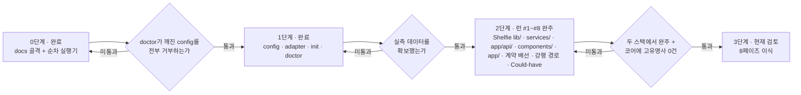
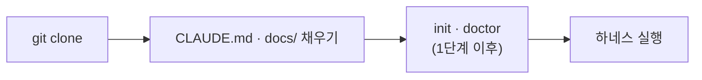

# 하네스 승격 로드맵

> **이 문서의 위치**
> 이 문서는 **템플릿 리포 자신**에 대한 것이다. 클론한 프로젝트가 채우는 `/docs/PRD.md`·`/docs/TRD.md` 등과는 층이 다르다.
> `docs/harness/` 하위는 하네스 자체의 문서이고, `docs/` 직속의 6개 문서는 **프로젝트가 채우는 자리**다.
> 이 리포에서는 그 자리를 파일럿 대상인 Shelfie가 채우고 있다 — 하네스와 파일럿이 한 리포에 사는 이유는 [ADR-H003](DECISIONS.md).
> 프로젝트 작업 중에는 이 폴더를 읽기만 하고 고치지 않는다. 고치는 것은 하네스 작업일 때뿐이다.

---

## 1. 현재 상태 (2단계 — 파일럿 런 #8 완주)

| 계층 | 내용 |
|------|------|
| 문서 골격 | `docs/` 6종 — PRD · TRD · API_SPEC · ARCHITECTURE · ADR · UI_GUIDE. **파일럿 대상(Shelfie)으로 채워져 있다** |
| 가드레일 | `CLAUDE.md` — 각 문서 경로만 참조. CRITICAL 규칙(TDD·Mermaid·API 단일 출처·레이어 경계) |
| 워크플로우 | `.claude/skills/harness/SKILL.md` (doctor → step 설계 → `phases/` 생성 → 실행), `.claude/skills/review/SKILL.md` |
| **계약 계층** | `harness/config.json` · `config.schema.json` · `adapters/{nextjs-ts,_template}.json` + `adapter.schema.json` · `profiles/nextjs-ts/` · `templates/contract.md` |
| 실행기 | `scripts/harness.py` — `init` · `doctor` · `calibrate`. `scripts/execute.py` — 순차 step 실행기, CLI는 `{task-name}` + `--push`. `scripts/backfill_reads.py` — 지난 런의 끌어온 양 사후 집계 |
| 테스트 | `scripts/test_harness.py` (70건) · `scripts/test_execute.py` (163건) |
| 파일럿 | `phases/lib-core/` · `phases/services-core/` · `phases/routes-core/` · `phases/app-core/` 각 5 step · `phases/app-shell/` 6 step · `phases/contract-wiring/` · `phases/forced-path/` · `phases/could-have/` 각 5 step — **여덟 런 41 step 완주.** 기록은 [PILOT-LOG.md](PILOT-LOG.md) |
| 실측 | `harness/calibration.json` — `calibrate` 산출. 정책 4종이 여기서 유도된다 |

`scripts/execute.py`가 하는 일: 브랜치 생성 · 가드레일 주입(CLAUDE.md 상시 + `steps[].docs`가 고른 docs/\*.md, 미지정이면 전량 + 경고 — [ADR-H008](DECISIONS.md)) · 소스 첨부(`steps[].sources` — [ADR-H009](DECISIONS.md)) · summary 컨텍스트 누적 · 자가 교정(상한은 `calibrate`가 유도, 미측정이면 `MAX_RETRIES`가 바닥값) · **2단계 커밋(커밋 범위는 `roles[].owns`에서 유도하고 소유 밖 변경은 커밋하지 않고 드러낸다 — M11)** · 타임스탬프와 `attempts` 기록 · **시도별 실측(`steps[].runs[]`) 기록** · **접두부 분해 기록([ADR-H010](DECISIONS.md))** · **세션이 끌어온 양 기록(트랜스크립트 사후 집계 — [ADR-H011](DECISIONS.md))** · **실행 중 상태(`phases/{phase}/RUNNING`) 관리**.

재개 판정은 **"돌았다"가 아니라 "남겼다"를 본다** — 출력 파일과 죽은 `RUNNING`은 신호일 뿐이고, 소유 경로의 미커밋 변경이나 그 step의 `feat` 커밋이 있어야 재개다 (M13).

`RUNNING`은 관찰자를 위한 계약이다 — `started_at`만으로는 "돌고 있다"와 "죽었다"가 갈리지 않아 감독 세션이 살아 있는 step의 산출물을 지운 적이 있다 ([ADR-H006](DECISIONS.md)).

`scripts/harness.py doctor`가 하는 일: python 런타임 · config·어댑터 스키마 · 어댑터 전제조건 · 러너 바이너리 · 스테이지 명령의 실물 존재 · 역할과 소유 경계 · 계약 절 ↔ 템플릿 일치 · base 브랜치와 원격 · 경로 240자 상한 · 캘리브레이션 상태. 실패는 exit 2로 `/feature` 진입 자체를 막고, 경고는 통과시키되 전부 출력에 드러낸다.

진입점이 둘인 이유와 통합 시점은 [ADR-H003](DECISIONS.md)에 있다.

---

## 2. 결정 — 단계적 승격

목표 파이프라인(스택 비종속 8페이즈 feature-pipeline: `doctor`/`calibrate`/`contract-trace`/리뷰어 라우팅/규칙 원장)은 **한 번에 이식하지 않는다.** 검증을 통과한 계층만 템플릿으로 승격한다.

### 왜 지금 전부 넣지 않는가

1. **실측 없는 상수를 상속하지 않는다.** 목표 파이프라인의 정책(백그라운드 회귀 여부, 타임아웃, 테스트 수 하한)은 전부 실측값의 함수다. 2단계 파일럿이 그 값을 만들었고(`harness/calibration.json`), 실제로 정책 세 개가 실측에서 유도됐다. **그러나 그것은 순차 실행기에서 잰 값이다** — 8페이즈 파이프라인의 스테이지 체인·귀속·리뷰어 호출 비용은 아직 한 번도 재 본 적이 없다. 그 값이 생기기 전에 정책을 상수로 굳히면 근거 없는 숫자를 모든 파생 프로젝트가 물려받는다.
2. **검증 전 승격 금지.** 어댑터의 `verified` 플래그와 같은 원칙이다 — 실제 프로젝트에서 완주시킨 뒤에만 `true`로 올린다. 문서·스크립트에도 같은 규율을 적용한다.
3. **그렇다고 프로젝트마다 하네스를 새로 만들지도 않는다.** 그러면 일반화의 목적이 무너진다. 개선이 축적되지 않고, 고유명사·상수가 매번 다시 박힌다.

### 흔한 오해

"하네스를 템플릿에 넣는 것"과 "프로젝트마다 docs를 먼저 채우는 것"은 **배타적이지 않다.** 목표 파이프라인도 `클론 → init → doctor → 실행`을 전제한다. 두 가지는 동시에 성립하며, 진짜 갈림길은 **"검증 안 된 것을 지금 굳힐 것인가"** 뿐이다.

---

## 3. 3단계 로드맵

| 단계 | 내용 | 승격 조건 | 상태 |
|------|------|-----------|------|
| **0. 골격** | docs 골격 + 단순 순차 실행기 | — | 완료 |
| **1. 계약 계층** | `harness/config.json` · `config.schema.json` · 어댑터 스키마 · `init` · `doctor` | 일부러 깨뜨린 config(역할 소유 겹침 · 계약 절 불일치 · 화이트리스트 밖 러너 등)를 `doctor`가 **전부 거부**하고, 정상 config는 통과 | **완료** — `scripts/test_harness.py`의 거부 8종 + 오탐 검사가 게이트다 |
| **2. 파일럿** | 첫 실제 프로젝트(**Shelfie**)를 **현재 실행기로** 완주. 부족한 지점을 기록 | 스테이지별 실측 시간 · 테스트 개수 · 린트 위반 기준선 확보 | **런 #1~#8 완주** — `lib/`·`services/`·`app/api/`·`components/`·`app/`·계약 배선·강행 경로·Could-have 41 step, 41/41 무재시도. 실측은 [PILOT-LOG.md](PILOT-LOG.md) |
| **3. 8페이즈 승격** | 파일럿 실측을 근거로 목표 파이프라인을 이식 | 두 스택에서 완주 + 코어 파일에 스택 고유명사 grep **0건** | ~5.5일 |

**1단계에서 실제로 회수한 것**: 첫 `doctor` 실행이 어댑터의 `compile` 스테이지가 참조하는 `npm run typecheck`가 `package.json`에 없다는 것을 잡았다(G5). 게이트가 없었다면 첫 파일럿 런이 25분 돌고 나서 드러났을 불일치다.

**1단계가 아직 못 하는 것**: `calibrate`가 없어 타임아웃·백그라운드 회귀 여부·테스트 수 하한이 전부 보수적 기본값이다. 어댑터의 `attribution` 블록은 형태만 있고 소비자가 없다. 역할 에이전트 정의(`.claude/agents/*.md`)도 없다 — `doctor`가 이 셋을 매번 경고로 드러낸다.

**2단계가 회수한 것**: 네 런 모두 자가 교정 재시도 0회로 완주했고 테스트가 64 → **731건**이 됐다. step당 평균은 런 #1(순수 함수) 352초 · 런 #2(외부 API 모킹) 422초 · 런 #3(라우트 통합) 700초 · 런 #4(UI) **606초**로, **소요의 단조 증가는 런 #4에서 멈췄다** — "통합적일수록 비싸다"는 런 #3의 해석은 계층의 깊이가 아니라 한 step이 만나는 계약의 수를 재고 있었다. 대신 step당 산출 테스트가 27~29건대에서 **49.8건**으로 뛰었다 — **테스트 수는 계층 간 비교에 쓸 수 있는 눈금이 아니다.** 재시도율은 **20 step 내내 0**이었다 — `MAX_RETRIES = 3`은 네 런 동안 한 번도 발동하지 않은 장치다. `calibrate`가 정책 3종(백그라운드 회귀 OFF · `full` 타임아웃 300s · 테스트 수 하한 **657**)을 실측에서 유도했고, **`scoped`의 답이 런 #4에서 확정됐다** — 런 #3의 83%가 jsdom이 들어오자 **101%**가 됐다(731건 중 1건 실행, 소요 21.81s vs `full` 21.64s). vitest가 테스트를 건너뛰어도 그 파일의 환경은 세우기 때문이다. `loop_stage`는 이 스택에서 **켜면 손해다.** 하네스 결함은 누적 **11건**이 드러났고 **10건을 고쳤다**(M11은 부분 해결). M10·M11은 런 #4 직후에 닫혔고, M11은 **M10을 실물로 검증하다** 드러났다 — 완주한 phase에 실행기를 다시 돌리자 `_finalize`의 `git add -A`가 미커밋 소스와 상태 파일을 한 커밋에 담고 런 #4의 실측 타임스탬프를 덮었다. 네 런 동안 숨어 있었던 이유는 M6과 같다: step 세션이 매번 스스로 커밋해 그 경로가 no-op이었다. 런 #4의 M10은 `started_at`은 있고 출력 파일은 없는 상태가 "진행 중"과 "죽었음" 양쪽을 뜻해 **관찰자가 둘을 구분할 수 없다**는 것으로, 이번에 감독 세션이 실제로 오독해 살아 있는 step의 산출물을 지운 일이 있다(복구됨). 런 #3의 결론이 한 번 더 확인됐다 — **실행기의 취약점은 작업 품질이 아니라 운영 견고성과 관측 가능성에 있다.** 상세는 [PILOT-LOG.md](PILOT-LOG.md).

**런 #5가 더한 것**: `app-shell` 6 step이 `src/app/page.tsx` 상태 머신과 화면 5종을 얹어 **앱이 처음 업로드에서 추천까지 이어졌고**, 테스트가 731 → **922건**이 됐다. 이 런의 값어치는 코드보다 **런 #4 직후 고친 네 장치가 전부 실물에서 통과했다**는 데 있다 — M7(사용량 한도를 자가 교정으로 오인하지 않는다), M10 `RUNNING`([ADR-H006](DECISIONS.md)), `attempts` 기록([ADR-H007](DECISIONS.md)), 이월 보고 라우팅. 특히 **step 2가 실제로 한도에 걸렸는데 재시도를 한 번도 태우지 않고 `blocked`로 끝났다** — 런 #3에서 같은 일이 재시도 통계를 오염시켰던 바로 그 경로다. 이월 5건은 step 0이 전부 해소했다(세 런째였다). `calibrate` 4회차는 `tests_ran_floor`를 **829**로 올렸고 `scoped`/`full`이 191건 늘어난 뒤에도 **100.2%** — `loop_stage`가 이 스택에서 손해라는 판정이 재확인됐다. `retry_budget`은 여전히 `null`이지만 이유가 바뀌었다: "기록 0 step"이 **"기록 6 step · 미기록 20 step"**이 됐고 `RETRY_RECORD_MIN`(10)까지 4 step 남았다. 새 결함 **3건(M12·M13·M14)**이 드러났고 **M12는 닫혔다**(M13·M14는 남았다) — 셋 다 작업 품질이 아니라 **실측을 기록·보존하는 쪽**이다. 런 직후 26 step 전체를 처음 집계해 **M15**도 드러났다: 청구 토큰의 95.4%가 cache read이고 그 접두부의 86.9%가 가드레일 전량 주입이었다 ([ADR-H008](DECISIONS.md)에서 해결). M14는 M9의 형제였다(`--stage`가 전체를 덮는 것은 고쳤는데 **전체가 부분을 덮는 것**은 남아 있었다). 상세는 [PILOT-LOG.md](PILOT-LOG.md).

**런 #6이 더한 것**: `contract-wiring` 5 step이 23번의 코드 배선 6건을 전부 닫아 **US-003을 빼면 계약과 코드가 처음으로 일치했고**, 테스트가 922 → **1036건**이 됐다. 그러나 이 런의 값어치 절반은 코드가 아니라 **[[ADR-H008]]의 A/B 실측**이다 — 런 #5가 세운 네 지표가 전부 예측한 방향으로 움직였다: 가드레일 문자 **−54.1%**(예측 41%보다 컸다) · turn당 재독 **−26.7%** · step당 비용 **−38.5%** · step당 turn **38.0 → 29.6**(런 #5가 경계한 "문서를 못 찾아 헤매느라 turn이 는다"는 실현되지 않았다). **품질 회귀 0건**이다 — 금지 경로 침범·CRITICAL 위반·새 의존성·레이어 경계·저장소 흔적 전부 0. 다만 **n=1이라 런 #7이 한 번 더 지지해야 한다.** 이 런이 남긴 가장 중요한 줄은 절감폭이 아니라 **절감이 어디서 멈추는가**다: 접두부를 문자 기준 절반으로 줄였는데 turn당 재독은 26.7%만 내려갔고, 역산하면 **turn당 재독의 약 53%만이 접두부이고 나머지 47%는 누적 대화(파일 읽기·도구 결과)**다. **가드레일을 0으로 만들어도 절반까지다** — 남은 절반이 [[ADR-H009]]가 겨눈 곳이고 런 #7이 잰다. 부수로 런 #5가 예약해 둔 "summary 누적 비중이 오르는가"의 답도 나왔다(**오르지 않았다** — 9.4% → 8.6%). 여섯 런 중 처음으로 **막힌 지점·수동 개입·실행기 결함이 0건**이었고, 대신 새로운 종류의 관측이 하나 나왔다: **설계가 틀렸고 워커가 고쳤다.** step 0의 파일이 `retryIndex` 클램프를 불필요하다고 적었는데 실제로는 `MAX_RECOMMEND_ATTEMPTS = 5`가 스키마 상한 4를 넘겨 마지막 재추천이 400으로 튕기는 상태였고, step 세션이 그것을 발견해 두 클램프를 걸고 제거하면 실패하는 테스트로 고정했다. 앞선 다섯 런의 보고는 전부 "설계가 **비워 둔** 것"이었지 "설계가 **틀린** 것"이 아니었다 — 후자는 이월로 처리되지 않고 런 중에 고쳐지지 않으면 계약이 깨진 채 남는다. `calibrate` 5회차는 **`retry_budget`을 `null`에서 처음으로 2로 바꿨다**(기록 11 step · 재시도 0건 · 최대 시도 1회) — [[ADR-H007]]이 런 #4 직후 만든 장치가 두 런 만에 답을 냈고, **기억 → 기록 → 정책**의 세 단계가 완결됐다. `tests_ran_floor`는 932, `scoped`/`full`은 **14.7%**로 M16의 경로 필터 판정이 재현됐다. 상세는 [PILOT-LOG.md](PILOT-LOG.md).

**런 #7이 더한 것**: `forced-path` 5 step이 US-003의 마지막 칸을 실환경에서 닫았고(강행이 이제 첫 모델 호출의 프롬프트까지 간다) 런 #5부터 두 런째 이월되던 UI 부채 2건도 함께 닫혔다. 테스트는 1036 → **1091건**. 그러나 이 런의 값어치는 [[ADR-H009]]의 A/B에 있고, **답이 절반짜리라는 것이 이 런의 성과다.** 기제는 작동했다 — 읽기 turn이 실제로 사라져 **step당 turn이 29.6 → 22.6(−23.6%)** 이 됐고, **접두부 밖 재독이 자·토큰 환산비를 1.2~2.0 어디로 잡아도 줄었다**(−10,667 ~ −31,161토큰/turn). 런 #6의 53%/47% 분해가 "접두부 밖 불변" 가정 위에 있었는데, 이번 런이 그 가정을 깨면서도 같은 방향을 냈다. **그런데 비용은 −0.7%로 제자리다** — 접두부가 113% 늘어(소스 46,302자 + 가드레일 33% 증가) 절감을 그대로 먹었다. **[[ADR-H009]]는 이 구성에서 비용 중립이고, 롤백하지 않는다. 기제가 아니라 예산이 문제다.** 진짜 결론은 구조에 있다: **[[ADR-H008]]과 [[ADR-H009]]가 같은 접두부를 반대 방향으로 당기는데 서로의 상한을 모른다.** step 2가 `sources` 상한 60,000자를 지키고도 접두부 136,986자로 **일곱 런 최대**를 만들었다 — 규칙을 다 지키고 막으려던 상태에 도달한 것이다(아래 28번). 부수로 [[ADR-H008]]의 품질 회귀 0건이 **n=2**가 됐고, `calibrate` 6회차는 `tests_ran_floor`를 981로, `scoped`/`full`을 14.2%로 재현했다. 새 보고는 **0건**으로 일곱 런 중 처음이다 — 다만 계약이 런 전에 전부 정해진 배선 작업이었기 때문이지 성숙의 신호로만 읽을 것은 아니다. 상세는 [PILOT-LOG.md](PILOT-LOG.md).

**런 #8이 더한 것**: `could-have` 5 step이 PRD의 Could-have 3종(알라딘 상품 링크 · 추천 결과 이미지 저장 · 촬영 가이드 시트)을 붙였다. 테스트 1091 → **1183건**. Must·Should가 런 #7에서 전부 닫힌 뒤라 **처음으로 "안 해도 되는 것"을 한 런**이고, 그래서 범위를 올리는 판단이 온전히 런 전 사람 몫이었다. 이 런의 값어치는 [[ADR-H010]]의 열린 질문에 답한 데 있다 — **"첨부는 쓸 파일에 덜 값을 하는가"의 답은 아니오였고, 질문 자체가 틀린 축을 보고 있었다.** 팔 A(쓸 파일 첨부, step 0·2)가 15.0 turn·$2.40, 팔 B(읽을 파일만 첨부, step 3·4)가 33.5 turn·$3.80으로 **접두부가 26% 작은 팔이 58% 비쌌다.** 런을 가로지르는 매칭 쌍이 더 강하다 — 같은 `page.tsx`를 고치며 런 #7 step 4는 첨부하고 27 turn, 런 #8 step 3은 첨부하지 않고 **44 turn**이었다. 그런데 같은 팔 B의 step 4는 23 turn으로 팔 A와 다르지 않았고, 차이는 **직접 읽어야 했던 양**(66,275자 vs 16,334자)이다. **축은 "읽을/쓸"이 아니라 크기다** — 첨부의 값은 *안 첨부했을 때 드는 읽기 turn 수*에 비례한다. 부수로 28번의 방향도 바뀌었다: 접두부를 31.6% 줄였는데 비용은 9.6%만 줄었고 **접두부 최대 step이 두 런 연속 최저 비용**이었다. 예산을 접두부 총량에 거는 것이 답이 아닐 수 있다. 새 결함 **M17** — M11 수정의 첫 실물 사용에서 실행기가 **자기가 쓴 `phases/index.json`을 "소유 밖"이라며 남겼다.** 고쳤고, 남는 값은 **조용한 커밋을 경고로 바꾼 장치가 첫 런에서 자기 버그를 잡았다**는 것이다. 보고는 두 런째 **0건**이고 막힌 지점도 세 런째 없다. 다만 런 전에 사람이 둘을 잡았다 — PRD가 **구현 불가능한 것**("촬영 가이드 오버레이" — `capture` 입력이 시스템 카메라를 연다)을 적고 있었고, `CLAUDE.md`의 한 줄이 **자기모순**이었다("상수는 `env.ts` 한 곳에서만" + "`env.ts`를 클라이언트에 import하지 마라" — 실제로는 클라이언트 파일 12개가 이미 import한다). **틀린 가드레일은 비어 있는 가드레일보다 나쁘다.** 상세는 [PILOT-LOG.md](PILOT-LOG.md).

**어댑터 `verified` 승격은 아직 아니다.** 일곱 런 모두 `execute.py`(순차 실행기)로 돌았고 어댑터의 스테이지 체인·귀속 규칙을 소비하지 않았다. 다만 `calibrate`가 `test_report` 파싱과 스테이지 명령에 이어 런 #3에서 `scoped`의 `select` 문법까지 **실제로 소비했다** — 어댑터에서 검증된 부분이 계속 늘고 있고, 나머지(스테이지 체인·`attribution`)는 04-gate가 생겨야 검증된다.

각 단계의 게이트를 통과하지 못하면 **다음 단계로 넘어가지 않는다.** "일단 넣고 나중에 고친다"는 이 로드맵이 막으려는 실패 자체다.

---

## 4. 프로젝트 시작 순서

**어느 단계에 있든 이 순서는 바뀌지 않는다.**

### 왜 docs가 먼저인가

문서가 하네스 설정의 **입력**이기 때문이다. 순서를 뒤집으면 채울 수 없는 칸이 생긴다.

| 하네스가 알아야 하는 것 | 출처 |
|------------------------|------|
| 어떤 어댑터를 쓸 것인가 (빌드·테스트 명령) | `/docs/TRD.md` 기술 스택 |
| 무엇을 만드는가 (계약의 유닛·진입점) | `/docs/PRD.md` 유저 스토리 · 기능 요구사항 |
| 역할별 소유 경계 glob | `/docs/ARCHITECTURE.md` 디렉토리 구조 · 레이어 의존 관계 |
| 게이트가 검사할 규칙 | `CLAUDE.md` CRITICAL 규칙 |
| 성능·보안 기준선 | `/docs/TRD.md` 비기능 요구사항 |

TRD의 기술 스택이 비어 있으면 어댑터를 고를 수 없고, PRD의 유저 스토리가 없으면 계약을 쓸 수 없다.

---

## 5. 지금 하지 않는 것

| 항목 | 이유 |
|------|------|
| 기존 리포에 하네스를 주입하는 부트스트랩 | 클론 방식을 택했다. 필요해지면 `init --into <path>`로 나중에 |
| git submodule 배치 | 경로 상대화 비용이 이득보다 크다 |
| 어댑터 3종 이상 (pytest · go · cargo) | **실제로 돌려본 것만 동봉한다.** 템플릿과 문서만 둔다 |
| GitLab · Bitbucket 지원 | 두 번째 forge가 실제로 필요해질 때. 지금 만들면 검증 불가 |
| 하네스를 프로젝트 스택 언어로 재작성 | 스택마다 실행기를 다시 만들게 되어 일반화의 목적이 무너진다 |
| 머지 자동화 | 파이프라인의 범위는 PR까지 |

---

## 6. 다음 행동

1~11과 13·15·16·17·18·19·21·22·23·25·27이 완료됐다. `calibrate`가 구현됐고 파일럿 런 #1~#8이 `lib/`·`services/`·`app/api/`·`components/`·`app/`·계약 배선·강행 경로·Could-have를 완주해 **앱이 업로드에서 추천까지 이어졌고 계약과 코드가 일치하며, PRD의 Must·Should·Could가 전부 구현됐다.** **남은 것은 12·14·28이다** — 셋 다 "대상이 없어서" 또는 "표본이 모자라서" 열려 있고, 실행기 결함(M11·M13·M14·M17)은 2026-09-02에 전부 닫혔다. 20·24·26도 닫혔다. **29는 2026-09-02에 닫혔다** — 실행기가 세션이 끌어온 양을 재고, 백필이 지난 여덟 런 41 step을 표본으로 바꿨다([[ADR-H011]]). 28은 그 표본이 방향을 확정했지만 **값은 아직 정하지 않는다.** **13은 답이 뒤집혀 다시 열렸다가 닫혔다**(아래). 런 #4에서 UI_GUIDE의 "Claude 생성 텍스트 블록"과 사실·해석 분리(ADR-002)가 처음 화면에서 시험되어 통과했고, ADR-005(`lookup_failed` ≠ `no_match`)도 문구·색·행동 셋 다 갈렸다.

**런 #4가 11번에서 하지 못한 것**: 런 #3의 보고 3건(알라딘 호출 상한 260회 · 이미지 상수 이중화 · `errorCodeSchema`의 500대 공백)을 "여기서 정리한다"고 적었으나 **하나도 정리되지 않았다.** step 파일 5개가 전부 `src/lib/`·`docs/` 수정을 금지해 **설계 단계에서 이미 불가능해져 있었다.** 아래 15번으로 옮긴다.

12. **3단계 게이트 재검토** — "두 스택에서 완주"의 두 번째 스택(`gradle-java`) 대상 리포가 이 머신에 없다. 게이트를 바꿀지, 대상을 구할지 먼저 정한다
13. ~~**`scoped` 스테이지의 존재 이유를 다시 묻는다**~~ — **답이 뒤집혔다 (M16).** 런 #3·#4·#5는 전부 `-t <테스트 이름>`으로 쟀는데 그 문법은 파일 수집을 줄이지 않는다. **경로 필터로 재니 `full` 대비 14.6%(4.56s vs 31.23s) — 6.8배 싸다.** `loop_stage`는 이 스택에서 **성립한다.** 8페이즈의 `tests_from`은 계약 심볼을 테스트 이름이 아니라 파일 경로로 조립해야 한다 ([ADR-H009](DECISIONS.md)). 아래는 뒤집히기 전의 서술이다 — **런 #4가 답했다.** `full` 대비 83%(런 #3) → **101%**(런 #4, jsdom 이후). vitest가 테스트를 건너뛰어도 파일 환경은 세우므로 선택 실행이 이익을 내지 못한다. **이 스택에서 `loop_stage`는 켜면 손해다** — 8페이즈 스테이지 체인은 이것을 스택별 판정으로 다뤄야 한다
14. 어댑터 `verified: true` 승격은 **04-gate가 어댑터를 실제로 소비한 뒤**다
15. ~~**이월 보고 4건을 받을 step을 명시적으로 배치한다**~~ — **해결. 다만 답이 "배치"가 아니라 "라우팅"이었다.** 소유 경계를 실제로 판정해 보니 4건 중 `main_owned_paths`에 걸리는 것은 2건뿐이었고, `src/lib/**`는 **처음부터 워커 소유라 막힌 적이 없었다** — `main_owned_paths`의 `*.ts`는 `*`가 디렉토리를 넘지 않아 리포 루트만 잡는다. 세 런을 막은 것은 config가 아니라 **step 파일이 워커가 소유한 경로를 습관적으로 금지한 한 줄**이었고, 설계자가 소유를 눈으로 판정했기 때문이다. `SKILL.md`에 보고를 손댈 파일 기준으로 분류하는 절을 넣었고(메인 소유는 사람이 런 전에, 역할 소유는 step이 이름으로 지정받아, 걸치면 문서 먼저), **판정은 `glob_any`로 하라**를 함께 박았다. 메인 소유분 4건은 런 #5 시작 전에 처리했다
16. ~~**M10 — `RUNNING` 파일**~~ — **해결** ([ADR-H006](DECISIONS.md)). 생존 판정을 pid가 아니라 heartbeat로 한다 — **Windows에서 `os.kill(pid, 0)`은 프로세스를 죽이므로** POSIX 관용구를 그대로 옮겼다면 M10 수정이 M10의 사고를 그대로 일으켰을 것이다. 수정 중 M11(`_finalize`의 `git add -A`가 작업 트리 전체를 쓸어담는다)이 드러나 부분 해결했다
17. ~~**`MAX_RETRIES = 3`을 정리한다**~~ — **해결** ([ADR-H007](DECISIONS.md)). 지우지 않고 **바닥값으로 강등**했고 상한은 `calibrate`가 `attempts`에서 유도한다. 핵심은 값이 아니라 **재는 것이 없었다**는 발견이다 — 20 step은 재시도 횟수를 어디에도 남기지 않았고 "재시도 0회"는 콘솔을 지켜본 사람의 기억이었다. 지금 `calibration.json`은 "기록 0 step · 미기록 20 step"이라고 스스로 적는다. 이것이 **실행기가 유도된 정책을 소비하는 첫 사례**이기도 하다

18. ~~**M11의 남은 절반**~~ — **해결 (2026-09-02).** `_commit_step`·`_finalize`의 `git add -A`를 걷어내고, 커밋할 경로를 `config`의 `roles[].owns`에서 유도한다. 판정은 눈이 아니라 `doctor`가 쓰는 `glob_any`로 한다 — 같은 규칙이 두 곳에서 갈라지지 않게 하는 것이 15번이 남긴 교훈이다. **소유 밖 변경은 커밋하지 않고 콘솔에 드러낸다** — 조용히 두면 다음 커밋이 삼킨다. 원래 서술을 남겨 둔다: `_finalize`가 `git add -A`로 커밋한다. **다섯 런째 드러나지 않았다** — step 세션이 매번 스스로 커밋해 작업 트리가 깨끗했기 때문이다. 드러나지 않는다는 것이 안전하다는 뜻은 아니다
19. ~~**파일럿 런 #5 `app-shell` 실행**~~ — **완주**(6/6 · 무재시도 · 한도로 1회 `blocked` 후 재개). `page.tsx` 상태 머신과 화면 5종이 붙어 앱이 처음 끝까지 이어졌고, 세 런째 이월되던 계약 부채 5건도 step 0이 닫았다. 새 결함 M12·M13·M14는 아래 20~22로 옮긴다

20. ~~**M12 — step별 `elapsed_sec`를 `index.json`에 남긴다.**~~ — **해결.** `steps[].runs[]`에 시도마다 `elapsed_sec`·`prompt_chars`·`guardrail_chars`·`cost_usd`·`turns`·`cache_read`를 남긴다. 배열인 것이 요점이다 — 런 #5에서 재개 실행이 `step2-output.json`을 덮어써 한도 중단분의 비용이 사라졌다. 원래 서술을 남겨 둔다: 재개된 step의 `started_at`은 첫 시도 것이라 `completed_at`과의 차가 **대기 시간을 포함한다**(런 #5 step 2: 유도값 3573s vs 실제 520s). [PILOT-LOG](PILOT-LOG.md)의 앞선 네 런 소요는 전부 그 유도값이다 — 재개가 한 번이라도 섞이면 그 방법이 깨진다. **실행기는 맞는 값을 콘솔에 찍고 버린다.** [ADR-H007](DECISIONS.md)이 `attempts`에 한 것과 같은 조치다
21. ~~**M13 — 재개 신호가 "출력 파일 존재"가 아니라 "산출물 존재"를 봐야 한다.**~~ — **해결 (2026-09-02).** 다만 **답이 `exitCode != 0`을 빼는 것이 아니었다.** 그렇게 고치면 런 #3의 형태를 놓친다 — 그때 한도는 세션이 코드·테스트를 다 쓰고 `index.json`을 갱신하기 직전에 떨어졌고, 그 출력 파일도 `exitCode != 0`이다. **"돌았다"와 "남겼다"는 다른 사실이고, 재개가 물어야 하는 것은 후자다.** 그래서 출력 파일·죽은 `RUNNING`은 신호로 두되, 소유 경로의 미커밋 변경이나 그 step의 `feat` 커밋이 있을 때만 재개로 판정한다. 판정할 수 없으면(git이 답하지 못하면) 재개로 본다 — **두 오류의 값이 다르다.** 재개를 놓치면 검증된 산출물이 덮이고, 헛 재개는 안내 한 문단이다. 원래 서술: 25초 만에 한도로 잘려 소스를 한 줄도 못 쓴 step이 다음 실행에서 재개로 판정됐다. 무해했지만 8페이즈 파이프라인은 이 신호로 페이즈 재개를 판정한다
22. ~~**M14 — 전체 `calibrate`가 `scoped`의 기존 실측을 지운다.**~~ — **해결 (2026-09-02).** 요구된 어휘 셋을 `stages[].state`로 만들었다: `absent`(`cmd:null` — 이 스택에 **없는** 것) · `unmeasured`(이번에 못 쟀고 옛 값도 없다 — **모르는** 것) · `stale`(이번에 못 쟀지만 옛 실측이 있다 — **옛** 값, `sec`와 옛 `measured_at`을 보존한다) · `measured`. 옛 값을 쓰는 칸이 있으면 `partial: true`이고 `doctor`가 WARN으로 드러낸다. **실물에서 확인했다** — `--select` 없이 전체 `calibrate`를 돌리자 런 #7의 `scoped` 3.33s가 `stale`로 살아남았고 `partial: true`가 됐다. 고치기 전이라면 `sec: null`로 덮이고 `partial: false`였다. **일곱 런 동안 `--select`로 손수 피해 가던 것이 더는 필요 없다.** 원래 서술: `--select` 없이 돌면 런 #4의 21.81s가 `skipped`로 덮이고, 그런데도 `partial: false`로 적혀 `doctor`가 통과시킨다. **M9의 형제다** — 그때는 부분이 전체를 덮었고 이번은 전체가 부분을 덮는다
24. ~~**M15 — 가드레일 전량 주입**~~ — **해결** ([ADR-H008](DECISIONS.md)). 다섯 런 26 step을 처음 집계하니 청구 토큰 115.6M 중 **cache read가 110.3M(95.4%)** 이고, 그 접두부의 **86.9%가 `CLAUDE.md` + `docs/*.md` 전량 주입**이었다. UI step이 배포 인프라 절을 750 turn 내내 재독한 셈이다. 이제 `steps[].docs`가 문서를 고르고, 미지정이면 전량 주입하되 경고로 드러난다. 런 #5의 step 파일들이 이미 선언한 대로만 넣었다면 문자 기준 **41% 절감**이었다 — **정보는 있었고 실행기가 쓰지 않았다.**

    **런 #6의 A/B가 답했다.** 문자 **−54.1%**(예측 41%를 넘겼다) · turn당 재독 **145,491 → 106,596(−26.7%)** · step당 비용 **$5.61 → $3.45(−38.5%)** · step당 turn **38.0 → 29.6**(늘지 않았다) · **품질 회귀 0건.** step 2가 계약 4종을 만나 전량의 82%를 그대로 실었는데도 총 절감이 예측을 넘었다 — **줄이는 것이 목적인 장치가 아니라는 것이 그 행에서 보인다.** 8페이즈 파이프라인은 접두부에 계약·findings·리뷰어 프롬프트를 더 얹으므로 이 장치는 이식 대상이다. 남은 검증은 **n=1이라는 것 하나**다(런 #7이 두 번째 표본을 준다)

25. ~~**M16 — 읽기 turn이 접두부를 다시 읽게 만든다**~~ — **장치는 해결, 실측은 런 #7이 준다** ([ADR-H009](DECISIONS.md)). 26 step 트랜스크립트를 turn 단위로 분해하니 파일 읽기가 도구 호출의 38%, 컨텍스트 투입의 70.5%였고, **읽기 turn 336회가 유발한 접두부 재독이 전체의 44.0%**였다. `steps[].sources`가 있으면 실행기가 그 파일을 접두부에 싣는다(상한 60,000자, 미지정이면 기존 동작). 런 #6에서는 켜지 않았고(24번의 A/B가 먼저였다) **`source_chars`가 5 step 전부 0인 것으로 그 판단이 지켜졌음이 파일에 남았다.**

    **런 #7이 실측을 줬다 — 기제는 작동했고 순효과는 없다.** 읽기 turn이 실제로 사라져 step당 turn이 **29.6 → 22.6(−23.6%)** 이 됐고, **접두부 밖 재독이 환산비 가정과 무관하게 줄었다**(1.2~2.0자/토큰 어느 가정에서도 −10,667 ~ −31,161토큰/turn). M16의 진단이 맞았다는 뜻이다. **그런데 step당 비용은 −0.7%로 제자리다** — 접두부가 113% 늘어(소스 46,302자 + 가드레일 33% 증가) 절감을 그대로 먹었다. **롤백하지 않는다. 기제가 아니라 예산이 문제이고, 그것이 28번이다**
26. ~~**`scoped` 를 경로 필터로 다시 잰다**~~ — **해결.** 위 13번을 본다. 어댑터의 `select` 4줄을 지운 것이 전부이고 코드 변경은 없었다

23. ~~**런 #6 전에 사람이 고쳐야 하는 계약 4건**~~ — **해결.** 네 건 중 **실제로 빈 것은 세 건**이었고 `book_resolved.matched`는 초기 커밋부터 PRD 표에 있었다(발생 조건만 모호해 불릿 한 줄로 닫았다). 고친 것: 상태도에 `error → recommending`·`error → moodInput`을 넣고 **`error`가 실패 단계를 기억한다**를 프로즈로 못 박았다(전이 22 → 25 — `guidedQuestions` 자기 전이도 리듀서에는 있고 상태도에는 없었다) · `recommendRequestSchema`에 `retryIndex`(0~4)·`irrelevantStreak`(0~2)를 **필수 평면 필드**로 넣어 두 공백을 1:1로 메웠다 · `recommend_failed`를 PRD 7번 표에 신설했다(에러율 + 세션당 비용). **세 건이 하나의 원인에서 나왔다** — 무상태라 서버가 셀 수 없는 값을 요청에 싣지 않아, 세는 쪽(클라이언트)과 판정하는 쪽(서버)이 갈라진 채로 다섯 런을 왔다.

    **계획에 없었으나 함께 고친 것**: PRD 7번 표와 흐름 2 시퀀스가 `recommend_viewed`를 **클라이언트 수집**이라 적고 있었는데 실제로는 `recommend/route.ts:252`가 서버에서 남기고 `page.tsx:330-334`가 의도적으로 보내지 않는다. 런 #6의 step이 바로 그 코드를 고치므로, **틀린 계약을 남겨 두면 워커가 "문서대로" 되돌려 이중 계상을 되살린다.** 비어 있는 문서만 위험한 것이 아니다.

    **코드 배선 6건은 런 #6이 전부 닫았다.** 문서만 고치고 코드를 어디에도 적지 않으면 그것이 15번이 기록한 실패의 원형이었는데, 이번에는 6건을 step에 **이름으로 지정**하고 그 step의 금지사항에서 `src/**`를 뺐다:

    | # | 파일 | 할 일 | 받은 step |
    |---|------|-------|-----------|
    | 1 | `src/lib/schemas.ts` | `recommendRequestSchema`에 `retryIndex`(0~4)·`irrelevantStreak`(0~2) | **0** `request-contract` |
    | 2 | `src/app/api/recommend/route.ts` | 상단 "계약의 공백 두 곳" 주석 삭제 · `irrelevantStreak>=2`면 `relevant:false` 무시 · `retry_index` 실제값 · `warnBurnedTokens` → `record({event:"recommend_failed"})` | **2** `recommend-route` |
    | 3 | `src/lib/analytics.ts` | `AnalyticsEvent` 유니온 + `PROPERTY_KEYS`에 `recommend_failed` (`analyze_failed`가 템플릿) | **1** `analytics-event` |
    | 4 | `src/lib/api-client.ts` · `src/app/page.tsx` | 두 필드 전송 — `retryIndex`는 `state.recommendCount`, `irrelevantStreak`는 `irrelevantCount` | **0** `request-contract` |
    | 5 | `src/lib/session.ts` · `src/app/page.tsx` | `error`가 실패 단계를 기억 + 회복 전이 2개 (상태도 25개 전이 전수 테스트) | **3** `error-recovery` |
    | 6 | `src/components/mood/MoodInput.tsx` | 3회째 강행 경로 (PRD US-003 AC — 지금 도달 불가) | **4** `mood-forced-path` |

    부수 항목(`clientEventSchema`가 아직 `recommend_viewed`를 받는다)도 step 0이 닫았다. **15번이 남긴 교훈이 두 런째 작동했다** — 배정된 8건이 전부 해소됐고 미배정 7건은 `not_assigned_this_run`에 이름으로 적혔다.

    **다만 6번이 화면까지만 닫혔다.** 강행이 서버 라우트와 화면에서만 이뤄지고 **첫 모델 호출에는 반영되지 않는다** — `lib/prompts.ts` 추천 프롬프트 규칙 7이 "relevant가 false면 recommendations를 빈 배열로 둔다"고 지시하므로 실제 응답은 `200 + 빈 배열`일 수 있다. step 2와 step 4가 독립적으로 같은 구멍을 지목했다. **US-003의 마지막 AC가 실환경에서 완결되는 마지막 한 칸이고 27번으로 옮긴다**

27. ~~**파일럿 런 #7 `forced-path`**~~ — **완주**(5/5 · 무재시도 · 중단 0 · 새 보고 0건). **US-003의 마지막 칸이 닫혔다** — 강행이 이제 첫 모델 호출의 프롬프트까지 가고, 서버가 판정을 무시하기로 한 요청이 `200` + 빈 배열로 끝나지 않는다. UI 부채 2건(목록 통합 · 책 단위 재조회)과 FR-010 간격 백오프도 함께 닫혔다. 테스트 1091건. [[ADR-H009]] A/B의 답은 위 25번에 있다 — **기제는 작동했고 예산이 그것을 먹었다.** 아래는 설계 시점의 서술이다.

    **(a) 코드** — 23번 6번이 남긴 마지막 칸을 닫는다: `lib/prompts.ts` 규칙 7을 강행 요청에서 대체하고(step 0), `services/anthropic.ts`의 `RecommendOptions`에 통로를 열고(step 1), `app/api/recommend/route.ts`가 첫 호출부터 그것을 쓴다(step 2). 이어서 런 #5부터 이월된 UI 부채를 닫는다 — `BookList.result`를 `ShelfBook[]`로 넓혀 재검색 승격분을 한 목록에 담고 `onRetryLookup`에 책 인자를 주어 책 단위 재조회에 잇고(step 3), FR-010 재시도 간격 백오프(0→5→15초)를 구현한다(step 4).

    **(b) 실측** — `steps[].sources`를 처음 켠다. 25번의 대조군이 런 #6이다.

    **설계 중 실측 하나가 나왔다**: `sources` 상한 60,000자는 **소스가 아니라 테스트에 먼저 걸린다.** 가장 큰 소스인 `src/services/anthropic.ts`가 38,130자(64%)로 `prompts.ts`(12,371)와 함께 실어도 들어가는데, **`anthropic.test.ts` 하나가 70,189자로 상한을 혼자 넘는다.** 테스트가 소스보다 1.84배 크기 때문이고, `sources`는 큰 모듈에서 사실상 소스 전용이 된다 — **읽기 turn을 없앤다는 전제가 절반만 성립한다.** 런 #7의 A/B는 이것을 알고 해석해야 한다. (첫 초안은 이 수치를 `wc -c`로 재서 틀렸다. 실행기는 문자를 센다 — [[ADR-H009]])

    **런 전에 사람이 고칠 것**: 강행을 모델 호출에 싣는다는 **계약 한 줄**(`docs/API_SPEC.md` 또는 `docs/TRD.md` 7번). 이 줄이 없으면 step이 프롬프트 문구를 지어내고 다음 런이 "문서대로" 되돌린다 — 23번 부수 항목이 기록한 실패 원형이다

28. **접두부에 통합 예산이 필요하다 — 두 결정이 같은 자원을 반대로 당기는데 서로를 모른다.** 런 #7이 드러냈다.

    [[ADR-H008]]은 접두부를 **줄이고**(문서 선택) [[ADR-H009]]는 **늘린다**(소스 첨부). 그런데 가드레일에는 상한이 아예 없고, `sources`의 60,000자 상한은 **소스만의 상한**이다. 그래서 런 #7 step 2는 가드레일 83,760 + 소스 45,355로 **접두부 136,986자** — 일곱 런 최대이자 런 #5 step 5(113,377)보다 크다. **`sources` 상한을 지키고도 그 상한이 막으려던 상태에 도달했다.**

    필요한 것은 **접두부 전체에 걸리는 하나의 예산**이고, 문서 선택과 소스 첨부가 그 아래에서 경쟁해야 한다. 결정으로 굳히려면 예산값의 근거가 필요한데 **지금 표본은 두 런(#6·#7)뿐이다** — 실측 없는 상수를 상속하지 않는다는 이 로드맵의 원칙(2절)이 여기에도 적용된다. 그러므로 지금 정할 것은 값이 아니라 **무엇을 재야 값을 정할 수 있는가**다.

    **런 #8이 이 항목의 방향을 바꿨다 (2026-09-02).** 접두부를 런 #7 대비 **31.6% 줄였는데 비용은 9.6%만** 줄었고, **접두부가 가장 큰 step이 가장 쌌다**(step 0 · 97,638자 · $2.39 · 16 turn). 런 #7 step 2가 이미 같은 모양이었으므로 **두 런 연속으로 "접두부가 크면 비싸다"가 성립하지 않았다.** 그러므로 예산을 **접두부 총량**에 거는 것은 답이 아닐 수 있다 — 걸어야 할 곳은 **"세션이 읽어야 하는데 첨부되지 않은 양"** 이고, 지금 실행기는 그것을 모른다. `sources`(첨부한 것)는 알지만 step이 **직접 읽은 것**은 재지 않는다. **값을 정하기 전에 이 숫자부터 만들어야 한다** — 그것이 이 항목의 다음 작업이다.

    **재는 쪽은 2026-09-02에 만들었다 ([[ADR-H010]]).** 실행기가 접두부를 네 조각으로 분해해 `steps[].runs[]`에 남긴다 — `preamble_chars`(접두부 전체) · `guardrail_chars` · `source_chars` · `context_chars`(누적 summary), 그리고 접두부 **밖**인 `step_body_chars`. 나머지(상용구)는 차로 유도된다. step 시작마다 같은 분해를 콘솔에도 찍는다. **상한은 걸지 않았다** — 걸면 그 순간부터 step 설계가 그 값에 맞춰지고, 그러면 그 값이 옳았는지 잴 표본이 더는 생기지 않는다. 막는 대신 **드러낸다.** 값을 정할 표본은 런 #8부터 쌓인다.

    **나머지 절반도 2026-09-02에 만들었다 ([[ADR-H011]], 아래 29번).** 41 step 백필이 이 항목의 방향 전환을 숫자로 확정했다 — **끌어온 양 ↔ 비용 r = 0.752**(n=15) vs **접두부 ↔ 비용 r = 0.040**(n=5). 세 런의 인상이 아니라 상관계수로 갈렸다. **그러므로 이 항목이 찾던 "하나의 예산"은 접두부 총량에 거는 것이 아니다.** 다만 관계는 결정적이지 않다(r=0.75이지 0.95가 아니다) — 끌어온 양이 79,860자인데 22 turn·$3.64로 끝난 step(런 #7 `booklist-props`)과 79,679자에 44 turn·$4.09가 든 step(런 #6 `request-contract`)이 같이 있다. **값은 아직 정하지 않는다.** 다음은 이 눈금이 여러 런에서 무엇을 예측하는지 보는 것이고, 그때까지 상한은 없다.

    ~~함께 볼 열린 질문 — 첨부는 읽을 파일에 값을 하고 쓸 파일에는 덜 하는가~~ — **런 #8이 답했다: 아니다, 그리고 질문이 틀린 축을 보고 있었다.** 팔 A(쓸 파일 첨부)가 15.0 turn·$2.40, 팔 B(읽을 파일만 첨부)가 33.5 turn·$3.80이었고, 같은 `page.tsx`를 두고 첨부한 런 #7 step 4(27 turn)와 첨부하지 않은 런 #8 step 3(44 turn)이 같은 방향을 냈다. **축은 크기다** — 첨부의 값은 *안 첨부했을 때 드는 읽기 turn 수*에 비례한다. 상세는 [[ADR-H010]]

29. ~~**실행기가 "세션이 직접 읽은 양"을 재야 한다.**~~ — **해결 (2026-09-02, [[ADR-H011]]).** 실행기가 step 세션의 트랜스크립트를 `session_id`로 찾아 `runs[]`에 `tool_result_chars` · `tool_result_count` · `tool_output_chars` · `tool_calls` · `session_id`를 남긴다. `scripts/backfill_reads.py`가 지난 여덟 런 **41/41 step을 사후 집계**해 표본이 런 #9를 기다리지 않고 지금 생겼다. 원래 서술을 남겨 둔다.

    **백필이 28번에 준 답**: 끌어온 양 ↔ 비용 **r = 0.752**(n=15)인데 접두부 ↔ 비용은 **r = 0.040**(n=5)이다. **예산을 걸 곳은 접두부가 아니라 여기다.** 부수로 [[ADR-H009]]의 기제가 이 눈금에서 처음 보였다 — `sources`를 켠 런(#7·#8)의 step당 끌어온 양이 33,440자로, 안 켠 런(#1~#6)의 52,622자보다 **36.4% 작다**(작업 성격이 교란 변수이므로 방향만 읽는다). **상한은 이번에도 걸지 않았다** — [[ADR-H010]]과 같은 이유다.

    원래 서술: 28번의 예산값을 정하려면 접두부(첨부한 것)만으로는 부족하다. 런 #8의 네 step을 가른 변수는 **첨부되지 않아 세션이 직접 읽어야 했던 양**이었는데(66,275자 → 44 turn · 16,334자 → 23 turn), 실행기는 그 숫자를 모른다. `sources`는 알고 `preamble_chars`도 알지만, step이 무엇을 몇 자 읽었는지는 기록하지 않는다. **재지 않는 것을 근거로 상수를 정할 수 없다** — [[ADR-H007]]이 `MAX_RETRIES`에서, [[ADR-H010]]이 접두부에서 각각 같은 자리를 지났다. 트랜스크립트에 있는 값이므로 사후 집계는 가능하고, 실행기가 `runs[]`에 남기게 하는 것이 다음 작업이다

결정 기록은 [DECISIONS.md](DECISIONS.md)를 본다.
