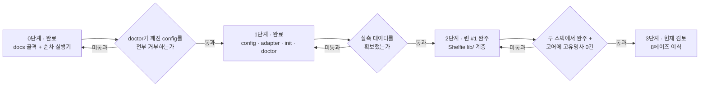

# 하네스 승격 로드맵

> **이 문서의 위치**
> 이 문서는 **템플릿 리포 자신**에 대한 것이다. 클론한 프로젝트가 채우는 `/docs/PRD.md`·`/docs/TRD.md` 등과는 층이 다르다.
> `docs/harness/` 하위는 하네스 자체의 문서이고, `docs/` 직속의 6개 문서는 **프로젝트가 채우는 자리**다.
> 이 리포에서는 그 자리를 파일럿 대상인 Shelfie가 채우고 있다 — 하네스와 파일럿이 한 리포에 사는 이유는 [ADR-H003](DECISIONS.md).
> 프로젝트 작업 중에는 이 폴더를 읽기만 하고 고치지 않는다. 고치는 것은 하네스 작업일 때뿐이다.

---

## 1. 현재 상태 (2단계 — 파일럿 런 #1 완주)

| 계층 | 내용 |
|------|------|
| 문서 골격 | `docs/` 6종 — PRD · TRD · API_SPEC · ARCHITECTURE · ADR · UI_GUIDE. **파일럿 대상(Shelfie)으로 채워져 있다** |
| 가드레일 | `CLAUDE.md` — 각 문서 경로만 참조. CRITICAL 규칙(TDD·Mermaid·API 단일 출처·레이어 경계) |
| 워크플로우 | `.claude/skills/harness/SKILL.md` (doctor → step 설계 → `phases/` 생성 → 실행), `.claude/skills/review/SKILL.md` |
| **계약 계층** | `harness/config.json` · `config.schema.json` · `adapters/{nextjs-ts,_template}.json` + `adapter.schema.json` · `profiles/nextjs-ts/` · `templates/contract.md` |
| 실행기 | `scripts/harness.py` — `init` · `doctor`. `scripts/execute.py` — 순차 step 실행기 417줄, CLI는 `{task-name}` + `--push` |
| 테스트 | `scripts/test_harness.py` (34건) · `scripts/test_execute.py` (52건) |
| 파일럿 | `phases/lib-core/` 5 step · 기록은 [PILOT-LOG.md](PILOT-LOG.md) |

`scripts/execute.py`가 하는 일: 브랜치 생성 · 가드레일 주입(CLAUDE.md + docs/\*.md) · summary 컨텍스트 누적 · 실패 시 3회 자가 교정 · 2단계 커밋 · 타임스탬프 기록.

`scripts/harness.py doctor`가 하는 일: python 런타임 · config·어댑터 스키마 · 어댑터 전제조건 · 러너 바이너리 · 스테이지 명령의 실물 존재 · 역할과 소유 경계 · 계약 절 ↔ 템플릿 일치 · base 브랜치와 원격 · 경로 240자 상한 · 캘리브레이션 상태. 실패는 exit 2로 `/feature` 진입 자체를 막고, 경고는 통과시키되 전부 출력에 드러낸다.

진입점이 둘인 이유와 통합 시점은 [ADR-H003](DECISIONS.md)에 있다.

---

## 2. 결정 — 단계적 승격

목표 파이프라인(스택 비종속 8페이즈 feature-pipeline: `doctor`/`calibrate`/`contract-trace`/리뷰어 라우팅/규칙 원장)은 **한 번에 이식하지 않는다.** 검증을 통과한 계층만 템플릿으로 승격한다.

### 왜 지금 전부 넣지 않는가

1. **실측 없는 상수를 상속하지 않는다.** 목표 파이프라인의 정책(백그라운드 회귀 여부, 타임아웃, 테스트 수 하한)은 전부 실측값의 함수다. `docs/`는 이제 Shelfie로 채워졌지만 파이프라인은 아직 **한 번도 완주한 적이 없다** — 스테이지별 실측 시간도, 테스트 수 기준선도 없다. 그 값이 생기기 전에 정책을 상수로 굳히면 근거 없는 숫자를 모든 파생 프로젝트가 물려받는다.
2. **검증 전 승격 금지.** 어댑터의 `verified` 플래그와 같은 원칙이다 — 실제 프로젝트에서 완주시킨 뒤에만 `true`로 올린다. 문서·스크립트에도 같은 규율을 적용한다.
3. **그렇다고 프로젝트마다 하네스를 새로 만들지도 않는다.** 그러면 일반화의 목적이 무너진다. 개선이 축적되지 않고, 고유명사·상수가 매번 다시 박힌다.

### 흔한 오해

"하네스를 템플릿에 넣는 것"과 "프로젝트마다 docs를 먼저 채우는 것"은 **배타적이지 않다.** 목표 파이프라인도 `클론 → init → doctor → 실행`을 전제한다. 두 가지는 동시에 성립하며, 진짜 갈림길은 **"검증 안 된 것을 지금 굳힐 것인가"** 뿐이다.

---

## 3. 3단계 로드맵

| 단계 | 내용 | 승격 조건 | 상태 |
|------|------|-----------|------|
| **0. 골격** | docs 골격 + 단순 순차 실행기 | — | 완료 |
| **1. 계약 계층** | `harness/config.json` · `config.schema.json` · 어댑터 스키마 · `init` · `doctor` | 일부러 깨뜨린 config(역할 소유 겹침 · 계약 절 불일치 · 화이트리스트 밖 러너 등)를 `doctor`가 **전부 거부**하고, 정상 config는 통과 | **완료** — `scripts/test_harness.py`의 거부 8종 + 오탐 검사가 게이트다 |
| **2. 파일럿** | 첫 실제 프로젝트(**Shelfie**)를 **현재 실행기로** 완주. 부족한 지점을 기록 | 스테이지별 실측 시간 · 테스트 개수 · 린트 위반 기준선 확보 | **런 #1 완주** — `lib/` 계층 5개 모듈, 5/5 무재시도. 실측은 [PILOT-LOG.md](PILOT-LOG.md) |
| **3. 8페이즈 승격** | 파일럿 실측을 근거로 목표 파이프라인을 이식 | 두 스택에서 완주 + 코어 파일에 스택 고유명사 grep **0건** | ~5.5일 |

**1단계에서 실제로 회수한 것**: 첫 `doctor` 실행이 어댑터의 `compile` 스테이지가 참조하는 `npm run typecheck`가 `package.json`에 없다는 것을 잡았다(G5). 게이트가 없었다면 첫 파일럿 런이 25분 돌고 나서 드러났을 불일치다.

**1단계가 아직 못 하는 것**: `calibrate`가 없어 타임아웃·백그라운드 회귀 여부·테스트 수 하한이 전부 보수적 기본값이다. 어댑터의 `attribution` 블록은 형태만 있고 소비자가 없다. 역할 에이전트 정의(`.claude/agents/*.md`)도 없다 — `doctor`가 이 셋을 매번 경고로 드러낸다.

**2단계 런 #1이 회수한 것**: step당 230~425초(평균 352초)·재시도 0회, 테스트 64 → 203건, 어댑터 스테이지 5종 실측(`full` 4.7s → 백그라운드 회귀 **불필요**로 판정, 타임아웃 1800 → 300 근거 확보). 하네스 결함 3건이 드러났고 2건을 고쳤다. 상세와 미해결 항목은 [PILOT-LOG.md](PILOT-LOG.md).

**어댑터 `verified` 승격은 아직 아니다.** 런 #1은 `execute.py`(순차 실행기)로 돌았고 어댑터의 스테이지 체인·귀속 규칙·`test_report` 파싱을 하나도 소비하지 않았다. 어댑터가 검증된 것이 아니라 그 안의 명령들이 손으로 확인된 것뿐이다.

각 단계의 게이트를 통과하지 못하면 **다음 단계로 넘어가지 않는다.** "일단 넣고 나중에 고친다"는 이 로드맵이 막으려는 실패 자체다.

---

## 4. 프로젝트 시작 순서

**어느 단계에 있든 이 순서는 바뀌지 않는다.**

### 왜 docs가 먼저인가

문서가 하네스 설정의 **입력**이기 때문이다. 순서를 뒤집으면 채울 수 없는 칸이 생긴다.

| 하네스가 알아야 하는 것 | 출처 |
|------------------------|------|
| 어떤 어댑터를 쓸 것인가 (빌드·테스트 명령) | `/docs/TRD.md` 기술 스택 |
| 무엇을 만드는가 (계약의 유닛·진입점) | `/docs/PRD.md` 유저 스토리 · 기능 요구사항 |
| 역할별 소유 경계 glob | `/docs/ARCHITECTURE.md` 디렉토리 구조 · 레이어 의존 관계 |
| 게이트가 검사할 규칙 | `CLAUDE.md` CRITICAL 규칙 |
| 성능·보안 기준선 | `/docs/TRD.md` 비기능 요구사항 |

TRD의 기술 스택이 비어 있으면 어댑터를 고를 수 없고, PRD의 유저 스토리가 없으면 계약을 쓸 수 없다.

---

## 5. 지금 하지 않는 것

| 항목 | 이유 |
|------|------|
| 기존 리포에 하네스를 주입하는 부트스트랩 | 클론 방식을 택했다. 필요해지면 `init --into <path>`로 나중에 |
| git submodule 배치 | 경로 상대화 비용이 이득보다 크다 |
| 어댑터 3종 이상 (pytest · go · cargo) | **실제로 돌려본 것만 동봉한다.** 템플릿과 문서만 둔다 |
| GitLab · Bitbucket 지원 | 두 번째 forge가 실제로 필요해질 때. 지금 만들면 검증 불가 |
| 하네스를 프로젝트 스택 언어로 재작성 | 스택마다 실행기를 다시 만들게 되어 일반화의 목적이 무너진다 |
| 머지 자동화 | 파이프라인의 범위는 PR까지 |

---

## 6. 다음 행동

1~4는 완료됐다. 파일럿 런 #1이 `lib/` 계층 5개 모듈을 완주했고 실측은 [PILOT-LOG.md](PILOT-LOG.md)에 있다.

5. **`calibrate` 구현** — 런 #1의 수동 실측(`compile` 2.5s · `lint` 5.7s · `check` 2.2s · `full` 4.7s · `build` 7.1s)이 그대로 `harness/calibration.json`의 첫 내용이다. 이제 근거가 있으므로 상수를 함수로 바꿀 수 있다
6. **파일럿 런 #2** — `services/`·`app/api/` 계층(TR-003·TR-004·TR-006). 외부 API 모킹이 들어갈 때 step 소요와 재시도율이 어떻게 변하는지가 미지수다. `scoped` 스테이지도 그때 실측한다
7. **3단계 게이트 재검토** — "두 스택에서 완주"의 두 번째 스택(`gradle-java`) 대상 리포가 이 머신에 없다. 게이트를 바꿀지, 대상을 구할지 먼저 정한다
8. 어댑터 `verified: true` 승격은 **04-gate가 어댑터를 실제로 소비한 뒤**다 (런 #1은 소비하지 않았다)

결정 기록은 [DECISIONS.md](DECISIONS.md)를 본다.
