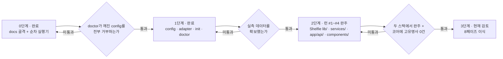

# 하네스 승격 로드맵

> **이 문서의 위치**
> 이 문서는 **템플릿 리포 자신**에 대한 것이다. 클론한 프로젝트가 채우는 `/docs/PRD.md`·`/docs/TRD.md` 등과는 층이 다르다.
> `docs/harness/` 하위는 하네스 자체의 문서이고, `docs/` 직속의 6개 문서는 **프로젝트가 채우는 자리**다.
> 이 리포에서는 그 자리를 파일럿 대상인 Shelfie가 채우고 있다 — 하네스와 파일럿이 한 리포에 사는 이유는 [ADR-H003](DECISIONS.md).
> 프로젝트 작업 중에는 이 폴더를 읽기만 하고 고치지 않는다. 고치는 것은 하네스 작업일 때뿐이다.

---

## 1. 현재 상태 (2단계 — 파일럿 런 #4 완주)

| 계층 | 내용 |
|------|------|
| 문서 골격 | `docs/` 6종 — PRD · TRD · API_SPEC · ARCHITECTURE · ADR · UI_GUIDE. **파일럿 대상(Shelfie)으로 채워져 있다** |
| 가드레일 | `CLAUDE.md` — 각 문서 경로만 참조. CRITICAL 규칙(TDD·Mermaid·API 단일 출처·레이어 경계) |
| 워크플로우 | `.claude/skills/harness/SKILL.md` (doctor → step 설계 → `phases/` 생성 → 실행), `.claude/skills/review/SKILL.md` |
| **계약 계층** | `harness/config.json` · `config.schema.json` · `adapters/{nextjs-ts,_template}.json` + `adapter.schema.json` · `profiles/nextjs-ts/` · `templates/contract.md` |
| 실행기 | `scripts/harness.py` — `init` · `doctor` · `calibrate`. `scripts/execute.py` — 순차 step 실행기, CLI는 `{task-name}` + `--push` |
| 테스트 | `scripts/test_harness.py` (65건) · `scripts/test_execute.py` (92건) |
| 파일럿 | `phases/lib-core/` · `phases/services-core/` · `phases/routes-core/` · `phases/app-core/` 각 5 step 완주 · `phases/app-shell/` 6 step 설계됨 · 기록은 [PILOT-LOG.md](PILOT-LOG.md) |
| 실측 | `harness/calibration.json` — `calibrate` 산출. 정책 4종이 여기서 유도된다 |

`scripts/execute.py`가 하는 일: 브랜치 생성 · 가드레일 주입(CLAUDE.md + docs/\*.md) · summary 컨텍스트 누적 · 자가 교정(상한은 `calibrate`가 유도, 미측정이면 `MAX_RETRIES`가 바닥값) · 2단계 커밋 · 타임스탬프와 `attempts` 기록 · **실행 중 상태(`phases/{phase}/RUNNING`) 관리**.

`RUNNING`은 관찰자를 위한 계약이다 — `started_at`만으로는 "돌고 있다"와 "죽었다"가 갈리지 않아 감독 세션이 살아 있는 step의 산출물을 지운 적이 있다 ([ADR-H006](DECISIONS.md)).

`scripts/harness.py doctor`가 하는 일: python 런타임 · config·어댑터 스키마 · 어댑터 전제조건 · 러너 바이너리 · 스테이지 명령의 실물 존재 · 역할과 소유 경계 · 계약 절 ↔ 템플릿 일치 · base 브랜치와 원격 · 경로 240자 상한 · 캘리브레이션 상태. 실패는 exit 2로 `/feature` 진입 자체를 막고, 경고는 통과시키되 전부 출력에 드러낸다.

진입점이 둘인 이유와 통합 시점은 [ADR-H003](DECISIONS.md)에 있다.

---

## 2. 결정 — 단계적 승격

목표 파이프라인(스택 비종속 8페이즈 feature-pipeline: `doctor`/`calibrate`/`contract-trace`/리뷰어 라우팅/규칙 원장)은 **한 번에 이식하지 않는다.** 검증을 통과한 계층만 템플릿으로 승격한다.

### 왜 지금 전부 넣지 않는가

1. **실측 없는 상수를 상속하지 않는다.** 목표 파이프라인의 정책(백그라운드 회귀 여부, 타임아웃, 테스트 수 하한)은 전부 실측값의 함수다. 2단계 파일럿이 그 값을 만들었고(`harness/calibration.json`), 실제로 정책 세 개가 실측에서 유도됐다. **그러나 그것은 순차 실행기에서 잰 값이다** — 8페이즈 파이프라인의 스테이지 체인·귀속·리뷰어 호출 비용은 아직 한 번도 재 본 적이 없다. 그 값이 생기기 전에 정책을 상수로 굳히면 근거 없는 숫자를 모든 파생 프로젝트가 물려받는다.
2. **검증 전 승격 금지.** 어댑터의 `verified` 플래그와 같은 원칙이다 — 실제 프로젝트에서 완주시킨 뒤에만 `true`로 올린다. 문서·스크립트에도 같은 규율을 적용한다.
3. **그렇다고 프로젝트마다 하네스를 새로 만들지도 않는다.** 그러면 일반화의 목적이 무너진다. 개선이 축적되지 않고, 고유명사·상수가 매번 다시 박힌다.

### 흔한 오해

"하네스를 템플릿에 넣는 것"과 "프로젝트마다 docs를 먼저 채우는 것"은 **배타적이지 않다.** 목표 파이프라인도 `클론 → init → doctor → 실행`을 전제한다. 두 가지는 동시에 성립하며, 진짜 갈림길은 **"검증 안 된 것을 지금 굳힐 것인가"** 뿐이다.

---

## 3. 3단계 로드맵

| 단계 | 내용 | 승격 조건 | 상태 |
|------|------|-----------|------|
| **0. 골격** | docs 골격 + 단순 순차 실행기 | — | 완료 |
| **1. 계약 계층** | `harness/config.json` · `config.schema.json` · 어댑터 스키마 · `init` · `doctor` | 일부러 깨뜨린 config(역할 소유 겹침 · 계약 절 불일치 · 화이트리스트 밖 러너 등)를 `doctor`가 **전부 거부**하고, 정상 config는 통과 | **완료** — `scripts/test_harness.py`의 거부 8종 + 오탐 검사가 게이트다 |
| **2. 파일럿** | 첫 실제 프로젝트(**Shelfie**)를 **현재 실행기로** 완주. 부족한 지점을 기록 | 스테이지별 실측 시간 · 테스트 개수 · 린트 위반 기준선 확보 | **런 #1~#4 완주** — `lib/`·`services/`·`app/api/`·`components/` 각 5 step, 20/20 무재시도. 실측은 [PILOT-LOG.md](PILOT-LOG.md) |
| **3. 8페이즈 승격** | 파일럿 실측을 근거로 목표 파이프라인을 이식 | 두 스택에서 완주 + 코어 파일에 스택 고유명사 grep **0건** | ~5.5일 |

**1단계에서 실제로 회수한 것**: 첫 `doctor` 실행이 어댑터의 `compile` 스테이지가 참조하는 `npm run typecheck`가 `package.json`에 없다는 것을 잡았다(G5). 게이트가 없었다면 첫 파일럿 런이 25분 돌고 나서 드러났을 불일치다.

**1단계가 아직 못 하는 것**: `calibrate`가 없어 타임아웃·백그라운드 회귀 여부·테스트 수 하한이 전부 보수적 기본값이다. 어댑터의 `attribution` 블록은 형태만 있고 소비자가 없다. 역할 에이전트 정의(`.claude/agents/*.md`)도 없다 — `doctor`가 이 셋을 매번 경고로 드러낸다.

**2단계가 회수한 것**: 네 런 모두 자가 교정 재시도 0회로 완주했고 테스트가 64 → **731건**이 됐다. step당 평균은 런 #1(순수 함수) 352초 · 런 #2(외부 API 모킹) 422초 · 런 #3(라우트 통합) 700초 · 런 #4(UI) **606초**로, **소요의 단조 증가는 런 #4에서 멈췄다** — "통합적일수록 비싸다"는 런 #3의 해석은 계층의 깊이가 아니라 한 step이 만나는 계약의 수를 재고 있었다. 대신 step당 산출 테스트가 27~29건대에서 **49.8건**으로 뛰었다 — **테스트 수는 계층 간 비교에 쓸 수 있는 눈금이 아니다.** 재시도율은 **20 step 내내 0**이었다 — `MAX_RETRIES = 3`은 네 런 동안 한 번도 발동하지 않은 장치다. `calibrate`가 정책 3종(백그라운드 회귀 OFF · `full` 타임아웃 300s · 테스트 수 하한 **657**)을 실측에서 유도했고, **`scoped`의 답이 런 #4에서 확정됐다** — 런 #3의 83%가 jsdom이 들어오자 **101%**가 됐다(731건 중 1건 실행, 소요 21.81s vs `full` 21.64s). vitest가 테스트를 건너뛰어도 그 파일의 환경은 세우기 때문이다. `loop_stage`는 이 스택에서 **켜면 손해다.** 하네스 결함은 누적 **11건**이 드러났고 **10건을 고쳤다**(M11은 부분 해결). M10·M11은 런 #4 직후에 닫혔고, M11은 **M10을 실물로 검증하다** 드러났다 — 완주한 phase에 실행기를 다시 돌리자 `_finalize`의 `git add -A`가 미커밋 소스와 상태 파일을 한 커밋에 담고 런 #4의 실측 타임스탬프를 덮었다. 네 런 동안 숨어 있었던 이유는 M6과 같다: step 세션이 매번 스스로 커밋해 그 경로가 no-op이었다. 런 #4의 M10은 `started_at`은 있고 출력 파일은 없는 상태가 "진행 중"과 "죽었음" 양쪽을 뜻해 **관찰자가 둘을 구분할 수 없다**는 것으로, 이번에 감독 세션이 실제로 오독해 살아 있는 step의 산출물을 지운 일이 있다(복구됨). 런 #3의 결론이 한 번 더 확인됐다 — **실행기의 취약점은 작업 품질이 아니라 운영 견고성과 관측 가능성에 있다.** 상세는 [PILOT-LOG.md](PILOT-LOG.md).

**어댑터 `verified` 승격은 아직 아니다.** 세 런 모두 `execute.py`(순차 실행기)로 돌았고 어댑터의 스테이지 체인·귀속 규칙을 소비하지 않았다. 다만 `calibrate`가 `test_report` 파싱과 스테이지 명령에 이어 런 #3에서 `scoped`의 `select` 문법까지 **실제로 소비했다** — 어댑터에서 검증된 부분이 계속 늘고 있고, 나머지(스테이지 체인·`attribution`)는 04-gate가 생겨야 검증된다.

각 단계의 게이트를 통과하지 못하면 **다음 단계로 넘어가지 않는다.** "일단 넣고 나중에 고친다"는 이 로드맵이 막으려는 실패 자체다.

---

## 4. 프로젝트 시작 순서

**어느 단계에 있든 이 순서는 바뀌지 않는다.**

### 왜 docs가 먼저인가

문서가 하네스 설정의 **입력**이기 때문이다. 순서를 뒤집으면 채울 수 없는 칸이 생긴다.

| 하네스가 알아야 하는 것 | 출처 |
|------------------------|------|
| 어떤 어댑터를 쓸 것인가 (빌드·테스트 명령) | `/docs/TRD.md` 기술 스택 |
| 무엇을 만드는가 (계약의 유닛·진입점) | `/docs/PRD.md` 유저 스토리 · 기능 요구사항 |
| 역할별 소유 경계 glob | `/docs/ARCHITECTURE.md` 디렉토리 구조 · 레이어 의존 관계 |
| 게이트가 검사할 규칙 | `CLAUDE.md` CRITICAL 규칙 |
| 성능·보안 기준선 | `/docs/TRD.md` 비기능 요구사항 |

TRD의 기술 스택이 비어 있으면 어댑터를 고를 수 없고, PRD의 유저 스토리가 없으면 계약을 쓸 수 없다.

---

## 5. 지금 하지 않는 것

| 항목 | 이유 |
|------|------|
| 기존 리포에 하네스를 주입하는 부트스트랩 | 클론 방식을 택했다. 필요해지면 `init --into <path>`로 나중에 |
| git submodule 배치 | 경로 상대화 비용이 이득보다 크다 |
| 어댑터 3종 이상 (pytest · go · cargo) | **실제로 돌려본 것만 동봉한다.** 템플릿과 문서만 둔다 |
| GitLab · Bitbucket 지원 | 두 번째 forge가 실제로 필요해질 때. 지금 만들면 검증 불가 |
| 하네스를 프로젝트 스택 언어로 재작성 | 스택마다 실행기를 다시 만들게 되어 일반화의 목적이 무너진다 |
| 머지 자동화 | 파이프라인의 범위는 PR까지 |

---

## 6. 다음 행동

1~11과 13·15·16·17이 완료됐다. `calibrate`가 구현됐고 파일럿 런 #1~#4가 `lib/`·`services/`·`app/api/`·`components/` 계층을 완주했다. **남은 것은 12·14·18·19다.** 런 #4에서 UI_GUIDE의 "Claude 생성 텍스트 블록"과 사실·해석 분리(ADR-002)가 처음 화면에서 시험되어 통과했고, ADR-005(`lookup_failed` ≠ `no_match`)도 문구·색·행동 셋 다 갈렸다.

**런 #4가 11번에서 하지 못한 것**: 런 #3의 보고 3건(알라딘 호출 상한 260회 · 이미지 상수 이중화 · `errorCodeSchema`의 500대 공백)을 "여기서 정리한다"고 적었으나 **하나도 정리되지 않았다.** step 파일 5개가 전부 `src/lib/`·`docs/` 수정을 금지해 **설계 단계에서 이미 불가능해져 있었다.** 아래 15번으로 옮긴다.

12. **3단계 게이트 재검토** — "두 스택에서 완주"의 두 번째 스택(`gradle-java`) 대상 리포가 이 머신에 없다. 게이트를 바꿀지, 대상을 구할지 먼저 정한다
13. ~~**`scoped` 스테이지의 존재 이유를 다시 묻는다**~~ — **런 #4가 답했다.** `full` 대비 83%(런 #3) → **101%**(런 #4, jsdom 이후). vitest가 테스트를 건너뛰어도 파일 환경은 세우므로 선택 실행이 이익을 내지 못한다. **이 스택에서 `loop_stage`는 켜면 손해다** — 8페이즈 스테이지 체인은 이것을 스택별 판정으로 다뤄야 한다
14. 어댑터 `verified: true` 승격은 **04-gate가 어댑터를 실제로 소비한 뒤**다
15. ~~**이월 보고 4건을 받을 step을 명시적으로 배치한다**~~ — **해결. 다만 답이 "배치"가 아니라 "라우팅"이었다.** 소유 경계를 실제로 판정해 보니 4건 중 `main_owned_paths`에 걸리는 것은 2건뿐이었고, `src/lib/**`는 **처음부터 워커 소유라 막힌 적이 없었다** — `main_owned_paths`의 `*.ts`는 `*`가 디렉토리를 넘지 않아 리포 루트만 잡는다. 세 런을 막은 것은 config가 아니라 **step 파일이 워커가 소유한 경로를 습관적으로 금지한 한 줄**이었고, 설계자가 소유를 눈으로 판정했기 때문이다. `SKILL.md`에 보고를 손댈 파일 기준으로 분류하는 절을 넣었고(메인 소유는 사람이 런 전에, 역할 소유는 step이 이름으로 지정받아, 걸치면 문서 먼저), **판정은 `glob_any`로 하라**를 함께 박았다. 메인 소유분 4건은 런 #5 시작 전에 처리했다
16. ~~**M10 — `RUNNING` 파일**~~ — **해결** ([ADR-H006](DECISIONS.md)). 생존 판정을 pid가 아니라 heartbeat로 한다 — **Windows에서 `os.kill(pid, 0)`은 프로세스를 죽이므로** POSIX 관용구를 그대로 옮겼다면 M10 수정이 M10의 사고를 그대로 일으켰을 것이다. 수정 중 M11(`_finalize`의 `git add -A`가 작업 트리 전체를 쓸어담는다)이 드러나 부분 해결했다
17. ~~**`MAX_RETRIES = 3`을 정리한다**~~ — **해결** ([ADR-H007](DECISIONS.md)). 지우지 않고 **바닥값으로 강등**했고 상한은 `calibrate`가 `attempts`에서 유도한다. 핵심은 값이 아니라 **재는 것이 없었다**는 발견이다 — 20 step은 재시도 횟수를 어디에도 남기지 않았고 "재시도 0회"는 콘솔을 지켜본 사람의 기억이었다. 지금 `calibration.json`은 "기록 0 step · 미기록 20 step"이라고 스스로 적는다. 이것이 **실행기가 유도된 정책을 소비하는 첫 사례**이기도 하다

18. **M11의 남은 절반** — `_finalize`가 `git add -A`로 커밋한다. 실행기가 커밋할 경로는 소유 glob에서 유도되어야 한다. 파일럿 네 런에서는 step 세션이 매번 스스로 커밋해 작업 트리가 깨끗했기 때문에 숨어 있었다
19. **파일럿 런 #5 `app-shell` 실행** — `phases/app-shell/`에 6 step이 설계돼 있다. `src/app/page.tsx` 상태 머신과 화면 5종(TR-011의 나머지)

결정 기록은 [DECISIONS.md](DECISIONS.md)를 본다.
