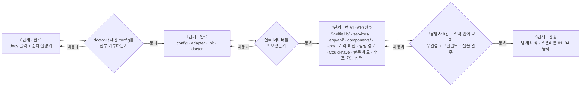

# 하네스 승격 로드맵

> **이 문서의 위치**
> 이 문서는 **템플릿 리포 자신**에 대한 것이다. 클론한 프로젝트가 채우는 `/docs/PRD.md`·`/docs/TRD.md` 등과는 층이 다르다.
> `docs/harness/` 하위는 하네스 자체의 문서이고, `docs/` 직속의 6개 문서는 **프로젝트가 채우는 자리**다.
> 이 리포에서는 그 자리를 파일럿 대상인 Shelfie가 채우고 있다 — 하네스와 파일럿이 한 리포에 사는 이유는 [ADR-H003](DECISIONS.md).
> 프로젝트 작업 중에는 이 폴더를 읽기만 하고 고치지 않는다. 고치는 것은 하네스 작업일 때뿐이다.

---

## 1. 현재 상태 (3단계 — 01~04 실물 완주 · 05~08 배선 완료)

| 계층 | 내용 |
|------|------|
| 문서 골격 | `docs/` 6종 — PRD · TRD · API_SPEC · ARCHITECTURE · ADR · UI_GUIDE. **파일럿 대상(Shelfie)으로 채워져 있다** |
| 가드레일 | `CLAUDE.md` — 각 문서 경로만 참조. CRITICAL 규칙(TDD·Mermaid·API 단일 출처·레이어 경계) |
| 워크플로우 | `.claude/skills/harness/SKILL.md` (doctor → step 설계 → `phases/` 생성 → 실행), `.claude/skills/review/SKILL.md` |
| **계약 계층** | `harness/config.json` · `config.schema.json` · `adapters/{nextjs-ts,_template}.json` + `adapter.schema.json` · `profiles/nextjs-ts/` · `templates/contract.md` |
| 실행기 | `scripts/harness.py` — `init` · `doctor` · `calibrate`. `scripts/execute.py` — 순차 step 실행기, CLI는 `{task-name}` + `--push`. `scripts/backfill_reads.py` — 지난 런의 끌어온 양 사후 집계(빠진 칸만 채운다) |
| **파이프라인 코어** | `scripts/pipeline/{cli,state,adapters,attribution,verdict,contract,gate,trace_contract,review,precheck,ledger,mask,pr,promote,review07,report}.py` — 8페이즈 실행기. `doctor` · `init --feature` · `next` · `record` · `gate` · `advance` · `retry` · `escalate` · `resume` · `status` · `lint-phases` · `precheck` · `contract-trace` · **`approve` · `mask` · `pr` · `promote` · `review07` · `report`**. **stdout 은 언제나 단일 JSON 봉투 하나**. 모듈명이 `trace.py` 가 아닌 것은 stdlib `trace` 를 가리기 때문이다 |
| **페이즈 파일** | `harness/phases/{01-plan,02-cross-verify,03-implement,04-gate,05-code-review,06-pr,07-pr-review,08-report}.md` — `---` 로 감싼 JSON 프론트매터. **여덟이 다 섰고 `lint-phases` 의 FUTURE 는 0건이다** — 다섯 번의 증분 동안 다음 진입점을 가리키던 그 한 줄이 처음으로 사라졌다. 판정 자체는 남겼다(09 를 가리키면 다시 뜬다). 01·02·05 의 "제출 형식" 절이 리뷰어 원문 형태와 재제기 어휘를 함께 적는다 ([[ADR-H014]]) |
| **리뷰어 · 원장** | `.claude/skills/{data-layer,security,architecture,test-quality,docs}-reviewer/SKILL.md` — 스택 비종속 관점 5종. 각 파일의 `## 프로젝트 보강` 절은 **비운 채로** 배포한다(그 절이 비어 갈수록 하네스가 성숙한 것이다). `docs/harness/pipeline/ledger/{taxonomy.json,findings.jsonl,rules_changelog.md}` — `taxonomy.json` 하나가 **원장 어휘 · 승격 목적지 · 리뷰 범위** 셋의 단일 출처다 |
| **진입점** | `.claude/commands/feature.md` (`/feature` — **01~08 전부**. push 는 실행기가 하고 **PR 생성·코멘트 게시는 메인 세션이 forge 도구로** 한다. **머지는 범위 밖**) · `.claude/agents/{impl-writer,test-writer,plan-reviewer}.md` (각 3KB 이하 — 소유 경계·제출 형식·금지만 담고 규약은 담지 않는다) |
| 테스트 | `scripts/test_harness.py` (**70건**) · `scripts/test_execute.py` (**176건**) · `scripts/test_pipeline.py` (**583건**) — 셋을 함께 걷으면 **829건**이다. 파일럿 앱은 **1,424건** · 47 suites. **전부 `pytest --collect-only` 와 P7 의 `full` 스테이지에서 잰 값이다** (2026-09-08). 앞 판은 파이프라인 슈트 하나를 708 로 적었는데 그것은 셋의 합을 한 칸에 넣은 것이었다 |
| 파일럿 | **파이프라인 런 P1** (`retry-reviewing`) — 8페이즈 파이프라인의 첫 실물 런. 아래는 순차 실행기 런이다: `phases/lib-core/` · `phases/services-core/` · `phases/routes-core/` · `phases/app-core/` 각 5 step · `phases/app-shell/` 6 step · `phases/contract-wiring/` · `phases/forced-path/` · `phases/could-have/` 각 5 step · `phases/golden-set/` · `phases/deploy-ready/` 각 4 step — **열 런 50 step 완주.** 기록은 [PILOT-LOG.md](PILOT-LOG.md) |
| **파이프라인 명세** | `docs/harness/pipeline/team-spec.md` — **8페이즈의 정본.** 리포 밖 로컬 플랜 3개를 스택 비종속으로 이식했다. 페이즈 01~08 · 종료 코드표 · 실패 3분류·매트릭스 · 수렴 판정 · 귀속 규칙 · 승격 임계값 · §E1~E14 · §P1~P6 |
| 실측 | `harness/calibration.json` — `calibrate` 산출. 정책 5종이 여기서 유도된다 |

`scripts/execute.py`가 하는 일: 브랜치 생성 · 가드레일 주입(CLAUDE.md 상시 + `steps[].docs`가 고른 docs/\*.md, 미지정이면 전량 + 경고 — [ADR-H008](DECISIONS.md)) · 소스 첨부(`steps[].sources` — [ADR-H009](DECISIONS.md)) · summary 컨텍스트 누적 · 자가 교정(상한은 `calibrate`가 유도, 미측정이면 `MAX_RETRIES`가 바닥값) · **2단계 커밋(커밋 범위는 `roles[].owns`에서 유도하고 소유 밖 변경은 커밋하지 않고 드러낸다 — M11)** · 타임스탬프와 `attempts` 기록 · **시도별 실측(`steps[].runs[]`) 기록** · **접두부 분해 기록([ADR-H010](DECISIONS.md))** · **세션이 끌어온 양 기록(트랜스크립트 사후 집계 — 합계·호출당 분포·동일 결과 재수신, [ADR-H011](DECISIONS.md))** · **실행 중 상태(`phases/{phase}/RUNNING`) 관리**.

재개 판정은 **"돌았다"가 아니라 "남겼다"를 본다** — 출력 파일과 죽은 `RUNNING`은 신호일 뿐이고, 소유 경로의 미커밋 변경이나 그 step의 `feat` 커밋이 있어야 재개다 (M13).

`RUNNING`은 관찰자를 위한 계약이다 — `started_at`만으로는 "돌고 있다"와 "죽었다"가 갈리지 않아 감독 세션이 살아 있는 step의 산출물을 지운 적이 있다 ([ADR-H006](DECISIONS.md)).

`scripts/harness.py doctor`가 하는 일: python 런타임 · config·어댑터 스키마 · 어댑터 전제조건 · 러너 바이너리 · 스테이지 명령의 실물 존재 · 역할과 소유 경계 · 계약 절 ↔ 템플릿 일치 · base 브랜치와 원격 · 경로 240자 상한 · 캘리브레이션 상태. 실패는 exit 2로 `/feature` 진입 자체를 막고, 경고는 통과시키되 전부 출력에 드러낸다.

진입점이 둘인 이유와 통합 시점은 [ADR-H003](DECISIONS.md)에 있다.

---

## 2. 결정 — 단계적 승격

목표 파이프라인(스택 비종속 8페이즈 feature-pipeline: `doctor`/`calibrate`/`contract-trace`/리뷰어 라우팅/규칙 원장)은 **한 번에 이식하지 않는다.** 검증을 통과한 계층만 템플릿으로 승격한다.

### 왜 지금 전부 넣지 않는가

1. **실측 없는 상수를 상속하지 않는다.** 목표 파이프라인의 정책(백그라운드 회귀 여부, 타임아웃, 테스트 수 하한)은 전부 실측값의 함수다. 2단계 파일럿이 그 값을 만들었고(`harness/calibration.json`), 실제로 정책 세 개가 실측에서 유도됐다. **그러나 그것은 순차 실행기에서 잰 값이다** — 8페이즈 파이프라인의 스테이지 체인·귀속·리뷰어 호출 비용은 아직 한 번도 재 본 적이 없다. 그 값이 생기기 전에 정책을 상수로 굳히면 근거 없는 숫자를 모든 파생 프로젝트가 물려받는다.
2. **검증 전 승격 금지.** 어댑터의 `verified` 플래그와 같은 원칙이다 — 실제 프로젝트에서 완주시킨 뒤에만 `true`로 올린다. 문서·스크립트에도 같은 규율을 적용한다.
3. **그렇다고 프로젝트마다 하네스를 새로 만들지도 않는다.** 그러면 일반화의 목적이 무너진다. 개선이 축적되지 않고, 고유명사·상수가 매번 다시 박힌다.

### 흔한 오해

"하네스를 템플릿에 넣는 것"과 "프로젝트마다 docs를 먼저 채우는 것"은 **배타적이지 않다.** 목표 파이프라인도 `클론 → init → doctor → 실행`을 전제한다. 두 가지는 동시에 성립하며, 진짜 갈림길은 **"검증 안 된 것을 지금 굳힐 것인가"** 뿐이다.

---

## 3. 3단계 로드맵

| 단계 | 내용 | 승격 조건 | 상태 |
|------|------|-----------|------|
| **0. 골격** | docs 골격 + 단순 순차 실행기 | — | 완료 |
| **1. 계약 계층** | `harness/config.json` · `config.schema.json` · 어댑터 스키마 · `init` · `doctor` | 일부러 깨뜨린 config(역할 소유 겹침 · 계약 절 불일치 · 화이트리스트 밖 러너 등)를 `doctor`가 **전부 거부**하고, 정상 config는 통과 | **완료** — `scripts/test_harness.py`의 거부 8종 + 오탐 검사가 게이트다 |
| **2. 파일럿** | 첫 실제 프로젝트(**Shelfie**)를 **현재 실행기로** 완주. 부족한 지점을 기록 | 스테이지별 실측 시간 · 테스트 개수 · 린트 위반 기준선 확보 | **런 #1~#10 완주** — `lib/`·`services/`·`app/api/`·`components/`·`app/`·계약 배선·강행 경로·Could-have·골든 세트·배포 가능 상태 50 step, 50/50 무재시도. 실측은 [PILOT-LOG.md](PILOT-LOG.md) |
| **3. 8페이즈 승격** | 파일럿 실측을 근거로 목표 파이프라인을 이식 | **다섯 줄로 재정의됐다 ([ADR-H013](DECISIONS.md))** — ① 코어에 고유명사 grep **0건** ② 어댑터만 바꿔 스택 교체 시 코어 무변경 ③ 언어 교체 시 코어 무변경 ④ 그린필드 테스트 0개가 `PASS_WITH_GAPS` ⑤ 파일럿 기능 1건을 01~04로 **실물 완주** | **다섯 줄 전부 통과 (2026-09-03)** — 파이프라인 런 P1 이 Shelfie 결함 1건을 01~04 로 완주했다(모델 호출 10회 · 3라운드 수렴 · `PASS_WITH_GAPS` · 테스트 1311→1333). 기록은 [PILOT-LOG.md](PILOT-LOG.md) |

**1단계에서 실제로 회수한 것**: 첫 `doctor` 실행이 어댑터의 `compile` 스테이지가 참조하는 `npm run typecheck`가 `package.json`에 없다는 것을 잡았다([team-spec §P5](pipeline/team-spec.md)). 게이트가 없었다면 첫 파일럿 런이 25분 돌고 나서 드러났을 불일치다.

**1단계가 아직 못 하는 것**: `calibrate`가 없어 타임아웃·백그라운드 회귀 여부·테스트 수 하한이 전부 보수적 기본값이다. 어댑터의 `attribution` 블록은 형태만 있고 소비자가 없다. 역할 에이전트 정의(`.claude/agents/*.md`)도 없다 — `doctor`가 이 셋을 매번 경고로 드러낸다.

**2단계가 회수한 것**: 네 런 모두 자가 교정 재시도 0회로 완주했고 테스트가 64 → **731건**이 됐다. step당 평균은 런 #1(순수 함수) 352초 · 런 #2(외부 API 모킹) 422초 · 런 #3(라우트 통합) 700초 · 런 #4(UI) **606초**로, **소요의 단조 증가는 런 #4에서 멈췄다** — "통합적일수록 비싸다"는 런 #3의 해석은 계층의 깊이가 아니라 한 step이 만나는 계약의 수를 재고 있었다. 대신 step당 산출 테스트가 27~29건대에서 **49.8건**으로 뛰었다 — **테스트 수는 계층 간 비교에 쓸 수 있는 눈금이 아니다.** 재시도율은 **20 step 내내 0**이었다 — `MAX_RETRIES = 3`은 네 런 동안 한 번도 발동하지 않은 장치다. `calibrate`가 정책 3종(백그라운드 회귀 OFF · `full` 타임아웃 300s · 테스트 수 하한 **657**)을 실측에서 유도했고, **`scoped`의 답이 런 #4에서 확정됐다** — 런 #3의 83%가 jsdom이 들어오자 **101%**가 됐다(731건 중 1건 실행, 소요 21.81s vs `full` 21.64s). vitest가 테스트를 건너뛰어도 그 파일의 환경은 세우기 때문이다. `loop_stage`는 이 스택에서 **켜면 손해다.** 하네스 결함은 누적 **11건**이 드러났고 **10건을 고쳤다**(M11은 부분 해결). M10·M11은 런 #4 직후에 닫혔고, M11은 **M10을 실물로 검증하다** 드러났다 — 완주한 phase에 실행기를 다시 돌리자 `_finalize`의 `git add -A`가 미커밋 소스와 상태 파일을 한 커밋에 담고 런 #4의 실측 타임스탬프를 덮었다. 네 런 동안 숨어 있었던 이유는 M6과 같다: step 세션이 매번 스스로 커밋해 그 경로가 no-op이었다. 런 #4의 M10은 `started_at`은 있고 출력 파일은 없는 상태가 "진행 중"과 "죽었음" 양쪽을 뜻해 **관찰자가 둘을 구분할 수 없다**는 것으로, 이번에 감독 세션이 실제로 오독해 살아 있는 step의 산출물을 지운 일이 있다(복구됨). 런 #3의 결론이 한 번 더 확인됐다 — **실행기의 취약점은 작업 품질이 아니라 운영 견고성과 관측 가능성에 있다.** 상세는 [PILOT-LOG.md](PILOT-LOG.md).

**런 #5가 더한 것**: `app-shell` 6 step이 `src/app/page.tsx` 상태 머신과 화면 5종을 얹어 **앱이 처음 업로드에서 추천까지 이어졌고**, 테스트가 731 → **922건**이 됐다. 이 런의 값어치는 코드보다 **런 #4 직후 고친 네 장치가 전부 실물에서 통과했다**는 데 있다 — M7(사용량 한도를 자가 교정으로 오인하지 않는다), M10 `RUNNING`([ADR-H006](DECISIONS.md)), `attempts` 기록([ADR-H007](DECISIONS.md)), 이월 보고 라우팅. 특히 **step 2가 실제로 한도에 걸렸는데 재시도를 한 번도 태우지 않고 `blocked`로 끝났다** — 런 #3에서 같은 일이 재시도 통계를 오염시켰던 바로 그 경로다. 이월 5건은 step 0이 전부 해소했다(세 런째였다). `calibrate` 4회차는 `tests_ran_floor`를 **829**로 올렸고 `scoped`/`full`이 191건 늘어난 뒤에도 **100.2%** — `loop_stage`가 이 스택에서 손해라는 판정이 재확인됐다. `retry_budget`은 여전히 `null`이지만 이유가 바뀌었다: "기록 0 step"이 **"기록 6 step · 미기록 20 step"**이 됐고 `RETRY_RECORD_MIN`(10)까지 4 step 남았다. 새 결함 **3건(M12·M13·M14)**이 드러났고 **M12는 닫혔다**(M13·M14는 남았다) — 셋 다 작업 품질이 아니라 **실측을 기록·보존하는 쪽**이다. 런 직후 26 step 전체를 처음 집계해 **M15**도 드러났다: 청구 토큰의 95.4%가 cache read이고 그 접두부의 86.9%가 가드레일 전량 주입이었다 ([ADR-H008](DECISIONS.md)에서 해결). M14는 M9의 형제였다(`--stage`가 전체를 덮는 것은 고쳤는데 **전체가 부분을 덮는 것**은 남아 있었다). 상세는 [PILOT-LOG.md](PILOT-LOG.md).

**런 #6이 더한 것**: `contract-wiring` 5 step이 23번의 코드 배선 6건을 전부 닫아 **US-003을 빼면 계약과 코드가 처음으로 일치했고**, 테스트가 922 → **1036건**이 됐다. 그러나 이 런의 값어치 절반은 코드가 아니라 **[[ADR-H008]]의 A/B 실측**이다 — 런 #5가 세운 네 지표가 전부 예측한 방향으로 움직였다: 가드레일 문자 **−54.1%**(예측 41%보다 컸다) · turn당 재독 **−26.7%** · step당 비용 **−38.5%** · step당 turn **38.0 → 29.6**(런 #5가 경계한 "문서를 못 찾아 헤매느라 turn이 는다"는 실현되지 않았다). **품질 회귀 0건**이다 — 금지 경로 침범·CRITICAL 위반·새 의존성·레이어 경계·저장소 흔적 전부 0. 다만 **n=1이라 런 #7이 한 번 더 지지해야 한다.** 이 런이 남긴 가장 중요한 줄은 절감폭이 아니라 **절감이 어디서 멈추는가**다: 접두부를 문자 기준 절반으로 줄였는데 turn당 재독은 26.7%만 내려갔고, 역산하면 **turn당 재독의 약 53%만이 접두부이고 나머지 47%는 누적 대화(파일 읽기·도구 결과)**다. **가드레일을 0으로 만들어도 절반까지다** — 남은 절반이 [[ADR-H009]]가 겨눈 곳이고 런 #7이 잰다. 부수로 런 #5가 예약해 둔 "summary 누적 비중이 오르는가"의 답도 나왔다(**오르지 않았다** — 9.4% → 8.6%). 여섯 런 중 처음으로 **막힌 지점·수동 개입·실행기 결함이 0건**이었고, 대신 새로운 종류의 관측이 하나 나왔다: **설계가 틀렸고 워커가 고쳤다.** step 0의 파일이 `retryIndex` 클램프를 불필요하다고 적었는데 실제로는 `MAX_RECOMMEND_ATTEMPTS = 5`가 스키마 상한 4를 넘겨 마지막 재추천이 400으로 튕기는 상태였고, step 세션이 그것을 발견해 두 클램프를 걸고 제거하면 실패하는 테스트로 고정했다. 앞선 다섯 런의 보고는 전부 "설계가 **비워 둔** 것"이었지 "설계가 **틀린** 것"이 아니었다 — 후자는 이월로 처리되지 않고 런 중에 고쳐지지 않으면 계약이 깨진 채 남는다. `calibrate` 5회차는 **`retry_budget`을 `null`에서 처음으로 2로 바꿨다**(기록 11 step · 재시도 0건 · 최대 시도 1회) — [[ADR-H007]]이 런 #4 직후 만든 장치가 두 런 만에 답을 냈고, **기억 → 기록 → 정책**의 세 단계가 완결됐다. `tests_ran_floor`는 932, `scoped`/`full`은 **14.7%**로 M16의 경로 필터 판정이 재현됐다. 상세는 [PILOT-LOG.md](PILOT-LOG.md).

**런 #7이 더한 것**: `forced-path` 5 step이 US-003의 마지막 칸을 실환경에서 닫았고(강행이 이제 첫 모델 호출의 프롬프트까지 간다) 런 #5부터 두 런째 이월되던 UI 부채 2건도 함께 닫혔다. 테스트는 1036 → **1091건**. 그러나 이 런의 값어치는 [[ADR-H009]]의 A/B에 있고, **답이 절반짜리라는 것이 이 런의 성과다.** 기제는 작동했다 — 읽기 turn이 실제로 사라져 **step당 turn이 29.6 → 22.6(−23.6%)** 이 됐고, **접두부 밖 재독이 자·토큰 환산비를 1.2~2.0 어디로 잡아도 줄었다**(−10,667 ~ −31,161토큰/turn). 런 #6의 53%/47% 분해가 "접두부 밖 불변" 가정 위에 있었는데, 이번 런이 그 가정을 깨면서도 같은 방향을 냈다. **그런데 비용은 −0.7%로 제자리다** — 접두부가 113% 늘어(소스 46,302자 + 가드레일 33% 증가) 절감을 그대로 먹었다. **[[ADR-H009]]는 이 구성에서 비용 중립이고, 롤백하지 않는다. 기제가 아니라 예산이 문제다.** 진짜 결론은 구조에 있다: **[[ADR-H008]]과 [[ADR-H009]]가 같은 접두부를 반대 방향으로 당기는데 서로의 상한을 모른다.** step 2가 `sources` 상한 60,000자를 지키고도 접두부 136,986자로 **일곱 런 최대**를 만들었다 — 규칙을 다 지키고 막으려던 상태에 도달한 것이다(아래 28번). 부수로 [[ADR-H008]]의 품질 회귀 0건이 **n=2**가 됐고, `calibrate` 6회차는 `tests_ran_floor`를 981로, `scoped`/`full`을 14.2%로 재현했다. 새 보고는 **0건**으로 일곱 런 중 처음이다 — 다만 계약이 런 전에 전부 정해진 배선 작업이었기 때문이지 성숙의 신호로만 읽을 것은 아니다. 상세는 [PILOT-LOG.md](PILOT-LOG.md).

**런 #8이 더한 것**: `could-have` 5 step이 PRD의 Could-have 3종(알라딘 상품 링크 · 추천 결과 이미지 저장 · 촬영 가이드 시트)을 붙였다. 테스트 1091 → **1183건**. Must·Should가 런 #7에서 전부 닫힌 뒤라 **처음으로 "안 해도 되는 것"을 한 런**이고, 그래서 범위를 올리는 판단이 온전히 런 전 사람 몫이었다. 이 런의 값어치는 [[ADR-H010]]의 열린 질문에 답한 데 있다 — **"첨부는 쓸 파일에 덜 값을 하는가"의 답은 아니오였고, 질문 자체가 틀린 축을 보고 있었다.** 팔 A(쓸 파일 첨부, step 0·2)가 15.0 turn·$2.40, 팔 B(읽을 파일만 첨부, step 3·4)가 33.5 turn·$3.80으로 **접두부가 26% 작은 팔이 58% 비쌌다.** 런을 가로지르는 매칭 쌍이 더 강하다 — 같은 `page.tsx`를 고치며 런 #7 step 4는 첨부하고 27 turn, 런 #8 step 3은 첨부하지 않고 **44 turn**이었다. 그런데 같은 팔 B의 step 4는 23 turn으로 팔 A와 다르지 않았고, 차이는 **직접 읽어야 했던 양**(66,275자 vs 16,334자)이다. **축은 "읽을/쓸"이 아니라 크기다** — 첨부의 값은 *안 첨부했을 때 드는 읽기 turn 수*에 비례한다. 부수로 28번의 방향도 바뀌었다: 접두부를 31.6% 줄였는데 비용은 9.6%만 줄었고 **접두부 최대 step이 두 런 연속 최저 비용**이었다. 예산을 접두부 총량에 거는 것이 답이 아닐 수 있다. 새 결함 **M17** — M11 수정의 첫 실물 사용에서 실행기가 **자기가 쓴 `phases/index.json`을 "소유 밖"이라며 남겼다.** 고쳤고, 남는 값은 **조용한 커밋을 경고로 바꾼 장치가 첫 런에서 자기 버그를 잡았다**는 것이다. 보고는 두 런째 **0건**이고 막힌 지점도 세 런째 없다. 다만 런 전에 사람이 둘을 잡았다 — PRD가 **구현 불가능한 것**("촬영 가이드 오버레이" — `capture` 입력이 시스템 카메라를 연다)을 적고 있었고, `CLAUDE.md`의 한 줄이 **자기모순**이었다("상수는 `env.ts` 한 곳에서만" + "`env.ts`를 클라이언트에 import하지 마라" — 실제로는 클라이언트 파일 12개가 이미 import한다). **틀린 가드레일은 비어 있는 가드레일보다 나쁘다.** 상세는 [PILOT-LOG.md](PILOT-LOG.md).

**런 #9·#10이 더한 것**: `golden-set` 4 step이 TRD 8번의 골든 인식률 하네스를 만들어 배포 전 체크리스트가 **부를 수 있는 명령**을 갖게 했고(세트는 여전히 비어 있다 — 아래 30번), `deploy-ready` 4 step이 **배포 가능 상태**를 겨눴다 — 이월 부채를 닫고 문서에만 있던 계약(TRD 6.6 접근성 다섯 줄 · TR-011의 Edge Cases 12행)을 회귀로 잠갔다. 테스트 1183 → **1311건**. **런 #10의 step 2·3은 구현을 한 줄도 고치지 않았다** — 계약을 코드가 이미 지키고 있었고 없던 것은 지켜지는지 검사하는 장치였으며, 검사가 실제로 무는지를 컴포넌트를 일부러 망가뜨려 확인하고 되돌렸다. 이 런의 값어치는 **비용의 축을 처음으로 갈라 본 것**이다: 청구액을 `cache_read`·`cache_write`·`output_tokens` 셋으로 회귀하니(13 step) 유도 단가가 공표 단가와 거의 일치했고($0.492 · $10.77 · $24.58), **접두부는 매 turn 재독(단가 0.49)이 아니라 캐시 쓰기(단가 10.77, 22배)로 물린다**는 것이 드러났다. 접두부 열 런 최대(169,316자)인 step 2가 재독은 오히려 적고(turn 31 vs 47) 쓰기·산출량에서 비쌌다. 상관은 `cache_read` **0.960** · 출력 토큰 0.920 · turn 0.818 · 끌어온 양 0.803 · **접두부 총량 0.662**로, 28번이 찾던 예산의 자리는 접두부 총량이 아니라 **접두부 × turn**이고 그 옆에 아무도 세지 않던 **산출량**이 있다. [[ADR-H012]]의 두 줄 표도 같은 런 안에서 시험됐다(31번) — **호출 줄은 n=3으로 강해졌고**(두 표본 다 정확히 2 turn) **통독 줄의 "하한"은 반증됐다**(어림의 0.38배). 눈금 `크기 ÷ 1,700`의 분모는 파일 크기가 아니라 **세션이 읽는 방식**(`cat` 통독이냐 `grep`+`sed` 슬라이싱이냐)의 함수였다. 새 결함 **2건** — **M18**(`sources` 상한 검사가 그 step에 도달해서야 돌아 앞선 두 step을 897초 태운 뒤 막혔다. 사람이 사전 검사를 대신 돌려 재개했고 상한은 올리지 않았다) · **M19**(`next dev`가 가드레일 `CLAUDE.md`에 규칙 블록을 자동으로 덧붙였는데, 실행기가 가드레일의 **지문을 남기지 않아** 런 중 변경이 장부에 드러나지 않는다). 보고는 세 런 연속 0건이던 것이 **6건**으로 늘었고 그중 넷이 문서 ↔ 코드 어긋남이다 — 런 #8이 남긴 질문의 답이며, **회귀로 잠그지 않은 문서 계약은 지켜지지 않는다.** 상세는 [PILOT-LOG.md](PILOT-LOG.md).

**3단계 스켈레톤이 더한 것 (2026-09-03)**: `04-gate`가 어댑터의 소비자가 됐고 **실물에서 체인을 완주했다** — `compile 2.38s → lint 7.29s → check 1.44s → scoped 2.83s → full 21.95s`, 등급 `PASS_WITH_GAPS`(스킵 3종이 gaps에 드러난다). **M16이 04-gate에서 처음 재현됐다**: 계약의 `lib/merge.ts · reduceBeforeLookup`이 테스트 **이름이 아니라 경로**(`src/lib/merge.test.ts` 등)로 조립됐고 `scoped/full = 12.9%`였다(런 #6~#8의 14.2~14.7%와 같은 자리).

**그리고 소비자가 생기자마자 어댑터 결함이 하나 드러났다.** `attribution.compile_error_regex`가 `path(line,col)` 뒤의 `:` 를 소비하지 못해 **실제 타입 검사기 출력에 한 건도 매칭되지 않았다.** 한 글자(`:?`)를 더해 고쳤고, 이것이 `_unconsumed` 주석이 예고한 바로 그 자리다 — **선언만 있고 소비자가 없는 계층은 맞는지 알 수 없다.**

**어댑터 `verified` 승격은 아직 아니다.** 스테이지 체인·선택자 조립·리포트 파싱은 실물에서 소비됐지만, **`attribution`의 실패 경로는 픽스처로만 검증됐다** — 실물 게이트가 통과해서 실패가 한 건도 없었다. 픽스처는 내가 만든 출력이지 진짜 러너 출력이 아니다. 그리고 01~03은 아직 모델 호출로 완주하지 않았다. 아래 14번을 본다.

각 단계의 게이트를 통과하지 못하면 **다음 단계로 넘어가지 않는다.** "일단 넣고 나중에 고친다"는 이 로드맵이 막으려는 실패 자체다.

---

## 4. 프로젝트 시작 순서

**어느 단계에 있든 이 순서는 바뀌지 않는다.**

### 왜 docs가 먼저인가

문서가 하네스 설정의 **입력**이기 때문이다. 순서를 뒤집으면 채울 수 없는 칸이 생긴다.

| 하네스가 알아야 하는 것 | 출처 |
|------------------------|------|
| 어떤 어댑터를 쓸 것인가 (빌드·테스트 명령) | `/docs/TRD.md` 기술 스택 |
| 무엇을 만드는가 (계약의 유닛·진입점) | `/docs/PRD.md` 유저 스토리 · 기능 요구사항 |
| 역할별 소유 경계 glob | `/docs/ARCHITECTURE.md` 디렉토리 구조 · 레이어 의존 관계 |
| 게이트가 검사할 규칙 | `CLAUDE.md` CRITICAL 규칙 |
| 성능·보안 기준선 | `/docs/TRD.md` 비기능 요구사항 |

TRD의 기술 스택이 비어 있으면 어댑터를 고를 수 없고, PRD의 유저 스토리가 없으면 계약을 쓸 수 없다.

---

## 5. 지금 하지 않는 것

| 항목 | 이유 |
|------|------|
| 기존 리포에 하네스를 주입하는 부트스트랩 | 클론 방식을 택했다. 필요해지면 `init --into <path>`로 나중에 |
| git submodule 배치 | 경로 상대화 비용이 이득보다 크다 |
| 어댑터 3종 이상 (pytest · go · cargo) | **실제로 돌려본 것만 동봉한다.** 템플릿과 문서만 둔다 |
| GitLab · Bitbucket 지원 | 두 번째 forge가 실제로 필요해질 때. 지금 만들면 검증 불가 |
| 하네스를 프로젝트 스택 언어로 재작성 | 스택마다 실행기를 다시 만들게 되어 일반화의 목적이 무너진다 |
| 머지 자동화 | 파이프라인의 범위는 PR까지 |

---

## 6. 다음 행동

1~13과 15·16·17·18·19·21·22·23·25·27·29가 완료됐다. **런 #10이 비용을 재독·캐시 쓰기·산출량 셋으로 갈랐고 31번이 닫혔다.** **3단계가 착수됐고 12번이 닫혔다 (2026-09-02, [ADR-H013](DECISIONS.md))** — 8페이즈 명세가 `docs/harness/pipeline/team-spec.md`로 이식돼 정본이 됐고, G3 게이트가 "두 스택에서 완주"에서 다섯 줄로 재정의됐다. 28번과 아래 30번을 본다. `calibrate`가 구현됐고 파일럿 런 #1~#10이 `lib/`·`services/`·`app/api/`·`components/`·`app/`·계약 배선·강행 경로·Could-have·골든 세트·배포 가능 상태를 완주해 **앱이 업로드에서 추천까지 이어졌고 계약과 코드가 일치하며, PRD의 Must·Should·Could가 전부 구현됐다.** **남은 것은 14·28·30이다** (P5 뒤에도 셋 그대로다 — 14 는 다섯 런째 게이트가 자연 실패하지 않았고, 28 은 예산의 값을 아직 안 정했고, 30 은 골든 세트가 비어 있다) — 셋 다 "대상이 없어서" 또는 "표본이 모자라서" 열려 있다. M20~M23은 파이프라인의 첫 실물 런이 드러낸 것이고 **같은 주에 닫혔다**. **05-code-review 와 규칙 원장 시드는 2026-09-03 에 닫혔다** — `contract-trace` 5종 · `precheck` · 리뷰어 라우팅과 스킬 5종 · `findings.jsonl`/`taxonomy.json`(staged 까지)이 들어왔고 파이프라인 테스트가 175 → 284건이 됐다. `lint-phases` 의 FUTURE WARN 한 줄은 이제 **`06-pr`** 를 가리킨다 — 그 줄은 지워지는 것이 아니라 다음 진입점으로 옮겨간다. ~~**다음 작업은 06~08 이다**~~ — **2026-09-03 에 한 증분으로 지었다 ([[ADR-H015]]).** 원래 서술은 "다음 실물 런이 05 의 결함을 드러낸 뒤에 06 을 짓는다" 였고, **그 순서를 밟지 않았다** (사용자 결정). 들어온 것: 페이즈 파일 3종 · 서브커맨드 6종(`approve`·`mask`·`pr`·`promote`·`review07`·`report`) · `state` 블록 5종 · `config.external_pr_review`. 파이프라인 테스트 284 → 388건. **`lint-phases` 의 FUTURE 가 0건이 됐다.** 핵심 결정은 **실행기가 forge 를 부르지 않는다**는 것이다 — `06_pr_req.json` 까지 만들고 PR 생성은 메인 세션이 한다. 이 머신에 `gh` 가 없고, 무엇보다 실행기가 `subprocess` 로 부르는 것은 `npm` 과 `git` 뿐이라는 기존 경계가 이미 그렇게 그어져 있었다. 함께 닫은 것 둘 — `precheck` 의 선언과 실제가 어긋난 두 자리(정책 실패의 카운터 계수 · exit 10 의 잠금 미실행), 그리고 **등급의 단일 출처**(세 곳이 직접 대입해 나중에 쓰는 쪽이 이겼다 — 게이트가 05 뒤에 돌면 `PASS_WITH_GAPS` 가 `PASS` 로 되돌아갔다). **ADR-H013 의 게이트 다섯 줄은 2026-09-03 에 전부 닫혔다** — 파이프라인 런 P1 이 Shelfie 결함 1건을 01~04 로 완주했다(모델 호출 10회 · 01 이 3라운드에 수렴 · `PASS_WITH_GAPS` · 테스트 1311→1333). 그 런이 파이프라인 결함 **M20~M23** 을 새로 열었고 **2026-09-03 에 넷 다 닫혔다** ([[ADR-H014]]) — 리뷰어 원문 형식 규칙의 문서 부재 · 단조성 검사의 세 누수 · `budget.model_calls` 미계수 · 계약 파서가 중첩 불릿을 유닛으로 셈(**템플릿 자신이 그 형태였다**). **05~08 을 짓기 전에 닫은 것이 요점이다** — 셋이 "05~08 로 늘면 문제가 배가된다"를 이유로 들었기 때문이다. 같은 날 `cross_verify.primary` 도 채워 **1라운드 수렴 경로가 처음 열렸다**(P1 은 폴백 때문에 최소 2라운드가 강제됐다). 파이프라인 테스트 132 → 162건. 상세는 [PILOT-LOG.md](PILOT-LOG.md) 의 "파이프라인 런 P1". 실행기 결함은 M11·M13·M14·M17이 2026-09-02에 닫혔고 **같은 날 런 #10이 M18·M19를 새로 열었다** — `sources` 상한의 사전 검사와 가드레일 지문이며, 둘 다 3단계 스켈레톤이 흡수할 자리다. 20·24·26도 닫혔다. **29는 2026-09-02에 닫혔다** — 실행기가 세션이 끌어온 양을 재고, 백필이 지난 여덟 런 41 step을 표본으로 바꿨다([[ADR-H011]]). 28은 그 표본이 방향을 확정했고 **예산의 형태까지 정해졌지만 값은 아직 정하지 않는다** — 분포를 재니 "얼마나 끌어오는가 × 몇 조각으로 끌어오는가"였다(2026-09-02, [[ADR-H011]] 보강). **13은 답이 뒤집혀 다시 열렸다가 닫혔다**(아래). 런 #4에서 UI_GUIDE의 "Claude 생성 텍스트 블록"과 사실·해석 분리(ADR-002)가 처음 화면에서 시험되어 통과했고, ADR-005(`lookup_failed` ≠ `no_match`)도 문구·색·행동 셋 다 갈렸다.

**런 #4가 11번에서 하지 못한 것**: 런 #3의 보고 3건(알라딘 호출 상한 260회 · 이미지 상수 이중화 · `errorCodeSchema`의 500대 공백)을 "여기서 정리한다"고 적었으나 **하나도 정리되지 않았다.** step 파일 5개가 전부 `src/lib/`·`docs/` 수정을 금지해 **설계 단계에서 이미 불가능해져 있었다.** 아래 15번으로 옮긴다.

12. ~~**3단계 게이트 재검토**~~ — **해결 (2026-09-02, [ADR-H013](DECISIONS.md)). 답은 "대상을 구한다"가 아니라 "게이트를 바꾼다"였다.** 게이트의 목적은 *두 리포를 돌리는 것*이 아니라 **"코어에 스택이 박히지 않았음"을 보이는 것**이고, 대상 리포가 없다는 이유로 아홉 런째 열어 두는 것은 통과할 수 없는 조건으로 3단계를 영구히 막는 것과 같았다. 새 게이트는 다섯 줄이고 넷은 정적 검사(고유명사 grep · 어댑터 교체 · 언어 교체 · 그린필드 `PASS_WITH_GAPS`), 다섯째가 **실물 완주**다. **무엇을 잃는지 함께 적었다** — 어댑터의 `attribution` 정규식이 진짜 다른 스택 출력에 맞는지는 replay 픽스처로 검증되지 않으므로 두 번째 어댑터는 `verified: false`로 남는다. 원 서술을 남겨 둔다: "두 스택에서 완주"의 두 번째 스택(`gradle-java`) 대상 리포가 이 머신에 없다
13. ~~**`scoped` 스테이지의 존재 이유를 다시 묻는다**~~ — **답이 뒤집혔다 (M16).** 런 #3·#4·#5는 전부 `-t <테스트 이름>`으로 쟀는데 그 문법은 파일 수집을 줄이지 않는다. **경로 필터로 재니 `full` 대비 14.6%(4.56s vs 31.23s) — 6.8배 싸다.** `loop_stage`는 이 스택에서 **성립한다.** 8페이즈의 `tests_from`은 계약 심볼을 테스트 이름이 아니라 파일 경로로 조립해야 한다 ([ADR-H009](DECISIONS.md)). 아래는 뒤집히기 전의 서술이다 — **런 #4가 답했다.** `full` 대비 83%(런 #3) → **101%**(런 #4, jsdom 이후). vitest가 테스트를 건너뛰어도 파일 환경은 세우므로 선택 실행이 이익을 내지 못한다. **이 스택에서 `loop_stage`는 켜면 손해다** — 8페이즈 스테이지 체인은 이것을 스택별 판정으로 다뤄야 한다
14. 어댑터 `verified: true` 승격 — **P7 이후에도 절반이다 (2026-09-08) — 일곱 런째다.** P7 의 게이트는 **1라운드에 통과**했다(`04_gate_report.failed: null`). 실패가 없으니 귀속 규칙이 한 번도 안 돌았고 `attribution` 의 `failures` 가 또 비었다. **일곱 런 연속으로 자연 실패가 오지 않았고 그래도 일부러 만들지 않는다** — 픽스처는 진짜 러너 출력이 아니고, 실패를 지어내면 그 어댑터가 검증됐다는 말이 지어낸 실패에 대해서만 참이 된다. 아래는 P2 이후의 서술이다. **P2 이후에도 절반이다 (2026-09-04).** 게이트가 이 런에서도 한 번도 실패하지 않아 `attribution.json` 의 `failures` 가 또 비었다. **두 런 연속으로 자연 실패가 오지 않았다** — 그래도 일부러 만들지 않는다. 아래는 P1 이후의 서술이다. **여전히 절반이다 (2026-09-03, 파이프라인 런 P1 이후).** `04-gate` 가 스테이지 체인·`select` 문법·`test_report` 파싱·`entrypoint_resolver` 를 두 런에서 소비했고 `compile_error_regex` 는 실물 출력에 맞춰 한 번 고쳤다. **남은 것은 `attribution` 의 실패 경로다** — P1 의 게이트도 8종 전부 통과해 `attribution.json` 의 `failures` 가 또 비었다. 픽스처는 진짜 러너 출력이 아니다. **실패를 일부러 만들지 않는다** — 다음 런이 자연히 실패할 때 닫힌다. `scripts/test_pipeline.py:1509` 의 `TestPromotionGate` 가 `verified is False` 를 단언하므로 승격은 플래그가 아니라 게이트를 여는 결정이다
15. ~~**이월 보고 4건을 받을 step을 명시적으로 배치한다**~~ — **해결. 다만 답이 "배치"가 아니라 "라우팅"이었다.** 소유 경계를 실제로 판정해 보니 4건 중 `main_owned_paths`에 걸리는 것은 2건뿐이었고, `src/lib/**`는 **처음부터 워커 소유라 막힌 적이 없었다** — `main_owned_paths`의 `*.ts`는 `*`가 디렉토리를 넘지 않아 리포 루트만 잡는다. 세 런을 막은 것은 config가 아니라 **step 파일이 워커가 소유한 경로를 습관적으로 금지한 한 줄**이었고, 설계자가 소유를 눈으로 판정했기 때문이다. `SKILL.md`에 보고를 손댈 파일 기준으로 분류하는 절을 넣었고(메인 소유는 사람이 런 전에, 역할 소유는 step이 이름으로 지정받아, 걸치면 문서 먼저), **판정은 `glob_any`로 하라**를 함께 박았다. 메인 소유분 4건은 런 #5 시작 전에 처리했다
16. ~~**M10 — `RUNNING` 파일**~~ — **해결** ([ADR-H006](DECISIONS.md)). 생존 판정을 pid가 아니라 heartbeat로 한다 — **Windows에서 `os.kill(pid, 0)`은 프로세스를 죽이므로** POSIX 관용구를 그대로 옮겼다면 M10 수정이 M10의 사고를 그대로 일으켰을 것이다. 수정 중 M11(`_finalize`의 `git add -A`가 작업 트리 전체를 쓸어담는다)이 드러나 부분 해결했다
17. ~~**`MAX_RETRIES = 3`을 정리한다**~~ — **해결** ([ADR-H007](DECISIONS.md)). 지우지 않고 **바닥값으로 강등**했고 상한은 `calibrate`가 `attempts`에서 유도한다. 핵심은 값이 아니라 **재는 것이 없었다**는 발견이다 — 20 step은 재시도 횟수를 어디에도 남기지 않았고 "재시도 0회"는 콘솔을 지켜본 사람의 기억이었다. 지금 `calibration.json`은 "기록 0 step · 미기록 20 step"이라고 스스로 적는다. 이것이 **실행기가 유도된 정책을 소비하는 첫 사례**이기도 하다

18. ~~**M11의 남은 절반**~~ — **해결 (2026-09-02).** `_commit_step`·`_finalize`의 `git add -A`를 걷어내고, 커밋할 경로를 `config`의 `roles[].owns`에서 유도한다. 판정은 눈이 아니라 `doctor`가 쓰는 `glob_any`로 한다 — 같은 규칙이 두 곳에서 갈라지지 않게 하는 것이 15번이 남긴 교훈이다. **소유 밖 변경은 커밋하지 않고 콘솔에 드러낸다** — 조용히 두면 다음 커밋이 삼킨다. 원래 서술을 남겨 둔다: `_finalize`가 `git add -A`로 커밋한다. **다섯 런째 드러나지 않았다** — step 세션이 매번 스스로 커밋해 작업 트리가 깨끗했기 때문이다. 드러나지 않는다는 것이 안전하다는 뜻은 아니다
19. ~~**파일럿 런 #5 `app-shell` 실행**~~ — **완주**(6/6 · 무재시도 · 한도로 1회 `blocked` 후 재개). `page.tsx` 상태 머신과 화면 5종이 붙어 앱이 처음 끝까지 이어졌고, 세 런째 이월되던 계약 부채 5건도 step 0이 닫았다. 새 결함 M12·M13·M14는 아래 20~22로 옮긴다

20. ~~**M12 — step별 `elapsed_sec`를 `index.json`에 남긴다.**~~ — **해결.** `steps[].runs[]`에 시도마다 `elapsed_sec`·`prompt_chars`·`guardrail_chars`·`cost_usd`·`turns`·`cache_read`를 남긴다. 배열인 것이 요점이다 — 런 #5에서 재개 실행이 `step2-output.json`을 덮어써 한도 중단분의 비용이 사라졌다. 원래 서술을 남겨 둔다: 재개된 step의 `started_at`은 첫 시도 것이라 `completed_at`과의 차가 **대기 시간을 포함한다**(런 #5 step 2: 유도값 3573s vs 실제 520s). [PILOT-LOG](PILOT-LOG.md)의 앞선 네 런 소요는 전부 그 유도값이다 — 재개가 한 번이라도 섞이면 그 방법이 깨진다. **실행기는 맞는 값을 콘솔에 찍고 버린다.** [ADR-H007](DECISIONS.md)이 `attempts`에 한 것과 같은 조치다
21. ~~**M13 — 재개 신호가 "출력 파일 존재"가 아니라 "산출물 존재"를 봐야 한다.**~~ — **해결 (2026-09-02).** 다만 **답이 `exitCode != 0`을 빼는 것이 아니었다.** 그렇게 고치면 런 #3의 형태를 놓친다 — 그때 한도는 세션이 코드·테스트를 다 쓰고 `index.json`을 갱신하기 직전에 떨어졌고, 그 출력 파일도 `exitCode != 0`이다. **"돌았다"와 "남겼다"는 다른 사실이고, 재개가 물어야 하는 것은 후자다.** 그래서 출력 파일·죽은 `RUNNING`은 신호로 두되, 소유 경로의 미커밋 변경이나 그 step의 `feat` 커밋이 있을 때만 재개로 판정한다. 판정할 수 없으면(git이 답하지 못하면) 재개로 본다 — **두 오류의 값이 다르다.** 재개를 놓치면 검증된 산출물이 덮이고, 헛 재개는 안내 한 문단이다. 원래 서술: 25초 만에 한도로 잘려 소스를 한 줄도 못 쓴 step이 다음 실행에서 재개로 판정됐다. 무해했지만 8페이즈 파이프라인은 이 신호로 페이즈 재개를 판정한다
22. ~~**M14 — 전체 `calibrate`가 `scoped`의 기존 실측을 지운다.**~~ — **해결 (2026-09-02).** 요구된 어휘 셋을 `stages[].state`로 만들었다: `absent`(`cmd:null` — 이 스택에 **없는** 것) · `unmeasured`(이번에 못 쟀고 옛 값도 없다 — **모르는** 것) · `stale`(이번에 못 쟀지만 옛 실측이 있다 — **옛** 값, `sec`와 옛 `measured_at`을 보존한다) · `measured`. 옛 값을 쓰는 칸이 있으면 `partial: true`이고 `doctor`가 WARN으로 드러낸다. **실물에서 확인했다** — `--select` 없이 전체 `calibrate`를 돌리자 런 #7의 `scoped` 3.33s가 `stale`로 살아남았고 `partial: true`가 됐다. 고치기 전이라면 `sec: null`로 덮이고 `partial: false`였다. **일곱 런 동안 `--select`로 손수 피해 가던 것이 더는 필요 없다.** 원래 서술: `--select` 없이 돌면 런 #4의 21.81s가 `skipped`로 덮이고, 그런데도 `partial: false`로 적혀 `doctor`가 통과시킨다. **M9의 형제다** — 그때는 부분이 전체를 덮었고 이번은 전체가 부분을 덮는다
24. ~~**M15 — 가드레일 전량 주입**~~ — **해결** ([ADR-H008](DECISIONS.md)). 다섯 런 26 step을 처음 집계하니 청구 토큰 115.6M 중 **cache read가 110.3M(95.4%)** 이고, 그 접두부의 **86.9%가 `CLAUDE.md` + `docs/*.md` 전량 주입**이었다. UI step이 배포 인프라 절을 750 turn 내내 재독한 셈이다. 이제 `steps[].docs`가 문서를 고르고, 미지정이면 전량 주입하되 경고로 드러난다. 런 #5의 step 파일들이 이미 선언한 대로만 넣었다면 문자 기준 **41% 절감**이었다 — **정보는 있었고 실행기가 쓰지 않았다.**

    **런 #6의 A/B가 답했다.** 문자 **−54.1%**(예측 41%를 넘겼다) · turn당 재독 **145,491 → 106,596(−26.7%)** · step당 비용 **$5.61 → $3.45(−38.5%)** · step당 turn **38.0 → 29.6**(늘지 않았다) · **품질 회귀 0건.** step 2가 계약 4종을 만나 전량의 82%를 그대로 실었는데도 총 절감이 예측을 넘었다 — **줄이는 것이 목적인 장치가 아니라는 것이 그 행에서 보인다.** 8페이즈 파이프라인은 접두부에 계약·findings·리뷰어 프롬프트를 더 얹으므로 이 장치는 이식 대상이다. 남은 검증은 **n=1이라는 것 하나**다(런 #7이 두 번째 표본을 준다)

25. ~~**M16 — 읽기 turn이 접두부를 다시 읽게 만든다**~~ — **장치는 해결, 실측은 런 #7이 준다** ([ADR-H009](DECISIONS.md)). 26 step 트랜스크립트를 turn 단위로 분해하니 파일 읽기가 도구 호출의 38%, 컨텍스트 투입의 70.5%였고, **읽기 turn 336회가 유발한 접두부 재독이 전체의 44.0%**였다. `steps[].sources`가 있으면 실행기가 그 파일을 접두부에 싣는다(상한 60,000자, 미지정이면 기존 동작). 런 #6에서는 켜지 않았고(24번의 A/B가 먼저였다) **`source_chars`가 5 step 전부 0인 것으로 그 판단이 지켜졌음이 파일에 남았다.**

    **런 #7이 실측을 줬다 — 기제는 작동했고 순효과는 없다.** 읽기 turn이 실제로 사라져 step당 turn이 **29.6 → 22.6(−23.6%)** 이 됐고, **접두부 밖 재독이 환산비 가정과 무관하게 줄었다**(1.2~2.0자/토큰 어느 가정에서도 −10,667 ~ −31,161토큰/turn). M16의 진단이 맞았다는 뜻이다. **그런데 step당 비용은 −0.7%로 제자리다** — 접두부가 113% 늘어(소스 46,302자 + 가드레일 33% 증가) 절감을 그대로 먹었다. **롤백하지 않는다. 기제가 아니라 예산이 문제이고, 그것이 28번이다**
26. ~~**`scoped` 를 경로 필터로 다시 잰다**~~ — **해결.** 위 13번을 본다. 어댑터의 `select` 4줄을 지운 것이 전부이고 코드 변경은 없었다

23. ~~**런 #6 전에 사람이 고쳐야 하는 계약 4건**~~ — **해결.** 네 건 중 **실제로 빈 것은 세 건**이었고 `book_resolved.matched`는 초기 커밋부터 PRD 표에 있었다(발생 조건만 모호해 불릿 한 줄로 닫았다). 고친 것: 상태도에 `error → recommending`·`error → moodInput`을 넣고 **`error`가 실패 단계를 기억한다**를 프로즈로 못 박았다(전이 22 → 25 — `guidedQuestions` 자기 전이도 리듀서에는 있고 상태도에는 없었다) · `recommendRequestSchema`에 `retryIndex`(0~4)·`irrelevantStreak`(0~2)를 **필수 평면 필드**로 넣어 두 공백을 1:1로 메웠다 · `recommend_failed`를 PRD 7번 표에 신설했다(에러율 + 세션당 비용). **세 건이 하나의 원인에서 나왔다** — 무상태라 서버가 셀 수 없는 값을 요청에 싣지 않아, 세는 쪽(클라이언트)과 판정하는 쪽(서버)이 갈라진 채로 다섯 런을 왔다.

    **계획에 없었으나 함께 고친 것**: PRD 7번 표와 흐름 2 시퀀스가 `recommend_viewed`를 **클라이언트 수집**이라 적고 있었는데 실제로는 `recommend/route.ts:252`가 서버에서 남기고 `page.tsx:330-334`가 의도적으로 보내지 않는다. 런 #6의 step이 바로 그 코드를 고치므로, **틀린 계약을 남겨 두면 워커가 "문서대로" 되돌려 이중 계상을 되살린다.** 비어 있는 문서만 위험한 것이 아니다.

    **코드 배선 6건은 런 #6이 전부 닫았다.** 문서만 고치고 코드를 어디에도 적지 않으면 그것이 15번이 기록한 실패의 원형이었는데, 이번에는 6건을 step에 **이름으로 지정**하고 그 step의 금지사항에서 `src/**`를 뺐다:

    | # | 파일 | 할 일 | 받은 step |
    |---|------|-------|-----------|
    | 1 | `src/lib/schemas.ts` | `recommendRequestSchema`에 `retryIndex`(0~4)·`irrelevantStreak`(0~2) | **0** `request-contract` |
    | 2 | `src/app/api/recommend/route.ts` | 상단 "계약의 공백 두 곳" 주석 삭제 · `irrelevantStreak>=2`면 `relevant:false` 무시 · `retry_index` 실제값 · `warnBurnedTokens` → `record({event:"recommend_failed"})` | **2** `recommend-route` |
    | 3 | `src/lib/analytics.ts` | `AnalyticsEvent` 유니온 + `PROPERTY_KEYS`에 `recommend_failed` (`analyze_failed`가 템플릿) | **1** `analytics-event` |
    | 4 | `src/lib/api-client.ts` · `src/app/page.tsx` | 두 필드 전송 — `retryIndex`는 `state.recommendCount`, `irrelevantStreak`는 `irrelevantCount` | **0** `request-contract` |
    | 5 | `src/lib/session.ts` · `src/app/page.tsx` | `error`가 실패 단계를 기억 + 회복 전이 2개 (상태도 25개 전이 전수 테스트) | **3** `error-recovery` |
    | 6 | `src/components/mood/MoodInput.tsx` | 3회째 강행 경로 (PRD US-003 AC — 지금 도달 불가) | **4** `mood-forced-path` |

    부수 항목(`clientEventSchema`가 아직 `recommend_viewed`를 받는다)도 step 0이 닫았다. **15번이 남긴 교훈이 두 런째 작동했다** — 배정된 8건이 전부 해소됐고 미배정 7건은 `not_assigned_this_run`에 이름으로 적혔다.

    **다만 6번이 화면까지만 닫혔다.** 강행이 서버 라우트와 화면에서만 이뤄지고 **첫 모델 호출에는 반영되지 않는다** — `lib/prompts.ts` 추천 프롬프트 규칙 7이 "relevant가 false면 recommendations를 빈 배열로 둔다"고 지시하므로 실제 응답은 `200 + 빈 배열`일 수 있다. step 2와 step 4가 독립적으로 같은 구멍을 지목했다. **US-003의 마지막 AC가 실환경에서 완결되는 마지막 한 칸이고 27번으로 옮긴다**

27. ~~**파일럿 런 #7 `forced-path`**~~ — **완주**(5/5 · 무재시도 · 중단 0 · 새 보고 0건). **US-003의 마지막 칸이 닫혔다** — 강행이 이제 첫 모델 호출의 프롬프트까지 가고, 서버가 판정을 무시하기로 한 요청이 `200` + 빈 배열로 끝나지 않는다. UI 부채 2건(목록 통합 · 책 단위 재조회)과 FR-010 간격 백오프도 함께 닫혔다. 테스트 1091건. [[ADR-H009]] A/B의 답은 위 25번에 있다 — **기제는 작동했고 예산이 그것을 먹었다.** 아래는 설계 시점의 서술이다.

    **(a) 코드** — 23번 6번이 남긴 마지막 칸을 닫는다: `lib/prompts.ts` 규칙 7을 강행 요청에서 대체하고(step 0), `services/anthropic.ts`의 `RecommendOptions`에 통로를 열고(step 1), `app/api/recommend/route.ts`가 첫 호출부터 그것을 쓴다(step 2). 이어서 런 #5부터 이월된 UI 부채를 닫는다 — `BookList.result`를 `ShelfBook[]`로 넓혀 재검색 승격분을 한 목록에 담고 `onRetryLookup`에 책 인자를 주어 책 단위 재조회에 잇고(step 3), FR-010 재시도 간격 백오프(0→5→15초)를 구현한다(step 4).

    **(b) 실측** — `steps[].sources`를 처음 켠다. 25번의 대조군이 런 #6이다.

    **설계 중 실측 하나가 나왔다**: `sources` 상한 60,000자는 **소스가 아니라 테스트에 먼저 걸린다.** 가장 큰 소스인 `src/services/anthropic.ts`가 38,130자(64%)로 `prompts.ts`(12,371)와 함께 실어도 들어가는데, **`anthropic.test.ts` 하나가 70,189자로 상한을 혼자 넘는다.** 테스트가 소스보다 1.84배 크기 때문이고, `sources`는 큰 모듈에서 사실상 소스 전용이 된다 — **읽기 turn을 없앤다는 전제가 절반만 성립한다.** 런 #7의 A/B는 이것을 알고 해석해야 한다. (첫 초안은 이 수치를 `wc -c`로 재서 틀렸다. 실행기는 문자를 센다 — [[ADR-H009]])

    **런 전에 사람이 고칠 것**: 강행을 모델 호출에 싣는다는 **계약 한 줄**(`docs/API_SPEC.md` 또는 `docs/TRD.md` 7번). 이 줄이 없으면 step이 프롬프트 문구를 지어내고 다음 런이 "문서대로" 되돌린다 — 23번 부수 항목이 기록한 실패 원형이다

28. **접두부에 통합 예산이 필요하다 — 두 결정이 같은 자원을 반대로 당기는데 서로를 모른다.** 런 #7이 드러냈다.

    [[ADR-H008]]은 접두부를 **줄이고**(문서 선택) [[ADR-H009]]는 **늘린다**(소스 첨부). 그런데 가드레일에는 상한이 아예 없고, `sources`의 60,000자 상한은 **소스만의 상한**이다. 그래서 런 #7 step 2는 가드레일 83,760 + 소스 45,355로 **접두부 136,986자** — 일곱 런 최대이자 런 #5 step 5(113,377)보다 크다. **`sources` 상한을 지키고도 그 상한이 막으려던 상태에 도달했다.**

    필요한 것은 **접두부 전체에 걸리는 하나의 예산**이고, 문서 선택과 소스 첨부가 그 아래에서 경쟁해야 한다. 결정으로 굳히려면 예산값의 근거가 필요한데 **지금 표본은 두 런(#6·#7)뿐이다** — 실측 없는 상수를 상속하지 않는다는 이 로드맵의 원칙(2절)이 여기에도 적용된다. 그러므로 지금 정할 것은 값이 아니라 **무엇을 재야 값을 정할 수 있는가**다.

    **런 #8이 이 항목의 방향을 바꿨다 (2026-09-02).** 접두부를 런 #7 대비 **31.6% 줄였는데 비용은 9.6%만** 줄었고, **접두부가 가장 큰 step이 가장 쌌다**(step 0 · 97,638자 · $2.39 · 16 turn). 런 #7 step 2가 이미 같은 모양이었으므로 **두 런 연속으로 "접두부가 크면 비싸다"가 성립하지 않았다.** 그러므로 예산을 **접두부 총량**에 거는 것은 답이 아닐 수 있다 — 걸어야 할 곳은 **"세션이 읽어야 하는데 첨부되지 않은 양"** 이고, 지금 실행기는 그것을 모른다. `sources`(첨부한 것)는 알지만 step이 **직접 읽은 것**은 재지 않는다. **값을 정하기 전에 이 숫자부터 만들어야 한다** — 그것이 이 항목의 다음 작업이다.

    **런 #10이 그 숫자를 만들었고, 축이 하나 더 있었다 (2026-09-02).** 끌어온 양은 런 #9부터 실행기가 재고 있다. 이번에는 비용 쪽을 갈랐다 — 청구액을 `cache_read`·`cache_write`·`output_tokens` 셋으로 회귀하니(13 step · 맞춤 오차 최대 $0.016) 유도 단가가 공표 단가와 거의 일치했다($0.492 · $10.77 · $24.58). 그러자 다섯 런째 흔들리던 서술이 정리된다: **접두부는 두 경로로 청구되고**, turn마다 곱해지는 재독(0.49)보다 캐시에 처음 실을 때의 **쓰기(10.77, 22배)** 가 훨씬 비싸다. 접두부 열 런 최대(169,316자)였던 런 #10 step 2는 **재독이 오히려 적었고**(turn 31 vs step 3의 47) 쓰기와 산출량에서 비쌌다. 비용과의 상관은 `cache_read` **0.960** · 출력 토큰 **0.920** · turn 0.818 · 끌어온 양 0.803 · **접두부 총량 0.662**다.

    **그래서 예산의 형태가 바뀐다.** 걸 곳은 접두부 총량도, 끌어온 양 단독도 아니고 **접두부 × turn**이다 — 첨부는 접두부를 키우지만 turn을 줄이므로 이 곱에서 값을 한다([[ADR-H009]]의 기제가 비용 축에서 처음 설명된다). 그리고 **산출량이라는 둘째 축이 지금 아무 설계 칸에도 없다** — 런 #10에서 가장 비싼 step은 가장 많이 쓴 step이었다. **값은 여전히 정하지 않는다**(다섯 번째로 미룬다): 표본 13 step은 전부 런 #8 이후이고, 그 이전 37 step은 `step{N}-output.json`의 `stdout`에서 세 칸을 복원해야 같은 눈금에 올라온다. 그것이 이 항목의 다음 작업이다.

    **재는 쪽은 2026-09-02에 만들었다 ([[ADR-H010]]).** 실행기가 접두부를 네 조각으로 분해해 `steps[].runs[]`에 남긴다 — `preamble_chars`(접두부 전체) · `guardrail_chars` · `source_chars` · `context_chars`(누적 summary), 그리고 접두부 **밖**인 `step_body_chars`. 나머지(상용구)는 차로 유도된다. step 시작마다 같은 분해를 콘솔에도 찍는다. **상한은 걸지 않았다** — 걸면 그 순간부터 step 설계가 그 값에 맞춰지고, 그러면 그 값이 옳았는지 잴 표본이 더는 생기지 않는다. 막는 대신 **드러낸다.** 값을 정할 표본은 런 #8부터 쌓인다.

    **나머지 절반도 2026-09-02에 만들었다 ([[ADR-H011]], 아래 29번).** 41 step 백필이 이 항목의 방향 전환을 숫자로 확정했다 — **끌어온 양 ↔ 비용 r = 0.752**(n=15) vs **접두부 ↔ 비용 r = 0.040**(n=5). 세 런의 인상이 아니라 상관계수로 갈렸다. **그러므로 이 항목이 찾던 "하나의 예산"은 접두부 총량에 거는 것이 아니다.** 다만 관계는 결정적이지 않다(r=0.75이지 0.95가 아니다) — 끌어온 양이 79,860자인데 22 turn·$3.64로 끝난 step(런 #7 `booklist-props`)과 79,679자에 44 turn·$4.09가 든 step(런 #6 `request-contract`)이 같이 있다. **값은 아직 정하지 않는다.** 다음은 이 눈금이 여러 런에서 무엇을 예측하는지 보는 것이고, 그때까지 상한은 없다.

    **예산의 *형태*는 2026-09-02에 정해졌다 — 한 숫자가 아니다.** 위가 남긴 질문(같은 ≈79,800자에 22 turn과 44 turn)의 답은 **조각 크기**였다. `booklist-props`는 21조각(평균 3,803자 · 최대 18,723), `request-contract`는 43조각(평균 1,853자 · 최대 5,804)으로 끌어왔다. 끌어온 양으로 설명하고 남은 **잔차가 조각 평균 크기와 r = −0.580**(turn, R² 0.558 → 0.707) · **−0.385**(비용, R² 0.566 → 0.631)이고, 잔차 순위의 양 끝이 정확히 그 두 step이다. **조각이 클수록 예측보다 싸다.** 반대 가설(같은 것을 다시 끌어왔다)은 기각됐다 — 동일 결과 재수신은 41 step에서 **0.39%**(7,635 / 1,965,693자)다. 그 눈금이 비용과 r=0.746으로 높게 나오지만 **총 호출 수를 타고 온 것**이지 인과가 아니다.

    **그러므로 이 항목이 찾던 "하나의 예산"은 끌어온 양 하나도 아니다.** 형태는 **얼마나 끌어오는가 × 몇 조각으로 끌어오는가**다. 다만 조각 크기는 step 설계가 직접 쥐지 못하고 세션의 읽기 방식이 정한다 — 쥘 수 있는 손잡이는 여전히 `sources`이고, 첨부는 양을 줄이는 **동시에** 그 파일의 조각 수를 0으로 만든다. 조각 크기 중앙값 1,713자(p25 1,340 · p75 2,269)가 `SKILL.md`의 첨부 기준을 "안 첨부하면 `크기 ÷ 1,700` turn"으로 재정식화한 근거다.

    **값은 여전히 정하지 않는다.** R²가 0.71이지 0.95가 아니고, 비용을 아는 15 step이 전부 `reads_source: "backfill"`이다. 실행기가 런 중에 재는 경로는 런 #9가 처음 밟는다. **상한도 세 번째로 걸지 않았다.**

    **런 #9가 어림을 반증했고, 예산의 두 축 중 하나가 갈라졌다 (2026-09-02, [[ADR-H012]]).** 이 항목이 정한 형태는 **얼마나 끌어오는가 × 몇 조각으로 끌어오는가**였고, 설계가 쥘 수 있는 손잡이는 `sources`뿐이었다. 그 손잡이를 어떻게 쥘지가 `크기 ÷ 1,700` 어림이었는데 **11.6배 틀렸다** — step 3이 `anthropic.ts`(39,233자 · 어림 23.1 turn)를 일부러 첨부하지 않았고, 세션은 `grep` 1회 + `sed` 1회로 **2 turn · 6,726자**에 끝냈다. 런 #8 `capture-guide`의 1.9배와 합쳐 어림의 실측 폭이 **0.09배 ~ 1.9배**다. **빠진 축은 세션이 그 파일을 통독하는가다** — 고칠 파일은 끝까지 읽고 부를 파일은 서명만 본다. `SKILL.md`의 첨부 기준을 두 줄로 갈랐다.

    **끌어온 양 쪽은 `live`에서 더 강해졌다** — 런 #9 안에서 네 step의 끌어온 양 순위와 비용 순위가 **완전히 일치**했다(r = 0.981). 누적은 r = 0.703(n=19).

    **다만 반대 방향 신호가 처음 나왔다.** 접두부 ↔ 비용이 **0.040(n=5) → 0.424(n=9)** 로 올랐다. step 3이 접두부 최대(152,800 — 아홉 런 최대)이면서 비용 최대였고, 런 #7·#8은 정반대였다. 세 런 연속 "접두부는 축이 아니다"라고 적어 온 서술이 여기서 흔들린다. **끌어온 양(0.981)이 접두부(0.787)를 여전히 이기므로 결론을 바꾸지 않되, 뒤집힐 수 있는 자리로 표시한다** — 가르려면 **접두부는 큰데 끌어온 양은 작은 step**이 하나 필요하고, 이 런에는 없었다.

    **값은 네 번째로 정하지 않는다.** 상한도 네 번째로 걸지 않는다.

    ~~함께 볼 열린 질문 — 첨부는 읽을 파일에 값을 하고 쓸 파일에는 덜 하는가~~ — **런 #8이 답했다: 아니다, 그리고 질문이 틀린 축을 보고 있었다.** 팔 A(쓸 파일 첨부)가 15.0 turn·$2.40, 팔 B(읽을 파일만 첨부)가 33.5 turn·$3.80이었고, 같은 `page.tsx`를 두고 첨부한 런 #7 step 4(27 turn)와 첨부하지 않은 런 #8 step 3(44 turn)이 같은 방향을 냈다. **축은 크기다** — 첨부의 값은 *안 첨부했을 때 드는 읽기 turn 수*에 비례한다. 상세는 [[ADR-H010]]

29. ~~**실행기가 "세션이 직접 읽은 양"을 재야 한다.**~~ — **해결 (2026-09-02, [[ADR-H011]]).** 실행기가 step 세션의 트랜스크립트를 `session_id`로 찾아 `runs[]`에 `tool_result_chars` · `tool_result_count` · `tool_output_chars` · `tool_calls` · `session_id`를 남기고, 이어서 호출당 분포(`tool_result_p50` · `p90` · `max`)와 동일 결과 재수신(`tool_result_repeat_chars` · `repeat_count`)까지 남긴다 — **합계만으로는 위 28번의 질문에 답할 수 없었다**([[ADR-H011]] 보강). `scripts/backfill_reads.py`가 지난 여덟 런 **41/41 step을 사후 집계**해 표본이 런 #9를 기다리지 않고 지금 생겼다. 원래 서술을 남겨 둔다.

    **백필이 28번에 준 답**: 끌어온 양 ↔ 비용 **r = 0.752**(n=15)인데 접두부 ↔ 비용은 **r = 0.040**(n=5)이다. **예산을 걸 곳은 접두부가 아니라 여기다.** 부수로 [[ADR-H009]]의 기제가 이 눈금에서 처음 보였다 — `sources`를 켠 런(#7·#8)의 step당 끌어온 양이 33,440자로, 안 켠 런(#1~#6)의 52,622자보다 **36.4% 작다**(작업 성격이 교란 변수이므로 방향만 읽는다). **상한은 이번에도 걸지 않았다** — [[ADR-H010]]과 같은 이유다.

    원래 서술: 28번의 예산값을 정하려면 접두부(첨부한 것)만으로는 부족하다. 런 #8의 네 step을 가른 변수는 **첨부되지 않아 세션이 직접 읽어야 했던 양**이었는데(66,275자 → 44 turn · 16,334자 → 23 turn), 실행기는 그 숫자를 모른다. `sources`는 알고 `preamble_chars`도 알지만, step이 무엇을 몇 자 읽었는지는 기록하지 않는다. **재지 않는 것을 근거로 상수를 정할 수 없다** — [[ADR-H007]]이 `MAX_RETRIES`에서, [[ADR-H010]]이 접두부에서 각각 같은 자리를 지났다. 트랜스크립트에 있는 값이므로 사후 집계는 가능하고, 실행기가 `runs[]`에 남기게 하는 것이 다음 작업이다

30. **골든 세트가 비어 있다 — 하네스는 섰고 데이터가 없다.** 런 #9가 `npm run test:golden`과 판정·리포트를 만들었고, 배포 전 체크리스트(TRD 9번)가 아홉 런 만에 **부를 수 있는 명령**을 갖게 됐다. 그러나 사진 20장과 기대 목록은 리포 밖에 있고(ADR-010) **아직 존재하지 않는다.** 그때까지 이 게이트는 `no_set_dir`로 skip만 하며, 리포트가 매번 "재지 못했습니다"라고 적는다 — **skip은 통과가 아니다.** 사람이 채워야 하고, 채우는 방법은 `phases/golden-set/index.json`의 step 3 `summary`에 있다. 이것은 하네스 항목이 아니라 파일럿 대상(Shelfie)의 항목이다

31. ~~**[[ADR-H012]]의 두 줄 표가 n=2에 서 있다**~~ — **런 #10이 두 유형을 같은 런 안에 두었고 답이 갈렸다 (2026-09-02).** 호출 줄은 **n=3**이 됐고 두 표본 다 정확히 **2 turn**이다(`image.ts` 9,956자 어림 5.9 → 2 · `aladin.ts` 22,379자 어림 13.2 → 2). **통독 줄의 "하한"은 반증됐다** — `merge.ts`+`merge.test.ts` 17,841자가 어림 10.5 turn에 **4 turn(0.38배)** 이었다. 세션이 `cat`으로 파일 하나를 1 turn에 통째로 읽었기 때문이고, 그래서 눈금 `크기 ÷ 1,700`의 분모는 파일 크기가 아니라 **세션이 읽는 방식**의 함수다(조각 p90이 같은 런 안에서 7,074자와 2,494자로 갈렸다). 설계자의 유형 판정도 반쯤 틀렸다 — `merge.ts`를 "고칠 파일"로 분류했으나 step은 읽기만 했다. 아래는 닫히기 전의 서술이다.  통독 1건(런 #8 `capture-guide`) · 호출 1건(런 #9 `golden-runner`)이고 서로 다른 런이라 **작업 성격이 교란 변수다.** 다음 런이 두 유형을 **같은 런 안에** 두면 교란 없이 비교된다 — 런 #8의 A/B가 두 팔을 한 런에 둔 것과 같은 수법이다. 그때 30번의 관측(접두부는 큰데 끌어온 양은 작은 step)도 함께 설계할 수 있다

32. ~~**05 의 첫 실물 표본이 아직 없다.**~~ — **P2 가 표본 하나를 만들었다 (2026-09-04).** 리뷰어 둘(`arch`·`test`)이 실제로 떴고 `review05.status: ok`(계획 2 / 성공 2 · `fanout` · 인라인 상한 초과로 **경로 전달 폴백** · 절단 0 · 검토제외 드롭 0). 지적은 1회차 major 1 + minor 2, 2회차(델타 재리뷰) 0건. **셋 중 둘에 답이 생겼다** — ② `findings_max: 50` 절단은 걸리지 않았다(총 3건). ③ `untested_contract_item` 의 오탐률은 **4/4** 였다(`post`·`ClientErrorCode`·`MESSAGE`·`startRetry` 넷 다 래퍼나 렌더 결과로 덮여 있다) — baseline 기간이 재려던 형태가 그대로 나왔다. ① **리뷰어 호출 고정비는 여전히 미측정**이다. 실행기의 `budget.model_calls` 가 제출 기준이라 형식 교정 왕복과 07 내장 리뷰를 세지 않는다(계수 18 vs 실측 26, M26). 원 서술을 남겨 둔다:  배선은 섰고 단위 검증은 284건이 잠갔지만, **리뷰어를 실제로 띄운 런이 0회다.** 그래서 아직 모르는 것 셋을 적어 둔다 — ① **리뷰어 호출 고정비**(첫 3런의 원장이 만든다) ② `findings_max: 50` 절단이 실제로 걸리는 빈도 ③ `untested_contract_item` 의 **오탐률**. 셋 다 값이 없으므로 상수로 굳히지 않았고 `config.json` 의 `_review_note` 가 그렇게 적고 있다.

    **다만 오탐 표본 하나는 이미 나왔다.** P1 런이 남긴 실물 계약(`_workspace/contract_retry-reviewing.md`)을 `contract-trace` 에 먹이니 검사 5종이 전부 돌고 Critical 0건에 `untested_contract_item` 1건이 나왔다 — `app/page.tsx · startRetry`. 확인해 보니 **그 함수는 export 되지 않는 로컬 함수이고 테스트는 컴포넌트를 통해 그것을 덮는다.** 글자대로는 참(어느 테스트도 이름으로 부르지 않는다)이고 의도로는 오탐이다. §E6 이 baseline 기간을 둔 이유가 정확히 이 형태이고, 실제로 `warn_only` 로 낮춰 나왔다 — **첫 표본이 설계가 예상한 자리에 떨어졌다.**

33. **원장의 `distinct_runs` 는 달력의 런이 아니라 "관측이 있었던 런"이다.** 지적을 한 건도 내지 않은 런은 세어지지 않는다. baseline 기간이 재려는 것이 오탐률이므로 관측 0건인 런은 그 비율에 아무 증거도 주지 않는다 — 그래서 세지 않는 것이 맞다고 판단했다. **다만 "첫 3런"의 뜻이 바뀐다**는 사실을 `ledger.distinct_runs` 의 docstring 과 여기 적어 둔다. 이 판단이 틀렸다면 첫 세 런이 그것을 보여줄 것이다.

34. **05 를 짓다가 드러난 결함 셋 — 전부 실제 런에서 조용히 틀렸을 것들이다.** ① `harness.list_files` 는 `git ls-files` 라 **추적 파일만** 낸다. 05 가 도는 시점은 03 이 방금 코드를 쓴 직후이고 그 파일들은 아직 추적되지 않으므로, 새로 만든 유닛이 **전부 `missing_impl` 로 잡힐** 뻔했다 — 이 검사가 가장 필요한 런에서 정확히 반대로 동작한다. ② `git status --porcelain` 은 **새 디렉터리를 한 줄로 뭉친다**(`?? src/x/`). 파일 열 개짜리 새 폴더가 예산에 1 로 잡혀 `precheck` 가 헐거워진다 — `-uall` 로 고쳤다. ③ public 심볼 정규식의 첫 글자를 `[A-Za-z_$]` 로 쓰면 **한글 식별자를 통째로 놓친다** — 비ASCII 식별자가 흔한 이 리포에서 `out_of_contract` 가 조용히 아무것도 안 잡는다. 셋 다 테스트가 먼저 잡았다.

35. **05~08 넷이 함께 미검증이다 — 이번 증분이 만든 부채다.** [[ADR-H015]] 가 06~08 을 한 증분으로 지으면서, "다음 실물 런이 05 의 결함을 드러낸 뒤에 06 을 짓는다" 던 순서를 밟지 않았다 (사용자 결정). 그래서 **다음 실물 런은 네 페이즈의 결함을 한꺼번에 받는다.** M20~M23 은 한 페이즈 위에서 드러난 넷이었고 이번에는 네 층이 동시에 처음 돈다 — **결함이 어느 층에서 왔는지 가르는 비용이 그때보다 크다.** 단위 검증 388건은 배선이 맞다는 뜻이지 흐름이 돈다는 뜻이 아니다.

36. **`harness-template` 추출 — 하네스 자산을 별도 public 리포로 옮긴다.** [[ADR-H003]] 이 *"빈 템플릿 리포에서는 `doctor` 가 검사할 실물이 없어 통과가 아무것도 의미하지 않는다"* 를 이유로 추출을 미뤘고 트레이드오프 칸에 **"파일럿 완주 후로 미룬다"** 고 적어 두었다. 그 조건이 채워졌다 — [[ADR-H013]] 이 재정의한 승격 게이트 다섯 줄이 2026-09-03 에 전부 통과했고 파이프라인 런 P1~P7 이 8페이즈를 실물에서 일곱 번 완주시켰다. **일회성 추출이고 이후 두 리포는 독립이다** (동기화 기계를 만들지 않는다). 범위는 8페이즈 + 파이썬 테스트 슈트 + 하네스 문서이고 **순차 실행기(`scripts/execute.py` 계열)는 뺀다** — `claude -p --dangerously-skip-permissions` 를 헤드리스로 띄우는 승인 우회([[ADR-H005]])를 클론하는 사람이 물려받게 하지 않는다. git 이력은 `git filter-repo` 로 보존한다. 대상 리포는 이미 비어 있는 채로 만들어져 있다.

    | 세션 | 하는 일 | 진입 조건 | 상태 |
    |---|---|---|---|
    | **A** | `NODE_RUNNERS` 를 코어에서 걷어낸다 | 없음 | ~~열림~~ **닫힘 (2026-09-08, [[ADR-H031]])** |
    | **B** | P8 런 — `/feature` 로 파이프라인 런 1건 | A | ~~열림~~ **닫힘 (2026-09-08, `20260908-1720-dca1` · [PR #11](https://github.com/hyuham1335-stack/shelfie-app/pull/11))** |
    | **C** | M51~M57 을 닫는다 | B | 열림 — **M56 닫힘 (2026-09-09)** · M51~M55·M57 남음 |
    | **D** | 이력 추출 + 리포 골격 | C | 열림 |
    | **E** | 코어 스크럽 — Shelfie 가 새어 든 15군데 | D | 열림 |
    | **F** | 문서 재작성 — ROADMAP·PILOT-LOG·`docs/` 골격·시드 | D | 열림 |
    | **G** | 게이트 5줄 + 클론 실물 완주 + `git push` | E·F | 열림 |

    **push 는 G 에서 한 번만 한다** — D~F 는 전부 로컬이다. 스크럽 전 상태가 public 에 나가면 되돌릴 수 없다. **열린 결함을 안은 채 템플릿으로 굳히지 않는다**(C 가 D 의 선행 조건인 이유) — [DECISIONS](DECISIONS.md) 의 *"파생 프로젝트가 물려받을 것에는 더 높은 기준을 적용한다"* 와 정면으로 어긋나기 때문이다. 어댑터 `verified: true`(위 14번)는 **기다리지 않는다**: 일곱 런 연속 자연 실패가 오지 않았고 일부러 만들지 않기로 한 항목이므로 템플릿은 `false` 를 그대로 싣고 이유를 문서에 적는다.

    **A 가 닫힌 자리** (2026-09-08). `scripts/harness.py:561` 의 `NODE_RUNNERS = ("npm", "pnpm", "yarn")` 를 지우고 `runner.script_manifest` 선언으로 옮겼다. 게이트 1번("코어에 스택 고유명사 0건")이 가리키던 자리이고, 스키마가 이미 *"실행기 코드에는 두지 않는다"* 고 적고 있었다 — **선언과 코드가 정반대를 말하던 것을 코드 쪽이 따라간 것이다.** 선언이 없으면 스크립트 존재 검사가 **WARN("검사 안 함")** 이고 PASS 가 아니다. 회귀는 테스트가 든다(`CoreHasNoStackNamesTest`). 하네스 테스트 70 → 78건 · `doctor` exit 0 · `src/` 변경 0줄.

    ~~**아직 한 번도 안 돈 경로 넷을 적어 둔다**~~ — **P2 가 둘을 닫았다 (2026-09-04).** ① 요청서 → forge → `record --phase 06` 왕복 — **돌았다.** `pr` exit 9 → `approve`(user) → push → GitHub MCP 로 [PR #2](https://github.com/hyuham1335-stack/shelfie-app/pull/2) 생성 → `record`. ② `escaped_05` — **값을 가졌다: 6.** 다만 그 숫자는 '05 가 보고도 놓쳤다' 와 '05 의 라우팅이 그 경로를 아예 보지 않았다' 를 구분하지 못한다. 7건 전부 `scripts/**` 이고 리뷰어 `when` glob 이 그 경로를 담지 않는다 — **첫 표본이므로 값으로 굳히지 않는다.** ③ `promote --apply` 의 규칙 전용 브랜치 — **안 돌았다.** 후보 0(원장이 본 런 1개). ④ `pr_repair` — **안 돌았다.** `change_requested: false`. **둘은 다음 런으로 넘어간다.** 상세는 [PILOT-LOG](PILOT-LOG.md) 의 "파이프라인 런 P2".

**2026-09-04 — 파이프라인 런 P2 가 05~08 을 실물에서 처음 돌렸다.** `offline-vs-upstream` 을 01~07 완주시켜 [PR #2](https://github.com/hyuham1335-stack/shelfie-app/pull/2) 까지 갔고 머지하지 않았다. 등급 `PASS_WITH_GAPS` · 테스트 1333 → 1347 · 안 돈 경로 넷 중 둘이 닫혔다(35번). **파이프라인이 세 번 멈춰 사람에게 물었고 세 번 다 상태를 잠그지 않았다.** 리뷰 계층이 사슬로 값을 냈다 — 01 의 교차검증이 "오프라인 실패가 재시도 예산을 잠식한다" 를 잡았고, 그 수정이 만든 결함을 03 의 워커가 `CONTRACT_DEFECT` 로 **고치지 않고 보고**했으며(계약 델타 D-1), 그 델타의 절반만 잠긴 것을 05 의 리뷰어가 잡았다. **새 결함 M24~M30 이 열렸고 07 의 내장 리뷰가 하네스 코드에서 7건을 더 냈다** — 그중 M24(`record --phase 08` 미구현)와 M25(06 을 지난 런은 `advance` 로도 못 닫는다)가 겹쳐 **이 런은 08 을 `running` 으로 남긴 채 끝났다.** 

**2026-09-04 (같은 날, 뒤) — M24·M25 를 닫고 P2 를 종결했다.** 08 은 자기 동사(`report`)로 닫히고 `run_status` 가 `done` 으로 간다. 지문은 `HEAD + 미커밋 해시` 에서 **소유 범위 파일의 내용 해시**로 바뀌어 커밋이 04 영수증을 낡게 만들지 않는다 ([[ADR-H016]]). 그 코드로 P2 를 실제로 닫았다 — exit 11 · `run_status: done` · **보고서 파일은 한 바이트도 안 바뀌었다.** 파이프라인 테스트 388 → 411 · 앱 테스트 1347 그대로 · `src/` 변경 0줄. 상세는 [PILOT-LOG](PILOT-LOG.md) 의 "파이프라인 런 P2".

**2026-09-04 (같은 날, 셋째) — M26~M30 과 G-1~G-7 열둘을 닫았다.** 여덟 커밋, 파이프라인 테스트 **411 → 708**, `src/` 변경 0줄. 묶음은 주제가 아니라 **같은 함수를 만지는가·순서 제약이 있는가**로 갈랐다 — G-4+M27(같은 함수이고, 뒤가 앞을 되돌린다) → G-5+G-6 → M29+M30(`count` 의 단위) → G-1+G-3(그 `count` 의 소비자) → G-2+M28 → G-7 → M26. **넷(G-4·G-5·G-6·M29)이 "조용히 통과" 부류**였고 그것을 먼저 닫은 이유는 검증이다 — `review05.status` 가 영원히 `ok` 인 상태에서 뒤 클러스터를 확인하면 그 런이 "리뷰가 됐다" 고 한 말을 믿을 수 없다. 결정 넷을 [[ADR-H017]]~[[ADR-H020]] 으로 기록했다. 버려진 옛 런 셋은 `abandoned` 로 닫았다(`run_status` 의 넷째 어휘).

**2026-09-05 — 파이프라인 런 P3 가 넷 중 셋에 답했고 하네스 결함 넷을 열었다.** `lookup-cap-and-offline` 을 01~08 완주시켜 [PR #3](https://github.com/hyuham1335-stack/shelfie-app/pull/3) 까지 갔고 머지하지 않았다. 등급 `PASS_WITH_GAPS` · 앱 테스트 1347 → 1353 · `src/` 로직 변경 **0줄**(상수 하나·주석 넷·`export` 하나·삼항 하나).

**P3 가 확인하기로 한 넷:**

① **`report` 가 정상 종료 경로로 돌았다** — exit 11 · `run_status: done`. P2 는 M24 를 고친 뒤 사후로만 닫혔으므로 이 경로는 P3 가 처음이다. [[ADR-H016]] 의 재검토 항목이 닫혔다.

② **`promote --apply` 는 이번에도 안 돌았고, 이유가 확정됐다.** `distinct_runs` 가 2 가 됐는데 **두 런에 걸쳐 관측된 버킷이 0 개**다 — 임계가 높은 것이 아니라 **같은 지적이 재발한 적이 없다.** 집계 대상 14건이 13개 버킷에 흩어져 있고 최대 누적이 2 다. `held` 도 0 이라 "임계가 높다" 와 "표본이 다른 제목이다" 가 **같은 침묵으로 보인다** — §5.3 의 M30 노트가 경계한 자리가 실물에서 나왔다. 그리고 14건 중 **8건이 `other/*`(승격 불가)** 다.

③ **계수 격차가 2.25배다** — 실행기 `instructed` 계수 **8** 대 세션 실측 **18**(리뷰어 10 · 워커 4 · 수리 2 · 외부 관측기 2). `record → record` 로 도는 구간에서 `next` 를 다시 부르지 않으면 지시가 세어지지 않는다. [[ADR-H020]] 이 "과소" 사각이라 이름 붙인 자리이고, 계수 키가 `01:r0:*`·`01:r4:*` 뿐인 것이 그 증거다.

④ **리뷰어 실패는 안 났지만 cap 절단이 처음 돌았다** — 프로파일 `small` 의 상한 1 로 `arch`·`test` 둘이 `dropped` 됐고 `sec` 가 두 런 만에 처음 떴다. 다만 그 `small` 은 **잘못된 유닛 파싱에서 나온 값**이다(아래 결함 4).

**하네스 결함 넷 — 전부 실물에서 처음 드러났다:**

| ID | 무엇 | 상태 |
|---|---|---|
| **M31** | 01 수렴이 `phases["01-plan"]["rounds"]` dict 를 **수렴 회차(정수)로 덮는다.** 02 의 Critical 이 01 로 되돌리는 경로가 처음 돌자 `_previous_open` 이 `sorted(4)` 에서 죽었고 런이 멈췄다. 잃은 것은 **단조성 검사가 근거로 삼는 회차별 기록**이고, 그 정수를 읽는 소비자는 어디에도 없었다 — 순수한 손실이다 | **닫힘** (`af204b8` · 되돌리면 깨지는 회귀 포함. 소실분은 리뷰어 제출 JSON 8개에서 재계산해 복원했다) |
| **M32** | **라운드 예산이 중간 설계 변경을 감당하지 못한다.** 1~4회차가 수렴한 뒤(4회차에 두 리뷰어가 findings 0건) 02 의 Critical 이 설계를 뒤집었는데 남은 리뷰 라운드가 **한 번**이었고, 그 한 번이 진짜 결함 셋을 찾았다. 왕복을 "최대 1회" 로 제한하면서 **그 뒤에 필요한 리뷰 라운드를 예산에 넣지 않는다** — 바뀐 설계는 새 설계이고 한 라운드로 수렴할 이유가 없다 | **닫힘** (`c577579` · 되돌리면 깨지는 회귀 포함) |
| **M33** | **flip 규칙과 `stuck_after_identical: 2` 가 충돌한다.** §3.4 는 "동일 sig 재발 시 다음 역할로 flip", §2.6 은 "동일 시그니처 2회면 즉시 에스컬레이션" 인데 **둘 다 같은 조건**이다. 그래서 flip 은 언제나 정체 감지와 같은 순간에 일어나고 **flip 이 값을 낼 기회를 갖기 전에 런이 멈춘다.** ambiguous 로 시작한 실패는 구조적으로 두 역할 중 한쪽만 시도해 보고 에스컬레이션된다. 정체 감지가 세어야 하는 것은 시그니처가 아니라 **(소유자, 시그니처)** 다 | **닫힘** (`6ddb666` · 되돌리면 깨지는 회귀 포함) |
| **M34** | **프로파일이 계약 변경 뒤 재판정되지 않는다.** 계약 델타 D-2 로 유닛이 2 → 5 가 됐는데 프로파일은 `small` 로 남아 05 의 리뷰어가 1명이 됐다. 계약 본문의 `normal` 은 읽히지 않는다 — 자동 판정이 이기는데 그 판정이 낡았다 | **닫힘** (`94a384f` · 되돌리면 깨지는 회귀 포함) |

**계약 파서의 침묵도 함께 드러났다.** `contract.py` 의 `_SEPARATORS` 가 `` `컨테이너 · 심볼` `` 쌍을 요구하는데, 계약이 `` `경로` — 서술 `` 형태로 적은 세 줄이 **유닛으로 세어지지 않았다.** M28 이 넣은 `unmatched` 드러내기는 조용했다 — 컨테이너가 풀린 뒤에만 동작하는데 파싱 자체가 그 줄을 유닛으로 안 봤기 때문이다. 결과가 둘이다: `scoped` 가 **정작 이 런이 바꾼 `page.test.tsx` 를 안 골라** `full` 이 뒤에서 잡았고(M28 이 겨눈 자리의 재현), 프로파일이 `small` 로 떨어졌다. D-2 로 표기를 고치자 유닛 5 · `scoped` 선택 23 → 26 이 되어 **2회차는 `scoped` 에서 잡혔다** — M28 수정이 실물에서 확인된 셈이다.

**§E6 의 baseline 3런이 재려던 오탐률이 나왔다.** `out_of_contract` 는 docstring 이 "**신규** public 심볼" 이라 적는데 구현은 **변경된 파일의 계약에 없는 모든 public 심볼**을 센다 — 새것인지 묻지 않는다. P3 의 32건 중 24건이 `env.ts` 의 `MAX_PHOTOS`·`DEFAULT_MODEL` 처럼 **이 런이 손도 안 댄 상수**다. P2 46 + P3 32 = **78/78 이 구조적 오탐**이고 `untested_contract_item` 도 **6/6**(P2 4 + P3 2)이다. **산문이 기계 사실을 참칭하는** 이 리포의 반복 결함 모양이 검사 자신에게서 났다.

**어댑터 `verified` 는 절반을 넘었다.** 두 런 연속 오지 않던 **자연 실패가 왔다** — `attribution.json` 의 `failures` 가 처음으로 비어 있지 않고, `ambiguous → primary_role` 배정과 flip 이 둘 다 실물에서 돌았다. 다만 그 실패는 `full` 이 잡은 테스트 하나이고 `compile_error_regex` 경로는 여전히 안 돌았다.

**이 런이 스스로에게 낸 청구서.** 같은 모양의 실패가 **다섯 번** 났고 전부 "사람이 눈으로 센 목록이 기계가 세는 것과 어긋난" 자리다 — 5회차 리뷰의 `env.test.ts` 누락, D-1(리터럴이 한 자리가 아니라 두 자리였다), D-2(유닛 표기), 07 이 잡은 `TRD:643` 의 "세션 8회"(80→65 만 갈고 뒤 숫자를 안 고쳤다), `sec` 이 잡은 소스 주석 다섯 자리. **문서와 코드의 어긋남을 고치러 온 런이 같은 종류의 어긋남을 다섯 번 새로 만들었다.**

상세는 [PILOT-LOG](PILOT-LOG.md) · 보고서는 `docs/harness/pipeline/runs/20260905-1401-4364.md`.

**2026-09-06 — M35 를 열고 같은 날 닫았다.** P3 를 되짚다 드러났다: **`cross_verify.primary` 가 설정돼 있고 서버도 살아 있는데 01 의 다섯 라운드가 전부 폴백으로 돌았다.** 같은 도구가 02 에서는 성공했다.

| ID | 무엇 | 상태 |
|---|---|---|
| **M35** | **교차검증기의 일시 실패가 부재와 같은 어휘로 뭉개진다.** 명세·스키마·코드가 아는 것은 "부재(null)" 뿐이고 `503`·`재시도`·`재프로브` 라는 낱말이 한 건도 없었다. 그리고 `## 교차검증` 절은 `render_packet` 에서만 나오는데 그건 `next` 에서만 불리고 01 의 루프는 `record → record` 라 **라운드마다 재프로브를 지시할 경로가 물리적으로 없었다.** 마지막으로 회차별 `mode` 가 `state.cross_verify` 에 안 올라가고 02 가 그것을 덮어, **보고서에 `폴백`·`교차검증`·`MCP` 가 0건**이었다 | **닫힘** (`083c2fb` · [[ADR-H022]] · 테스트 474 → 482) |

**대가가 실측됐다.** 그 폴백은 무해하지 않았다 — 폴백 xv 가 1회차에 "조회 전 절단분을 `lookup_failed` 로 실어라" 를 major 로 밀었고(`01_xverify_r1.json` F-3), 네 라운드 내내 그 방향을 지지했고, **02 의 primary 가 바로 그 설계를 Critical 로 반려했다.** 되돌리는 데 왕복 예산 1회와 라운드 예산 다섯을 다 썼고(M32 가 그 자리다), 마지막 라운드의 새 설계는 리뷰를 한 번밖에 못 받았다.

**이것은 ADR-005 를 하네스 자신이 어긴 자리다.** 앱 코드에 "외부 호출의 실패와 데이터 없음을 뭉개지 말 것" 을 CRITICAL 로 요구하면서, 하네스는 "지금 못 함" 과 "없음" 을 한 어휘로 뭉갰다. 그리고 **`02-cross-verify.md:70` 과 `team-spec.md` 실패 매트릭스가 "그 사실이 상태와 보고서·원장에 남는다" 고 이미 적고 있었는데 그 코드가 없었다** — 산문이 기계 사실을 참칭하는 이 리포의 반복 결함이 또 났다. 이 증분의 절반은 새 규칙이 아니라 **미구현 명세의 구현**이다.

**M35 는 M32 와 뿌리가 같다** — 01 의 라운드 루프가 봉투를 다시 만들지 않는다. [[ADR-H020]] 이 이름 붙인 계수의 사각(`01:r0:*` 만 세는 것)도 같은 자리에서 온다. **세 결함이 한 구조에서 나온다.**

**MCP 서버(리포 밖)는 안 고쳤다.** 이미 3회 재시도하고(백오프 ~6초) 장애는 분 단위였다 — 30초로 늘려도 못 넘고, 한 라운드가 그보다 기니 다음 라운드 재프로브가 그 일을 더 잘한다.

**아직 실물로 안 돌았다.** P4 가 처음 확인한다 — 라운드 중간에 primary 가 실패했다가 다음 라운드에 회복되는 경로가 실제로 도는가.

**2026-09-07 — M32~M34 와 `out_of_contract` 를 닫았다.** 넷 다 P3 가 실물에서 드러냈고, 셋은 다음 런을 같은 자리에서 또 멈추게 만들 것이었다. 커밋 넷으로 갈랐다 — 무엇이 무엇을 고쳤는지가 갈려 있어야 P4 가 그 각각을 확인할 수 있다.

| ID | 무엇을 고쳤나 | 커밋 |
|---|---|---|
| **M33** | 정체 감지가 **`(소유자, 시그니처)` 쌍**을 센다. ambiguous 실패의 sig 는 소유자가 `"ambiguous"` 로 굳어 라운드를 넘어 안 바뀌므로, 시그니처만 세면 flip 이 다음 역할을 배정한 바로 그 라운드에 먼저 멈춰 **그 배정이 지시로 나가지 못한 채 버려졌다.** `stuck_after_identical` 도 처음으로 실제로 읽는다 — 프론트매터 넷·문서 넷에 있고 `scripts/` 파이썬에는 `grep` 0건이었다 | `6ddb666` · [[ADR-H023]] |
| **M32** | 02 가 Critical 로 되돌리면 **라운드 예산을 지급한다.** 리셋이 아니라 지급이라 `used` 가 안 지워지고, `counters.round.grants` 와 보고서가 그 사실을 말한다. 지급량은 01 의 상한과 같은 출처에서 읽고 왕복 예산 1 에 묶여 런당 한 번뿐이다 | `c577579` · [[ADR-H024]] |
| **M34** | 계약 파일의 `sha256` 이 바뀌면 프로파일을 **다시 센다** — 03 기록·04 게이트 진입·05 라우팅 직전 세 자리에서. 변화를 감지할 재료는 이미 상태에 있었고 **읽는 쪽이 없었다.** 계약 파서가 흘린 `dropped` 도 함께 드러낸다(D-2 의 침묵). 재판정을 넣으면 05 라우팅을 더 자주 지나므로 `planned` 가 조용히 줄지 않게 함께 막았다 | `94a384f` |
| `out_of_contract` | 변경된 파일의 **본문 전체**가 아니라 **추가된 줄**을 본다. docstring 이 처음부터 "신규" 라 적고 있었다 | `d1d24bd` |

**§E6 이 재려던 오탐률에 응답했다.** P2 46 + P3 32 = 78/78 이 `out_of_contract` 의 구조적 오탐이었고, 원인은 규명돼 고쳤다. 다만 **`BASELINE_CHECKS` 에서는 빼지 않는다** — 78/78 은 고치기 전 구현의 값이고 새 구현의 오탐률은 아직 0런이다. 재지 않은 것을 잰 것처럼 쓰지 않는다. `untested_contract_item` 의 6/6 은 원인이 다르므로(커버리지 도구 부재의 대리 검사) 별건으로 남긴다.

**M34 에서 안 한 것 하나.** 계약 본문에 적힌 프로파일 선언은 **여전히 안 읽는다.** ROADMAP 이 지적한 것은 "자동 판정이 이기는데 그 판정이 **낡았다**" 이고 이번에 고친 것은 낡음이다. 사람이 쓴 선언이 자동 판정을 이겨야 하는가는 별개 결정이고, 아직 하지 않았다. `--profile` 로 준 값은 지금도 이긴다.

**M36 — 선언만 있고 코드가 안 읽는 설정 셋.** `stuck_after_identical` 을 잇다 드러났다. `on_exceed`(01·04 프론트매터) · `on_fail_return_to`(`02-cross-verify.md`) · `xverify_return` 의 상한 `1`(`cli.py` 하드코딩)이 전부 `scripts/` 파이썬 `grep` 0건이다. **지금 동작이 선언값과 우연히 일치해서** 아무도 눈치채지 못했고, 선언을 고치면 조용히 무시된다. M33 이 이름한 값만 이번에 이었다.

**테스트 482 → 502.** 넷 각각을 되돌려 자기 검사가 무는 것을 확인했다. **그때는 한 줄도 실물에서 안 돌았고, P4·P5 가 그중 둘에 답했다 (2026-09-07).**

| P4 가 확인하기로 했던 것 | 결과 |
|---|---|
| ① ambiguous 실패가 두 역할을 다 시도하는가 (M33) | **아직 안 돌았다** — P4·P5 둘 다 게이트가 한 번도 실패하지 않았다 |
| ② 왕복 뒤 새 설계가 라운드를 지급받는가 (M32) | **아직 안 돌았다** — 02 가 Critical 을 내지 않아 왕복이 없었다 |
| ③ 계약 델타 뒤 05 의 리뷰어 수가 바뀌는가 (M34) | **P5 가 답했다** — 유닛 11 → 프로파일 `normal` → 리뷰어 **3명**(P3 는 파싱 결함으로 1명이었다) |
| ④ 새 `out_of_contract` 의 오탐률 | **P5 가 답했다 — 0건** (P2 46 + P3 32 = 78/78 오탐이던 검사다) |
| ⑤ M35 의 교차검증 재프로브 | **아직 안 돌았다** — P4·P5 둘 다 `primary` 가 한 번도 실패하지 않았다(`degraded_rounds: 0`) |

**안 돈 셋을 통과로 적지 않는다.** 셋 다 자연 실패를 기다리는 중이고 일부러 만들지 않는다 — 어댑터 `verified: true` 가 다섯 런째 절반인 것과 같은 이유다.

**P4 는 완주하지 못했다.** 05 의 `precheck` 가 `ALADIN_TTB_KEY` 를 요구하는 프로브로 exit 10 을 냈는데, **알라딘 OpenAPI 는 신규 발급이 2026-09-04 에 닫혀 그 조건을 채울 방법이 이제 없다.** 가짜 키를 넣지도, 런 도중에 어댑터를 고치지도 않고 `abandoned` 로 닫은 뒤 밖에서 프로브를 뗐다(`92a961c`). 그 프로브가 **목업 모드를 모른다**는 것이 M44 다. 상세는 [PILOT-LOG.md](PILOT-LOG.md) 의 "파이프라인 런 P4".

**2026-09-07 — P5 가 완주했고 결함 여덟(M37~M44)을 열었다.** [PR #4](https://github.com/hyuham1335-stack/shelfie-app/pull/4) · `PASS_WITH_GAPS` · 앱 테스트 1353 → 1352 · `src/` 로직 변경 0줄. 여덟 중 셋(M37·M38·M39)은 **봉투가 기계 검사를 다 말하지 않아** 제출이 반려된 자리이고, M39 가 가장 비싸다 — **원장 어휘에 문서 드리프트 코드가 없고** `other/*` 는 글롭이 아니라 문자열 그대로인 키(`ledger.py:140`)인 데다 `unpromotable` 이라, **이 리포에서 가장 자주 나는 결함이 승격 경로를 못 갖는다.** `distinct_runs` 가 3 이 되어 다음 런부터 `in_baseline` 이 거짓이 되므로 그전에 정해야 한다. 상세는 [PILOT-LOG.md](PILOT-LOG.md) 의 "파이프라인 런 P5".

**2026-09-07 — M36~M44 아홉을 전부 닫았다.** 여덟은 P5 가 비용을 치르고 드러낸 것이고 하나(M36)는 앞선 증분이 열어 둔 것이다. 커밋을 결함별로 갈랐다 — 무엇이 무엇을 고쳤는지가 갈려 있어야 다음 파일럿 런이 각각을 확인할 수 있다.

| ID | 무엇을 고쳤나 | 커밋 | ADR |
|---|---|---|---|
| **M36** | 루프 선언(`counter`·`max`·`on_exceed`·`on_fail_return_to`)을 **코드가 읽는다.** `or` 폴백을 걷었다 — 폴백이 곧 새 하드코딩이다. 선언이 없거나 어휘 밖이면 exit 2 이고 `lint-phases` 가 런 전에 먼저 잡는다 | `2991f82` | [[ADR-H025]] |
| **M37** | 05 봉투가 `mode: merged` 옆에 **제출 규약**을 적는다 — 라우팅된 코드로 `record` 명령 줄을 직접 찍는다 | `ebd9238` | — |
| **M38** | 수리 봉투가 **minor 회계 의무**와 **열린 목록 자체**를 적는다. 수리 면제이지 회계 면제가 아니다 | `ebd9238` | — |
| **M39** | `DOC_CODE_DRIFT`·`OTHER` 를 넣고 `other/*` 를 `retired` 로. 코드 형태를 lint 가 잠근다. **승격 축은 안 바꾸고** `by_category` 롤업으로 드러낸다 | `1225c4c` | [[ADR-H026]] |
| **M40** | `precheck --scope pr` 이 base→워크트리를 잰다. `at_06` 이 더는 0/0 이 아니다 | `b79da68` | [[ADR-H028]] |
| **M41** | PR 본문이 채택 판정을 파이썬 repr 이 아니라 사람이 읽는 형태로 적는다. `reject` 도 감추지 않는다 | `fc28aa9` | — |
| **M42** | `_inv_block` 이 INTENT 주석의 INV 를 읽는다 — 본문이 **없는 결손을 보고**하지 않는다. 요청 인용도 줄 경계에서 자르고 잘랐다고 적는다 | `fc28aa9` | — |
| **M43** | `reviewers_planned`·`reviewers_ok` 가 라운드 최댓값이다. 회차별 기록을 `review05.rounds` 에 통째로 남긴다 | `022a6be` | — |
| **M44** | 프로브에 `on_missing: fail\|warn` + `why`. `warn` 은 exit 10 이 아니라 `infra_skipped:` gap 이고 등급이 내려간다 | `b79da68` | [[ADR-H027]] |

**곁가지로 M36 의 넷째 사례가 닫혔다.** `infra_skipped:` 는 `pr.py:215` 와 `report.py:39` 가 **소비**하는데 리포 전체에 **쓰는 코드가 0건**이었다 — 선언만 있고 코드가 안 읽는 그 모양이다. M44 의 설계가 처음으로 생산자를 만들었다.

**M43·M44 의 번호 충돌을 먼저 정정했다**(`a301fb8`). 같은 커밋(`da8a5a1`) 안에서 ROADMAP 과 PILOT-LOG 가 다른 번호를 말하고 있었고, 아홉을 한 자리에서 열거하는 PILOT-LOG 의 표를 정본으로 삼았다.

**`in_baseline` 서술을 정정한다.** 위 P5 문단이 "`distinct_runs` 가 3 이 되어 **다음 런부터** `in_baseline` 이 거짓이 된다" 고 적었는데, `in_baseline` 은 `distinct_runs < baseline_runs`(`ledger.py`)이고 `baseline_runs`=3 에 `distinct_runs` 가 **이미 3** 이라 **지금 이미 거짓이다.** 정할 시한이 있었던 것이 아니라 이미 지났다. **그 결과가 다음 런에 나타난다** — `out_of_contract`·`untested_contract_item` 이 `warn_only` 강등을 못 받고 승격 집계에 들어가며, critical 이 나오면 차단된다.

**M39 는 어휘를 고쳤을 뿐 승격을 열지 않았다.** 실측이 그 한계를 확정한다 — `other/*` 16건은 **서로 다른 제목 16종**이고 그중 9건이 `target_role: main` 이다. 승격 버킷의 축이 제목이므로 임계에 영원히 닿지 않고, 그것은 결함이 아니라 정의의 결과다. 축을 바꾸는 것은 잰 적 없는 축 위에서 잰 적 없는 임계를 다시 맞추는 일이라 하지 않았다([[ADR-H026]]).

**테스트 502 → 544** (`test_harness` 포함 614 통과). 각 커밋의 수정을 되돌려 그 커밋이 넣은 테스트가 무는 것을 확인했고, 무는 테스트 이름을 커밋 본문에 적었다. **M36 의 회귀 테스트는 전부 변이 테스트다** — 지금 동작이 선언값과 우연히 일치하므로 값을 바꾸지 않으면 되돌려도 초록이다.

**M40 은 이 증분 자신에게서 한 번 확인됐다.** 이 브랜치에서 쳐 보니 `--scope pr` 이 **21파일 / 1800줄**(`git diff --shortstat main` 의 21파일과 일치)이고 `--scope worktree` 는 5파일이다. 그리고 `files_max` 10 을 넘어 **exit 9** 가 났다 — 예측한 그 자리다. 다만 이것은 파이프라인 런이 아니므로 **관측이지 차단이 아니다.** 나머지 여덟은 여전히 배선만 확인됐다.

### P6 가 확인하기로 했던 것 — 그리고 결과

**2026-09-08 — P6 `unreadable-two-kinds` 가 완주했다.** [PR #6](https://github.com/hyuham1335-stack/shelfie-app/pull/6) · `PASS_WITH_GAPS` · 8페이즈 전부 `passed` · 앱 테스트 1352 → **1403**. 상세는 [PILOT-LOG.md](PILOT-LOG.md) 의 "파이프라인 런 P6".

테스트는 배선을 보고 런은 비용을 본다. 아홉 중 **넷이 답을 얻었고**(M36·M39·M40·M43), **하나는 미확인**(M44), **둘은 확인하지 못했다**(M37·M38).

| M | 판정 | 근거 |
|---|---|---|
| **M37·M38** | **확인 못 했다 — 그리고 판정할 자가 없었다** | 05 제출이 한 번에 통과하지 않았다. 라운드 1 에서 리뷰어 셋이 제출한 뒤(22:47:49~50) `arch` 가 재제출하고(22:49:53) 이어 **셋 전원이 재제출했다**(22:52:23~24). 더 무거운 것은 ROADMAP 이 판정 기준으로 적은 **`attempts` 필드가 `state.json` 에 아예 없다**는 것이다 — 재기로 한 것을 잴 자를 만들지 않았다. 재제출의 사유는 M37·M38 이 고친 두 자리가 아니라 **새 검사**였고, 그것이 아래 M46 이다 |
| **M39** | **확인** | P6 원장에 `DOC_CODE_DRIFT` **13건**. 원장 134행 전체에서 이 코드를 쓴 런은 **P6 뿐**이다. **0건이 아니므로 "어휘가 아니라 리뷰어 프롬프트 문제"라는 대안은 기각된다** — 어휘를 주자 리뷰어가 실제로 썼다. 다만 제목이 13종이라 승격 임계에는 닿지 않는다([[ADR-H026]] 이 예고한 그대로다). 런 보고서의 카테고리 표는 이 코드를 **11건**으로 적는데, 그것은 `08-report` 시점 값이고 그 뒤 `b68b9c4` 가 07 의 지적 둘을 원장에 더해 13이 됐다 — **보고서는 그 시점의 증언이므로 고치지 않는다** |
| **M40** | **확인** | `precheck.at_06` 이 **13파일 / 1750줄**이고, PR 생성 시점 커밋(`be30d41`)의 `git diff --shortstat main...` 이 **13파일 / 1698+52 = 1750줄**이다. 파일 수도 줄 수도 정확히 같다. `at_06` 이 더는 0/0 이 아니다 |
| **M40 부수** | **발화했다 — `budget` 상수의 첫 실측이다** | `files_max: 10` 을 13이 넘어 06 에서 **exit 9**(`classification: policy`). 05 에서도 9파일 981줄이 `lines_max: 400` 을 넘어 exit 9 였다. **두 자리 다 사람이 진행을 정했다.** 상한 셋 중 둘이 한 런에서 동시에 좁다고 나온 것이 첫 표본이다 |
| **M43** | **확인** | `review05.rounds` 가 `{1: planned 3 / ok 3, 2: planned 1 / ok 1}` 이고 `reviewers_planned`·`reviewers_ok` 는 둘 다 **3** 이다. 델타 라운드의 1명이 1회차의 셋을 덮지 않았고, 보고서 "05 리뷰어" 칸도 `3 / 3` 을 적는다 |
| **M44** | **미확인 — 프로브 경로를 안 지났다** | `precheck.at_05`·`at_06` 의 `infra` 가 **둘 다 빈 배열**이고 gaps 에 `infra_skipped:` 가 없다. 이 런은 `src/services/anthropic.ts` 를 건드리지 않았다. **일부러 건드려 발화시키지 않았다** — 자연 실패를 만들지 않는 규율과 같은 이유다 |
| **M36** | **처음 발화했다 — 다만 갈래 하나뿐이다** | `05-code-review.md` 의 `loop` 선언(`counter: review_repair` · `max: 2` · `on_exceed: escalate`)에서 카운터가 **3/2 로 상한을 넘었고 `on_exceed` 가 실제로 에스컬레이션을 냈다**(`events.jsonl` seq 52·57 · 05 에서 두 번). ROADMAP 이 "상한을 넘는 런이 없으면 배선만 확인된 것"이라 적어 둔 그 자리다. **`on_fail_return_to` 갈래는 여전히 안 돌았다 — 하나가 돌았다고 선언 전체를 통과로 적지 않는다** |

**여전히 자연 실패를 기다리는 셋**(M32·M33·M35)은 P6 에서도 안 돌았다 — 게이트가 두 번 다 통과했고(`04_gate_report` 두 판 모두 `failed: null`), 02 가 Critical 을 내지 않아 왕복이 없었고, `cross_verify.degraded_rounds` 가 **0** 이다. 어댑터 `verified` 도 **여섯 런째 `false`** 다. 넷 다 이 증분이 건드리지 않는다.

**`in_baseline` 이 예고대로 거짓이 됐다.** `05_trace.json` 의 `baseline` 이 `{in_baseline: false, distinct_runs: 4, baseline_runs: 3}` 이고, `out_of_contract` 둘과 `untested_contract_item` 하나가 `warn_only` 강등 없이 major 로 집계됐다. 차단은 나지 않았다(`blocking: 0`). **예상된 동작이지 회귀가 아니다.**

### P6 가 연 하네스 결함 여섯 — M45~M50

셋은 런 보고서가 스스로 열거한 것이고([20260907-2056-a1ad.md](pipeline/runs/20260907-2056-a1ad.md) 의 "다음 런에서 바꿀 것" ③), **셋은 그 판정 근거를 다시 재는 과정에서 나왔다.** 뒤의 셋에 `※` 를 붙여 출처를 갈라 둔다 — 런이 스스로 본 것과 사후 검증이 본 것은 다른 사실이다.

| ID | 무엇 | 무엇을 조용히 통과시키는가 |
|---|---|---|
| **M45** | 봉투가 「역할 프롬프트 템플릿」 코드 블록을 **비워서** 낸다 (03·05 둘 다) | 페이즈 파일에 템플릿이 적혀 있는데 렌더 결과가 비면, **역할이 실제로 받는 지시가 문서와 다르다.** 선언이 있는데 코드가 안 읽는 [[ADR-H025]](M36) 의 다섯째 사례다 |
| **M46** | 원장 어휘 검사가 **리뷰어 집합이 다 찬 뒤에** 돌아 엉뚱한 제출자를 탓하고, 그 제출자가 스스로 빠져나올 수 없다 | 교착이다. 빠져나가는 유일한 길이 **리뷰 회차 예산을 태우는 것**이고 P6 에서 실제로 셋 전원 재제출을 낳았다. M20 이 고친 것("리뷰어 잘못이 아닌 것으로 리뷰어를 벌한다")이 **새 검사에서 재발했다** |
| **M47** | `review_repair` 카운터가 **형식 반려와 지적 수리를 같은 예산으로** 센다 | P6 은 M46 의 교착으로 예산을 태워 **수리를 한 번도 시도하기 전에** 05 에스컬레이션에 닿았다. 원장에서 "수리 2회로 안 됐다"와 "형식으로 2회 튕겼다"가 같은 줄로 보인다. 보고서는 이것을 M46 의 결과로 적었지만 **M46 을 고쳐도 카운터의 뭉갬은 남는다** |
| **M48** ※ | `escaped_05` 의 dedup 이 `sha1(category \| target_role \| title)` 이라, **07 이 같은 결함에 다른 이름을 붙이면 새 것으로 센다** | P6 의 `R7-1`(`OTHER` · "정규화 제목이 빈 항목이 한 키로 접혀…")은 05 의 `data` 가 이미 낸 `F-7`(`CONTRACT_DEFECT` · "제목을 못 읽은 항목이 모두 같은 mergeKey 라…")과 **같은 결함**이다. `07_pr_review.json` 의 `note` 가 사람 말로 그렇게 적는데 기계는 `deduped: 0` · `escaped_05: 2` 를 냈다. **`escaped_05` 는 05 라우팅 품질의 지표인데, 그 지표가 05 를 실제보다 나쁘게 적는다.** M21 이 05 라운드 안에서 고친 "제목이 신원이라 다듬으면 신규가 된다"가 **05→07 경계에 그대로 남아 있다** |
| **M49** ※ | 07 에서 메인이 **수리한** 지적이 원장에 `deferred` 로 굳는다 | P6 의 `R7-2` 는 `07_pr_review.json` 이 `resolution: "repaired"` · `repaired_by: "main"` 으로 적고 실제로 `7f94226` 이 고쳤는데, 원장 줄은 `resolution: "deferred"` · `repaired_by: "main"` 이다. **한 줄이 스스로 모순된다.** 원장은 append-only 라 갱신 경로가 승계뿐인데 그 줄이 없다. `deferred` 는 `EXCLUDED_FROM_COUNT` 에 없으므로 **고쳐진 결함이 "반복되는 미해결"로 승격 집계에 학습된다.** P2 의 G-6("수리된 지적이 영원히 `deferred`")이 07 경로에서 재발했다 |
| **M50** ※ | 계약 컨테이너 매칭이 **03 이 방금 만든 새 파일을 못 찾는다** | P6 의 계약 유닛 8 중 **4가 `unmatched`** 였고(`04_gate_report.json`), 넷 다 이 런이 새로 만든 `src/lib/unidentified.ts` 의 것이다. 그 결과 `scoped` 스테이지가 고른 테스트 8개에 **`src/lib/unidentified.test.ts`(450줄)가 없다** — 이 런의 핵심 모듈을 루프 내내 한 번도 안 돌았다. `full` 이 뒤에 전부 돌아 결과는 무사했지만, **`full` 은 루프 뒤 1회뿐이라 수리 라운드 동안은 그 모듈이 검사되지 않는다.** 더해서 04 는 `unmatched: 4` 를 적고 05 의 `contract-trace` 는 같은 계약에 `dropped: []` · `errors: 0` 을 적는다 — **두 페이즈가 같은 계약을 두고 다른 말을 한다.** M23(스코프 선택에서 빠진 테스트)과 "추적 파일만 보는 검사가 새 파일에서 반대로 동작한다"(`PIPELINE-LOG.md:193`·`:204`)가 겹친 자리다 |

**여는 것과 닫는 것을 한 증분에 섞지 않는다** — M36~M44 를 커밋별로 가른 이유와 같다. 여섯 중 어느 것도 **그** 증분이 고치지 않았다.

**2026-09-08 — M45~M50 여섯을 전부 닫았다.** 커밋을 결함별로 갈랐다 — 무엇이 무엇을 고쳤는지가 갈려 있어야 다음 파일럿 런이 각각을 확인할 수 있다. 순서는 `PILOT-LOG` 가 정한 대로 **M50 이 먼저**이고, **M45 가 둘째로 올라온 것은 이 증분이 재현 중에 찾은 의존 때문이다** — M46 의 수정 절반("제출 형식이 어휘를 말한다")이 M45 가 잘라 내던 바로 그 절 위에 서 있었다.

| ID | 무엇을 고쳤나 | 커밋 | ADR |
|---|---|---|---|
| **M50** | 04 가 `git ls-files`(추적분만) 대신 **미추적 새 파일까지** 본다. 정본을 `harness.list_files_with_untracked` 하나로 모아 04·05 가 같은 목록을 보고, 두 영수증이 각자 센 파일 수를 적어 갈라짐이 사후에 보인다. **기존 테스트가 `git add -A` 로 이 결함을 우회하고 있었다** | `249ea09` | — |
| **M45** | `_section` 과 `parse_phase_file` 이 **코드 펜스 안의 `## ` 를 절 경계로 보지 않는다.** 판정을 `_headings` 한 곳으로 모았고, 안 닫힌 펜스는 `lint-phases` 가 exit 2 로 거부한다 | `960ef47` | — |
| **M46** | 어휘 검사가 **리뷰어별 층**으로 내려와 위반한 리뷰어가 이미 있는 `attempts` 예산과 강등 경로를 탄다. 봉투가 `## 원장 어휘` 절로 쓸 수 있는 코드 전부를 먼저 말한다. `ledger.append` 의 검사는 05 밖 경로의 마지막 방어선으로 남겼다 | `bc6401b` | — |
| **M47** | `counter_inc` 이 `reason` 을 **필수**로 받고 상태·이벤트·보고서 셋에 남긴다. **예산 자체는 안 갈랐다** — 새 상한의 실측이 없다 | `fb0185d` | [[ADR-H029]] |
| **M48** | 05→07 경계에 `reraised_from_previous` 선언을 뒀다. 07 봉투가 05 의 열린 지적과 키를 직접 주고, 열려 있지 않은 키를 가리키면 exit 8. **`finding_key` 는 안 바꿨다** | `37986d5` | [[ADR-H030]] |
| **M49** | `resolution` 을 제출에서 읽되 **git 으로 대조한다** — `repaired` 는 그 `path` 를 건드린 변경이 `pr.head_sha` 이후에 실재할 때만 받는다. 06 이 그 기준점을 남기고, 기준점이 없으면 주장을 받지 않고 갭 `repair_unverified` 를 남긴다 | `1af7fdc` | — |

**M45 가 기록보다 넓었다.** 여는 표는 "03·05 둘 다" 라고 적었는데 재현해 보니 잘리는 진짜 헤딩이 **다섯 페이즈에 여섯**이고 그중 셋이 「제출 형식」이었다(05 는 78줄 중 22줄, 01 은 60줄 중 16줄이 잘렸다). **그 절은 리뷰어에게 제출 규약을 알려 주는 자리이고, M20·M37·M38 이 전부 "봉투가 기계 검사를 다 말하지 않아 제출이 반려됐다"는 같은 계열이었다** — 셋을 절 본문에 문장을 더해 고쳤는데 더한 문장이 잘리는 구간에 있었는지는 아무도 확인하지 않았다. 같은 원인이 `parse_phase_file` 의 `sections` 에도 있어 유령 절 넷이 목록에 들어갔고, `lint-phases` 의 필수 절 검사가 **코드 블록 안의 글자로 통과할 수 있었다.** **열 때 본 것과 고칠 때 잰 것은 다른 사실이므로 둘 다 적어 둔다.**

**여섯 중 실물에서 확인된 것은 아직 없다** — 테스트는 배선을 보고 런은 비용을 본다. 파이썬 테스트 544 → **653**. `src/` 변경 0줄.

### P7 이 확인하기로 했던 것 — 그리고 결과

**2026-09-08 — P7 `fold-rule-redesign` 이 완주했다.** [PR #9](https://github.com/hyuham1335-stack/shelfie-app/pull/9) · `PASS_WITH_GAPS` · 8페이즈 전부 `passed` · 앱 테스트 1403 → **1424**. 상세는 [PILOT-LOG.md](PILOT-LOG.md) 의 "파이프라인 런 P7".

여섯 중 **셋이 확인**(M45·M47·M49), **하나는 부분 확인**(M50), **둘은 발화하지 않았다**(M46·M48).

**"확인 못 했다"와 "발화하지 않았다"를 가른다.** 앞은 잴 자가 없었다는 뜻이고(P6 의 M37·M38 이 그랬다), 뒤는 **그 경로가 이 런에서 일어나지 않았다**는 뜻이다. 둘을 같은 칸에 적으면 다음 런이 무엇을 기다려야 하는지 모른다.

| M | 판정 | 근거 |
|---|---|---|
| **M45** | **확인** | 03·05 봉투에 소유권 표 · 「제출 형식」 · 「원장 어휘」 · 「검토 제외」 · 「금지」 · 「쓸 파일」이 **끝까지** 실렸다(잘린 절 0). 더 강한 증거는 결과다 — **05 제출 넷(sec · arch · data · arch r2)이 전부 1회에 통과했고**, 05 의 `check_fail` 은 1건뿐인데 그것도 제출 반려가 아니라 `precheck` 의 exit 9(예산)다. P6 에서 리뷰 회차를 태웠던 **셋 전원 재제출이 사라졌다** |
| **M46** | **발화하지 않았다** | 어휘 위반이 **0건**이다 — 리뷰어 넷이 낸 category 전부(`DOC_CODE_DRIFT` · `CONTRACT_DEFECT` · `OTHER`)가 어휘 안이었다. "그 리뷰어만 재제출하는가"는 시험되지 않았다. **다만 위반 자체가 사라진 것이 M46 수정의 절반(봉투가 `## 원장 어휘` 절로 쓸 수 있는 코드 13개를 먼저 말한다)의 효과로 보인다 — 인과를 단정하지 않는다.** 표본 하나로 "고쳐졌다"고 적지 않는다 |
| **M47** | **확인** | `events.jsonl` 에 `counter_inc` **7건**이 실재하고 **전부 `reason` 을 싣는다** — `round` 6건이 `not_converged`, `review_repair` 1건이 `review_blocking`. `state.counters.*.spent[]` 에도 같은 값이 남았다. **형식 반려와 수리를 가르는지는 시험되지 않았다** — 형식 반려가 0건이라 `review_blocking` 한 종류만 나왔다. ADR-H029 가 "예산 자체는 안 갈랐다 — 새 상한의 실측이 없다"고 적은 그 실측은 **이 런으로도 안 모였다** |
| **M48** | **발화하지 않았다** | `deduped: 0` · `escaped_05: 2`. 그러나 P6 과 달리 **이번의 2는 실제로 둘이다** — 07 이 낸 지적 둘은 05 의 어느 지적과도 같은 결함이 아니어서 `reraised_from_previous` 를 **달 대상이 없었다.** ROADMAP 이 적은 판정 기준("안 달면 배선만 맞은 것")은 **달 대상이 있었는데 안 단 경우**를 뜻하므로 이 표본에는 적용되지 않는다. 배선은 여전히 미검증이다 |
| **M49** | **확인** | 원장의 P7 07 두 줄이 `resolution: "repaired"` · `repaired_by: "main"` 이다. P6 의 "한 줄이 스스로 모순된다"(제출은 `repaired` · 원장은 `deferred`)가 사라졌다. git 대조도 실제로 돌았다 — 두 finding 의 `path`(`src/lib/unidentified.ts` · `docs/TRD.md`)를 건드린 커밋 `f3680f7` 이 `pr.head_sha` 이후에 실재한다. **거짓 주장이 exit 8 로 막히는지는 시험되지 않았다** — 거짓 주장을 하지 않았다 |
| **M50** | **부분 확인 — 두 페이즈의 불일치는 사라졌고, 결함의 본체는 안 돌았다** | `04_gate_report.contract` 가 `unmatched: []` 이고 `scope.repo_files` 가 **243**, `05_trace.repo_files` 도 **243** 으로 같다. `contract-trace` 도 `dropped: []` · `errors: 0` 이다 — P6 에서 "04 는 `unmatched: 4`, 05 는 `dropped: []`" 로 갈렸던 것이 이번엔 두 영수증이 같은 말을 한다. **그러나 이 런은 새 파일을 하나도 만들지 않았다** — 기존 파일 11개를 고쳤을 뿐이다. M50 의 본체(`git ls-files` 가 미추적 새 파일을 못 찾는다)는 발화할 조건 자체가 없었다 |

**여전히 자연 실패를 기다리는 셋**(M32·M33·M35)은 P7 에서도 안 돌았다 — 게이트가 **1라운드에 통과**했고(`04_gate_report.failed: null`, `attribution.failures` 빈 채) 02 가 Critical 을 내지 않았으며 `cross_verify.degraded_rounds` 가 **0** 이다. 어댑터 `verified` 도 **일곱 런째 `false`** 다.

### P7 이 연 하네스 결함 다섯 — M51~M55

셋(M51~M53)은 런을 돌리며 실물로 부딪힌 것이고, 둘(M54·M55)은 **런이 끝난 뒤 영수증을 다시 읽으며 나왔다.** 뒤의 둘에 `※` 를 붙여 출처를 갈라 둔다.

| ID | 무엇 | 무엇을 조용히 통과시키는가 |
|---|---|---|
| **M53** | **`need_more_context` 가 델타 라운드 제출에 덮어써진다** | P7 1회차에 리뷰어 셋이 **5건**을 쌓았고 **넷이 "그 구간이 diff 밖이라 코드로 대조하지 못했다"** 였다. 2회차 `arch` 가 빈 배열을 내자 `state.review05.need_more_context` 가 **0** 이 됐고 런 보고서의 「맥락 부족 요청」도 0을 적는다. **리뷰어가 "확인 못 했다"고 말한 것이 조용히 증발한다** — 단조성 검사가 findings 에는 걸리는데 이 필드에는 안 걸린다. 이 파이프라인이 막겠다고 선언한 실패의 정의 그 자체이고, **여섯 중 가장 먼저 본다** |
| **M51** | 리뷰어 스킬 다섯이 `quote` 의 대조 대상을 **"diff 원문의 부분문자열"** 이라 적는데, 기계는 리뷰어 **자신의 `.raw.md`** 와 대조한다(`verdict.py:170`) | 리뷰어가 문서대로 diff 를 인용하면 exit 8 이고 **그 반려는 리뷰어 잘못이 아니다.** M20("리뷰어 잘못이 아닌 것으로 리뷰어를 벌한다")·M46 과 같은 계열이고, [[ADR-H025]](선언은 있는데 코드가 안 읽는다)의 거울상이다 — 이번엔 **코드가 있는데 선언이 다른 것**을 가리킨다. P7 에서는 메인이 프롬프트에 정정을 넣어 피해 갔고, 그래서 **결함이 있는 채로 초록불이 났다** |
| **M52** | 델타 단일 리뷰어 라운드가 **다른 리뷰어의 열린 지적을 회계 목록에서 뺀다** | P7 2회차의 회계 대상은 `arch` 의 셋뿐이었고 `sec` 의 Minor 1건과 `data` 의 Minor 2건은 목록에 없었다. 그 결과 PR 본문의 「미해결 Minor」에 **arch 의 둘만** 실렸다 — 원장에는 셋이 남아 있지만 **사람이 읽는 자리에서 사라진다.** "Minor 는 수리 면제이지 회계 면제가 아니다"(M38)가 **리뷰어 경계에서 새는 것**이고, 델타 라운드는 설계상 한 명만 도므로 이 누수는 델타를 쓸 때마다 난다 |
| **M54** ※ | 06 push 가 계약을 지운 뒤 `pr` 을 **다시** 돌리면 PR 본문이 `no_contract` 로 퇴화한다 | `state.contract` 는 여전히 `{mode: "contract", present: true}` 인데 재생성된 `06_pr_body.md` 는 **"계약의 유닛·진입점 절이 없다 (no_contract)"** 를 적는다. 상태와 산출물이 같은 런을 두고 다른 말을 한다. 07 수리를 PR 에 올리려면 재승인 뒤 `pr` 을 다시 돌려야 하는데(P7 이 실제로 그랬다), **그때 갱신용 본문이 런을 사실과 다르게 보고한다.** P7 은 그것을 알고 갱신하지 않아 PR 본문을 지켰다 — **파이프라인이 시키는 대로 했으면 PR 이 스스로를 잘못 보고했을 것이다** |
| **M55** ※ | `tests.ran` 이 `gate --stage <id>` 재실행으로 갱신되지 않는다 | P7 보고서는 `1423` 을 적는데 마지막 `full` 은 **1424** 를 돌았다. 값의 크기는 작지만 **"테스트가 몇 개 돌았는가"는 빈 스위트의 초록불을 막으려고 따로 만든 신호**(§G1)이고, 재게이트 뒤의 값이 영수증에 안 남으면 그 신호가 **마지막 코드 상태를 증언하지 못한다.** 05·07 수리 뒤 재게이트는 정상 경로이므로 이 어긋남은 수리가 있는 런마다 난다 |

**여는 것과 닫는 것을 한 증분에 섞지 않는다** — M36~M44 · M45~M50 과 같은 규율이다. 다섯 중 어느 것도 **그** 증분이 고치지 않는다.

### P8 이 확인할 것

| M | 무엇으로 확인되나 |
|---|---|
| **M53** | 델타 라운드가 있는 런에서 `state.review05.need_more_context` 가 **앞 회차의 항목을 잃지 않는다.** 보고서의 「맥락 부족 요청」이 실제 누적 건수와 같다 |
| **M51** | 리뷰어가 프롬프트의 정정 없이도 `quote` 를 한 번에 통과시킨다 — 스킬 문서와 기계가 같은 것을 말하는지 |
| **M52** | 델타 라운드 뒤 PR 본문의 「미해결 Minor」가 **모든 리뷰어의** 열린 Minor 를 담는다 |
| **M54** | 07 수리가 있는 런에서 `pr` 재실행이 계약 절을 잃지 않은 본문을 낸다 |
| **M55** | 수리 뒤 재게이트가 있는 런의 보고서 `tests.ran` 이 **마지막** `full` 의 값과 같다 |
| **M46 · M48** | 발화 조건이 오는가 — 어휘 위반이 나는 런, 07 이 05 와 같은 결함을 다시 내는 런 |
| **M50** | **새 파일을 만드는 런**에서 `unmatched` 가 0 인가. P7 은 그 조건이 없었다 |

### P8 이 연 하네스 결함 둘 — M56·M57

둘 다 **런을 돌리며 실물로 부딪힌 것**이다. P8 런 보고서(`pipeline/runs/20260908-1720-dca1.md:124,126`)가 "후보"로 적었고 여기서 번호를 준다.

| M | 무엇이 | 왜 |
|---|---|---|
| **M56** | **라운드 예산 추가 지급이 다음 `counter_inc` 한 번에 지워진다** | `counter_grant`(`state.py:440`)가 올린 `max` 를 `counter_inc`(`state.py:426`)의 `node["max"] = max_` 가 되돌린다. P8 에서 **세 번 재현**됐다 — 라운드 7·8·9 가 전부 `used >= max` 로 잘못 에스컬레이션했고 **사람이 답변 셋을 손으로 써서 그 대역을 했다.** [[ADR-H024]]가 만든 지급 경로가 지금 실질적으로 없다. **결함은 세 자리에 있다**: 저장(`state.py:426`) · 반환(`state.py:437` 이 인자 `max_` 를 그대로 돌려줘 `cli.py:1918`·`2005` 의 판정이 선언값을 본다) · **이벤트**(`state.py:435` 가 `max=max_` 를 적어 `events.jsonl` 의 seq 49·58·64 가 지급 뒤인데도 `max: 5` 다). 셋째 때문에 **원장만 봐서는 그 런이 왜 세 번 멈췄는지 설명되지 않는다.** ADR-H024 는 스스로 *"아직 실물로 안 돌았다 — P4 가 처음 확인한다"* 고 적어 두었는데, 실제로 처음 돈 것이 P8 이었고 **돌자마자 경로가 없다는 것이 드러났다** |
| **M57** | **`out_of_contract` 가 계약의 「데이터 형태」 절을 안 읽는다** | `contract.symbols()`(`contract.py:62-70`)가 `units` 와 `errors` 만 모으는데 계약 템플릿은 「데이터 형태」에 타입·상수를 적게 한다. P8 의 `contract-trace` 지적 **6/6 이 그 구조적 오탐**이었다. `trace_contract.py:41-47` 이 적어 둔 이전 오탐(P2·P3 의 78/78)과 **원인이 다르다** — 그때 고친 것은 「변경 파일 전체 → 추가된 줄」이었다 |

**여는 것과 닫는 것을 한 증분에 섞지 않는다** — 위 다섯과 같은 규율이다. 다만 **M56 은 예외로 이 증분이 바로 닫는다**: 라운드 수 관측이 전부 오염된 표본이라 "01 이 몇 라운드에 수렴하는가"를 잴 수 없고, `scripts/pipeline/` 코어는 `harness-template` 로 그대로 실리므로 추출 뒤에는 두 리포에서 두 번 고쳐야 한다. **여는 커밋과 닫는 커밋은 가른다.**

**2026-09-09 — M56 을 닫았다.** 여는 커밋과 닫는 커밋을 갈랐다. **ADR 을 새로 쓰지 않는다** — 이 수정은 새 결정이 아니라 [[ADR-H024]]를 **구현이 따라가게 한 것**이다.

| ID | 무엇을 고쳤나 | 커밋 | ADR |
|---|---|---|---|
| **M56** | `grants` 가 원장이고 `max` 는 **파생값**이다. `counter_inc` 이 매 소모마다 `선언값 + grants 합` 으로 다시 계산하고, **저장·반환·이벤트 셋이 모두 그 실효값을 말한다.** `counter_grant` 의 대입은 그대로 뒀다 — 불변식 `max == 선언값 + Σ grants[].extra` 를 두 연산이 함께 보존해 재계산이 **멱등**이고, 지급 직후~다음 소모 사이를 읽는 봉투·보고서가 옛 상한을 말하지 않는다. 봉투 문구도 함께 고쳤다(`cli.py` 둘): 실효 10 인 예산에서 *"5라운드 안에 수렴하지 않았다"* 고 적으면 **사람이 그 숫자로 판단할 수 없다** | `bfd8a7b` | — |

**되돌림으로 확인했다.** `state.py` 를 옛 대입으로 되돌리면 새 회귀 여섯이 **전부** 빨간불이다. [[ADR-H025]]가 반복해 적은 함정 — *"지금 동작이 선언과 우연히 일치해 되돌려도 초록"* — 이고, **기존 지급 테스트 다섯이 정확히 그 함정에 빠져 있었다**: 전부 `counter_grant` **직후** 상태만 보고 그 뒤에 `counter_inc` 를 한 번 더 돌리는 단언이 하나도 없었다. **실물로도 대조했다** — `dca1` 의 `counters.round`(`used 9 / max 5` · `grants` 1건)에서 라운드 7·8·9 가 전부 `exceeded=False` 가 된다. 파이썬 테스트 **837 → 843** · `src/` 변경 0줄. **이미 닫힌 P8 보고서는 소급해 고치지 않는다** — 그 `max: 5` 는 그 런의 사실 기록이다.

**M58 을 열어 둔다 (이 증분이 고치지 않는다).** `counter_grant`(`state.py:455`)의 `setdefault(name, {"used": 0, "max": extra})` 는 노드가 없을 때 초기값 `extra` 에 다시 `extra` 를 더해 **상한이 2배**가 된다(직접 호출로 재현: 5 지급 → `max` 10). **오늘 실물 경로로는 도달하지 않는다** — 지급은 `_grant_rounds` 한 곳에서 `round` 에만 일어나고 01 이 그 전에 반드시 라운드를 소모한다(`dca1` 은 지급 시점에 이미 6건을 썼다). 재현이 라이브러리 직접 호출로만 가능하므로 **여는 것과 닫는 것을 섞지 않는 규율을 지켜 등록만 한다.**

**판단 대상 셋 — M 번호를 붙이지 않는다.** 결함이 아니라 설계의 귀결이거나, 값을 바꾸기 전에 표본이 더 필요한 것이다.

- **`scoped` 캘리브레이션이 구조적으로 stale 하다.** 계약은 06 push 에서 지워지므로 런 밖에 존재하지 않고 `calibrate` 는 런 밖에서 돈다 — 그 스테이지는 영원히 옛 값이다
- **`test` 리뷰어가 두 런 연속 `profile_caps.normal: 3` 에 밀렸다.** 두 런 다 테스트 파일을 여럿 고쳤다. 그 미검증 상속값이 **어떤 관점을 반복해서 끄는지**가 이제 표본으로 보인다 — 한 런 더 보고 정한다
- **예산 상한이 세 런 연속 초과다**(P5·P6·P7). 사람이 세 번 다 "그대로 간다"를 골랐다. **매번 사람을 세우는 검사는 검사가 아니라 소음이 되어 간다** — `files_max: 10` · `lines_max: 400` 도 미검증 상속값이다

결정 기록은 [DECISIONS.md](DECISIONS.md)를 본다.
