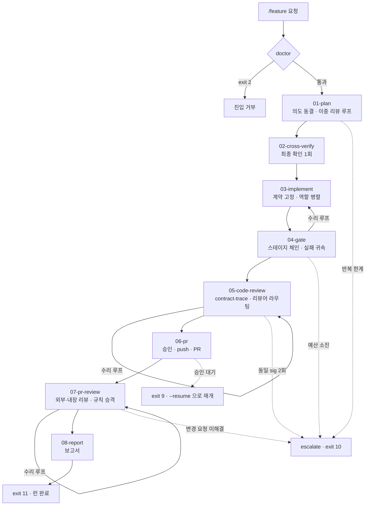
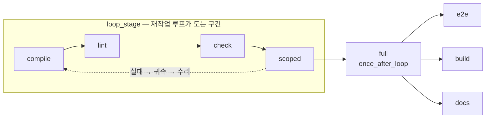
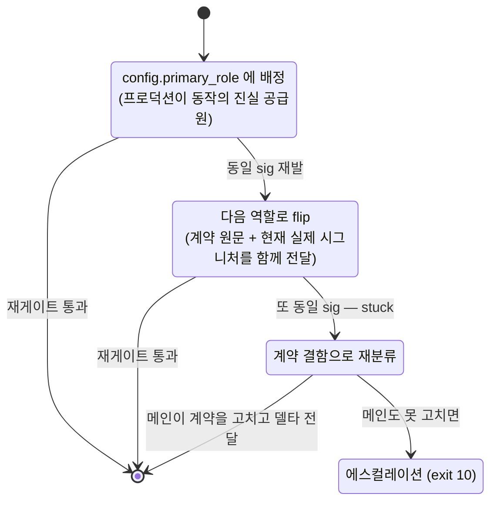

# 8페이즈 feature-pipeline 명세 (team-spec)

> **이 문서의 위치**
> `docs/harness/` 하위는 **하네스 자신의 문서**다. `docs/` 직속 6종(PRD·TRD·API_SPEC·ARCHITECTURE·ADR·UI_GUIDE)은 **프로젝트가 채우는 자리**이고, 이 리포에서는 파일럿 대상이 그 자리를 채우고 있다 ([ADR-H002](../DECISIONS.md)).
> 프로젝트 작업 중에는 읽기만 하고 고치지 않는다. 고치는 것은 하네스 작업일 때뿐이다.

---

## 0. 이 문서의 위치

### 0.1 정본 선언

**이 문서가 8페이즈 feature-pipeline의 정본이다.**

명세는 원래 이 리포 밖 로컬 플랜 3개 문서에 있었다. 클론한 사람에게는 존재하지 않는 문서이므로, 그 불변식을 스택 비종속 형태로 여기에 이식했다. **이식 이후 로컬 플랜 파일은 참조하지 않는다** — 셋 중 어느 것과 이 문서가 다르면 **이 문서가 맞다.**

| 원본 | 이 문서에 남긴 것 |
|---|---|
| 1차 (페이즈 01~04) | 페이즈 파일 포맷 · 종료 코드표 · 01~04 정의 · 수렴 판정 · 귀속 규칙 · 핑퐁 방지 |
| 2차 (페이즈 05~08) | 05~08 정의 · §E1~E14 · 실패 매트릭스 · 규칙 원장 · 승격 임계값 · 종료 코드 `9` |
| 3차 (일반화 델타) | config·어댑터 계층 · 정책의 캘리브레이션 · §P(그린필드) · 페이즈별 일반화 델타 |

1·2차가 충돌하는 지점은 **한쪽으로 결론지어 옮겼다** (§11.2에 무엇을 어느 쪽으로 정리했는지 적었다). 두 서술을 병기하지 않는다 — 병기된 명세는 명세가 아니다.

### 0.2 이식 원칙 셋

1. **고유명사를 남기지 않는다.** 빌드 도구·테스트 러너·프레임워크·리뷰 봇·에이전트 이름·리포 이름이 이 문서에 나오면 안 된다. 스택 의존은 전부 `harness/adapters/{id}.json`이 담고, 프로젝트 고유 지식은 전부 `harness/config.json`이 담는다.
2. **실측 상수를 상속하지 않는다.** 원본의 수치는 전부 원 리포에서 잰 값이다. 새 프로젝트에서 정답은 **"모른다"**이고, `calibrate`가 재서 `harness/calibration.json`에 쓴다. **정책이 상수가 아니라 캘리브레이션의 함수가 된다** (§4).
3. **예시는 코어가 아니다.** 스택별 계약 템플릿·리뷰어 보강 노트는 `harness/profiles/`에 두고, 검증 여부를 `verified` 플래그로 정직하게 표기한다.

**검수 기준**은 원칙 1의 기계 검사다 — 아래 목록이 이 문서와 코어 파일에서 **0건**이어야 한다. 예외는 `harness/adapters/`·`harness/profiles/`·`harness/config.schema.json`, 그리고 §11이 "무엇을 왜 뺐는지" 설명하며 이름을 부르는 자리다.

```
gradle spring flyway prisma archunit eslint coderabbit gemini junit jest vitest
ruff jacoco testcontainers postgres redis docker nextjs backend-implementer unit-test-writer
```

### 0.3 게이트 번호의 네임스페이스

이 리포에는 `G`로 시작하는 게이트가 이미 있다 — [ROADMAP](../ROADMAP.md) 3절의 **승격 단계 게이트** `G1`~`G3`(0단계→1단계→2단계→3단계 진행 조건)이다. 8페이즈의 그린필드 게이트는 층이 다르므로 **`§P`(Provisioning)** 로 옮겨 적는다.

| 이 문서 | 원본 3차 | 다루는 것 |
|---|---|---|
| §P1~P6 | §G1~G6 | 그린필드 리포에서만 생기는 실패 |
| — | — | `G1`~`G3`은 ROADMAP의 승격 단계 게이트로 남는다 |

---

## 1. 파이프라인 개요

`/feature <요청>` 하나가 요청부터 PR까지를 끌고 간다. 페이즈마다 **`next` → (모델이 산출물 작성) → `record`** 두 번의 왕복만 있고, `record`가 성공하면 선행조건·수렴·드리프트를 검사해 **다음 페이즈 지시문을 바로 낸다.**



**페이즈 소유와 승인**

| 페이즈 | 소유 | 승인 | 성공 시 |
|---|---|---|---|
| `01-plan` | main | none | `02-cross-verify` |
| `02-cross-verify` | main | none | `03-implement` |
| `03-implement` | `config.roles[]` 병렬 | none | `04-gate` |
| `04-gate` | main | none | `05-code-review` |
| `05-code-review` | main | none | `06-pr` |
| `06-pr` | main | **user** | `07-pr-review` |
| `07-pr-review` | main | `inherited:06` | `08-report` |
| `08-report` | main | none | `done` |

**모델이 하는 일은 둘뿐이다**: ① `produces[].path`에 파일을 쓴다 ② `record --file <그 파일>`을 호출한다.

---

## 2. 공통 규약

### 2.1 런타임 전제 — 하네스는 프로젝트의 언어를 쓰지 않는다

실행기는 **Python 3.8+ stdlib만**으로 쓴다. 프로젝트 스택에 Python 의존이 생기는 것을 감수하는 이유는 셋이다.

1. 하네스를 프로젝트 스택으로 쓰면 스택마다 실행기를 다시 만들어야 한다 — 일반화의 목적이 무너진다.
2. 프로젝트의 패키지 매니저·런타임 상태와 무관해야 **게이트가 깨진 프로젝트에서도** 돈다.
3. 프로젝트의 의존성 그래프를 오염시키지 않는다.

- 프로젝트 스택과 무관하게 **파이썬 하나만** 요구한다. `doctor`가 버전·인코딩을 확인하고, 없으면 exit 2로 안내한다.
- **서드파티 패키지 금지** → 페이즈 프론트매터는 `---`로 감싼 **JSON**이다(YAML 파서를 쓰지 않기 위한 결정).
- 모든 파일 I/O에 **UTF-8 인코딩 명시**, JSON 덤프는 **비ASCII를 이스케이프하지 않는다**, 개행 변환을 끈다. 비ASCII 식별자와 테스트 이름이 흔한 리포에서 이게 깨지면 **원장이 조용히 오염된다** (§E4).
- 경로 조립은 표준 경로 API로, **경로 240자 상한**. `lint-phases`가 모든 산출물 경로의 최대 길이를 계산해 초과를 거부한다.
- 하네스가 만드는 파일은 **프로젝트 빌드 산출물 경로에 절대 쓰지 않는다.**
- **플랫폼 관용구를 그대로 옮기지 않는다.** 프로세스 생존 판정에 시그널 0을 보내는 POSIX 관용구를 쓰면 일부 플랫폼에서 **그 프로세스를 죽인다.** 생존 판정은 pid가 아니라 heartbeat로 한다 ([ADR-H006](../DECISIONS.md)).

### 2.2 페이즈 파일 포맷

`---` 사이에 **JSON**. 한 줄로 파싱되고, 잘못 쓰면 즉시 예외가 나며, `lint-phases`가 CI 없이도 검증한다.

````markdown
---
{
  "id":"04-gate","index":4,"owner":"main","approval":"none",
  "requires":[
    {"kind":"file","path":"${run.contract_file}","min_bytes":200,
     "must_contain":"${config.contract.sections.units}",
     "unless":"state.contract.present == false"},
    {"kind":"state","pointer":"phases.03-implement.status","equals":"passed"},
    {"kind":"clean_ownership","from":"config.roles","except":"config.main_owned_paths"}
  ],
  "produces":[{"key":"gate_report","path":"${run.dir}/04_gate_report.json","kind":"json"}],
  "gate":{"runner":"adapter","fail_fast":true,"rerun_failed_once":true,
    "steps":[{"id":"compile"},{"id":"lint"},{"id":"check"},
             {"id":"scoped","tests_from":"contract","loop_stage":true},
             {"id":"full","once_after_loop":true,
              "background":"${calibration.derived.background_full_regression}",
              "join_before":"06-pr","assert_tests_ran":true},
             {"id":"e2e"},{"id":"build"},{"id":"docs"}]},
  "loop":{"counter":"repair","max":3,"stuck_after_identical":2,"on_exceed":"escalate"},
  "allow":{"agents":"config.roles[].agent"},
  "on_success":"05-code-review"
}
---

## 목적 / ## 진입 조건 / ## 절차 / ## 역할 프롬프트 템플릿 / ## 제출 형식 / ## 금지 / ## 실패 시
````

**규칙 넷**

1. **`gate.runner`는 `adapter` 또는 `none`이다. raw shell은 없다** — 페이즈 파일이 임의 명령 실행 벡터가 되지 않게 한다.
2. **`steps[]`는 스테이지 이름만 적는다.** 명령은 어댑터가 갖는다. 어댑터에 없는 스테이지(`cmd: null`)는 **"스킵됨"으로 기록되고 등급에 반영된다** — 없는 것과 통과한 것을 구분한다.
3. **`${...}`는 `config`·`calibration`·`run` 세 네임스페이스만 참조할 수 있다.** 미해결 플레이스홀더는 `lint-phases`가 **exit 2**로 거부한다.
4. **`loop_stage: true`인 스테이지까지가 재작업 루프**다. `once_after_loop: true`는 루프 종료 후 1회만이고, `background`가 참이면 잡을 띄우고 진행하며 `join_before`가 가리키는 페이즈 진입 전에 결과를 확인한다.

`lint-phases`가 잡는 것: JSON 파싱 실패 · 미해결 플레이스홀더 · `on_success` 고아·사이클 · 어댑터에 없는 스테이지 이름 · 필수 H2 섹션 누락 · 산출물 경로 240자 초과 · `taxonomy` 코드 유니크·어휘·참조 실재 · `approval != "none"` + 비대화형 조합.

### 2.3 CLI 계약과 종료 코드

stdout은 **항상 단일 JSON 봉투 하나**, stderr는 원시 도구 출력. 모델은 `render`(그대로 따를 지시문)와 `next_command`(다음에 칠 명령 전문)만 읽으면 된다.

```json
{"schema":1,"ok":false,"cmd":"gate","exit":4,"run_id":"…","phase":"04-gate",
 "state_summary":{"counters":{"repair":{"used":1,"max":3}},"escalated":false},
 "data":{"…커맨드별 페이로드…"},
 "render":"## 04 게이트 실패 — 수리 지시\n### {역할} 에게만 …",
 "next_command":"python scripts/pipeline/cli.py record --phase 04 --file …"}
```

| cmd | 하는 일 | 종료 코드 |
|---|---|---|
| `doctor` | 설정과 리포의 어긋남을 실행 **전에** 잡는다 (§P5) | 0 / 2 |
| `init [--adapter] [--name]` | config 생성 · 프로파일 정리 · 원장 초기화. **원격은 건드리지 않는다** | 0 / 2 |
| `init --feature <slug> --request-file <p> [--profile]` | 런 생성. 원본 요청을 바이트 그대로 동결 + sha256. VCS baseline 기록 | 0 / 2 |
| `calibrate [--stage] [--select]` | 스테이지를 실측해 `calibration.json`을 쓴다 | 0 / 10 |
| `next [--run-id]` | 선행조건 검증 → 지시문 패킷 렌더링. **`--run-id`가 세션 복구 경로** | 0 / 3 |
| `record --phase --file` | 스키마 + quote 검증 → 판정(수렴/드리프트) → **통과 시 자동 전이 + 다음 지시문** | 0 / 3 / 8 |
| `gate --phase [--stage <name>] [--replay <dir>]` | 어댑터 스테이지 실행 → 리포트 파싱 → 귀속 → `repair_dispatch` 생성 | 0 / 4 / 5 / 10 |
| `advance --phase` | 명시 전이(수동 개입·복구용). 산출물 신선도 + **워크트리 지문 대조**(내용 해시. 커밋은 지문을 바꾸지 않는다) | 0 / 6 |
| `retry --phase --counter --reason` | 카운터 증가 + 한계·stuck 강제 | 0 / 7 |
| `escalate` / `resume --ack --answer-file` | 상태 잠금 / 사람 답변 수용 후 해제 | 10 / 0 |
| `contract-trace --run-id` | 계약 심볼 ↔ 코드 대조. `no_contract`면 스킵 | 0 / 8 |
| `precheck --scope pr` | 예산 · 브랜치 · base divergence · 인프라. **05 진입과 06에서 각 1회** | 0 / 9 / 10 |
| `approve --phase 06 [--revoke] [--auto]` | 승인을 이벤트로 못박고 지문·등급 기록 | 0 / 3 |
| `mask --file --out` | 외부로 나가는 페이로드 마스킹 | 0 / 1 |
| `promote --scan/--stage/--apply/--flush` | 재집계 → 적재 → 실제 쓰기 + 자체 게이트 → 잔여 종결 | 0 / 4 / 6 / 8 |
| `report --out <p>` | 결정론 표 조립 + 필수 섹션 검사 → **08 통과 시 런 종료 전이** | 0 / 3 / 6 / 11 |
| `status` / `lint-phases` | 현황 / 페이즈 파일 검증 | 0 / 2 |

**종료 코드표**

| 코드 | 의미 |
|---|---|
| `0` | 성공 |
| `1` | 내부 오류 |
| `2` | 사용법 / 미해결 플레이스홀더 / `doctor` 미통과 |
| `3` | 선행조건 미충족 (이미 `passed`인 페이즈에 `record` 재호출 포함) |
| `4` | 게이트 실패 (예산 남음) |
| `5` | 게이트 실패 (예산 소진) |
| `6` | `advance` 거부 — 산출물 없음 / 지문 stale / 승격 미종결 |
| `7` | 반복 한계 · stuck |
| `8` | 제출물 스키마 · 정합성 위반 (기계로 막을 수 있는 규칙의 산문 승격 포함) |
| `9` | **사용자 승인 / 판단 대기.** 상태를 잠그지 않는다 — `10`과 다르다 |
| `10` | 에스컬레이션 대기. **상태를 잠근다** |
| `11` | 런 완료 |

`retry`가 한계·stuck에 닿으면 `status="escalated"`로 전이하고 이후 모든 커맨드가 에스컬레이션 패킷만 내며 exit 10. `_workspace/runs/{id}/ESCALATION.md`도 함께 만들어 대화에 묻히지 않게 한다. `resume --ack --answer-file` 없이는 진행 불가.

`join`과 `kill-job`은 만들지 않는다 — 백그라운드가 캘리브레이션 조건부로 켜지지만 조인 지점은 `join_before: "06-pr"` 하나로 충분하다.

### 2.4 런 디렉터리와 상태

```
_workspace/runs/{YYYYMMDD-HHMM-xxxx}/
  00_original_request.md        # 바이트 그대로. 스크립트가 sha256 재검증
  state.json  events.jsonl
  01_plan.md                    # INV 블록 + 본문 + 커버리지 표. 한 파일
  01_review_r{n}.{raw.md,json}  01_xverify_r{n}.raw.md
  02_verdict.json
  gates/gr-{n}.stdout.log  attribution.json
  05_precheck.json  05_trace.json
  05_rv_{code}.{raw.md,json}  05_review.json  05_promo_staged.json
  06_pr_req.json  06_pr_body.md
  07_pr_review.json  07_promo_applied.json
  08_report_data.json           # 집계값 + 상위 N개 제목만. 전문은 파일 참조 (<= 20KB)
```

**리뷰어 산출물 파일명은 축약 코드를 쓴다** — `config.reviewers[].code`. 경로 240자 상한이 있고 리뷰어 이름을 그대로 쓰면 넘긴다 (§E4).

tracked 신설:

```
docs/harness/pipeline/ledger/{findings.jsonl, taxonomy.json, rules_changelog.md}
docs/harness/pipeline/runs/{run_id}.md          # 08 보고서
```

`state.json`의 주요 키:

```json
{"contract":{"present":true,"sha256":"…"},
 "cross_verify":{"mode":"primary|fallback|skipped"},
 "review05":{"status":"ok|degraded|failed","reviewers_planned":3,"reviewers_ok":3,
             "mode":"merged|fanout","major":0,"need_more_context":[],
             "dropped_by_enforcement":0,"truncated":false},
 "precheck":{"at_05":{"files":7,"lines":213,"base_behind":0,"infra":{}},"at_06":{}},
 "repair":{"by_main":2,"by_agent":1,"main_cap":3,"regressions_after_main":0,"escalated_to_agent":false},
 "approval":{"06":{"granted":true,"mode":"user|auto","fingerprint":"…",
                   "scope":"push+pr","grade_at_grant":"PASS"}},
 "pr":{"number":231,"head":"…","pushed":true,"created_at":"…","state":"open"},
 "review07":{"external":{"status":"reviewed","major":0},
             "code_review":"skipped|low|medium","escaped_05":0},
 "audit":{"is_audit_run":false,"reason":null},
 "tests":{"ran":0,"expected_min":0,"status":"none|shrank|ok","source":"report_glob|calibration"},
 "grade":"PASS|PASS_WITH_GAPS|INCOMPLETE","gaps":[],
 "promotions":[{"rule_id":"…","status":"staged|applied|rejected|skipped","reason":null}],
 "budget":{"model_calls":{"total":14,"max":24,"approx":true,"by_phase":{}}},
 "calibration":{"present":true,"partial":false,"adapter_verified":false}}
```

**컨텍스트 관리**: 게이트 로그 전문은 파일에만, stdout에는 소유자별 브리프(실패당 60줄 상한)만. 매 `next`의 `render` 헤더에 300자 이내로 재주입(INV 요약 / 소유권 표 / 남은 예산 / 금지 목록). 플랜 갱신은 **전체 재작성이 아니라 부분 편집**으로 해서 전문이 라운드마다 다시 쌓이지 않게 한다.

### 2.5 실패 3분류

모든 실패는 셋 중 하나로 분류된다. **분류가 카운터 소모 여부를 정한다.**

| 분류 | 뜻 | 카운터 | 대처 |
|---|---|---|---|
| **infra** | 하네스도 모델도 원인이 아니다 — 외부 의존이 없거나 불통 | **소모하지 않는다** | 즉시 에스컬레이션. 판정은 `adapter.infra_failure_patterns` |
| **정책** | 설정·규약이 어긋났다 | 소모하지 않는다 | 진입 거부(exit 2/3) 또는 사용자 판단(exit 9) |
| **제출물** | 모델의 산출물이 스키마·정합성을 어겼다 | **소모한다** | exit 8 + 재제출 |

**인프라를 먼저 걸러내지 않으면 외부 의존 미기동이 "구현 역할의 실패"로 오분류돼 예산을 태운다.** 이것이 §E9가 다루는 실패이고, 귀속 4단계(§3.4)의 0단계인 이유다.

보조 어휘로 **비차단**(등급에 드러나지만 진행을 막지 않는다)과 **판단**(파이프라인이 판정하지 않고 사람에게 남긴다)을 쓴다.

### 2.6 불변식 — 일반화 과정에서 약해지기 쉬운 것들

1. **워크트리 지문 결합** — 게이트 통과 후 **소유 범위의 내용**이 바뀌면 영수증이 stale(exit 6). "통과한 셈 치고 넘어가기"의 구조적 차단. **커밋은 내용을 바꾸지 않으므로 지문도 바꾸지 않는다** — 06 이 PR diff 를 위해 요구하는 커밋이 04 영수증을 낡게 만들던 것이 M25 였다.
2. **`record`는 멱등이 아니다** — 이미 `passed`인 페이즈에 다시 `record`하면 exit 3. 재작업은 `retry`로만.
3. **`stuck_after_identical: 2`** — 동일 실패 시그니처가 연속 2회면 예산이 남아도 즉시 에스컬레이션. **`2`와 수리 루프의 `loop.max: 3`은 미검증 상속값이다 (§11.1).**
4. **ambiguous 동시 배정 금지** — `primary_role` → flip → 계약 결함 재분류.
5. **quote 부분문자열 검증 · 단조성** — "지적 조용히 증발" 차단.
6. **05는 staged까지, 실제 쓰기는 07에서 한 번.**
7. **기계로 막을 수 있는 규칙의 산문 승격은 exit 8.**
8. **모델의 자진 신고 중 기계로 확인 가능한 것은 반드시 기계로 확인한다** — "고쳤다" → diff, "계약을 지켰다" → `contract-trace`, "리뷰했다" → JSON 스키마 + quote 검증.
9. **어떤 페이즈도 stdin을 블로킹하지 않는다** — 승인 대기는 exit 9로 정상 종료하고 `--resume`으로 잇는다.

**재개 판정은 "돌았다"가 아니라 "남겼다"를 본다.** 출력 파일의 존재와 죽은 heartbeat는 신호일 뿐이고, 소유 경로의 미커밋 변경이나 그 페이즈의 커밋이 있어야 재개다. 출력 파일이 있어도 산출물이 없으면 재개가 아니고, **종료 코드가 0이 아닌 출력 파일을 신호에서 빼는 것만으로는 부족하다** — 사용량 한도가 산출물을 다 쓴 *뒤* 상태 파일 갱신 직전에 떨어지는 형태를 놓친다 (M13).

---

## 3. 페이즈 01~08

### 3.1 `01-plan` — 의도 동결 · 이중 리뷰 루프 · 수렴 판정

**입력**: `00_original_request.md`(바이트 동결 + sha256) · `config.project.instruction_file` · `config.project.rules_dir`
**출력**: `01_plan.md` 하나 — 상단 INV 블록, 본문, 하단 커버리지 표
**성공 조건**: `CONVERGED` (아래) + `drift_score == 0`

#### 의도 동결이 결정론의 앵커다 — 단, 파일 하나로

`init`이 원문을 바이트 그대로 복사하고 sha256을 못박는다. 그다음 산출물은 **`01_plan.md` 하나뿐**이다. 불변식·플랜·커버리지를 세 파일로 나누면 파일마다 `record` 왕복이 붙는다.

```markdown
<!-- INTENT
{"invariants":[{"id":"INV-2","kind":"must_not","text":"…",
                "source_quote":"원문의 부분문자열"}],
 "out_of_scope":["…"],
 "acceptance":[{"id":"AC-1","text":"…","source_quote":"…"}]}
-->

# 플랜 …본문…

<!-- COVERAGE
{"covers":[{"id":"INV-2","status":"covered","plan_section":"§0 범위 밖"}],
 "added_scope":[]}
-->
```

**모든 `source_quote`는 원문의 문자 단위 부분문자열이어야 한다**(공백만 정규화 후 포함 검사). 아니면 exit 8. 이것이 "없는 요구를 지어내거나 실제 요구를 자기 말로 바꿔치기"를 막는 유일한 기계적 손잡이고, 검사 자체는 한 줄이라 사실상 공짜다.

**원본 요청이 짧으면 INV 블록을 생략한다** — 임계값은 `config.profile.inv_skip_below_chars`. 한 문단짜리 요청에서 "의도 이탈"은 물리적으로 일어나기 어렵다.

`drift-check` 강제: `covers`가 모든 INV를 정확히 한 번씩 포함 / 모든 `plan_section` 문자열이 본문에 실제 존재 / `covered`가 아니면 `reason` 필수. **`drift_score > 0`이면 전이 거부(exit 4)** 하고 원문 인용과 함께 이탈 항목을 명시한 재조정 패킷을 낸다. `dropped` 상태의 `must` 불변식이 남은 채로는 넘어가지 못하며, 넘기려면 사용자 승인이 필요하다.

#### 리뷰어 둘을 매 라운드 병렬로 돌린다

작성자(main)와 격리된 **내부 플랜 리뷰어**와 **외부 교차검증기**(`config.cross_verify`)를 매 라운드 병렬로 돌린다. 교차검증이 마지막이 아니라 **매 라운드** 걸린다.

**외부 교차검증기가 없는 머신이 있다.** `config.cross_verify.primary`가 부재하면 **폴백 에이전트**로 대체하고 `state.cross_verify.mode`에 기록한다. **둘 중 하나가 폴백이면 1라운드 수렴을 허용하지 않는다** — "독립 관측 두 개"라는 전제가 약해지기 때문이다.

#### 수렴 판정 — 모델 자기판단 배제

각 회차가 리뷰어별로 **두 파일**을 낸다: 출력 원문 `.raw.md` + 구조화 `.json`.

```
finding_key = sha1(category | target_role | normalize_title(title))[:16]
new_keys    = keys(round k) - union(keys of rounds 1..k-1)
```

`CONVERGED`(exit 0) 조건: **신규 0 / open critical·major 0 / `drift_score == 0` / 아래 라운드 조건.**

**라운드 조건 — 무조건 2회를 강제하지 않는다.**

- **1라운드 수렴 허용**: 리뷰어 둘이 **모두** Major 이상 0건이고, **둘 다 폴백이 아닐 때만.** 독립적인 두 리뷰어가 동시에 놓칠 확률은 한 리뷰어를 두 번 돌리는 것보다 낮다.
- 어느 한쪽이라도 Major 이상을 냈으면 **최소 2라운드.** 2회차는 페이즈 파일에 고정된 `focus`로 강제 재검토한다.
- 상한은 프로파일에 따라 3(`small`) 또는 5(`normal`). 초과 시 exit 7 → 에스컬레이션(미해결 Critical·Major 전문 + "이대로 진행 / 범위 축소 / 중단" 3지선다).

**거짓 수렴 차단** (전부 값싼 검사)

- **quote 부분문자열 검증** — 모든 finding의 `quote`가 `.raw.md`에 실재해야 한다. 추가로 `.raw.md`의 심각도 헤딩 개수와 findings 길이가 일치해야 한다. **1라운드 수렴을 허용하는 만큼 이 검사가 더 중요해진다** — "Major 0건"이 진짜인지 원문으로 확인하는 게 이것뿐이다.
- **단조성** — 이전 회차 open이던 key는 이번에 (a) 다시 findings에 있거나 (b) `resolved_from_previous`에 `resolved_by`와 함께 있어야 한다. 그냥 사라지면 exit 8.
- `record` 페이로드의 `reviewer`가 `main`이면 exit 8.

#### 프로파일 자동 판정

`config.profile`이 임계값을 갖는다. 판정 기준은 **계약의 `${config.contract.sections.units}` 항목 수 + `${config.contract.sections.entrypoints}` 항목 수**이고, `config.profile.small_max_units` 이하면 `small`(01 라운드 상한 3, 05 리뷰어 최대 1개), 넘으면 `normal`(상한 5, 라우팅된 전부). 사용자가 `--profile`로 덮어쓸 수 있다.

#### `01-plan`이 페이즈 전체의 `requires`를 미리 검증한다

`01`은 자기 선행조건만 보지 않고 **런 전체의 `requires`를 미리 훑는다** — 첨부 상한, 계약 절 존재, 어댑터 스테이지 실재. 뒤 페이즈에 도달해서야 막히면 앞 페이즈에 쓴 시간이 전부 낭비다 (M18).

**다만 사전 검사는 예측이지 보장이 아니다.** 앞선 페이즈가 파일을 고치므로 시작 시점의 계산이 진입 시점에 틀릴 수 있다. **그래서 둘 다 필요하다** — 런 시작 시 경고 + 페이즈 진입 시 강제.

### 3.2 `02-cross-verify` — 최종 확인 1회

**입력**: 확정된 `01_plan.md`
**출력**: `02_verdict.json`
**성공 조건**: Critical 0

01의 매 라운드에서 이미 교차검증이 걸렸으므로 여기서는 **최종 플랜 전문에 대한 확인 1회**만 한다. Critical이 남아 있으면 01로 되돌린다(최대 1회 왕복) — 01 루프에 교차검증이 들어갔으니 실제로는 거의 발생하지 않는다.

`config.cross_verify.required: false`이고 primary·fallback이 **둘 다 불가**하면 **스킵 + 등급 `PASS_WITH_GAPS`**. 조용히 통과시키지 않는다.

### 3.3 `03-implement` — 계약 고정 + 역할 병렬

**입력**: `01_plan.md` · `02_verdict.json`
**출력**: 계약 파일(`${config.contract.path_template}`) + 각 역할의 코드 변경
**성공 조건**: `compile` 통과 + `clean_ownership` 통과

- 메인이 계약 파일을 **직접** 작성한다(역할 에이전트 위임 금지). 템플릿은 `harness/templates/contract.md`.
- `requires`의 `must_contain`이 `config.contract.required`에 적힌 필수 절을 검사한다. **절 제목과 언어를 프로젝트가 정한다** — `config.contract.sections`가 단일 출처다.
- 사용자 승인 지점 없음. **`config.roles[]` 전원을 한 메시지 안에서 동시 호출**한다(2인 고정이 아니라 N인).
- 게이트: `compile` + **`clean_ownership`** — VCS가 보고하는 실제 변경 집합을 각 역할이 보고한 `claimed_files`와 대조해 (a) 소유 경로 위반 (b) 아무도 claim 안 한 orphan 파일을 잡는다. 위반 시 exit 8 + 롤백 지시. 소유 계산은 `config.roles[].owns`/`excludes` + `config.main_owned_paths`이고, **`doctor`가 쓰는 것과 같은 glob 판정기를 쓴다** — 같은 규칙이 두 곳에서 갈라지는 것이 이 리포가 이미 겪은 실패다.

#### 역할 에이전트 정의는 규약을 담지 않는다

`.claude/agents/{role}.md`는 **소유 경계·제출 형식·금지 사항만** 담고 목표 3KB 이하로 쓴다. 프로젝트 지식은 네 곳에서만 온다 — `config.project.instruction_file` · `config.project.rules_dir` · 계약 파일 · `agent-memory/{role}/`.

이유는 비용이다. 규약 산문을 정의에 복사하면 **역할 호출마다 그 고정비가 따라붙는다.** 정의는 "어디서 읽을지"만 지시한다.

### 3.4 `04-gate` — 스테이지 체인 + 타겟 재작업

**입력**: 03의 코드 변경 + 계약 파일
**출력**: `04_gate_report.json` · `attribution.json` · `repair_dispatch`
**성공 조건**: 모든 차단 스테이지 통과 + `assert_tests_ran`

#### 스테이지 체인은 어댑터에서 온다



`e2e`·`build`·`docs`는 조건부다 — 어댑터에 `cmd`가 없거나 `when_touched`가 안 맞으면 스킵으로 기록된다.

- `loop_stage: true`까지가 재작업 루프의 게이트다. 루프 안에서 전체 회귀를 돌리지 않는 것이 이 설계의 가장 큰 절감이다.
- `full`의 백그라운드 여부는 **상수가 아니라 캘리브레이션의 함수**다 — `calibration.derived.background_full_regression` (§4). 전체 회귀가 짧은 스택에서 백그라운드 기계는 커맨드·상태 키·실패 모드만 늘린다.
- **`tests_from: "contract"`** — 계약의 `${config.contract.sections.units}`·`${config.contract.sections.entrypoints}` 심볼에서 선택자를 조립한다. 조립 문법은 `adapter.stages.scoped.select`.

> **선택자는 테스트 이름이 아니라 파일 경로여야 한다.** 이름 필터는 러너가 모든 파일을 수집·변환하고 환경을 세운 **뒤에** 거르므로 비용을 줄이지 못한다. 이 리포의 실측에서 이름 필터는 전체 대비 100.2%였고 **경로 필터는 14.6%(6.8배 싸다)** 였다 (M16). `loop_stage`의 성립 여부는 스택별 판정이며, `adapter.select` 어휘가 그 구분을 담는다.

- 어댑터 스테이지가 `cmd: null`이면 **"스킵됨"으로 기록되고 등급에 반영된다.** "없는 것"과 "통과한 것"을 구분한다.
- **`assert_tests_ran`** — 테스트가 실제로 몇 개 돌았는지를 별도 신호로 본다 (§P1). 빈 테스트 스위트는 통과하고, 통과는 초록불로 보인다.

#### 실패 귀속 — 4단계

**1차 소스는 구조화된 테스트 리포트**(`adapter.test_report.{format, glob}`). 콘솔 정규식은 컴파일 실패와 폴백용이다.

**0. 인프라를 먼저 걸러낸다.** `adapter.infra_failure_patterns` 매칭 시 `owner: "infra"` — **카운터를 소모하지 않고 즉시 에스컬레이션.** 이걸 안 하면 외부 의존 미기동이 구현 역할의 실패로 오분류돼 예산을 태운다.

**1. 컴파일·타입.** `adapter.attribution.compile_error_regex`가 뽑은 `path`를 `config.roles[].owns`에 매칭해 소유자를 정한다. 경로 추출 실패 시 태스크 단위 폴백.

> **주의**: 테스트 컴파일 실패의 상당수는 **구현 역할이 계약 시그니처를 안 지켜서** 생긴다. `adapter.attribution.symbol_not_found_patterns` 매칭 + 그 심볼이 계약 파일에 존재하면 **`config.primary_role`로 강제한다.** 경로만 보고 테스트 역할에 보내면 매번 오귀속된다.

**2. 테스트.** `adapter.test_report.format` 파서가 실패를 `{unit, file, message, frames[]}`로 정규화한다. 스택에서 테스트가 아닌 첫 애플리케이션 프레임(`adapter.attribution.app_frame_prefixes`)이 원인 유닛이다.

| 조건 | owner |
|---|---|
| non-assertion 예외 + 최상단 앱 프레임이 어느 역할의 `owns`에 속함 | 그 역할 |
| 스키마·마이그레이션 계열 메시지 | `primary_role` |
| assertion 계열 / 목 불일치 — 계약에 심볼 **없음** | 테스트 역할 `[out_of_contract]` |
| assertion 계열 / 목 불일치 — 계약에 심볼 **있음** | `ambiguous` |

스택별 특수 규칙(특정 테스트 슬라이스 애노테이션 + 특정 오류 메시지 조합 등)은 **어댑터의 `attribution.rules[]`(선택)** 로 이동한다. 규칙이 없으면 프레임 경로 → 역할 glob의 일반 규칙만 적용한다.

정규식 계약 파싱은 완전할 필요가 없다. 못 찾으면 `ambiguous`로 안전 낙하한다. **"틀린 확신"보다 "모른다"가 낫다.**

**3. 못 정하면 `ambiguous` → `config.primary_role` → 동일 sig 재발 시 다음 역할로 flip.**

#### 핑퐁 방지 — 단일 소유자 + 순차 flip

**`ambiguous`를 두 역할에 동시 배정하지 않는다.** 03의 병렬이 안전했던 건 파일 소유가 안 겹치고 계약이 고정됐기 때문이다. 4단계 수리는 "같은 하나의 동작"을 두고 다투는 상황이라, 동시에 보내면 구현은 테스트에 맞춰 구현을 바꾸고 테스트는 구현에 맞춰 테스트를 바꾸는 핑퐁이 나고 **둘 다 계약에서 멀어진다.**



예외: 실패 집합이 대상을 공유하지 않는 disjoint 파일군이면 동시 배정을 허용한다.

#### 예산

- **실패 시그니처 정규화** — 경로·해시·타임스탬프·숫자를 마스킹한 뒤 `sha1(owner|unit|ftype|msg)`. **동일 sig가 연속 2회 등장하면 stuck** → 예산이 남아도 즉시 에스컬레이션.
- **플레이키 격리** — 실패한 테스트 유닛만 선택자로 1회 재실행. 통과하면 `flaky`로 분류해 귀속·카운터에서 제외하고 **원장·보고서에 명시**한다. flaky 판정 후 확정된 실패만 시그니처 체인에 넣는다.
- `gate`가 내는 `by_owner`를 모델이 그대로 쓴다. **모델은 실패를 다시 분류하지 않는다.**
- **`gate --replay <fixture-dir>`** — 실제 러너 실행 없이 픽스처로 수리 루프를 시뮬레이션한다. 개발 시간 절감의 핵심이라 자르지 않는다.

### 3.5 `05-code-review` — 계약 대조 · 리뷰어 라우팅

**입력**: 04의 영수증 + 계약 + diff
**출력**: `05_review.json` · `05_trace.json` · `05_promo_staged.json`
**성공 조건**: Critical/Major 해소 + 지문 유효

#### 실행 순서 (비용 오름차순 · 첫 실패에서 멈춘다)

```
1. precheck --scope pr     정적   예산·브랜치·divergence·인프라   → 초과 exit 9 / infra exit 10
2. contract-trace          정적   계약 ↔ 코드 대조 (no_contract 면 스킵, §E3)
3. Critical 있으면 선수리 + scoped 재게이트                       → 2로 복귀
4. 리뷰:  diff <= config.review.merge_below_diff_lines  → 단일 에이전트 다중 체크리스트
          그보다 크면                                    → 병렬 fan-out (profile 상한까지)
          인라인 상한 초과                                → 경로 전달 폴백 (§E5)
5. 병합 → 수리(국소면 메인 직접, §E7) → 델타 재리뷰 1명

**델타 재리뷰의 한 명은 실행기가 결정론으로 고른다** — 막은 지적을 가장 많이 낸
리뷰어이고 동률이면 `config.reviewers` 순서다. 실패한 리뷰어는 후보가 아니다.
모델이 고르면 라우팅 결정론이 델타 라운드에서만 무너지고 `escaped_05` 가 라운드마다
다른 것을 센다.

**그리고 `review05.status` 는 런 안에서 좋아지지 않는다.** 라운드별 status 를
따로 남기고 런의 값은 그중 **최악**이다(`review.worst_status`). 델타 라운드는
분모가 1이라 깨끗하면 `ok` 가 나오는데, 그것을 런의 값으로 쓰면 **1라운드의
`degraded` 가 조용히 지워진다** — §E1 이 막으려던 구멍이 옆문으로 다시 열린다.
6. 코드 확정 → 전체 회귀 1회 → 승인 알림 발신
```

**1·2번이 무료다.** 뒤에서 되돌릴 일을 여기서 먼저 잡는다.

#### `contract-trace` — 검사 5종

04의 `tests_from` 파서를 재사용해 계약의 절에서 백틱 심볼을 뽑는다.

| 검사 | 코드 | 판정 방법 |
|---|---|---|
| 계약의 유닛이 소스에 존재 | `missing_impl` | **컨테이너명 + 심볼명 쌍**으로 검색. Critical, `primary_role`, **리뷰어 전 선수리** |
| 그 유닛을 참조하는 테스트가 존재 | `untested_contract_item` | 심볼 문자열 **또는** 진입점 경로. Major, 테스트 역할 — **첫 3런 `warn_only`** (§E6) |
| 계약의 오류 어휘 상수가 실재 | `missing_error_symbol` | `config.contract.sections.errors` 절. Critical, 선수리 |
| 진입점이 실재 | `missing_entrypoint` | `adapter.entrypoint_resolver`. Critical, 선수리 |
| 계약에 없는 신규 public 심볼 | `out_of_contract` | Major — **첫 3런 `warn_only`** |

- **컨테이너명 + 심볼명 쌍으로 검색한다.** 심볼명만 보면 흔한 이름이 다른 파일에 있어 **거짓 통과**한다. 컨테이너를 못 찾으면 `unknown`으로 낙하시킨다.
- 파일 읽기는 전부 UTF-8 명시 (§E4).
- 커버리지 도구가 없는 상태에서 `untested_contract_item`이 "테스트 약화" 탐지를 대신한다.
- `adapter.entrypoint_resolver`가 미정의면 `missing_entrypoint`만 스킵하고 나머지 4종은 수행한다 + 보고서에 명시.

#### 리뷰어 선정 (결정론)

`config.reviewers[]`의 `when` glob이 변경 파일 경로에 매칭되면 그 리뷰어가 켜진다. 우선순위는 배열 순서다.

- `small` → 최상위 **1개**. `normal` → `config.review.profile_caps.normal`까지.
- diff가 `merge_below_diff_lines` 이하면 **통합 모드**(단일 에이전트가 체크리스트를 순차 적용). 같은 diff를 여러 번 보내지 않는다.
- 기동 **전에** 스킬 파일 존재를 확인한다(무료, §E10). 프롬프트 첫 줄은 스킬 파일을 읽으라는 지시이고 **본문을 복사하지 않는다.**
- 입력은 **인라인 diff + 계약 + trace**. 리포 탐색 금지, 부족하면 `need_more_context`에 적고 지적하지 않는다.
- **작성자 격리**: `config.roles[].agent`에 있는 에이전트는 리뷰어가 될 수 없다(`reviewer`가 그중 하나면 exit 8).

#### "검토 제외" 목록 자동 주입

`taxonomy.json`에서 `enforceable != "prose"` && `status == "active"`인 category를 프롬프트에 넣는다. `record`는 해당 category를 드롭하고 `dropped_by_enforcement`에 센다(**조용히 버리지 않는다**). **기계 강제 규칙이 늘수록 05가 자동으로 싸지고 좁아진다** — 규칙 승격의 복리가 실현되는 지점이다.

#### 제출 형식

```json
{"reviewer":"{code}","round":1,"status":"ok",
 "by_checklist":{"{checklist}":[{"id":"F-1","category":"AUTHZ_MISSING_RULE","severity":"critical",
   "target_role":"impl","title":"…","path":"…","line":34,
   "quote":"…","evidence":"…","suggestion":"…"}]},
 "resolved_from_previous":[{"id":"F-2","resolved_by":"…"}],
 "need_more_context":[]}
```

- **재제기는 1급 어휘다** — finding 안의 `"reraised_from_previous": "F-1"`. `finding_key`가 제목을 포함하므로 다듬은 제목으로 다시 올리면 같은 지적이 "신규"이자 "증발"이 되어 한 번의 재제기가 오탐을 둘 낸다. 열려 있는 이전 지적을 가리키지 않으면 exit 8.
- **`resolved_from_previous`의 `id`는 같은 리뷰어의 지적만 닫는다.** 리뷰어가 여럿이면 전부 `F-1`부터 매기므로 id를 전역 대조하면 한 줄이 서로 다른 지적 여럿을 동시에 닫는다. 다른 리뷰어의 것은 `key`로 닫는다. **05는 이 위험이 리뷰어 수만큼 커진다.**
- **이전 회차의 열린 목록에서 닫힌 것은 뺀다.** 안 빼면 3라운드가 1라운드에 이미 해소된 지적까지 다시 적어야 하고, 그 목록이 리뷰어 프롬프트에 실리므로 접두부가 라운드마다 자란다.

- **quote 부분문자열 검증 · 단조성 · 닫힌 어휘 · `finding_key`** — 01의 검사 그대로.
- **`.raw.md`의 형태도 01과 같다** — 지적 하나에 심각도 헤딩(`critical`/`major`/`minor`) 하나이고, **헤딩 개수와 findings 개수가 같아야 한다.** 이 규칙을 페이즈 파일에 적지 않으면 리뷰어가 알 길이 없고 메인이 사후에 헤딩을 붙여 맞추게 된다 — 원문 대조라는 검사의 취지가 그 순간 사라진다. **05는 리뷰어가 여럿이므로 이 비용이 인원수만큼 곱해진다.**
- 병렬 경로에서 **2인 이상이 지적한 항목은 severity 한 단계 상승**(독립 관측의 합치).
- 통합 경로는 `by_checklist`로 관점을 분리하고 **0건인 체크리스트도 명시**한다(누락과 구분, §E10).
- findings가 `config.review.findings_max`를 넘으면 Critical/Major만 남기고 절단 + `truncated: true` (§E5).

#### 수리 루프

```json
"loop":{"counter":"review_repair","max":2,"stuck_after_identical":2,"on_exceed":"escalate",
        "rereview":"delta_single_reviewer",
        "local_repair":{"by":"main","max_per_run":3,
                        "criteria":{"failures_max":2,"files_max":1,"lines_max":20}}}
```

> **미검증 상속값** — 위 블록의 `max: 2` · `stuck_after_identical: 2` · `max_per_run: 3`과 그 판정 기준 세 숫자는 원본에서 왔고 이 리포에서 재본 적이 없다 (§11.1).

- **Critical/Major만** 대상. Minor는 원장 적재 후 보고서로. `CONTRACT_DEFECT`는 수리가 아니라 **에스컬레이션**이다.
- 배정은 **04의 소유자 라우팅 재사용** — 단일 소유자, `ambiguous`는 `primary_role` 우선, 동일 sig 재발 시 flip.
- 수리가 발생하면 지문이 바뀌어 영수증이 stale → 06이 자동으로 막는다. **"재게이트를 잊는" 실패 모드가 구조적으로 불가능**하다.
- 수리 후: `gate --stage scoped` → **전체 회귀 1회**(인프라 확인 선행, §E9) → 승인 알림.

#### `review05.status` — findings 개수와 분리한다

**리뷰어가 전부 실패해도 findings는 0건이다.** 그러면 "지적이 없다"가 "리뷰가 됐다"로 읽힌다. 그래서 **리뷰 수행 여부를 별도 신호로 만든다** (§E1).

| `review05.status` | 조건 |
|---|---|
| `ok` | 계획된 리뷰어가 **전부** 유효 JSON을 제출 |
| `degraded` | 1개 이상 실패했지만 1개 이상 성공 |
| `failed` | 전부 실패, 또는 계획된 리뷰어가 0개 |

### 3.6 `06-pr` — 승인 · push · PR

**입력**: 05의 확정 코드 + 지문
**출력**: `06_pr_body.md`(마스킹 완료) · `06_pr_req.json`
**성공 조건**: 사용자 승인 + push + PR 생성/갱신

| # | 단계 | 실패 시 |
|---|---|---|
| 1 | `precheck --scope pr` 재확인 (예산·divergence·마이그레이션·인프라) | 예산 exit 9 / behind exit 9 / 의미 충돌 exit 10 |
| 2 | 브랜치 — `${config.vcs.branch_pattern}` 매칭, HEAD가 `config.vcs.protected`에 없음 | exit 3. **브랜치를 자동 생성하지 않는다** |
| 3 | 원격 브랜치 fetch — non-fast-forward 여부 | non-FF면 **에스컬레이션**(force-push 금지, §E8) |
| 4 | PR 본문 조립 + `mask` | secret 파일이 없으면 패턴 마스킹만 + 원장 기록 |
| 5 | **승인** (알림은 05 종료 시 이미 발신) | 미응답이면 exit 9로 정상 종료 → `--resume` |
| 6 | 계약 파일 삭제 → push → PR 생성/갱신 | push 성공은 원격 ref 조회로 확인 |

**계약 파일 삭제는 push 직전이다.** 04 귀속과 05 대조가 계약을 계속 읽으므로 시점을 미룬다.

#### 승인 프로토콜

```
## PR 생성 승인 요청
{remote}  {head} → {base}      7파일 / 213라인 (예산 내)
게이트: scoped PASS · 전체 회귀 PASS · {스킵된 스테이지 나열}
05: 리뷰어 2/2 OK · Critical/Major 0 · Minor 2건(본문 명시)
완료 등급 예상: PASS_WITH_GAPS ({사유})
승인 범위: push + PR 생성.  07 코멘트 게시는 등급 재확인 후.  머지는 포함하지 않습니다.
→ python scripts/pipeline/cli.py approve --phase 06
```

- `approve`가 **승인 시점 지문 + 등급**을 기록한다. 이후 코드가 바뀌면 지문 불일치로 승인 자동 무효(exit 6) → 재승인.
- **`--auto`의 범위를 좁힌다**: 06 시점의 등급은 외부 리뷰를 아직 못 봤으므로 "예상"이다. → 사전 승인은 **push + PR 생성까지만** 자동이고, **07의 코멘트 게시는 등급을 재확인한 뒤** 진행한다. `PASS_WITH_GAPS`로 강등되면 게시를 보류하고 승인 대기로 전환한다. (이미 나간 PR을 되돌릴 수는 없다 — 이 한계를 보고서에 명시한다.)

#### 마스킹

**외부로 나가는 페이로드에만** 적용한다. 원장·내부 보고서는 **원문 보존.**

1. `config.project.secret_files[]`에 실재하는 값과의 **문자열 일치** → 키 이름은 남기고 값만 `[MASKED]`.
2. 명시 패턴 — 커넥션 문자열, 베어러 토큰, 클라우드 액세스 키.

**"32자 난수처럼 보이는 것"을 통째로 가리지 않는다** — 식별자·해시가 지워지면 스택트레이스가 무의미해진다. secret 파일이 없으면 2번만 적용하고 원장에 기록한다(경고이지 실패가 아니다).

#### push · PR (멱등)

- 리모트는 `${config.vcs.remote}`, base는 `${config.vcs.base_branch}`로 **못박는다.** 기본값에 기대지 않는다.
- WIP는 로컬 스쿼시 후 **최초 1회 푸시**, 이후는 커밋 적재만. **force-push 금지**(외부 리뷰 스레드와 승인이 깨진다).
- PR 조회 → 있으면 갱신 + `state.pr.number` 재사용, 없으면 생성.
- **원격이 없으면**(그린필드 첫 런) exit 9 + 3지선다 (§P3).

#### PR 본문 — 템플릿 매핑

| 섹션 | 소스 |
|---|---|
| 개요 | `01_plan.md` INV 블록 + 원본 요청 요약 |
| 작업 내용 | 계약의 유닛·진입점 절 + diff 통계 |
| 기술적 고려사항 | 02 교차검증에서 **채택된** 판정과 근거 |
| 참고사항 | 미해결 Minor, **건너뛴 비차단 게이트 나열**. 이슈 자동 종결 링크는 비워둔다 |
| 체크리스트 | 게이트 결과로 기계 체크. 확인 불가 항목은 미체크 |

**완료 등급을 본문 최상단 한 줄로**: `PASS` / `PASS_WITH_GAPS(사유 나열)`.

### 3.7 `07-pr-review` — 외부·내장 리뷰 · 규칙 승격

**입력**: PR 번호 + 06의 승인 지문
**출력**: `07_pr_review.json` · `07_promo_applied.json`
**성공 조건**: 변경 요청 해소 + 승격 종결

#### 진입 시 외부 상태 확인

PR 상태를 먼저 본다. **닫혔거나 머지됐으면 수리·코멘트를 하지 않고 정상 종료**하고 보고서에 명시한다 (§E8). 머지된 PR에 코멘트를 달거나 이미 머지된 코드를 수리하지 않는다.

#### 리뷰 소스와 호출 조건

| 소스 | 획득 |
|---|---|
| PR 코멘트 (외부 봇 · 사람) | 폴링 — **최소 출력 프로브**로 존재만 확인, 붙으면 **1회만 전문**. PR 생성 시각 기준 경과 차감, `poll_sec` 간격, `timeout_sec` 상한 |
| 내장 `code-review` | 로컬 브랜치 diff, `--effort` **명시** |

```
생략 = (profile == small AND external.status == reviewed)
    OR (review05.status == ok AND external.status == reviewed
        AND review05.major == 0 AND external.major == 0)

review05.status != ok        → --effort medium   (리뷰 결손을 비싼 쪽으로 메운다)
external.status != reviewed  → --effort low + PASS_WITH_GAPS
audit_run (5런마다 1회)       → 생략 조건을 만족해도 medium 강제 (§E2)
```

**`config.external_pr_review.enabled: false`면 봇 소스 자체가 없다.** `external.status = "disabled"`가 되고, 생략 조건은 `reviewed`를 요구하므로 **생략이 성립하지 않는다 — 내장 리뷰가 항상 돈다.** "봇이 없으니 리뷰가 없었다"가 "통과"가 되지 않는다.

**`external.status = reviewed`의 정의를 명시한다** — "봇이 뭔가 썼다"로는 부족하다. 봇 계정의 리뷰 또는 코멘트가 존재하고 그 안에 **findings 구조가 있을 것.** 봇 출력 언어에 의존하지 않도록 **헤딩 텍스트가 아니라 구조**(리뷰 상태·코멘트 개수·심각도 라벨)로 판정한다. 구조 판정에 실패하면 `not_a_review`다. **심각도 판정에 실패하면 보수적으로 Major로 취급한다** — 모르면 생략하지 않는 방향으로 낙하시킨다.

- 두 소스 모두 05와 **같은 finding 스키마**로 정규화한다(`source`: `code-review` / `external` / `human`).
- **05가 이미 낸 `finding_key`는 dedup.** 대신 `escaped_05`로 세어 05 라우팅 품질을 측정한다.
- **사람 코멘트는 수리 대상이 아니라 보고 대상이다.** 파이프라인이 사람과 논쟁하지 않는다.

#### 변경 요청은 차단이다

외부 리뷰가 변경 요청 상태를 내면 **수리 루프 대상**이고 미해결로 07을 끝낼 수 없다(exit 10). PR 체크가 어차피 빨간불인데 파이프라인이 초록불인 척하면 안 된다.

**타임아웃 후 늦게 도착한 경우**는 08 직전 재확인에서 잡아 **등급을 강등**하되 수리 루프로 되돌아가지 않는다(무한 대기 방지).

#### 게시

**단일 코멘트 하나**로 게시한다(인라인 pending 흐름은 쓰지 않는다 — 왕복이 늘고 스레드 정리 부담만 커진다). 본문도 `mask`를 거친다. 게시 실패는 infra → 2회 재시도 → **비차단 스킵**(findings는 원장에 남으므로 유실이 아니다).

#### 승격 적용 (런당 단 한 번)

```
1. promote --scan     후보 0 → 모델 호출 없이 스킵, promotions: [] 종결   ← 초기 런의 최빈 경로
2. verdict            create | amend | skip  (duplicate 면 create 금지, contradicts 면 차단 → 에스컬레이션)
3. base fetch → 규칙 전용 브랜치 분기 (있으면 체크아웃해 이어서, §E11)
4. promote --apply    파일 쓰기 + 베이스라인 파일 스테이징 확인
5. 자체 게이트         lint + check 스테이지
6. 실패 → 브랜치 폐기, rejected + 사유.  push 실패도 rejected + 사유
7. 성공 → 별도 PR      기능 PR과 섞지 않는다. 머지 순서 제약 없음(효력은 다음 런부터)
```

### 3.8 `08-report` — 보고서

**입력**: `08_report_data.json` 하나 (20KB 이하)
**출력**: `docs/harness/pipeline/runs/{run_id}.md`
**성공 조건**: 필수 섹션 존재
**성공 시**: 08 → `passed`, `phase` → `done`, `run_status` → `done`, **exit 11**

- **`grade == INCOMPLETE`면 08을 돌리지 않는다** (§E12). `ESCALATION.md`가 보고서를 겸한다.
- `promote --flush`가 먼저 돈다. `staged`가 남아 있으면 **exit 6**.
- **PR 상태를 1회 재확인**한다 — 늦게 도착한 변경 요청이면 등급 강등 (§E8).

| 결정론 (`report`가 조립) | 모델 (서술) |
|---|---|
| 완료 등급 + **건너뛴 비차단 게이트 나열** | 문제 → 원인 → 해결 → 결과 → 배운 점 |
| 페이즈별 소요·재시도, 스테이지별 시간, **모델 호출 수(근사 표기, §E14)** | 계약이 어디서 부족했는가 |
| `review05.status`, `escaped_05`, `dropped_by_enforcement`, `need_more_context`, 메인 직접 수리 비율·회귀율, flaky 목록 | 05 리뷰 범위가 적절했는가 |
| **승격 규칙 목록(원장에서 자동 추출 — 모델이 빠뜨릴 수 없다)** | 다음 런에서 바꿀 것 |
| 에스컬레이션 이력, `audit_run` 여부, **캘리브레이션 상태** | |

**필수 섹션**: `## 완료 등급` · `## 승격된 규칙` · `## 건너뛴 게이트` · `## 비용과 시간` · **`## 캘리브레이션 상태`**.

마지막 섹션이 새로 붙은 이유는 §11.1이다 — 미캘리브레이션 런과 `verified: false` 어댑터가 보고서에 드러나지 않으면 "조용히 통과"가 된다.

- **08은 diff도 코드도 읽지 않는다.** 입력은 `08_report_data.json` 하나뿐이다.
- **필수 섹션 존재 검사는 결정론이다.** 빠지면 원장에 기록하되 **보고서는 파이프라인을 실패시키지 않는다.**
- 같은 `run_id`로 재개해 다시 쓰면 **덮어쓴다**(최종본이 맞다). 이미 닫힌 런이면 **덮어쓰기만 하고 exit 0** — 전이는 한 번뿐이다.
- **런을 닫는 것은 `report`다.** §1의 페이즈 표가 08의 성공 시 다음을 `done`이라 적은 그 전이이고, 전이 조건은 08 자신의 `requires`다. 조건이 안 맞으면 보고서는 쓰되 닫지 않는다(exit 0) — **보고서는 파이프라인을 실패시키지 않는다.**
- 보고서는 **기능 PR에 싣지 않는다.** 07의 승격 PR에 함께 커밋하고, 승격이 없던 런이면 다음 런의 승격 PR에 묶는다. 원시 텔레메트리는 `_workspace/runs/{run_id}/`에만 남는다.

---

## 4. 정책의 캘리브레이션 — 상수를 함수로 바꾼다

**원본의 수치는 전부 원 리포에서 잰 값이다.** 새 프로젝트에서 정답은 "모른다"이고, `calibrate`가 스테이지를 1회씩 실측해 `harness/calibration.json`에 쓴다.

| 정책 | 상수였던 것 | 캘리브레이션 함수 |
|---|---|---|
| 전체 회귀를 백그라운드로 돌릴까 | "N초니까 절대 안 돌린다" | `full.sec > config.background_threshold_sec` 이면 백그라운드 + `join_before: 06-pr` |
| `full` 타임아웃 | 고정 초 | `max(바닥값, full.sec × 계수)` |
| 테스트가 실제로 돌았는가 | (없음) | `tests_ran >= floor(calibration.full.tests_ran × 비율)` — 미달이면 `none`/`shrank` (§P1) |
| 재시도 상한 | 고정 횟수 | `attempts` 기록에서 유도. 기록이 임계 미만이면 **바닥값** ([ADR-H007](../DECISIONS.md)) |
| 리뷰어 호출 고정비 | "N토큰" | 첫 3런의 원장에서 실측, 그 전에는 **"미측정" 표기** |
| 린트 베이스라인 | 동결 스토어 | `adapter.stages.lint.baseline_file` 기준선, 증가하면 실패 (§P2) |

**`calibration.json`이 없으면 전부 보수적 기본값**(백그라운드 ON, 타임아웃 넉넉, `tests_ran` 검사는 warn)으로 가고 보고서에 **"미캘리브레이션 런"** 이라고 박힌다.

`stages[].state`는 네 어휘를 갖는다 — `measured`(이번에 쟀다) · `stale`(이번에 못 쟀지만 옛 실측이 있다) · `absent`(`cmd: null`, 이 스택에 **없는** 것) · `unmeasured`(못 쟀고 옛 값도 없다, **모르는** 것). **부분 캘리브레이션이 전체 실측을 덮어쓰지 않는다.**

### 4.1 접두부 예산 — 형태는 정해졌고 값은 정하지 않는다

8페이즈는 접두부에 **계약 · 이전 findings · 리뷰어 프롬프트를 더 얹는다.** 그래서 접두부 예산이 설계 제약이 된다.

이 리포의 열 런이 그 예산의 **형태**를 정했다.

- 걸 곳은 **접두부 총량이 아니다.** 접두부 총량과 비용의 상관은 약하고(r = 0.662), 접두부가 가장 큰 step이 가장 싼 런이 두 번 있었다.
- 실제 축은 **접두부 × turn**이다. 접두부는 매 turn 재독(낮은 단가)이 아니라 **캐시 쓰기(약 22배 단가)** 로 물리고, 그 옆에 아무도 세지 않던 **산출량**이 있다 (상관: 캐시 재독 0.960 · 출력 토큰 0.920 · turn 0.818).
- **첨부는 접두부를 키우지만 turn을 줄이므로 이 곱에서 값을 한다.** 첨부의 값은 *안 첨부했을 때 드는 읽기 turn 수*에 비례하고, 축은 파일 크기가 아니라 **통독해야 하는가 × 크기**다 ([ADR-H012](../DECISIONS.md)).

**값은 정하지 않는다.** 정하려면 8페이즈 자신의 실측이 필요한데 그것이 아직 없다. 값 없이 상수를 굳히면 근거 없는 숫자를 모든 파생 프로젝트가 물려받는다 — 이 문서가 막으려는 실패다. 재는 장치는 이미 있다: 페이즈 프론트매터의 `docs` 선택([ADR-H008](../DECISIONS.md))과 `sources` 첨부([ADR-H009](../DECISIONS.md)), 접두부 4조각 분해([ADR-H010](../DECISIONS.md)), 세션이 끌어온 양 계측([ADR-H011](../DECISIONS.md)).

---

## 5. 규칙 원장

### 5.1 `taxonomy.json` — 시드만 배포한다

스택 비종속 코드만 남긴다. 프로젝트가 코드를 **추가**하는 것은 자유이고, `doctor`가 유니크·어휘·`rule` 참조 실재를 검증한다.

```json
{"version":1,
 "categories":[
  {"code":"BOUNDARY_VIOLATION","enforceable":"lint","rule":"…","status":"active"},
  {"code":"NAMING","enforceable":"lint","rule":"…","status":"active"},
  {"code":"RESPONSE_SHAPE","enforceable":"lint","rule":"…","status":"proposed"},
  {"code":"INPUT_VALIDATION","enforceable":"lint","rule":"…","status":"proposed"},
  {"code":"AUTHZ_MISSING_RULE","enforceable":"prose","status":"active"},
  {"code":"MIG_DESTRUCTIVE","enforceable":"check","status":"active"},
  {"code":"MIG_MISSING","enforceable":"check","status":"proposed"},
  {"code":"TX_BOUNDARY","enforceable":"prose","status":"active"},
  {"code":"CONCURRENCY","enforceable":"prose","status":"active"},
  {"code":"TEST_MISSING_FAILURE_PATH","enforceable":"prose","status":"active"},
  {"code":"CONTRACT_DEFECT","enforceable":"none","status":"escalate_only"},
  {"code":"other/*","enforceable":"prose","status":"unpromotable"}]}
```

`status`: `active` / `proposed`(어휘만) / `retired` / `escalate_only` / `unpromotable`.
**`active` + `enforceable != prose`인 것만** 05의 "검토 제외" 목록에 들어간다 — 이 파일 하나가 원장 어휘·승격 목적지·리뷰 범위 셋의 단일 출처다.

### 5.2 `findings.jsonl` (append-only)

```json
{"run_id":"…","phase":"05","finding_key":"…","category":"AUTHZ_MISSING_RULE","severity":"critical",
 "target_role":"impl","title_norm":"…",
 "resolution":"repaired|deferred|dropped_by_enforcement|warn_only","repaired_by":"main|agent",
 "reported_by":["{code}"],"source":"reviewer|code-review|external|human|contract-trace","ts":"…"}
```

원장은 이 파일 **하나뿐**이다(append-only라 머지 충돌이 자명하게 union). 집계 파일은 두지 않고 **매번 재계산**한다 — 수백 줄 규모라 밀리초고, 파생 파일을 두면 동기화 버그만 생긴다.

**`finding_key = sha1(category | target_role | normalize_title)`. 파일 경로를 키에 넣지 않는다** — "동일 유형"은 파일을 가로질러야 의미가 있다. `resolution: "warn_only"`는 baseline 기간(§E6) 항목이며 **승격 집계에서 제외된다.**

### 5.3 승격 임계값 · 목적지 · 철회

| severity | 누적 | `distinct_runs` |
|---|---|---|
| critical | 2 | >= 2 |
| major | 3 | >= 2 |
| minor | 5 | >= 3 |

> **미검증 상속값** — 이 임계값 여섯 숫자는 원본에서 그대로 왔고 이 리포에서 재본 적이 없다. **첫 세 런의 원장이 이 값을 검사한다** — 승격이 한 번도 발생하지 않으면 임계가 높은 것이고, 승격이 매 런 발생하면 낮은 것이다.

**`distinct_runs >= 2`를 반드시 넣는다.** 한 런에서 같은 지적이 5개 파일에 나오는 건 그 런의 특성이지 학습 대상이 아니다.

`enforceable` 어휘는 셋이다:

```
lint   → 프로젝트 린터에 규칙 추가 + 베이스라인 갱신(신규만 실패).  런타임 비용 0
check  → adapter.stages.check 또는 프로젝트 스크립트
prose  → config.project.rules_dir  →  agent-memory/{role}  →  config.project.instruction_file
         (뒤로 갈수록 영구 비용)
```

- **기계로 막을 수 있는 규칙을 산문으로 승격하면 exit 8.** 이것이 `config.project.instruction_slot_budget`과 맞물려서, 그 예산이 **진짜 기계가 못 잡는 규칙**에만 쓰이게 만든다.
- **`lint` 승격 시 베이스라인 diff를 승격 이력에 남긴다.** 없으면 "규칙은 추가했는데 아무것도 안 막는다"가 조용히 통과한다.
- **중복·충돌**: `promote --scan`이 같은 category의 active 규칙 / anchors 교집합 2개 이상 / 목적지 파일 검색 결과를 **원문과 함께** 제시한다. 판정은 모델이 하되 `verdict` 강제 기록 — `duplicate`면 `action`은 `skip`/`amend`만(**`create` 금지**), `contradicts`면 자동 쓰기 차단 + 에스컬레이션. **"일단 붙이기"를 선택지에서 없앤다.** 런당 `create` 최대 3건 — **미검증 상속값이다 (§11.1).**
- **철회**: 오탐 3회 이상 · 사용자 반려 · 상위 규칙 흡수. `status = retired`로 바꾸고 린트 규칙은 **삭제가 아니라 무시 표시 + 사유**. 삭제가 아니라 이동이라 감사 이력이 보존된다.
- `rules_changelog.md`: 날짜 / `run_id` / `rule_id` / category / `enforceable` / 근거 런·횟수 / 중복·충돌 판정 / 실제 조치 / 베이스라인 diff / 철회 사유.
- **05는 `staged`까지, 실제 쓰기는 07에서 한 번.** dedup이 로직이 아니라 시점으로 성립하고 PR diff에 규칙 문서 변경이 섞이지 않는다. 08 시작 시 `promote --flush`로 잔여를 강제 처리한다.

---

## 6. §E1~E14 — 예외 · 실패 · 엣지

05~08은 **비결정적 리뷰어**와 **파이프라인이 통제하지 못하는 외부 상태**(forge · 봇 · 사람)를 다룬다. 04까지는 "러너가 뭐라고 하는가"가 진실이었지만 여기서는 그런 심판이 없다. 이 절의 목표는 하나다 — **아무것도 실패하지 않은 것처럼 보이면서 실제로는 검증이 빠진 경로를 없앤다.**

### E1. 리뷰가 실제로 수행됐는가 — 생략 조건의 전제 (가장 위험한 구멍)

생략 조건은 "05·외부 리뷰 둘 다 Major 0"이다. 그런데 **리뷰어가 전부 실패해도 findings는 0건이다.** 그러면 조건이 성립해서 **아무도 리뷰하지 않은 diff가 PR로 나간다.** 게이트는 초록불이고 보고서도 성공처럼 보인다.

→ **findings 개수가 아니라 "리뷰 수행 여부"를 별도 신호로 만든다** — `review05.status`(§3.5)와 `external.status`(§3.7). 심각도 판정 실패는 **보수적으로 Major**. "모른다"가 "괜찮다"가 되면 안 된다.

**일반화되면서 오히려 더 중요해진다** — 새 스택에서 리뷰어가 조용히 실패할 여지가 크다.

### E2. 관측의 자기참조 — 감사 샘플링

`escaped_05`(07에서 처음 잡힌 Critical/Major)가 생략의 안전성을 검증하는 지표인데, **생략하면 escaped를 셀 수 없다.** 지표가 자기 자신을 증명하지 못한다.

→ **5런마다 1회, 생략 조건을 만족해도 내장 리뷰를 강제 실행한다**(`audit_run`). 그 런의 `escaped_05`가 실측이고, 0이 아니면 생략 조건을 되돌린다. `state.audit`에 남긴다. 5런에 1회의 비용으로 정책의 근거를 산다.

### E3. 계약이 없는 런 / 계약이 바뀐 런

**계약 없는 런이 05에서 조용히 데드락한다.** `requires`가 계약 절을 강제하는데, "소규모 수정·리팩터링·테스트만 추가"는 계약 단계를 건너뛰는 것이 정상이다. 그런 런은 05에 진입조차 못 한다(exit 3).

→ **`no_contract` 모드를 1급으로 정의한다.**

| | 계약 있음 | `no_contract` |
|---|---|---|
| `contract-trace` | 실행 | **스킵**(원장에 `skipped_no_contract`) |
| 04 `tests_from` | `contract` | 변경된 구현 소유 파일명에서 유도 |
| 05 리뷰 | 계약 + diff | **diff만** |
| 05 `requires` | 계약 절 검사 | 계약 검사 없음 |
| 완료 등급 | 영향 없음 | **계약 대조가 없었음을 보고서에 명시** |

**계약이 재개 사이에 바뀐 경우**: `state.contract.sha256`을 재개 시 대조한다. 다르면 04 게이트 결과와 `contract-trace` 결과가 전부 무효 → **exit 3 + "03부터 재실행" 안내.** 조용히 이어가지 않는다.

### E4. 인코딩 · 경로 · 파일 I/O

비ASCII 식별자·주석·findings가 흔하다. 여기서 조용히 깨지면 원장이 오염된다.

- **모든 파일 I/O에 UTF-8 명시.** 플랫폼 기본 인코딩으로 열면 소스 파싱과 원장 쓰기가 둘 다 깨진다.
- **JSON 덤프는 비ASCII를 이스케이프하지 않는다**, 읽기도 UTF-8. 개행 변환을 끈다.
- **경로 길이** — `run_id`는 짧게(`YYYYMMDD-HHMM-xxxx`), 리뷰어 파일명은 `config.reviewers[].code`의 **축약 코드**를 쓴다.
- `lint-phases`가 **모든 산출물 경로의 최대 길이를 계산해 240자 초과를 거부한다.**

### E5. 입력 폭발 방어

리뷰어 입력에 diff를 **인라인**으로 넣는데, 인라인은 상한이 없으면 위험하다.

- **인라인 상한**(`config.review.inline_max`) 초과 시 파일 경로 전달 + 읽기 허용으로 폴백하고, 그 사실을 원장에 남긴다.
- **인라인 제외**: 바이너리 · 빌드 산출물 · 이미지 · 아카이브 · 베이스라인 파일. **제외했다는 사실과 파일 목록을 프롬프트에 명시**한다(모르고 넘어가는 것과 구분).
- 리뷰어 출력도 상한을 둔다 — findings가 `config.review.findings_max`를 넘으면 **Critical/Major만 남기고 절단**하고 절단 사실을 기록한다. **그 상한의 기본값은 미검증 상속값이다 (§11.1)** — 절단이 실제로 걸리는 빈도를 첫 세 런이 만든다.

### E6. 오탐 방어 — `untested_contract_item`의 baseline 기간

`untested_contract_item`은 오탐이 나기 쉽다 — 상위 계층 테스트로만 커버되거나, 테스트가 심볼명을 직접 쓰지 않는 스타일일 수 있다.

- 판정은 **심볼명 문자열 + 진입점 경로** 둘 다 실패할 때만.
- **첫 3런은 `warn`으로만 기록하고 finding으로 올리지 않는다.** 오탐률을 보고 나서 승격한다.
- 같은 원칙을 `out_of_contract`에도 적용한다(생성 코드가 오탐을 만든다).

> **미검증 상속값** — "첫 3런"은 원본에서 왔고 이 리포에서 재본 적이 없다. 첫 세 런의 원장이 실제 오탐률을 만든다.

### E7. 메인 직접 수리의 안전장치

메인이 고치면 소유 경계 검사(03 전용)를 우회하고 메인 컨텍스트가 쌓인다.

- **범위 검증**(결정론·무료): 수리 후 변경 파일 집합이 `repair_dispatch`가 예상한 집합과 다르면 **경고 + 원장 기록.**
- **런당 상한 3회.** 초과하면 이후 수리를 전부 소유자 역할로 승급한다.
- **적응 규칙**: 메인 직접 수리 후 회귀가 1회라도 나면 **그 런에서는 이후 전부 역할로 승급**한다.
- WIP 커밋 메시지에 주체를 남긴다 — 귀속이 흐려지지 않는다.

### E8. 외부 상태는 내가 안 보는 사이에 바뀐다

| 상황 | 탐지 | 대처 |
|---|---|---|
| **PR이 그 사이 닫히거나 머지됨** | 07 진입 시 PR state | **수리·코멘트를 하지 않고** 정상 종료 + 보고서 명시 |
| **push가 non-fast-forward** | push 전 원격 fetch | force-push 금지이므로 자동 해결 불가 → **에스컬레이션** |
| **브랜치가 원격에 없음**(첫 push) | 원격 ref 조회 | upstream 설정과 함께 push |
| **외부 리뷰가 타임아웃 후 도착** | **08 직전 PR 상태 1회 재확인** | 변경 요청이면 완료 등급을 `PASS_WITH_GAPS`로 **강등**하고 보고서·PR 본문에 명시. 수리 루프로 되돌아가지 않는다(무한 대기가 된다) |
| **base 브랜치가 그 사이 움직임** | 06의 `precheck` 재실행 | behind면 exit 9(**자동 리베이스 금지**). 마이그레이션 번호 충돌이면 재배정 → `check` 재실행 → 의미 충돌 의심이면 exit 10 |
| **코멘트 게시 실패**(권한·rate limit) | 도구 오류 | infra → 2회 재시도 → **비차단 스킵**(findings는 원장·보고서에 남으므로 유실이 아니다) |
| **forge 도구 불통** | 도구 호출 실패 | 카운터 미소모, 즉시 에스컬레이션. **push는 이미 됐을 수 있다** → 원격 ref 조회로 확인해 기록 |

### E9. 인프라 선행 조건 — 전체 회귀가 한꺼번에 빨간불이 되는 것을 막는다

스프링업이 필요한 통합 테스트는 외부 의존이 있어야 돈다. 없으면 회귀 **전량**이 실패하고, 그 로그로 귀속을 시도하면 무의미한 수리 루프가 돈다.

- **전체 회귀 직전에 `adapter.infra_preflight[]`의 프로브를 돈다**(`tcp` / `cmd` / `env`). 실패면 **infra → 카운터 미소모 → 즉시 에스컬레이션.**
- **프로브가 실패해 스킵된 테스트가 있으면 그것은 통과가 아니라 미검증이다.**
  - 기본: **`PASS_WITH_GAPS` + PR 본문·보고서에 무엇이 미검증인지 명시.** 조용히 통과시키지 않는다.
  - `--strict-migration`: 마이그레이션 diff가 있는데 그 검증이 스킵되면 **중단.**
- **flaky**: 전체 회귀 실패 시 실패 유닛만 1회 재실행, 통과하면 `flaky`로 분류해 귀속·카운터에서 제외하고 **원장·보고서에 명시**. flaky 판정 후 확정된 실패만 시그니처 체인에 넣는다.

### E10. 리뷰어가 만드는 실패

| 상황 | 대처 |
|---|---|
| 스킬 파일 부재·경로 오타 | 기동 **전에** 파일 존재 확인(무료). `lint-phases`에도 포함 |
| 리뷰어가 JSON을 안 내고 산문만 | `record`가 exit 8 → **재제출 1회.** 2회 실패하면 그 리뷰어만 **비차단 스킵**(전체를 세우지 않는다) → `review05.status = degraded` |
| `need_more_context`가 계속 참 | 그 리뷰어 **1회에 한해** 파일 목록을 명시 추가해 재기동. 반복되면 라우팅 결함으로 보고 |
| 두 리뷰어의 지적이 상반 | **계약 우선**, 없으면 `config.project.rules_dir` 우선. 판정과 근거를 원장에 남긴다 |
| 리뷰어가 **계약 자체의 결함**을 발견 | 역할도 리뷰어도 계약을 고치지 않는다(계약은 메인 단독 소유). `category = CONTRACT_DEFECT` → **수리 대상이 아니라 에스컬레이션.** 자동 승격 불가 |
| 통합 모드에서 앞 관점이 뒤를 편향 | **체크리스트별로 findings를 분리 출력**하고, 0건인 체크리스트도 명시한다(누락과 구분) |
| quote 위조 / 단조성 위반 | exit 8, 같은 회차 재제출(카운터 소모) — 01의 검사 그대로 |

### E11. 승격의 실패 경로

| 상황 | 대처 |
|---|---|
| 승격 브랜치가 이미 존재(재개·이전 잔여) | 체크아웃해 이어서 쓴다. PR이 이미 있으면 갱신 |
| base가 stale | `promote --apply` 전에 **base fetch 필수** |
| 린트 규칙은 추가됐는데 **베이스라인 파일이 스테이징되지 않음** | 승격 게이트가 VCS 상태로 확인. 누락이면 실패 처리 — 다음 런 전체가 깨지는 것을 막는다 |
| 자체 게이트 통과 후 push 실패 | `rejected` + 사유. 로컬 커밋은 폐기. 임계값이 다시 충족되면 다음 런에서 재승격 |
| 승격이 기존 코드를 대량 위반시킴 | 자체 게이트가 잡는다 → 브랜치 폐기 → `rejected`. **기능 PR은 영향받지 않는다**(별도 브랜치이므로) |
| `taxonomy.json` 손상 | `lint-phases`가 검증: 코드 유니크 / `enforceable`·`status` 어휘 / `rule` 참조가 실재 |

### E12. `INCOMPLETE`면 08을 돌리지 않는다

에스컬레이션으로 멈춘 상태에서 보고서 페이즈를 새로 띄우는 것은 **비용만 쓴다.** 이때는 **`ESCALATION.md`가 보고서를 겸한다** — 이미 누적 시간·시도 이력·선택지를 담고 있으므로 **완료 등급만 명시**하면 된다. 나중에 재개해 정상 완료하면 그때 08이 정식 보고서를 낸다.

완료 등급: `PASS`(모든 차단 통과 + 비차단도 전부 수행) / `PASS_WITH_GAPS`(건너뛴 비차단을 **나열**) / `INCOMPLETE`(에스컬레이션 중단).

### E13. 재개 불변식

- 각 페이즈는 **선행 산출물 존재를 진입 조건으로 검사**하고 없으면 거부한다.
- **재개 시 반드시 다시 검사하는 것**: 워크트리 지문 · 계약 파일 sha256(§E3) · `precheck`(예산·divergence는 그 사이 변한다) · PR 상태(§E8).
- **`record`는 멱등이 아니다.** 이미 `passed`인 페이즈에 다시 `record`하면 **exit 3.** 재작업은 `retry`를 통해서만.
- **`_workspace/runs/{run_id}/`는 어떤 실패에서도 보존한다.** 성공해도 지우지 않는다. 지우는 것은 계약 파일뿐이고 그것도 06에서 한 번이다.
- **실행 중 상태를 파일로 외재화한다** — `started_at`만으로는 "돌고 있다"와 "죽었다"가 갈리지 않아 감독하는 쪽이 살아 있는 페이즈의 산출물을 지울 수 있다. 생존 판정은 heartbeat로 하고 stale 임계를 함께 기록한다 ([ADR-H006](../DECISIONS.md)).
- **가드레일·소스의 지문을 `runs[]`에 남긴다.** 접두부는 런 도중에도 바뀔 수 있는데(도구가 규칙 파일에 블록을 자동으로 덧붙이는 경우가 있다) 지문이 없으면 그 변경이 장부에 드러나지 않는다 (M19).

### E14. 측정의 한계를 정직하게 적는다

실행기가 모델을 직접 호출하지 않는 구성에서는 **토큰·비용을 실측할 수 없다.**

- `budget.model_calls`는 `next`/`record` 이벤트 수와 `record` 페이로드의 역할 수로 계산한 **근사치**다. 이 사실을 보고서에 **"근사"로 표기**한다. 실측 가능한 실행 모드로 바꾸면 그때 실제 값으로 대체한다.
- **모델의 자진 신고 중 기계로 확인 가능한 것은 반드시 기계로 확인한다** (§2.6-8).
- 확인 불가능한 보고만 신뢰한다.

---

## 7. §P1~P6 — 그린필드 특수성

시드 리포를 클론한 직후는 **코드도 테스트도 베이스라인도 원격도 없다.** 원본 1·2차는 성숙한 리포를 전제해서 이 구멍이 없었다.

### P1. 테스트가 0개면 게이트는 초록불이다 — 가장 위험한 그린필드 구멍

빈 테스트 스위트는 **통과한다.** 04·05·06이 전부 초록불이고 보고서도 성공처럼 보인다. §E1과 같은 종류의 실패다.

→ **"테스트가 몇 개 돌았는가"를 별도 신호로 만든다.**

```json
"tests":{"ran":0,"expected_min":0,"status":"none|shrank|ok","source":"report_glob|calibration"}
```

| 조건 | 판정 |
|---|---|
| `adapter.test_report.glob`이 아무 파일도 못 찾음 | `status: none` — **리포트 경로 설정 오류일 수 있다.** infra로 취급, 카운터 미소모 |
| `ran == 0` | `none` — 비차단이지만 **등급 `PASS_WITH_GAPS` + 보고서 명시.** 첫 3런은 여기가 정상 |
| `ran < floor(calibration.full.tests_ran × 비율)` | `shrank` — **차단.** 테스트가 삭제·스킵된 것을 잡는다 |

### P2. 린트 베이스라인이 없다

첫 `lint` 실행이 `adapter.stages.lint.baseline_cmd`로 베이스라인을 **생성하고 통과시킨다.** 그 사실을 원장·보고서에 남긴다. 이후 런은 **증가분만** 실패.

### P3. 원격 · base 브랜치가 없다

`doctor`가 원격 조회와 `config.vcs.base_branch` 존재를 확인한다. 없으면 06 진입 시 **exit 9**:

> ① 원격을 붙이고 재개 ② 로컬 커밋까지만 하고 종료(등급 `PASS_WITH_GAPS`) ③ 중단

**자동으로 원격을 만들거나 브랜치를 만들지 않는다.**

### P4. 계약이 가장 필요한 시점이 그린필드다

`no_contract` 모드(§E3)는 **"기존 코드 소규모 수정·리팩터링"에만** 허용한다. 추적 파일 수가 임계 이하인 초기 리포에서 `no_contract`를 요청하면 **경고 + 원장 기록**(막지는 않는다).

### P5. 어댑터가 실물과 어긋난다

어댑터가 참조하는 스크립트가 프로젝트에 없는 경우 — **게이트가 한참 돌고 나서 알게 되면 안 된다.** `doctor`가 `adapter.requires[]`와 `stages[*].cmd`의 실행 가능성(스크립트 존재·바이너리 존재)을 **`/feature` 진입 전에** 검사한다. `doctor` 미통과면 `/feature`가 시작하지 않는다.

이 리포의 1단계가 실제로 이 값을 회수했다 — 첫 `doctor` 실행이 어댑터의 `compile` 스테이지가 참조하는 스크립트가 프로젝트 매니페스트에 없다는 것을 잡았다.

### P6. 템플릿 잔재

클론 직후 프로파일 예시와 템플릿 안내가 프로젝트에 남는다. `init`이 (a) 스택 선택 → config·어댑터 시드 (b) 미선택 프로파일 정리 (c) README를 프로젝트용으로 교체 (d) `docs/harness/pipeline/ledger/*` 초기화 (e) **프로파일의 무시 목록 조각을 프로젝트 VCS 무시 파일에 append**한다(템플릿은 스택을 모르므로 스택별 산출물 경로를 미리 넣어 둘 수 없다).

**`init`은 원격과 커밋 이력을 건드리지 않는다** — 사용자가 직접 한다.

---

## 8. 실패 매트릭스

### 8.1 전역 · 01~04

| 페이즈 | 실패 | 분류 | 대처 |
|---|---|---|---|
| 전역 | `doctor` 미통과 (어댑터 ↔ 리포 불일치) | 정책 | `/feature` 시작 거부. exit 2 + 무엇이 어긋났는지 명시 (§P5) |
| 전역 | `calibration.json` 부재 | — | 보수적 기본값으로 진행 + **보고서에 "미캘리브레이션 런"** |
| 전역 | `verified: false` 어댑터 | — | 첫 런 `calibrate` 강제 + 보고서 명시 |
| 전역 | 파이썬 부재·구버전 | infra | exit 2 + 설치 안내. 프로젝트 스택과 무관하게 요구되는 유일한 외부 의존 |
| 전역 | `contract.sections` ↔ 템플릿 ↔ 페이즈 불일치 | 정책 | `doctor`가 사전 거부. 방치하면 05가 조용히 데드락한다(§E3의 일반형) |
| 전역 | `record` 중복 호출 | 정책 | 이미 `passed`면 exit 3. 재작업은 `retry`로만 (§E13) |
| 전역 | `budget.model_calls` 초과 | 정책 | 페이즈 경계에서 에스컬레이션 + **어느 페이즈가 넘었는지** 명시 |
| 전역 | 인코딩 · 경로 길이 | 정책 | 모든 I/O UTF-8, 240자 초과는 `lint-phases`가 거부 (§E4) |
| 01 | `cross_verify.primary` 부재 | — | 폴백 에이전트 + **1라운드 수렴 불허** + 원장 기록 |
| 01 | `drift_score > 0` | 제출물 | exit 4 + 원문 인용과 함께 재조정 패킷 |
| 01 | quote 위조 / 단조성 위반 | 제출물 | exit 8, 재제출(카운터 소모) |
| 01 | 라운드 상한 초과 | 정책 | exit 7 → 에스컬레이션 3지선다 |
| 02 | primary·fallback 둘 다 불가 + `required: false` | — | 스킵 + 등급 `PASS_WITH_GAPS`. 조용히 통과 금지 |
| 03 | `roles[].owns` glob 교집합 | 정책 | `doctor`가 사전 거부(`clean_ownership`이 무의미해진다) |
| 03 | 소유 경계 위반 / orphan 파일 | 제출물 | exit 8 + 롤백 지시 |
| 04 | `test_report.glob` 매칭 0건 | infra | 카운터 미소모 에스컬레이션. "리포트 경로 설정을 확인" (§P1) |
| 04 | `tests.ran == 0` | 비차단 | `PASS_WITH_GAPS` + 명시. **조용히 통과 금지** |
| 04 | `tests.ran`이 캘리브레이션 대비 급감 | 차단 | 테스트 삭제·스킵 의심 → 수리 루프 (§P1) |
| 04 | 어댑터 스테이지 `cmd: null` | — | "스킵됨"으로 기록 + 등급 반영. 없는 것과 통과한 것을 구분 |
| 04 | `runner.bin`이 화이트리스트 밖 | 정책 | `doctor` / `lint-phases`가 거부 |
| 04 | `infra_failure_patterns` 매칭 | infra | 카운터 미소모, 즉시 에스컬레이션 |
| 04 | 동일 sig 연속 2회 | 정책 | 예산이 남아도 즉시 에스컬레이션 |
| 04 | 예산 소진 | 정책 | exit 5 → 에스컬레이션 |

### 8.2 05~08

| 페이즈 | 실패 | 분류 | 대처 |
|---|---|---|---|
| 05 | `precheck` 예산 초과 / base behind | 정책 | **exit 9 즉시 사용자 판단.** 자동 분할·자동 리베이스 금지 |
| 05 | `infra_preflight` 프로브 실패 | infra | 카운터 미소모, 즉시 에스컬레이션. 회귀 전량이 빨간불이 되는 것을 막는다 (§E9) |
| 05 | 프로브 실패로 스킵된 검증 + 관련 diff 있음 | 비차단 | `PASS_WITH_GAPS` + PR·보고서 명시. `--strict-migration`이면 중단 |
| 05 | 계약 부재 | — | `no_contract` 모드로 진행, 보고서에 명시 (§E3) |
| 05 | 계약이 재개 사이에 변경됨 | 정책 | exit 3 + "03부터 재실행" |
| 05 | 리뷰어 호출 실패·타임아웃 | infra | 그 리뷰어만 1회 재시도 → 실패 시 **비차단 스킵** + `review05.status = degraded` |
| 05 | **리뷰어 전원 실패** | 정책 | `review05.status = failed` → **생략 조건 불성립** → 07 내장 리뷰 medium 강제 + `PASS_WITH_GAPS` (§E1) |
| 05 | 리뷰어가 JSON 대신 산문 | 제출물 | exit 8, 재제출 1회 → 2회 실패 시 스킵 + degrade |
| 05 | `need_more_context` 계속 참 | 판단 | 1회에 한해 파일 목록 명시 추가. 반복되면 라우팅 결함으로 보고 |
| 05 | quote 위조 / 단조성 위반 | 제출물 | exit 8, 재제출(카운터 소모) |
| 05 | 두 리뷰어 지적이 상반 | 판단 | 계약 우선 → `rules_dir` 우선. 판정을 원장에 |
| 05 | **`CONTRACT_DEFECT` 발견** | 정책 | 수리하지 않는다 → **에스컬레이션**(계약은 메인 단독 소유) |
| 05 | `entrypoint_resolver` 미정의 | — | `missing_entrypoint` 검사만 스킵 + 보고서 명시. 나머지 4종은 수행 |
| 05 | 메인 직접 수리 후 회귀 | 판단 | 그 런의 이후 수리를 **전부 역할로 승급.** 원장 기록 (§E7) |
| 05 | diff가 인라인 상한 초과 | — | 경로 전달 폴백 + 원장 기록 (§E5) |
| 05 | 전체 회귀 flaky | 판단 | 실패 유닛만 1회 재실행 → flaky면 통과 + **보고서 명시.** 시그니처 체인에는 확정 실패만 |
| 05 | `review_repair` 초과 / 동일 sig 2회 | 정책 | 에스컬레이션. **계약 결함을 먼저 의심**하라고 패킷에 명시 |
| 06 | 전체 회귀 실패 | 판단 | **push 이전에** 멈추고 04로. 승인은 지문과 함께 무효화 |
| 06 | 승인 후 코드 변경 | 정책 | 지문 불일치 → exit 6 → 재승인 |
| 06 | 사용자가 승인에 미응답 | — | stdin을 붙잡지 않는다. exit 9로 정상 종료 → `--resume`(재개 시 `precheck`·지문 재검사) |
| 06 | 원격 없음 / base 브랜치 없음 | 정책 | exit 9 3지선다. **자동 생성 금지** (§P3) |
| 06 | 원격 브랜치 non-fast-forward | 정책 | force-push 금지 → **에스컬레이션** (§E8) |
| 06 | 마이그레이션 버전 충돌 | 판단 | 재배정 → `check` 재실행 → 의미 충돌 의심이면 exit 10 |
| 06 | forge 도구 불통 | infra | 카운터 미소모, 에스컬레이션. push 여부를 원격 ref 조회로 확정해 기록 |
| 06 | PR 생성됐는데 이후 실패 | — | `state.pr.number` 기록 → 재개 시 **생성 금지, 갱신만** |
| 06 | secret 파일 부재 | — | 패턴 마스킹만 적용 + 원장 기록(경고이지 실패가 아니다) |
| 07 | **PR이 닫힘 / 머지됨** | — | 수리·코멘트 없이 정상 종료 + 보고서 명시 (§E8) |
| 07 | `external_pr_review.enabled == false` | — | `external.status = "disabled"` → **생략 불성립** → 내장 리뷰 항상 실행 |
| 07 | 외부 봇 무응답 | 비차단 | 내장 리뷰 `--effort low` 1회, `PASS_WITH_GAPS`, 사전 승인 코멘트 게시 보류 |
| 07 | 외부 봇 출력 파싱 실패 | 판단 | `not_a_review` → 생략 불성립. 심각도 불명은 **Major로 보수 판정** (§E1) |
| 07 | 변경 요청 미해결 | 차단 | 수리 루프. 초과 시 에스컬레이션 |
| 07 | 타임아웃 후 외부 리뷰 도착 | — | 08 직전 재확인에서 **등급 강등.** 수리 루프로 되돌아가지 않는다 |
| 07 | 코멘트 게시 실패 | infra | 2회 재시도 → 비차단 스킵(findings는 원장에 남는다) |
| 07 | 승격 자체 게이트 실패 / 베이스라인 미스테이징 / push 실패 | 판단 | 브랜치 폐기 + `rejected` + 사유. **기능 PR 무영향** |
| 07 | 사람 코멘트와 계약이 충돌 | 판단 | 파이프라인이 판단하지 않는다 → 보고서에 남기고 사람에게 |
| 08 | `grade == INCOMPLETE` | — | 08을 돌리지 않는다. `ESCALATION.md`가 보고서를 겸한다 (§E12) |
| 08 | 원장 누락 · 손상 | — | "미측정"으로 표기하고 산출. **보고서는 파이프라인을 실패시키지 않는다** |
| 08 | `promotions` 미종결 | 정책 | exit 6 → `promote --flush` |
| 승격 | `lint` 승격인데 베이스라인 diff 0 | 판단 | "아무것도 안 막는 규칙" → `rejected` + 사유 |

---

## 9. 파일럿 열 런이 이 명세에 더한 것

이식은 복사가 아니다. 원본이 쓰인 시점에 없던 실측이 있고, 그것이 8페이즈 설계를 직접 바꿨다. 근거는 [PILOT-LOG](../PILOT-LOG.md)와 [DECISIONS](../DECISIONS.md)에 있다.

| 실측 | 이 명세가 바뀐 자리 |
|---|---|
| [ADR-H008](../DECISIONS.md) — 규칙 문서 전량 주입이 청구 토큰의 대부분이었다. 선택으로 바꾸니 비용 −38.5% · **품질 회귀 0건**(n=2) | 페이즈 프론트매터의 `docs` 선택. 8페이즈는 접두부에 계약·findings·리뷰어 프롬프트를 **더 얹으므로**, 이 장치 없이는 같은 구조를 더 큰 규모로 물려준다 (§4.1) |
| [ADR-H009](../DECISIONS.md) · [H010](../DECISIONS.md) · [H012](../DECISIONS.md) — 첨부의 값은 *안 첨부했을 때 드는 읽기 turn 수*에 비례하고, 축은 크기가 아니라 **통독인가 호출인가** | `sources` 선택 기준과 접두부 4조각 분해 (§4.1) |
| **런 #10** — 비용의 축은 접두부 총량(r = 0.662)이 아니라 **캐시 재독(0.960)** 이고 그 옆에 **산출량(0.920)** 이 있다. 접두부는 재독이 아니라 **캐시 쓰기(약 22배 단가)** 로 물린다 | 접두부 예산의 **형태**를 §4.1에 적었다. **값은 정하지 않는다** |
| **M16** — `scoped`를 경로 필터로 재니 전체 대비 **14.6%(6.8배 싸다)**. 이름 필터는 파일 수집을 못 줄인다 | `04-gate`의 `tests_from: "contract"`는 계약 심볼을 **테스트 이름이 아니라 파일 경로로** 조립한다. `adapter.select` 어휘가 그 구분을 담는다 (§3.4) |
| **M13** — 재개는 "돌았다"가 아니라 **"남겼다"**를 본다. 종료 코드만 보는 수정으로는 부족하다 | 페이즈 재개 판정 (§2.6) |
| [ADR-H006](../DECISIONS.md) · [H007](../DECISIONS.md) · [H011](../DECISIONS.md) — heartbeat 외재화 · `attempts` 기록 · 세션이 끌어온 양 계측 | 재개 불변식과 실측 기록의 형태 (§E13). **플랫폼 관용구를 그대로 옮기면 안 된다** (§2.1) |
| **M18** — 첨부 상한 검사가 **그 단계에 도달해서야** 돌아 앞선 두 단계를 태운 뒤 막혔다 | `01-plan`이 런 전체의 `requires`를 미리 검증한다. **사전 검사는 예측이지 보장이 아니므로 진입 시 강제도 함께 둔다** (§3.1) |
| **M19** — 실행기가 가드레일 **지문**을 남기지 않아 런 중 변경이 장부에 드러나지 않는다 | `runs[]`에 가드레일·소스 해시 (§E13) |
| **M11 · M17** — 커밋 범위를 `roles[].owns`에서 유도하고 소유 밖 변경은 커밋하지 않고 드러낸다. 판정은 `doctor`가 쓰는 것과 **같은 glob 엔진**으로 | `clean_ownership` 계산 (§3.3) |
| `retry_budget`이 **50 step 무재시도**에서 유도됐다 | 이 값은 실측이 아니라 **바닥에 눌린 값**이다. 재시도가 한 번도 없는 상태에서 유도된 상한은 "안전한 상한"이 아니라 "아직 모른다"를 뜻한다 (§4) |
| **회귀로 잠그지 않은 문서 계약은 지켜지지 않는다** — 런 #10의 보고 6건 중 넷이 문서 ↔ 코드 어긋남이었고, 그 런이 처음으로 *문서가 지켜지는지*를 검사했기 때문에 드러났다 | `02-cross-verify`가 겨누는 자리이고, `contract-trace` 5종이 05에서 같은 일을 한다 (§3.5) |

---

## 10. 이 리포의 배치와 정본 레이아웃의 차이

원본 3차가 그린 레이아웃은 새 템플릿 리포를 전제했다. **이 리포는 계약 계층을 이미 다른 경로에 지었고**, `config.main_owned_paths`가 그 경로에 걸려 있다. 재조정의 근거와 무엇을 잃는지는 [ADR-H013](../DECISIONS.md)에 있다.

| 원본 레이아웃 | 이 리포 | 비고 |
|---|---|---|
| `.agents/skills/feature-pipeline/{execute,state,attribution,adapters,ledger}.py` | `scripts/pipeline/{cli,state,attribution,adapters,ledger}.py` | 진입점이 `scripts/`에 있고 `main_owned_paths`가 그 경로를 이미 덮는다 |
| `.agents/skills/feature-pipeline/phases/01~08.md` | `harness/phases/01~08.md` | 계약 계층과 같은 층에 둔다 |
| `.agents/skills/feature-pipeline/templates/contract.md` | `harness/templates/contract.md` | **이미 있다.** `doctor`가 `config.contract.sections`와의 일치를 검사 중 |
| `.claude/commands/feature.md` | 같음 | 신설 |
| `.claude/agents/{role}.md` | 같음 | 신설. `config.roles[].agent`가 이름을 지목하는데 파일이 없어 `doctor`가 경고 중 |
| `profiles/{stack}/` | `harness/profiles/{stack}/` | 이미 있다 |
| `docs/harness/pipeline/{team-spec.md, ledger/, runs/}` | 같음 | 이 문서가 그 첫 파일이다 |
| `harness/{config.json, config.schema.json, calibration.json, adapters/}` | 같음 | 이미 있다 |

**재사용하고 새로 만들지 않는 것**:

- `scripts/harness.py`의 `doctor` · `calibrate` · `init` · 순수 파이썬 스키마 검증기 · glob 엔진 — 파이프라인이 **호출**한다. 소유 판정이 두 곳에서 갈라지는 것이 이 리포가 이미 기록한 실패다.
- `harness/adapters/{id}.json`의 `stages` · `attribution` · `test_report` · `entrypoint_resolver` · `infra_failure_patterns` — `04-gate`가 **처음으로 실제 소비자가 된다.** 어댑터를 `verified: true`로 올릴 수 있는 시점이 여기다.
- `harness/calibration.json`의 `derived` — §4의 정책이 읽는 값.

**순차 실행기(`scripts/execute.py`)는 남긴다.** 01~04가 기능 1건을 완주할 때까지 회귀 안전망이고, 통합·폐기 판단은 그 뒤다 ([ADR-H003](../DECISIONS.md)).

---

## 11. 이식하지 않은 것

### 11.1 남기되 근거가 없는 값 — "미검증 상속값"

아래 여섯은 원본에서 그대로 왔고 **이 리포에서 재본 적이 없다.** 지우면 명세에 구멍이 나고 그대로 두면 근거 없는 상수를 물려주므로, **표기해서 남긴다.**

| 값 | 자리 | 무엇이 이것을 검사하는가 |
|---|---|---|
| `loop.max: 3` | 04 수리 루프 | `attempts` 기록이 쌓이면 `calibrate`가 유도한다 (§4) |
| `stuck_after_identical: 2` | 전 페이즈 | 동일 sig가 실제로 몇 번째에 풀리는지 |
| findings 절단 상한 | 05 제출 | 절단이 실제로 걸리는 빈도 |
| 승격 임계 `2/2 · 3/2 · 5/3` | 원장 | 첫 세 런의 승격 발생률 (§5.3) |
| 런당 `create` 최대 3건 | 원장 | 같음 |
| "첫 3런 `warn_only`" | `contract-trace` | 첫 세 런의 오탐률 (§E6) |

**미측정을 미측정이라고 적는 것이 이 문서의 규율이다.** `calibration.json`이 `partial: true`이거나 어댑터가 `verified: false`이면 보고서의 `## 캘리브레이션 상태`가 그것을 드러낸다 (§3.8).

### 11.2 1·2차가 충돌한 여섯 지점 — 어느 쪽으로 정리했는가

| 충돌 | 채택 | 이유 |
|---|---|---|
| 전체 회귀 소요 (1차의 긴 추정 vs 2차의 짧은 실측) | **둘 다 버리고 캘리브레이션 함수로** | 두 값 모두 원 리포의 것이다. 새 프로젝트에서는 `calibrate`가 잰다 (§4) |
| 백그라운드 전체 회귀 (1차 도입 vs 2차 폐기) | **조건부 부활** | `full.sec > background_threshold_sec`일 때만. 짧은 스택에서 이 기계는 커맨드·상태 키·실패 모드만 늘린다 |
| 종료 코드 `9` (1차 표에 없음) | **2차 신설분을 표에 끼웠다** | 05·06·07 흐름이 exit 9에 의존한다. 1차 표만 옮기면 그 절들이 깨진다 (§2.3) |
| 07 내장 리뷰 (1차 무조건 vs 2차 조건부 생략) | **2차**, 단 §E1의 신호 둘을 함께 | 생략의 전제가 "리뷰가 실제로 수행됐다"이고, 그 신호 없이는 "봇이 없으니 리뷰가 없었다"가 통과가 된다 |
| 05 리뷰어 상한 (1차 1~2개 vs 2차 프로파일별 + 통합 모드) | **2차** | 값과 모드가 둘 다 달라졌다 (§3.5) |
| 계약 전제 (1차 강제 vs 2차 `no_contract` 1급) | **2차** | 1차대로 옮기면 소규모 수정 런이 exit 3으로 **조용히 데드락**한다 (§E3) |

1차 문서의 절 번호 오류(같은 제목의 중복 헤딩, 어긋난 번호)는 이식하며 정리했다.

### 11.3 원본에 있었으나 이 명세에서 뺀 것

| 뺀 것 | 이유 |
|---|---|
| 특정 빌드 도구의 태스크명 · 테스트 리포트 경로 · 마이그레이션 파일 네이밍 · 아키텍처 규칙 라이브러리 · 특정 린터 | 전부 `harness/adapters/{id}.json`으로 갔다. 이 문서에 남으면 스택 교체가 코어 변경이 된다 |
| 특정 리뷰 봇(`config.external_pr_review`) · 특정 교차검증 MCP(`config.cross_verify`) | 도구 이름이 아니라 **역할**로 참조한다. 없으면 없는 대로 등급에 드러난다 (§3.7, §3.2) |
| 두 에이전트 이름 고정 | `config.roles[]` N인 + `primary_role`로 일반화 (§3.3) |
| 원 리포의 실측 수치(회귀 소요 · 테스트 개수 · 규칙 파일 크기 · 리뷰어 고정비) | §4의 캘리브레이션 함수로 대체 |
| 원 리포의 패키지 경로 · 클래스명 · 위반 목록 | `adapter.attribution.app_frame_prefixes`와 역할 glob으로 대체 |
| tracked 미러(`agent-rules/`) | `.claude/`를 추적하므로 미러가 필요 없다 |
| 정본 한 벌 외의 이중 복사본 | 드리프트 검사 비용만 든다 |
| 헤드리스 실행 · 머지 자동화 · 두 번째 forge · 커버리지 도구 연동 | 범위 밖. 파이프라인은 PR까지다 |

### 11.4 이 명세가 아직 답하지 않은 것

1. **접두부 예산의 값** — 형태는 §4.1에 있고 값은 없다. 8페이즈 자신의 실측이 필요하다.
2. **어댑터 `attribution` 정규식이 실제 다른 스택 출력에 맞는가** — `04-gate`가 소비하기 전까지는 형태만 검증된다. 두 번째 어댑터가 `verified: false`로 남는 이유이고, [ADR-H013](../DECISIONS.md)이 무엇을 잃는지 적어 둔 자리다.
3. **05~08의 실행 비용** — 리뷰어 호출 고정비는 첫 3런의 원장이 만든다. 그때까지 보고서는 "미측정"으로 표기한다 (§E14).
